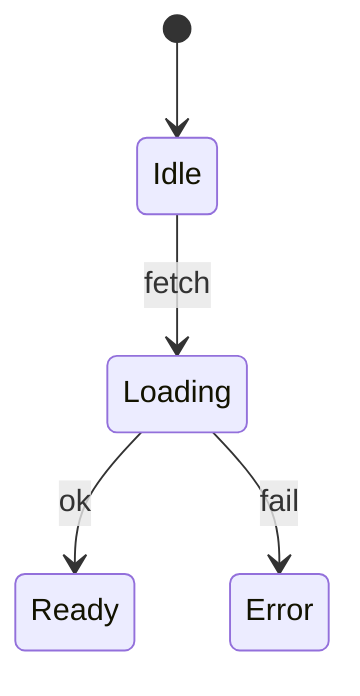

# <Concept> — <one-line intent>

<!--
  Canonical design-doc template (R64). Copy this file to
  `.agents/design/<domain>/<concept>.md` and fill every section.
  The five `##` sections below map 1:1 to the conformance lint
  (scripts/design-doc-lint.mjs); a doc missing any of them fails the
  post-round audit. Delete this comment and the `> Fill:` notes once
  the doc is real. For a horizon doc, use the target variant instead
  (see README.md §"Optional: `<concept>.target.md`") — it is exempt
  from the Token map + Acceptance-criteria rules.

  Vocab (Surface table): Reusability ∈ {shared cross-domain, feature,
  builder-only, backend, data type}; Purity ∈ {plain-UI, glue, data
  constant, feature, data type, pure}; each may carry an optional
  `(qualifier)`. See README.md §"File-format conventions".
-->

**Concept**: <what this surface is and the user-facing value it delivers>.
**Status**: Draft (R<NN> design)
**Round introduced**: `Round_NN` — link to the round file under
[`.agents/plan/cycles/`](../../plan/cycles/).
**Domain folder**: `<domain>/`.

<!-- L1: the Status line must carry a lifecycle word — Draft / Accepted /
     Superseded — and grows as the concept ships, e.g.
     `Accepted (R23 design; shipped R24–R26; extended R30/R32)`. -->

---

## Surfaces — layer / reuse / purity declaration

> Fill: one row per surface the concept introduces. This re-states the
> UI/BIZ boundary per
> [memory/2026-05-22-ui-boundary-build-first.md](../../memory/2026-05-22-ui-boundary-build-first.md).

| Surface                  | Layer                              | Reusability         | Purity              | Allowed peer deps                         |
| ------------------------ | ---------------------------------- | ------------------- | ------------------- | ----------------------------------------- |
| `<Primitive>` component  | `@mdd/ui`                          | shared cross-domain | plain-UI            | react, react-dom, antd, @ant-design/icons |
| `<FeaturePage>` route    | `apps/builder/src/features/<dom>/` | feature             | feature             | react, antd, @tanstack/react-query        |
| `use<Thing>Query` hook   | `apps/builder/src/features/<dom>/` | feature             | glue (server-data)  | @tanstack/react-query                     |
| `<thing>Api` client      | `apps/builder/src/api/`            | builder-only        | glue                | (fetch — no extra peer dep)               |
| `GET /<things>` route    | `apps/backend/`                    | backend             | feature             | (FastAPI — backend native)                |
| `<Thing>` type (FE)      | `.../features/<dom>/types.ts`      | feature             | data type           | none                                      |

**Boundary check**: <name the `@mdd/ui` rows and confirm their peer-dep
list stays within the permanent allow-list — no router, no query, no zod>.

---

## Token map

> Fill: map each styled surface to a CSS variable or AntD seed token
> already defined in
> [themeTokens.ts](../../../workspace/packages/ui/src/themeTokens.ts).
> Never invent inline values; the `Value` column is informational only.
> (The `workspace-shell.md` map is the model.)

| Surface             | Source                                              | Value (informational) |
| ------------------- | --------------------------------------------------- | --------------------- |
| Page background     | AntD seed `colorBgLayout` (themeTokens.ts)          | derived               |
| Primary action      | AntD seed `colorPrimary` (themeTokens.ts)           | `#1677ff`             |
| Border / divider    | AntD seed `colorBorderSecondary` (themeTokens.ts)   | derived               |

---

## Layout — ASCII intent

> Fill: unicode box-drawing for spatial structure. Mermaid is for
> flows/states, not layout.

```text
┌──────────────────────────────────────────┐
│  <header / title>                          │
│  ────────────────────────────────────────  │
│  <content region>                          │
└──────────────────────────────────────────┘
```

---

## Behaviour

> Fill: state transitions / interaction notes. Mermaid `stateDiagram-v2`
> or `sequenceDiagram` where they help.



---

## Acceptance criteria (Design gate exit)

> Fill: testable criteria the implementation must satisfy, each mapping
> to at least one automated test in the F / B / I phases. Lead with the
> user journey, then number the criteria (`C1`, `C2`, …) so test suites
> can reference them. (The `advanced-query.md` C1–C17 list is the model.)

**User journey** — <as a user, I … so that …>.

1. **<Surface>** _(test kind)_ — <observable, testable assertion>.
2. <next criterion>.
3. <error / empty / edge path is specified>.

---

## Scope boundary

### IN scope

- <what this concept covers in the introducing round>.

### OUT of scope (deferred with named triggers)

- <what is explicitly NOT covered, and the trigger that would pull it>.

---

## Reference materials (read-only)

> Optional: links to extracted lessons, sibling design docs, or external
> inspiration. Marked clearly as _reference_, not authority.
