# Advanced query on datasets — feature design

**Concept**: a single-line typed query input layered on top of the
[dataset detail page](dataset-detail.md), peer to the R37
[per-column chip filters](dataset-filters.md). The chip row stays
for discoverable per-column predicates; the advanced input handles
**boolean composition** (`AND` / `OR`) and direct `key:value` entry
without clicking through popovers. The input parses, in the FE, to
the **exact same `FilterPredicate` vocabulary** the chip row emits;
the only new capability is **OR** across predicates — which the flat
`f<N>_*` per-column param shape cannot carry.
**Status**: Draft (Round 51 design; DCFBI implementation in the
same round).
**Round introduced**: [Round_51](../../plan/cycles/Round_51.md);
first product feature round under R47 hybrid-flow doctrine.
**Sibling docs**:
[dataset-filters.md](dataset-filters.md) (the predicate vocabulary
this reuses verbatim; the chip UI this composes with),
[dataset-detail.md](dataset-detail.md) (the page this input is
placed on; the `?q=` substring search this AND-composes with),
[datasets.md](datasets.md) (where `Dataset.columns[].dtype` and
`.name` are defined — the parser resolves a query key to a column
by name and reads its dtype).

---

## Why this exists separately from dataset-filters.md

[dataset-filters.md](dataset-filters.md) explicitly pre-declared
this as the next concept and deferred it to its own chain:

> "The next step *after* filters is a typed query language
> (`stage:won AND amount>10000`) — that's a separate concept with
> its own [DCBF] chain."

— [dataset-filters.md § Why this exists separately](dataset-filters.md#why-this-exists-separately-from-dataset-detailmd)

The chip row resolved the *discoverable* predicate entry point: a
user reaches "won deals over $10k" by clicking column headers.
Advanced query resolves the *expressive* entry point: a user types
`stage:won AND amount:>10000` directly, and — the genuinely new
capability — composes alternatives with `OR`
(`stage:won OR stage:lost`), which the chip row structurally cannot
express (its URL params are keyed by column index, one predicate
per column, AND-only).

Keeping this in its own doc lets dataset-filters.md stay the
authoritative **predicate-vocabulary** reference (per-dtype
operators, value shapes, SQL mapping) while this doc owns the
**grammar**, the **input UX**, and the **OR transport** that the
chip row deferred.

---

## Surfaces — layer / reuse / purity declaration

| Surface | Layer | Reusability | Purity | Allowed peer deps |
| --- | --- | --- | --- | --- |
| `parseAdvancedQuery(text, columns)` parser module | `apps/builder/src/features/data-management/datasets/advanced-query/` | feature | pure (no react, no router, no fetch) | none |
| `AdvancedQueryInput` component (input + inline error) | `apps/builder/src/features/data-management/datasets/advanced-query/` | feature | plain-UI | react, antd, react-i18next |
| `useAdvancedQueryState` hook (URL `aq` ↔ predicate-DNF) | `apps/builder/src/features/data-management/datasets/advanced-query/` | feature | glue (router-aware) | react, react-router-dom |
| `datasetsApi.getRows(... , advanced?)` extension | `apps/builder/src/api/` | builder-only | glue | (fetch + URLSearchParams — no extra peer dep) |
| `GET /datasets/{id}/rows` `aq` param extension | `apps/backend/` | backend | feature | (FastAPI native, DuckDB for the OR-of-AND WHERE clause) |
| `PredicateGroups` (DNF) type alias | `apps/builder/src/features/data-management/datasets/advanced-query/types.ts` | feature | data type | none |

**Boundary check**: no advanced-query surface lives in `@mdd/ui`.
Same discipline as the chip filters
([dataset-filters.md § Surfaces](dataset-filters.md#surfaces-layer-reuse-purity-declaration)):
feature-local until a second consumer (dashboards, a future
query-results page) arrives with a concrete need. The **parser is
deliberately pure** (no React, no router, no fetch) so it is the
unit-testable load-bearing module and is trivially portable to any
future surface that needs the same grammar.

The `PredicateGroups` type is literally `FilterPredicate[][]` — an
array of AND-groups, OR'd together. It imports
[`FilterPredicate`](../../../workspace/apps/builder/src/features/data-management/datasets/filters/types.ts)
from the chip-filter module; no new predicate variant is
introduced, so the per-dtype operator surface and the BE evaluator
stay unchanged. The single new capability lives in the *transport
and composition*, not in the predicate shape.

---

## Reference materials

- [dataset-filters.md § Predicate vocabulary table](dataset-filters.md#predicate-vocabulary-table)
  — the authoritative per-dtype operator/value/SQL spec. The
  advanced-query grammar maps onto **exactly** this set; no new
  operator is added.
- [dataset-filters.md § FE types](dataset-filters.md#fe-types-target-for-r40)
  — the `FilterPredicate` discriminated union the parser emits.
- [dataset-detail.md § Row search (`?q=`)](dataset-detail.md#row-search-q)
  — the substring search the advanced query AND-composes with.
- [rows-get.contract.yaml](../../../workspace/packages/contracts/datasets/rows-get.contract.yaml)
  — the wire contract this round extends with the `aq` param
  (Contract phase).

External reference: none. A small `key:value AND/OR` grammar with
single-level precedence is a stock pattern (GitHub issue search,
Jira JQL-lite, Gmail filters); no novel UX research input needed
for the MVP.

---

## Grammar (MVP)

### Production rules

```text
query   := group ( OR group )*
group   := atom ( AND atom )*
atom    := key ':' value
key     := column-name            (case-insensitive match on Dataset.columns[].name)
value   := op-prefix? operand
operand := bare-token | quoted-string
```

- `AND` / `OR` are **case-insensitive** keywords (`and`, `And`,
  `OR`, `or` all accepted). They must be whitespace-delimited
  tokens — `stage:android` is one atom whose value is `android`,
  not `stage:` AND `roid`.
- **Precedence: `AND` binds tighter than `OR`.** This is the
  conventional choice (matches SQL, JQL, and the chip row's
  AND-default mental model). The consequence is structural: with
  no parentheses and single-level precedence, **every well-formed
  query is in disjunctive normal form (DNF)** — an `OR` of
  `AND`-groups. `a AND b OR c AND d` parses as `(a AND b) OR
  (c AND d)`. The parser emits this DNF directly as
  `FilterPredicate[][]`.
- **`bare-token`**: a run of non-whitespace characters terminated
  by whitespace, used for values without spaces (`won`, `10000`,
  `2026-01-01`, `>5000`).
- **`quoted-string`**: `"closed won"` — a double-quoted run that
  may contain spaces. The quotes are stripped; the inner text is
  the operand. (Single quotes and escape sequences are deferred —
  see § Out of scope.)

### Operator-prefix → predicate-vocabulary mapping

The `op-prefix` on the operand selects which **existing**
[predicate operator](dataset-filters.md#predicate-vocabulary-table)
the atom maps to. The mapping is dtype-aware; a `(prefix, dtype)`
combination with no existing predicate is a **semantic error**
(see § Error states), never a silently-different behavior.

| Prefix | Intent | `string` | `integer` / `float` | `date` / `datetime` | `boolean` |
| --- | --- | --- | --- | --- | --- |
| *(none)* | equals | `equals` | `equals` | `equals` | `is_true` / `is_false` ¹ |
| `~` | contains | `contains` | — error | — error | — error |
| `>` | greater / after | — error | `gt` | `after` | — error |
| `<` | less / before | — error | `lt` | `before` | — error |
| `>=` | at least | — error | `gte` | — error ² | — error |
| `<=` | at most | — error | `lte` | — error ² | — error |
| `!=` | not equal | — error ³ | `ne` | `ne` | — error |

¹ A boolean atom's operand must be `true` or `false`
(case-insensitive) → `is_true` / `is_false`. Any other operand on
a boolean column is a value error.

² **Known gap (documented, not a bug)**: the R37 predicate
vocabulary has no inclusive date bound — `date`/`datetime` columns
offer only `before` / `after` / `equals` / `ne` / `between`. So
`won_at:>=2026-01-01` (which the round's framing names as an
example) has **no existing operator to map to**. The MVP rejects
it with a clear message pointing at `>`/`<`, and `won_at:>2025-12-31`
expresses the same intent. Closing the gap means adding
`on_or_after` / `on_or_before` to the *shared* predicate
vocabulary (FE types, BE `OPS_BY_DTYPE`, MSW, the chip date
editor, and dataset-filters.md) — a cross-cutting vocabulary
expansion that belongs to its own round, not this one. Recorded as
a follow-up pull in [Round_51 § Act](../../plan/cycles/Round_51.md).

³ The R37 vocabulary has no `ne` for `string` (string ops are
`contains` / `equals` / `starts_with` / `ends_with` + empty/null).
`stage:!=won` is therefore a semantic error in the MVP; the same
gap-closing note as ² applies if demand surfaces.

**Operand-less operators** (`is_null`, `is_not_null`, `is_empty`,
`is_not_empty`) and the **range operator** (`between`) are **out of
the MVP grammar** — they have no `key:value` surface form. A user
who needs them uses the chip row, which composes by AND with the
advanced query (§ Composition). Promoting a surface syntax for
them (e.g. `amount:10000..50000` for between, `notes:null`) is a
documented follow-up, not MVP.

### Worked examples

| Query text | Parsed DNF (`FilterPredicate[][]`) |
| --- | --- |
| `stage:won` | `[[{col:3, dtype:'string', op:'equals', val:'won'}]]` |
| `amount:>10000` | `[[{col:1, dtype:'integer', op:'gt', val:10000}]]` |
| `stage:won AND amount:>10000` | `[[{col:3,…equals 'won'}, {col:1,…gt 10000}]]` |
| `stage:won OR stage:lost` | `[[{col:3,…equals 'won'}], [{col:3,…equals 'lost'}]]` |
| `stage:won AND amount:>10000 OR stage:lost` | `[[{col:3,…'won'},{col:1,…gt 10000}], [{col:3,…'lost'}]]` |
| `is_priority:true` | `[[{col:5, dtype:'boolean', op:'is_true'}]]` |
| `stage:"closed won"` | `[[{col:3, dtype:'string', op:'equals', val:'closed won'}]]` |

Note the third row: two predicates on **different** columns inside
one AND-group is expressible by the chip row too. The fourth row —
two predicates on the **same** column joined by `OR` — is the
capability only advanced query provides.

---

## Layout — ASCII intent

The advanced query input is placed on the dataset detail page
**directly below the `?q=` search bar and above the active-filter
chip row**. Reading top-to-bottom, the three predicate surfaces sit
in increasing specificity: free-text find (`?q=`) → typed query
(`aq`) → discoverable per-column chips (`f<N>_*`). All three
AND-compose (§ Composition).

> **R53 implementation note.** The "Advanced query" label is
> realized as a **header row** above the input (AntD label-above
> for readability) with `[Clear]` as a text link on its right —
> the `┌─ Advanced query ─┐` boxes below are *illustrative of the
> labeled region*, not a literal drawn border. The affordances the
> spec requires (a visible label distinguishing the field from the
> `?q=` box; a discoverable clear) are what bind; the exact chrome
> is the build's call. Verified by `ui-design` fidelity mode in
> [Round_53](../../plan/cycles/Round_53.md).

### Idle / empty state

```text
[🔍 Search rows…                       ]  Matched 2,481 / 2,481

┌─ Advanced query ─────────────────────────────────────────────────────────┐
│  [ e.g. stage:won AND amount:>10000                          ]  [Clear]   │
│  Type key:value predicates joined by AND / OR.                            │
└──────────────────────────────────────────────────────────────────────────┘

   (no chip row — no f<N>_* filters active)

┌────────────────────────────── table ────────────────────────────────────┐
```

- The input is full-width, single-line, monospace-ish (so
  operators read clearly). Placeholder shows a representative
  query. A muted helper line below states the grammar in one
  sentence. `[Clear]` is hidden when the input is empty.

### Parsed / applied state (valid query, ≥1 matched row)

```text
[🔍 Search rows…                       ]  Matched 47 / 2,481

┌─ Advanced query ─────────────────────────────────────────────────────────┐
│  [ stage:won AND amount:>10000                               ]  [Clear]   │
│  ✓ 1 group · 2 predicates                                                 │
└──────────────────────────────────────────────────────────────────────────┘

┌──────────────────────────────── table ──────────────────────────────────┐
```

- On a successful parse the helper line summarizes the structure
  (`N group(s) · M predicate(s)`) in a muted/success tone — a
  lightweight readback so the user can confirm precedence parsed
  as they intended (especially the AND-tighter-than-OR grouping).
- The `aq` param is written to the URL; `?page=` resets to 1.

### Errored state (unparseable input)

```text
[🔍 Search rows…                       ]  Matched 47 / 2,481

┌─ Advanced query ─────────────────────────────────────────────────────────┐
│  [ stage:won AND amount:>                                    ]  [Clear]   │  ← error border
│  ✕ Expected a value after ">" for column "amount" (position 20)           │  ← error text
└──────────────────────────────────────────────────────────────────────────┘

┌──────────────────────────────── table ──────────────────────────────────┐
   (table still shows the LAST-APPLIED query's results, "47 / 2,481")
```

- The input border turns `--color-error`. A single error message
  below names **what** went wrong and **where** (1-based character
  position and, when known, the offending column/token).
- **The errored query is NOT applied.** The URL `aq` and the table
  results stay at the last successfully-applied query (or
  unfiltered if there was none). This is the "suggest-on-failure"
  decision: never silently apply a half-parsed query, never blank
  the results out from under the user mid-keystroke.
- **Token-level red underline** on the exact offending substring
  (as the round framing floats) requires a rich-text input
  surface; the MVP uses an error border + positional message in a
  plain `<input>`. Per-token underline is deferred (§ Out of
  scope) — it needs the same rich editor that autocomplete would.

### Composition state (advanced query + chips + `?q=` all active)

```text
[🔍 renewal                            ]  Matched 3 / 2,481

┌─ Advanced query ─────────────────────────────────────────────────────────┐
│  [ stage:won OR stage:lost                                   ]  [Clear]   │
│  ✓ 2 groups · 2 predicates                                                │
└──────────────────────────────────────────────────────────────────────────┘

┌─ Active filters ─────────────────────────────────────────────────────────┐
│  [amount > 10,000 ×]                                        Clear all     │
└──────────────────────────────────────────────────────────────────────────┘

┌──────────────────────────────── table ──────────────────────────────────┐
```

- All three surfaces stay visible and independent. The result is
  `q("renewal") AND (chip: amount>10000) AND (aq: stage:won OR stage:lost)`.
- The **AND join across surfaces is implicit and not re-stated in
  the UI** — but it is *visually legible* because each surface is
  its own labeled box stacked top-to-bottom. The advanced query
  never silently "wins" over the chips: both boxes render, both
  contribute. This is the explicit answer to the round's
  "does advanced silently win?" risk.
- The "Matched X / Y" counter reflects the fully-composed result
  (same counter, same semantics as today — it already shows the
  post-filter `total`).

---

## Behavior

```mermaid
stateDiagram-v2
    [*] --> Empty: enter page, no ?aq=
    [*] --> Parsed: enter page with valid ?aq=
    Empty --> Typing: user types
    Typing --> Parsed: parse OK on debounce/Enter (writes aq, page→1)
    Typing --> Errored: parse fails on debounce/Enter (no URL write)
    Parsed --> Typing: user edits
    Errored --> Typing: user edits
    Parsed --> Empty: clear input / [Clear] (removes aq, page→1)
    Errored --> Empty: clear input / [Clear] (removes aq, page→1)
    Parsed --> Parsed: ?q= or chip change (independent; aq unchanged)
```



### Input lifecycle — state model table

| State | Input text | Parse result | URL `aq` (applied) | Table reflects | UI affordance |
| --- | --- | --- | --- | --- | --- |
| **Empty** | `""` | n/a | absent | `?q=` + chips only | placeholder + grammar hint; no `[Clear]` |
| **Typing** | non-empty, mid-edit | not yet committed | **last applied** (unchanged) | last-applied result | neutral border; `[Clear]` visible |
| **Parsed** | non-empty | success | = parsed DNF (JSON) | composed result | success helper (`N groups · M preds`); `[Clear]` visible |
| **Errored** | non-empty | failure | **last applied** (unchanged) | last-applied result | error border + positional message; `[Clear]` visible |

- **Commit trigger**: parse runs on a **300 ms debounce** after the
  last keystroke (matching the `?q=` debounce in
  [dataset-detail.md § Row search](dataset-detail.md#row-search-q))
  and **immediately on Enter**. Parsing is cheap (pure, ≤ a few
  dozen tokens) so the debounce is purely to avoid URL-history
  churn, not for performance.
- **Apply-on-valid only**: a successful parse writes
  `?aq=<url-encoded-json>` via `setSearchParams(..., { replace: true })`
  (same replace policy as `?q=` and chip Apply — one history entry
  per keystroke would be noise) and resets `?page=` to 1.
- **No-apply-on-error**: a failed parse updates only the in-input
  error message; it does **not** touch the URL. The previously
  applied query (if any) keeps governing the table. This is the
  deliberate "don't blank results mid-edit" choice.
- **Clear**: the `[Clear]` button (and emptying the input) removes
  `?aq=` from the URL and resets `?page=` to 1. Chips and `?q=`
  are untouched.
- **URL is source of truth**: on load, `?aq=` is parsed back into
  the input text via a **canonical re-serialization** of the DNF
  (not the raw user text — the raw text is not round-tripped; the
  URL carries the parsed JSON, and the input is repopulated from a
  deterministic pretty-print of that JSON). A malformed `?aq=`
  hand-edited into the URL is dropped silently on parse (the FE
  never crashes on a bad URL — same discipline as
  [serialize.ts](../../../workspace/apps/builder/src/features/data-management/datasets/filters/serialize.ts)),
  and the BE returns 422 if such a request is somehow sent.

### Combine with `?q=` and chip filters — Composition

- **Three independent predicate sources**, AND-composed
  server-side, in this evaluation order (all equivalent under AND;
  order stated for the SQL builder, not for semantics):
  1. chip filters (`f<N>_*`) — AND of per-column predicates;
  2. advanced query (`aq`) — `(g1) OR (g2) OR …`, each `gi` an AND
     of predicates;
  3. `?q=` — substring across all cells.
- Final WHERE = `chipSQL AND aqSQL AND qSQL`, any subset of which
  may be empty. `total` reflects the fully-composed matched count.
- **Same-column independence**: chips key by column index (one per
  column); the advanced query has no such limit (it is the whole
  point of OR). A chip on `amount` and an advanced predicate on
  `amount` simply AND together — no conflict resolution needed
  because they live in different transports and compose by AND.

### Caching (TanStack query key)

- The rows query key gains the advanced-query DNF as a stable
  string: `['datasets', { id }, 'rows', { page, pageSize, q, filters, aq }]`
  where `aq` is `JSON.stringify(predicateGroups)` (empty string
  when no advanced query) — mirroring
  [`cacheKeyForFilters`](../../../workspace/apps/builder/src/features/data-management/datasets/filters/serialize.ts).
- `placeholderData: (prev) => prev` stays, so the previous result
  is visible during transitions (no blank flash while typing a
  longer query).

### Concurrent delete (404 race)

Inherits unchanged from
[dataset-detail.md § Concurrent delete](dataset-detail.md#concurrent-delete-404-race).
An `aq`-bearing rows-GET that 404s transitions the page to the
deleted-dataset state; the query in the URL is irrelevant then.

---

## Data contract (target for the Contract phase)

> The Contract phase of [Round_51](../../plan/cycles/Round_51.md)
> formalizes the wire shape in
> [rows-get.contract.yaml](../../../workspace/packages/contracts/datasets/rows-get.contract.yaml)
> and its [rationale](../../../workspace/packages/contracts/datasets/rows-get.contract.md).
> This section states the **design intent** the contract must
> satisfy; the YAML wins on any drift.

**Why the existing `f<N>_*` shape cannot carry this**: the chip
param shape is keyed by 0-based column index with at most one
predicate per column and **implicit AND only**
([rows-get.contract.yaml lines 96–114](../../../workspace/packages/contracts/datasets/rows-get.contract.yaml)).
There is no key in that shape for "a second predicate on the same
column" nor for "OR between predicates." OR is structurally
inexpressible. The contract must therefore **add** a transport, not
extend `f<N>_*`.

**Design intent**: a single additive query param **`aq`** carrying
the URL-encoded JSON of the DNF — `FilterPredicate[][]` — i.e. the
*same* predicate atoms the chip row already serializes, wrapped in
two array levels (outer = OR groups, inner = AND atoms). Chosen
because:

- It is **purely additive** — `f<N>_*`, `q`, `page`, `page_size`
  are untouched, so every existing rows-GET test stays green and
  old URLs keep working (backward compatible).
- It keeps the endpoint a **GET** — shareable URL, TanStack-
  cacheable, composes with `?q=` and `f<N>_*` exactly as they
  already compose with each other.
- It **maximizes shape reuse** — each atom is the existing
  `FilterPredicate`, so BE validation (`OPS_BY_DTYPE`, per-dtype
  value parse) and SQL (`_predicate_sql`) are reused per-atom; the
  only new BE code is the OR-of-AND **composition wrapper**.
- The pre-parked `POST /datasets/{id}/rows:search` JSON-body
  fallback
  ([dataset-filters.md § Fallback](dataset-filters.md#fallback-json-body-via-post-datasetsidrowssearch))
  stays parked — `aq` JSON in a query param is well under URL
  limits at MVP scale (single-level DNF, a handful of atoms), and
  a GET keeps the caching/sharing story simple. Promote to POST if
  `aq` URLs balloon in practice.

**Atom wire shape** (one element of an inner group) is exactly the
chip predicate JSON:

```json
{ "col": 3, "dtype": "string", "op": "equals", "val": "won" }
```

**Validation / errors**: the BE validates each atom with the same
rules as `f<N>_*` (column in range, op valid for dtype, value
parses) and returns the **same 422 envelope and `filter_*` msg
codes**. Two `aq`-specific failure shapes are added:

- `aq` is not valid JSON, or not an array-of-arrays-of-objects →
  `422 advanced_query_malformed`.
- an atom inside `aq` fails an existing per-atom check → the
  existing `filter_op_dtype_mismatch` / `filter_value_unparseable`
  / `filter_col_out_of_range` code, with the `loc` pointing at
  `["query", "aq"]`.

**Parser is FE-only**: the BE **never** receives query *text*. The
grammar, precedence, tokenization, and error positions are a pure
FE concern; the BE receives validated predicate JSON. This keeps
the BE free of grammar-coupling and means a future second grammar
(or a different client) reuses the same predicate transport.

---

## Read/write boundary

**R51 implements** (this design's full MVP scope, DCFBI in one
round):

- **Contract** — additive `aq` param on the rows-GET contract YAML
  plus rationale; MSW handler decodes/validates/evaluates `aq`;
  contract validator stays green.
- **Frontend**:
  - `parseAdvancedQuery(text, columns)` pure parser → `{ ok: true,
    groups } | { ok: false, message, position }`.
  - `useAdvancedQueryState` URL `aq` ↔ DNF hook.
  - `AdvancedQueryInput` component (input + clear + inline error +
    success readback).
  - `datasetsApi.getRows(..., advanced?)` + `useDatasetRowsQuery`
    key extension.
  - `DatasetDetailPage` placement below the search bar.
  - i18n: namespace `datasets.advancedQuery.*` (placeholder, hint,
    clear, success readback, error templates); en + vi.
  - vitest: parser unit tests (grammar + every error path),
    component test (empty/typing/parsed/errored), MSW-backed
    handler test for a fixture query.
- **Backend** — decode `aq` JSON, validate each atom (reuse R39
  `filters.py` checks), build `(g1) OR (g2) …` SQL (reuse
  `_predicate_sql` per atom), AND-compose with chip + `?q=`
  fragments in `rows_reader.py`; pytest per parse/SQL/compose path.
- **Integration** — one test for chip + advanced + `?q=` three-way
  composition (FE through MSW; BE through pytest).

**Deferred** (explicitly not in this MVP):

- **Parentheses / nested grouping** — single-level DNF only.
  Promote when the flat AND/OR surfaces real ambiguity users hit.
- **Negation** (`NOT` / leading `-`).
- **Inclusive date bounds** (`>=` / `<=` on date/datetime) and
  **string `!=`** — require expanding the *shared* predicate
  vocabulary (§ Operator-prefix mapping notes ² and ³); own round.
- **Operand-less ops in the grammar** (`is_null`, `is_empty`, …)
  and **`between` surface syntax** — available via the chip row;
  no `key:value` form in the MVP.
- **Autocomplete / type-ahead / token underline** — needs a rich
  input surface; the MVP is a plain `<input>` with a positional
  error message.
- **Saved queries / query history** — persistence concern; URL
  `?aq=` is the only durability this round.
- **Cross-column expressions** (`amount:>revenue`) — not in the
  predicate vocabulary.
- **Server-side query-text exposure** — the BE receives predicate
  JSON, never the raw query string.
- **Dashboards / other surfaces** consuming the parser — the
  parser is built pure/portable, but only the dataset detail page
  wires it this round.

---

## Scope boundary

This concept covers:

- The single-line advanced-query input on the dataset detail page
  (`/data-management/datasets/:id`), the MVP `key:value AND/OR`
  grammar with AND-tighter-than-OR precedence, the inline error
  UX, the `aq` transport, and the AND-composition with chips and
  `?q=`.

This concept defers:

- All of the "Deferred" bullets in § Read/write boundary.

This concept explicitly does NOT cover:

- The chip filter UI internals (live in
  [dataset-filters.md](dataset-filters.md); reused unchanged).
- The `?q=` substring search internals (live in
  [dataset-detail.md § Row search](dataset-detail.md#row-search-q)).
- The predicate vocabulary itself — operators, value shapes, and
  SQL mapping stay authoritative in
  [dataset-filters.md § Predicate vocabulary table](dataset-filters.md#predicate-vocabulary-table);
  this doc only *consumes* them.
- Filtering on the datasets list page (cross-dataset catalog) —
  unchanged.

---

## Acceptance criteria (Design gate exit)

Testable criteria the implementation must satisfy. Each maps to at
least one automated test in the F / B / I phases.

Numbered continuously (1–17) and referenced as `C1`–`C17` in the
test suites. Grouped by phase via bold lead-ins.

1. **Parser** *(pure FE unit)* — `parseAdvancedQuery("stage:won", columns)`
   → `{ ok: true, groups: [[{col:3, dtype:'string', op:'equals', val:'won'}]] }`.
2. `AND` joins atoms within one group; `OR` starts a new group;
   `a AND b OR c` parses to `[[a,b],[c]]` (AND binds tighter).
3. `AND`/`OR` keywords are case-insensitive; column-name match is
   case-insensitive.
4. Operator prefixes map per the § mapping table: `amount:>10000`
   → `gt`; `won_at:>2026-01-01` → `after`; `is_priority:true` →
   `is_true`; `stage:~ren` → `contains`.
5. Quoted operand with spaces parses: `stage:"closed won"` →
   `equals "closed won"`.
6. Every error path returns `{ ok: false, message, position }` with
   a 1-based `position`:
   - unknown column (`nope:1`);
   - empty operand (`amount:>`);
   - unsupported `(prefix, dtype)` (`stage:>1`, `won_at:>=x`,
     `stage:!=x`);
   - non-numeric value on numeric column (`amount:abc`);
   - boolean operand not `true`/`false` (`is_priority:maybe`);
   - dangling `AND`/`OR` (`stage:won AND`).
7. Empty / whitespace-only input → `{ ok: true, groups: [] }`
   (treated as "no advanced query", not an error).
8. **Input component** *(FE component)* — empty state shows
   placeholder + grammar hint, no `[Clear]`.
9. Typing a valid query and committing writes `?aq=` and shows the
   `N groups · M predicates` readback.
10. Typing an invalid query shows the error border + positional
    message and does **not** change `?aq=` or the rendered rows.
11. `[Clear]` removes `?aq=` and resets to the unfiltered (by-aq)
    view; chips and `?q=` are untouched.
12. **Backend** *(pytest)* — a single-group `aq` returns the same
    rows as the equivalent chip filter set (AND-only parity).
13. A two-group `aq` (`stage:won OR stage:lost`) returns the union
    of both groups' matches; `total` reflects the OR-composed
    count.
14. `aq` AND-composes with `f<N>_*` and `?q=`: the three-way result
    equals the intersection.
15. Malformed `aq` JSON → `422 advanced_query_malformed`; a bad
    atom → the existing `filter_*` code with `loc=["query","aq"]`.
16. All pre-round rows-GET tests stay green (no regression;
    baseline = BE 119 / FE 65).
17. **Integration** — chip filter + advanced query + `?q=`
    simultaneously on the detail page yields the intersected rows
    and a correct "Matched X / Y" counter, with no UI thrash (all
    three surfaces render).

---

## Lifecycle

This doc:

- **Amended in place** during R51 implementation if a decision not
  pre-baked here surfaces (exact debounce constant, exact success-
  readback wording, exact error-message templates).
- **Superseded** by a `dataset-query-v2.md` if the grammar grows
  parentheses/negation into a full query language — that is a
  different concept (a real expression tree, not single-level DNF)
  and earns its own doc; this one stays the MVP-grammar reference.
- **Folded back** into a `data-management/` overview doc if the
  data-management spine (workspaces, datasets, detail, filters,
  advanced query, dashboards) coheres as one cross-feature
  design.

R51's Act section confirms which lifecycle event applies.
