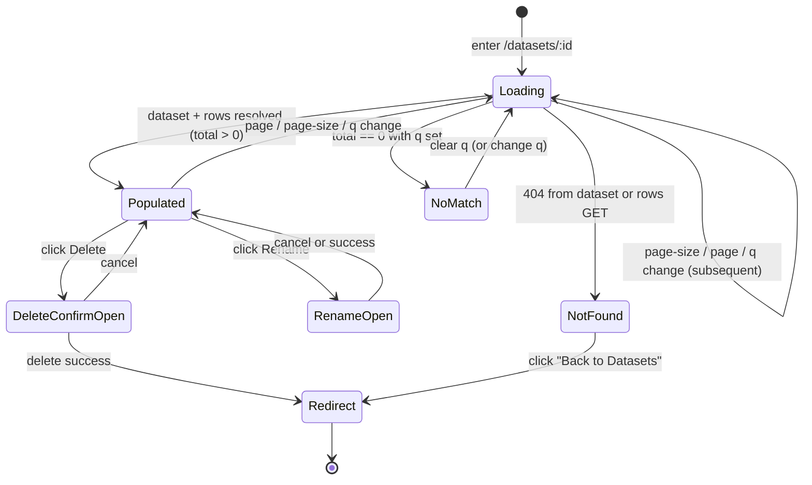

# Dataset detail — feature design

**Concept**: a per-dataset inspector page at
`/data-management/datasets/:id`. Shows the dataset's headline
metadata (workspace, format, sheet, rows, columns, size, uploaded
timestamp) and renders its row contents as a paged data table
with a substring search bar above the table for Cmd-F-style
row lookup. Reached by clicking a row in the Datasets list (the
R14 [datasets.md](datasets.md) R∞-deferred affordance, now
pulled in). Carries the rename + delete affordances inherited
from [crud-hygiene.md](crud-hygiene.md), placed in the page
header's `actions` slot.
**Status**: Draft (Round 33 design-only).
**Round introduced**: [Round_33](../../plan/cycles/Round_33.md);
implementation chain begins R34 (contract), R35 (BE), R36 (FE).
**Sibling docs**:
[datasets.md](datasets.md) (the noun this page inspects),
[upload.md](upload.md) (the verb that produced the rows),
[crud-hygiene.md](crud-hygiene.md) (rename + delete affordances
reused here),
[workspace-shell.target.md](workspace-shell.target.md) (the chrome
this page renders inside), and
[dataset-detail.preview.html](dataset-detail.preview.html) (visual
preview of the populated / loading / 404 / zero-rows / no-match
states).

---

## Why this exists separately from datasets.md

[datasets.md](datasets.md) covers the **collection** — the list
page, the workspace filter, the workspace-card handoff. It
explicitly deferred the **per-dataset** surface to R∞ "until a
downstream surface (query, dashboard) needs a per-dataset URL."

R33 promotes that surface because POC/MVP needs the user to **see**
their uploaded data before query/dashboard surfaces land. Without
detail, the upload wizard's preview-step is the only place the
user ever views their rows — and that view disappears the moment
they commit. The detail page is the durable readout.

This split keeps datasets.md focused on the noun's *catalog*
behavior and lets this doc focus on the noun's *single-instance*
behavior. The two cross-reference; clicking a row in the list
navigates here.

---

## Surfaces — layer / reuse / purity declaration

| Surface | Layer | Reusability | Purity | Allowed peer deps |
| --- | --- | --- | --- | --- |
| `DatasetDetailPage` route component | `apps/builder/src/features/data-management/datasets` | feature | feature | react, antd, @tanstack/react-query, react-router-dom, react-i18next |
| `DatasetMetadataStrip` component | `apps/builder/src/features/data-management/datasets` | feature | plain-UI | react, antd, react-i18next |
| `DataTable` (paged) component | `apps/builder/src/features/data-management/datasets` | feature | plain-UI | react, antd, react-i18next |
| `useDatasetQuery(id)` hook | `apps/builder/src/features/data-management/datasets` | feature | glue (server-data) | @tanstack/react-query |
| `useDatasetRowsQuery(id, page, pageSize, q?)` hook | `apps/builder/src/features/data-management/datasets` | feature | glue (server-data) | @tanstack/react-query |
| `RowSearchBar` component (Input.Search + match counter + clear) | `apps/builder/src/features/data-management/datasets` | feature | plain-UI | react, antd, react-i18next |
| `datasetsApi.get(id)` + `datasetsApi.getRows(id, page, pageSize, q?)` | `apps/builder/src/api/` | builder-only | glue | (fetch — no extra peer dep) |
| `GET /datasets/{id}` backend route | `apps/backend/` | backend | feature | (FastAPI — backend native) |
| `GET /datasets/{id}/rows` backend route | `apps/backend/` | backend | feature | (FastAPI — backend native, pyarrow for paged Parquet read) |
| `DatasetDetail` + `RowsPage` types (FE) | `apps/builder/src/features/data-management/datasets/types.ts` | feature | data type | none |

**Boundary check**: no dataset-detail surface lives in `@mdd/ui`.
The metadata strip and paged data-table stay feature-local. If a
second paged-table consumer arrives in a future round (e.g. an
audit-log page, or a query-results page), the extraction question
gets re-opened with two concrete consumers in hand. Per the
build-first lesson
([memory/2026-05-22-ui-boundary-build-first.md](../../memory/2026-05-22-ui-boundary-build-first.md)):
feature-local until two consumers exist.

`DatasetMetadataStrip` and `DataTable` are `plain-UI` purity —
they take props in, render JSX out, no router, no query, no zod.
The hooks + page above them carry the glue.

---

## Reference materials

- [datasets.md § Read/write boundary](datasets.md#readwrite-boundary-r15-scope)
  — the deferral row this page resolves.
- [crud-hygiene.md](crud-hygiene.md) — rename + delete modals
  reused unchanged. R33 only adds a new *placement* (page header
  actions) for the same affordances.
- [workspace-shell.target.md](workspace-shell.target.md) — the
  master-layout chrome (sidebar + topbar + page-card) this page
  renders inside.
- [upload.md](upload.md) — defines `Dataset.columns[].dtype`
  which drives this page's cell rendering.

External reference (none — Parquet-paged-reads + AntD `<Table>` +
`<Pagination>` are stock patterns; no novel UX research input).

---

## Layout — ASCII intent

The detail page renders inside the master-layout chrome — sidebar
shows "Data Management → Datasets" active; PageHeader shows
breadcrumb + title + actions; PageCard wraps metadata strip and
data table.

### Populated state (≥1 row)

```text
                                                            ┌── PageHeader.actions ──┐
Home ▸ Data Management ▸ Datasets ▸ q1_pipeline_Deals             [Rename]  [Delete] │
📊 q1_pipeline_Deals                                                                  │
Excel · Sheet1 — 2,481 rows · 12 columns · 84 KB · Uploaded 14:02 today  ─────────────┘

┌──────────────────────────────────────────────────────────────────────────────────┐
│  PageCard                                                                         │
│  ─────────────────────────────────────────────────────────────────────────────  │
│   ┌─ Metadata strip ────────────────────────────────────────────────────────┐   │
│   │ Workspace    Rows     Cols   Size      Uploaded         Format          │   │
│   │ Marketing    2,481    12     84 KB     14:02 today      Excel · Sheet1  │   │
│   └─────────────────────────────────────────────────────────────────────────┘   │
│                                                                                   │
│   [🔍 Search rows…                       ]  Matched 2,481 / 2,481                │
│                                                                                   │
│   ┌──────────────────────────────────────────────────────────────────────────┐  │
│   │ deal_id [str] │ amount [int]  │ won_at [date]  │ stage [str]  │ ...      │  │
│   ├──────────────────────────────────────────────────────────────────────────┤  │
│   │ D-0001        │       12,400  │ 2026-03-01     │ won          │ ...      │  │
│   │ D-0002        │            —  │     —          │ open         │ ...      │  │
│   │ D-0003        │      102,000  │ 2026-04-12     │ negotiating  │ ...      │  │
│   │ D-0004        │        7,800  │ 2026-04-18     │ open         │ a-very…  │  │
│   │ …                                                                          │  │
│   └──────────────────────────────────────────────────────────────────────────┘  │
│                                                                                   │
│         ◀  1 ▸ 2  3  …  50  ▶     Page size: [50 ▾]   Go to: [   ] of 50         │
└──────────────────────────────────────────────────────────────────────────────────┘
```

- **Header title**: source-format icon (`📊` Excel / `📄` CSV) +
  dataset name. Subtitle: format · sheet (excel only) — row
  count · column count · size · uploaded (relative time).
- **Metadata strip**: same fields restated as a table-style row
  for scannable reading. Mirrors the list-row columns so the
  user sees the *same* numbers they clicked on, only larger.
- **Column headers**: column name + dtype badge (small pill,
  muted color). Dtype badge tooltip on hover: full dtype name
  ("integer", "datetime", etc.).
- **Cells**:
  - **numeric** (`integer`, `float`) — right-aligned,
    `Intl.NumberFormat(locale)` with thousand separators;
    floats keep their decimal precision (no rounding;
    truncated-with-tooltip if too long for the column).
  - **date** / **datetime** — `Intl.DateTimeFormat(locale)`
    ISO-ish display (`2026-03-01` / `2026-03-01 14:02:00`).
  - **boolean** — plain `true` / `false` (lowercase).
  - **string** — left-aligned, truncated at column max-width
    with browser-native `title` tooltip showing full text.
  - **null** — faint `—` (em-dash, muted-color), centered in
    cell. Same glyph regardless of dtype.
- **Pagination**: AntD `<Pagination>` at the bottom — prev/next
  arrows, numbered pages with ellipsis, page-size selector
  (25 / 50 / 100), jumper input. Always-visible when total > 0;
  hidden for zero-rows state.
- **Search bar** above the table: AntD `<Input.Search>` with a
  search-icon prefix and `placeholder: "Search rows…"`. To the
  right of the input, a muted-text "Matched X / Y" counter
  echoes the active match count (where `Y` is the dataset's
  full `rowCount`). When the input is empty, the counter shows
  the unfiltered total (`Y / Y`). Visible whenever the dataset
  has rows; hidden in zero-rows state. The wider goal is
  Cmd-F-style "find a row in this dataset" — not the full
  query/dashboard surface, which remains R∞.

### Loading state (first load or page change)

```text
Home ▸ Data Management ▸ Datasets ▸ q1_pipeline_Deals             [Rename]  [Delete]
📊 q1_pipeline_Deals
…loading…

┌──────────────────────────────────────────────────────────────────────────────────┐
│   ▁▁▁▁▁▁  ▁▁▁▁▁▁  ▁▁▁▁  ▁▁▁▁▁▁▁▁  ▁▁▁▁▁▁  ▁▁▁▁▁▁                                  │
│   ▁▁▁▁▁▁  ▁▁▁▁▁▁  ▁▁▁▁  ▁▁▁▁▁▁▁▁  ▁▁▁▁▁▁  ▁▁▁▁▁▁                                  │
│   …                                                                                │
└──────────────────────────────────────────────────────────────────────────────────┘
```

- Page header renders immediately from the dataset query (cached
  from the list page if entered via row click — R31's
  TanStack-Query cache covers this; React-router preload
  optional, not designed in this round).
- Table area shows AntD `<Skeleton>` rows (R31 added skeleton
  pattern) — ~10 placeholder rows, header row is the real
  column headers if the dataset query resolved.
- Subsequent page changes (page 2, 3, …) keep the previous page's
  rows visible behind a `loading={true}` overlay (AntD `<Table>`
  native behavior; no skeleton flash).

### 404 / deleted state

```text
Home ▸ Data Management ▸ Datasets ▸ ?

┌──────────────────────────────────────────────────────────────────────────────────┐
│                                                                                   │
│                              🗑                                                    │
│                                                                                   │
│            This dataset no longer exists                                         │
│            It may have been deleted from another tab.                            │
│                                                                                   │
│                          [ ← Back to Datasets ]                                  │
│                                                                                   │
└──────────────────────────────────────────────────────────────────────────────────┘
```

- Triggered when `GET /datasets/{id}` returns 404 (or when
  `getRows` returns 404 — same handling; rare second case if the
  dataset was deleted between detail-GET and rows-GET).
- One-shot toast in addition to the in-page state: "Dataset
  deleted" (matches the list-page delete-success toast wording
  for visual continuity).
- `← Back to Datasets` button uses `history.back()` if there is
  a previous list-page entry, else `navigate('/data-management/datasets')`.

### Zero-rows state (rare but legit)

```text
Home ▸ Data Management ▸ Datasets ▸ commission_calc               [Rename]  [Delete]
📄 commission_calc
CSV — 0 rows · 6 columns · 4 KB · Uploaded 1 week ago

┌─ Metadata strip ────────────────────────────────────────────────────────┐
│ Workspace    Rows     Cols   Size      Uploaded         Format          │
│ Finance      0        6      4 KB      1 week ago       CSV             │
└─────────────────────────────────────────────────────────────────────────┘

┌──────────────────────────────────────────────────────────────────────────────────┐
│ amount [int]  │ memo [str]   │ paid_at [date]  │ ...                              │
├──────────────────────────────────────────────────────────────────────────────────┤
│                                                                                   │
│                              📭                                                    │
│              No rows in this dataset                                              │
│              Re-upload the file to replace the data.                              │
│                                                                                   │
└──────────────────────────────────────────────────────────────────────────────────┘
```

- A dataset with 0 rows can happen via the wizard if every parsed
  row was empty after parse_options pruning (uncommon, but the
  type system allows `rowCount: 0`). Schema (column headers) is
  still meaningful and rendered.
- No pagination control — total is 0.

### No-match state (search returned zero rows)

```text
Home ▸ Data Management ▸ Datasets ▸ q1_pipeline_Deals             [Rename]  [Delete]
📊 q1_pipeline_Deals
Excel · Sheet1 — 2,481 rows · 12 columns · 84 KB · Uploaded 14:02 today

┌─ Metadata strip ────────────────────────────────────────────────────────┐
│ Workspace    Rows     Cols   Size      Uploaded         Format          │
│ Marketing    2,481    12     84 KB     14:02 today      Excel · Sheet1  │
└─────────────────────────────────────────────────────────────────────────┘

[🔍 ZZZZZ                          ]  Matched 0 / 2,481  [Clear]

┌──────────────────────────────────────────────────────────────────────────────────┐
│ deal_id [str] │ amount [int]  │ won_at [date]  │ stage [str]  │ ...               │
├──────────────────────────────────────────────────────────────────────────────────┤
│                                                                                   │
│                              🔎                                                    │
│              No rows match "ZZZZZ"                                                │
│              Try a shorter substring or clear the search.                         │
│                                                                                   │
└──────────────────────────────────────────────────────────────────────────────────┘
```

- Triggered when `?q=` is set and the rows-GET returns
  `total: 0`. Column headers stay visible (the schema is still
  meaningful); the pagination control disappears.
- A `[Clear]` button (text link, muted color) next to the
  match counter strips `?q=` from the URL and restores the
  unfiltered view in one click. Same effect as emptying the
  input and Enter.

---

## Token map

| Surface | Token | Source |
| --- | --- | --- |
| Page background | `--color-bg-layout` (`#f5f5f5`) | tokens.css mirror of themeTokens.ts |
| Page card background | `--color-bg-base` (`#ffffff`) | tokens.css |
| Page card border / shadow | `--shadow-card`, `1px solid --color-border-secondary` | tokens.css |
| Header title text | `--color-text-base` | tokens.css |
| Header subtitle text | `--color-text-secondary` | tokens.css |
| Breadcrumb text | `--color-text-tertiary`; active segment `--color-text-secondary` | tokens.css |
| Metadata strip background | `--color-fill-quaternary` (`#fafafa`) | tokens.css |
| Metadata strip label | `--color-text-tertiary` | tokens.css |
| Metadata strip value | `--color-text-base` | tokens.css |
| Table header background | `--color-fill-quaternary` | tokens.css |
| Table header text | `--color-text-secondary` | tokens.css |
| Table row border | `--color-border-secondary` | tokens.css |
| Table row hover | `--color-primary-bg` (`#e6f4ff`) | tokens.css |
| Cell text | `--color-text-base` | tokens.css |
| Null cell glyph | `--color-text-tertiary` | tokens.css |
| Dtype badge background | `--color-fill-quaternary` | tokens.css |
| Dtype badge text | `--color-text-tertiary` | tokens.css |
| Dtype badge border | `1px solid --color-border-secondary` | tokens.css |
| Pagination active page | `--color-primary` (`#1677ff`) | tokens.css |
| Search input border | `--color-border` | tokens.css |
| Search input focus border | `--color-primary` | tokens.css |
| Search match counter text | `--color-text-tertiary` | tokens.css |
| Search "Clear" link text | `--color-primary` | tokens.css |
| Border radius (cards, badges) | `--radius-md` (6px) | tokens.css |
| Font family | `--font-family` | tokens.css |

No new token values are introduced. If any value below is missing
from the authoritative `themeTokens.ts`, R36 promotes it as a
prerequisite step in that round (don't invent values inline).

---

## Behavior



### URL state

- Route: `/data-management/datasets/:id` where `:id` matches
  `^ds_[0-9a-f]{8}$`.
- Query params: `?page=N&page_size=M` (both 1-indexed page,
  page_size ∈ {25, 50, 100}). Both omitted → defaults to
  `page=1&page_size=50`.
- Page-size change resets `page` to 1 (AntD default; documented
  explicitly so the cache key invalidation works as expected).
- Browser back/forward respects query-param history; each page
  change is a `navigate({ search: ... })` (replace=false), so
  hitting back returns to the previous page.
- Search: `?q=<substring>` appended when the input is non-empty.
  An empty input strips the param entirely. Changing `q` resets
  `page` to 1 — same trigger as page-size change. Search uses
  `navigate({ search: ... }, { replace: true })` so the URL
  history is not cluttered with one entry per keystroke.

### Back navigation

- The header's breadcrumb segments are clickable:
  `Home` → `/`, `Data Management` → `/data-management/workspaces`
  (the spine's landing page), `Datasets` → `/data-management/datasets`.
- The third breadcrumb segment is the dataset name (current page,
  not clickable).
- Direct browser back (`history.back()`) is the primary
  list-state-preservation lever — if the user clicked a row from
  a filtered list, browser back returns to the filtered list.
- No explicit `referrer` param this round — flagged as a risk
  ([Round_33.md § Risks](../../plan/cycles/Round_33.md#risks--unknowns));
  promote to a `?from=` query param if `history.back()` proves
  flaky in R36 verification.

### Rename / delete (inherited from crud-hygiene.md)

- Rename: opens existing `<RenameModal>` with `resource="dataset"`
  and the current name pre-filled. Mutation hook: existing
  `useRenameDatasetMutation()` from R26. Success → toast "Dataset
  renamed" + the header title updates from the
  re-cached dataset (TanStack Query invalidation already wired).
- Delete: opens existing `<DeleteConfirmModal>` with
  `resource="dataset"` and the current name in the body. Mutation
  hook: existing `useDeleteDatasetMutation()` from R26. Success
  → toast "Dataset deleted" + `navigate('/data-management/datasets')`
  (replace=true so back-button doesn't re-enter the deleted
  page's 404 state).
- Both modals already render correctly inside the master shell
  (R26 + R29 contracts); no modal-mount-point changes needed.

### Row search (`?q=`)

- **Affordance**: a single `<Input.Search>` above the table.
  Placeholder `"Search rows…"`. Default empty (unfiltered).
- **Match semantics**: case-insensitive substring against the
  **stringified cell value** of any column in the row.
  Effectively `LOWER(cell_as_string) LIKE '%q%'` evaluated
  row-major; a row matches if any cell does. No regex, no
  per-column scoping, no AND/OR composition in this round —
  Cmd-F-style "find anywhere in this dataset."
- **Where it runs**: server-side. The FE sends `?q=<value>`;
  the BE filters before paginating so `total` reflects the
  matched row count (not the full dataset row count). The FE
  renders "Matched X / Y" above the table where `Y` comes from
  `Dataset.rowCount` (already fetched) and `X` comes from the
  rows-GET `total` field.
- **Debounce**: the FE debounces user keystrokes by 300 ms
  before firing the next rows-GET. AntD `<Input.Search>` has
  built-in `onSearch` (fires on Enter / button click) plus
  `onChange` we wrap with `useDeferredValue` or a `setTimeout`
  to avoid hammering the BE.
- **Cleared state**: clearing the input restores the unfiltered
  view (counter becomes `Y / Y`, pagination total matches
  `rowCount`).
- **Cell rendering**: matched substring highlighting (mark
  matched chars in yellow) is **deferred** — useful but
  expensive at 100 rows × 12 cols × highlight-render. Names
  the trigger: promote if users complain they can't find their
  match on the page. R∞ until then.
- **Zero matches**: table body shows a centered "No rows match
  `<q>`" placeholder; pagination disabled. Same chrome as the
  zero-rows state but with a different message.

### Concurrent delete (404 race)

If the dataset is deleted from another tab between the user
loading the detail page and clicking somewhere on it, the next
mutation/refetch surfaces a 404. The page transitions to the 404
state and the one-shot toast fires. No optimistic rollback (we're
already on the dataset; just re-render the empty state).

If the dataset is deleted *before* the initial GET, the page
opens directly in the 404 state. Same toast wording, same back
button.

---

## Data contract (target shape for R34)

### `GET /datasets/{id}`

```yaml
paths:
  /datasets/{id}:
    get:
      operationId: getDataset
      summary: Get a single dataset by id
      parameters:
        - name: id
          in: path
          required: true
          schema:
            type: string
            pattern: '^ds_[0-9a-f]{8}$'
      responses:
        '200':
          description: Dataset with its committed schema.
          content:
            application/json:
              schema:
                $ref: '../_shared/dataset.yaml#/components/schemas/Dataset'
        '404':
          description: No dataset with the given id exists.
          content:
            application/json:
              schema:
                $ref: '../_shared/api-error.yaml#/components/schemas/ApiErrorNotFound'
```

No new fields on `Dataset`. The list-GET shape suffices —
`name`, `workspaceId`, `sizeBytes`, `rowCount`, `columnCount`,
`columns[]`, `sourceFormat`, `sheetName?`, `createdAt`.

### `GET /datasets/{id}/rows`

```yaml
paths:
  /datasets/{id}/rows:
    get:
      operationId: getDatasetRows
      summary: Get a paged slice of a dataset's rows
      parameters:
        - name: id
          in: path
          required: true
          schema:
            type: string
            pattern: '^ds_[0-9a-f]{8}$'
        - name: page
          in: query
          required: false
          schema:
            type: integer
            minimum: 1
            default: 1
          description: 1-indexed page number.
        - name: page_size
          in: query
          required: false
          schema:
            type: integer
            enum: [25, 50, 100]
            default: 50
        - name: q
          in: query
          required: false
          schema:
            type: string
            minLength: 1
            maxLength: 200
          description: |
            Optional substring filter. Case-insensitive match
            against the stringified value of any cell in the
            row. When present, `total` reflects the matched-
            row count (not the dataset's full row count). When
            absent, behavior is identical to the unfiltered
            paged read.
      responses:
        '200':
          description: Paged row slice.
          content:
            application/json:
              schema:
                type: object
                required: [rows, page, pageSize, total]
                additionalProperties: false
                properties:
                  rows:
                    type: array
                    items:
                      type: array
                      items:
                        type: [string, 'null']
                  page:
                    type: integer
                    minimum: 1
                  pageSize:
                    type: integer
                    enum: [25, 50, 100]
                  total:
                    type: integer
                    minimum: 0
        '404':
          description: No dataset with the given id exists.
          content:
            application/json:
              schema:
                $ref: '../_shared/api-error.yaml#/components/schemas/ApiErrorNotFound'
        '422':
          description: |
            Page beyond `ceil(total / pageSize)`, or `page_size`
            outside the enum. Body is the request-level validation
            shape; specifics decided in R34.
```

**Cell stringification rationale**: cells come over the wire as
`string | null`. BE renders each cell via Parquet → string
conversion (`pyarrow.compute.cast` or python-side `str()` per
dtype) and FE re-applies dtype-aware display formatting using
the column dtype carried on the parent `Dataset.columns[].dtype`.
This keeps the rows-payload schema-free and lets FE control
locale/format without round-tripping every change. The
alternative (typed cells with `(string | number | boolean |
null)[][]`) leaks BE's parser opinions; defer until a real need.

### FE types (target for R36)

```ts
export type DatasetDetail = Dataset; // No extra fields in R33+.

export type RowsPage = {
  rows: (string | null)[][];
  page: number;
  pageSize: number;
  /** Matched-row count when `q` is set; full dataset row count otherwise. */
  total: number;
};
```

### Query keys (TanStack)

- `['datasets', { id }]` — the detail GET. Existing
  `['datasets']` list-cache invalidation already matches this
  via prefix.
- `['datasets', { id }, 'rows', { page, pageSize, q }]` — the
  rows GET. `q` is part of the cache key so the same page across
  different searches stays cached independently. Invalidated on
  dataset delete (covered by the list-cache invalidation in
  R26's `useDeleteDatasetMutation`); no separate invalidation
  needed on rename (rows don't change).

---

## Read/write boundary

**R34+ implements** (this design's full scope):

- `GET /datasets/{id}` BE route (R35).
- `GET /datasets/{id}/rows?page=&page_size=&q=` BE route (R35,
  reads paged slice from the dataset's Parquet file; applies
  the optional substring filter before paginating).
- `datasetsApi.get(id)` + `.getRows(id, page, pageSize, q)` (R36).
- `useDatasetQuery` + `useDatasetRowsQuery` hooks (R36).
- `DatasetDetailPage` route at `/data-management/datasets/:id`
  with breadcrumb, header actions, metadata strip, search bar
  (debounced 300 ms, AntD `<Input.Search>`), paged `<Table>`,
  AntD `<Pagination>`, loading skeleton, 404 state, zero-rows
  state, no-match state (R36).
- List-page row-click handoff: `<Table>` `onRow` → navigate to
  detail route (R36 — one-line behavioral update to existing
  DatasetsPage).
- i18n keys: namespace `datasets.detail.*` for all user-facing
  strings; en + vi resource entries (R36, follows R32's
  pattern).

**Deferred** (not in this implementation chain):

- **Column sorting**. Parquet is column-oriented but sort-by-
  arbitrary-column still requires full-file read. Promote when
  a query/dashboard surface needs it or when row counts make
  unsorted browsing impractical.
- **Per-column search / typed-filter language** (e.g. `stage:won
  AND amount>10000`). The R33 `?q=` is plain substring across
  all cells — useful for "find a specific id or memo" but not
  for analytical slicing. Per-column filters are the natural
  next step alongside the future query surface.
- **Matched-substring highlighting** in cell text. Cheap UX
  win but adds a per-cell render pass; defer until users
  actually complain they can't find their match on the page.
- **Virtualized scroll**. Offset pagination is sufficient
  through ~100k rows × 50 page-size. Promote when 100k+ row
  datasets become routine *and* page-size-100 feels slow.
- **Column hide / freeze / reorder**. Cosmetic; promote when a
  user is actually blocked.
- **Row-level CRUD** (edit / delete / insert). Datasets are
  immutable post-commit in this iteration.
- **Row inspection drawer** (click row → full-cell-text drawer
  for long-string blobs). Truncate-with-tooltip is the R36
  affordance; drawer is a follow-up.
- **CSV / JSON / Parquet export**. Separate feature with its own
  auth + perms story; R∞.
- **Append / re-upload from this page**. Append-mode is reserved
  on the batch-commit contract but unimplemented; re-upload is
  delete + upload-new today.

---

## Scope boundary

This concept covers:

- The `/datasets/:id` route, its layout, its states (populated,
  loading, 404, zero-rows), its data contract, and the
  rename/delete affordances it inherits.

This concept defers:

- All of the "Deferred" bullets in § Read/write boundary above.

This concept explicitly does NOT cover:

- The Datasets list page (lives in [datasets.md](datasets.md)).
- The upload wizard (lives in [upload.md](upload.md)).
- Rename/delete modal internals (live in
  [crud-hygiene.md](crud-hygiene.md)). This page is a *placement*
  of those modals; the modals themselves are unchanged.
- Future query / dashboard surfaces that will read the same
  dataset; those get their own design docs when they land.

---

## Lifecycle

This doc:

- **Amended in place** during R34→R36 if implementation surfaces
  a decision not pre-baked here (exact table column widths,
  exact dtype-badge color, exact skeleton row count).
- **Superseded** by `dataset-detail-v2.md` if the detail page
  grows a second purpose (e.g. an inline chart preview, a column
  profile panel) — that's a different surface, not an amendment.
- **Folded back** into a `data-management/` overview doc if the
  data-management spine (workspaces + datasets + detail +
  queries + dashboards) cohere as one cross-feature design.

R36's Act section confirms which lifecycle event applies.
