# Dataset filters — feature design

**Concept**: per-column typed filters layered on top of the
[dataset detail page](dataset-detail.md). The dataset's
`Dataset.columns[].dtype` (already used to drive R36's cell
rendering) now also drives which operator set each column
offers; the FE composes per-column predicates AND together with
the existing `?q=` substring search; the BE evaluates the full
predicate set server-side so `total` reflects matched-row count
and pagination stays correct. The natural discoverable entry
point that precedes a real query language.
**Status**: Draft (Round 37 design-only).
**Round introduced**: [Round_37](../../plan/cycles/Round_37.md);
implementation chain begins R38 (contract), R39 (BE), R40 (FE).
**Sibling docs**:
[dataset-detail.md](dataset-detail.md) (the page this extends),
[datasets.md](datasets.md) (where the `Dataset.columns[].dtype`
field is defined),
[upload.md](upload.md) (the upstream dtype inference),
[dataset-filters.preview.html](_archive/dataset-filters.preview.html) (visual
preview of the chip row + per-dtype popover variants).

---

## Why this exists separately from dataset-detail.md

[dataset-detail.md](dataset-detail.md) covers the **inspector**
— layout, paged rows, dtype-aware cell rendering, the Cmd-F-
style `?q=` substring search. It explicitly deferred per-column
filtering to R∞ "Per-column search / typed-filter language."

R37 promotes that deferral because filters are the natural
discoverable predicate entry point: a user who wants to see only
won deals over $10k can reach that view through clicking column
headers, without learning a query syntax. The next step _after_
filters is a typed query language (`stage:won AND
amount>10000`) — that's a separate concept with its own DCBF
chain.

This split keeps dataset-detail.md focused on the inspector
chrome and lets this doc focus on the predicate vocabulary,
URL serialization, and per-dtype widgets. The two cross-
reference; the filter UI is _placed_ on the detail page but the
predicate spec is portable to future surfaces (advanced query,
dashboards) that also evaluate against the same dataset rows.

---

## Surfaces — layer / reuse / purity declaration

| Surface                                                                                   | Layer                                                                 | Reusability  | Purity                            | Allowed peer deps                                   |
| ----------------------------------------------------------------------------------------- | --------------------------------------------------------------------- | ------------ | --------------------------------- | --------------------------------------------------- |
| `FilterTrigger` column-header button (`▾` icon, active-state)                             | `apps/builder/src/features/data-management/datasets`                  | feature      | plain-UI                          | react, antd, @ant-design/icons                      |
| `FilterPopover` per-dtype widget container                                                | `apps/builder/src/features/data-management/datasets`                  | feature      | glue (AntD Popover + draft state) | react, antd, react-i18next                          |
| `StringFilterEditor` / `NumericFilterEditor` / `DateFilterEditor` / `BooleanFilterEditor` | `apps/builder/src/features/data-management/datasets/_filter-editors/` | feature      | plain-UI                          | react, antd, react-i18next                          |
| `ActiveFilterChips` row component                                                         | `apps/builder/src/features/data-management/datasets`                  | feature      | plain-UI                          | react, antd, react-i18next                          |
| `useFiltersState` hook (URL ↔ predicate set)                                              | `apps/builder/src/features/data-management/datasets`                  | feature      | glue (router-aware)               | react, react-router-dom                             |
| `datasetsApi.getRows(id, page, pageSize, q?, filters?)`                                   | `apps/builder/src/api/`                                               | builder-only | glue                              | (fetch + URLSearchParams — no extra peer dep)       |
| `GET /datasets/{id}/rows` filter params extension                                         | `apps/backend/`                                                       | backend      | feature                           | (FastAPI native, DuckDB for WHERE-clause push-down) |
| `FilterPredicate` discriminated-union type (+ helpers)                                    | `apps/builder/src/features/data-management/datasets/types.ts`         | feature      | data type                         | none                                                |

**Boundary check**: no filter surface lives in `@mdd/ui`. Per
[memory/2026-05-22-ui-boundary-build-first.md](../../memory/2026-05-22-ui-boundary-build-first.md)
("build `@mdd/ui` first, don't extract later") and the same
discipline R33 applied to detail-page surfaces — feature-local
until a second consumer arrives. If a future round adds filters
on a second surface (e.g. an audit-log page or a query-results
page), the extraction question gets re-opened with two concrete
consumers in hand.

The popover and chip row are `plain-UI` purity — they take
predicates in, render JSX out, no router, no query. The
`useFiltersState` hook carries the URL glue.

---

## Reference materials

- [dataset-detail.md § Read/write boundary](dataset-detail.md#readwrite-boundary)
  — the deferral row this concept resolves.
- [dataset-detail.md § Row search (`?q=`)](dataset-detail.md#row-search-q)
  — the substring-search affordance that filters compose AND
  with. Filter predicates evaluate first; `?q=` runs over the
  filtered intermediate.
- [datasets.md](datasets.md) — defines `Dataset.columns[].dtype`,
  the discriminator that drives the per-column operator set.
- [upload.md](upload.md) — the inference step that assigns
  `dtype` at commit time.

External reference (none — typed filter widgets keyed off a
column dtype are a stock BI pattern; no novel UX research input
needed at this stage).

---

## Layout — ASCII intent

The filter UI renders inside the existing dataset detail page
chrome. The new visual elements are:

1. A small `▾` filter-trigger icon next to each column header's
   dtype badge. Active filters style the trigger primary-colored.
2. An `ActiveFilterChips` row between the search bar and the
   table, visible only when at least one filter is active.
3. A `FilterPopover` (AntD `<Popover>`) anchored to the trigger,
   containing an operator selector + value editor(s) + Apply /
   Cancel buttons.

### Populated state — filters applied (≥1 filter, ≥1 matched row)

```text
                                                            ┌── PageHeader.actions ──┐
Home ▸ Data Management ▸ Datasets ▸ q1_pipeline_Deals             [Rename]  [Delete] │
📊 q1_pipeline_Deals                                                                  │
Excel · Sheet1 — 2,481 rows · 12 columns · 84 KB · Uploaded 14:02 today  ─────────────┘

┌──────────────────────────────────────────────────────────────────────────────────┐
│  PageCard                                                                         │
│  ─────────────────────────────────────────────────────────────────────────────  │
│   ┌─ Metadata strip ────────────────────────────────────────────────────────┐   │
│   │ Workspace    Rows     Cols   Size      Uploaded         Format          │   │
│   │ Marketing    2,481    12     84 KB     14:02 today      Excel · Sheet1  │   │
│   └─────────────────────────────────────────────────────────────────────────┘   │
│                                                                                   │
│   [🔍 Search rows…                       ]  Matched 47 / 2,481                   │
│                                                                                   │
│   ┌─ Active filters ─────────────────────────────────────────────────────────┐  │
│   │  [stage = won ×]  [amount between 10,000 and 50,000 ×]      Clear all    │  │
│   └──────────────────────────────────────────────────────────────────────────┘  │
│                                                                                   │
│   ┌──────────────────────────────────────────────────────────────────────────┐  │
│   │ deal_id [str] ▾ │ amount [int] ▾*│ won_at [date] ▾ │ stage [str] ▾* │ ...│  │
│   ├──────────────────────────────────────────────────────────────────────────┤  │
│   │ D-0001          │      12,400    │ 2026-03-01      │ won            │ ...│  │
│   │ D-0017          │      48,200    │ 2026-04-08      │ won            │ ...│  │
│   │ D-0023          │      31,950    │ 2026-04-19      │ won            │ ...│  │
│   │ …                                                                          │  │
│   └──────────────────────────────────────────────────────────────────────────┘  │
│                                                                                   │
│         ◀  1  2  ▶     Page size: [50 ▾]   Go to: [   ] of 1                    │
└──────────────────────────────────────────────────────────────────────────────────┘
```

- `▾*` on `amount` and `stage` headers signals an active filter
  on that column (the trigger is rendered in `--color-primary`
  with the `▾` icon kept; an asterisk in this ASCII represents
  the colored state).
- Chip text format: `{column_name} {operator_symbol} {value}`
  for binary ops, `{column_name} between {min} and {max}` for
  range, `{column_name} is null` / `is not null` for null ops.
- "Matched X / Y" counter: `X` is the rows-GET `total`
  (filtered + searched matched count), `Y` is
  `Dataset.rowCount` (unchanged from R36; always full).

### Popover open — string column (`stage`)

```text
                  ┌──────────────────────────────────────┐
                  │  Filter "stage"                       │
                  │  ───────────────────────────────────  │
                  │  Operator                             │
                  │  [contains            ▾]              │
                  │                                       │
                  │  Value                                │
                  │  [______________________________]     │
                  │                                       │
                  │  ──────────────────────────────────   │
                  │  [Clear filter]    [Cancel] [Apply]   │
                  └──────────────────────────────────────┘
```

- Operator dropdown options for `string` dtype: `contains`
  (default), `equals`, `starts with`, `ends with`, `is empty`,
  `is not empty`.
- `is empty` / `is not empty` hide the value input.
- `Clear filter` removes the filter for this column entirely
  (writes the URL without the `f<N>_*` params, closes the
  popover). Distinct from `Cancel` (discards in-popover draft,
  leaves existing filter intact).
- `Apply` writes the URL and closes the popover; disabled when
  the value input is empty and the operator requires a value.

### Popover open — numeric column (`amount`)

```text
                  ┌──────────────────────────────────────┐
                  │  Filter "amount"                      │
                  │  ───────────────────────────────────  │
                  │  Operator                             │
                  │  [between             ▾]              │
                  │                                       │
                  │  From               To                │
                  │  [   10,000      ]  [   50,000     ]  │
                  │                                       │
                  │  ──────────────────────────────────   │
                  │  [Clear filter]    [Cancel] [Apply]   │
                  └──────────────────────────────────────┘
```

- Operator dropdown options for `integer` / `float` dtypes:
  `equals`, `≠`, `>`, `<`, `≥`, `≤`, `between`, `is null`, `is
not null`.
- `between` shows two number inputs (From / To); the value-shape
  comment below the inputs reminds the user the range is
  inclusive on both ends.
- `is null` / `is not null` hide both inputs.
- Other operators show a single number input.

### Popover open — date column (`won_at`)

```text
                  ┌──────────────────────────────────────┐
                  │  Filter "won_at"                      │
                  │  ───────────────────────────────────  │
                  │  Operator                             │
                  │  [between             ▾]              │
                  │                                       │
                  │  From               To                │
                  │  [📅 2026-04-01 ]  [📅 2026-04-30 ]  │
                  │                                       │
                  │  ──────────────────────────────────   │
                  │  [Clear filter]    [Cancel] [Apply]   │
                  └──────────────────────────────────────┘
```

- Operator dropdown for `date` / `datetime` dtypes: `equals`,
  `≠`, `before`, `after`, `between`, `is null`, `is not null`.
- Inputs use AntD `<DatePicker>` (already in the bundle from the
  R17 wizard parse-options panel). For `datetime` columns the
  picker includes a time component; for `date` columns it's
  date-only.
- The BE accepts ISO 8601 (`YYYY-MM-DD` or
  `YYYY-MM-DDTHH:MM:SS`); the FE always serializes to ISO
  regardless of locale.

### Popover open — boolean column

```text
                  ┌──────────────────────────────────────┐
                  │  Filter "is_open"                     │
                  │  ───────────────────────────────────  │
                  │  Operator                             │
                  │  [is true             ▾]              │
                  │                                       │
                  │  (no value needed)                    │
                  │                                       │
                  │  ──────────────────────────────────   │
                  │  [Clear filter]    [Cancel] [Apply]   │
                  └──────────────────────────────────────┘
```

- Operator dropdown for `boolean`: `is true`, `is false`, `is
null`, `is not null`. All four are operand-less.

### No-match state — filters return zero rows

```text
Home ▸ Data Management ▸ Datasets ▸ q1_pipeline_Deals             [Rename]  [Delete]
📊 q1_pipeline_Deals
Excel · Sheet1 — 2,481 rows · 12 columns · 84 KB · Uploaded 14:02 today

[🔍 Search rows…                       ]  Matched 0 / 2,481

┌─ Active filters ─────────────────────────────────────────────────────────┐
│  [stage = won ×]  [amount > 1,000,000 ×]                  Clear all      │
└──────────────────────────────────────────────────────────────────────────┘

┌──────────────────────────────────────────────────────────────────────────────────┐
│ deal_id [str] ▾ │ amount [int] ▾*│ won_at [date] ▾ │ stage [str] ▾* │ ...        │
├──────────────────────────────────────────────────────────────────────────────────┤
│                                                                                   │
│                              🔎                                                    │
│              No rows match these filters                                          │
│              Adjust or clear a filter to see more results.                        │
│                                                                                   │
└──────────────────────────────────────────────────────────────────────────────────┘
```

- Triggered when the rows-GET returns `total: 0` and at least
  one filter is active. Distinct from R36's "no rows match
  `<q>`" state — copy mentions filters explicitly.
- If `?q=` is also set, the placeholder copy becomes "No rows
  match `<q>` with these filters" so the user knows both
  predicates are in play.
- Column headers stay visible (the schema is still meaningful);
  pagination disappears.

---

## Filter trigger anatomy

The `FilterTrigger` is a small button rendered immediately to
the right of each column header's dtype badge:

```text
deal_id [str] ▾
        ↑     ↑
        |     filter trigger (button)
        dtype badge (R36)
```

- Visual: a single `▾` chevron icon (`@ant-design/icons`
  `<DownOutlined />`), 12px font-size, muted (`--color-text-
tertiary`).
- Hover state: bumps to `--color-text-secondary` + faint
  rounded-rectangle background (`--color-fill-quaternary`).
- Active-filter state (column has a non-null filter set):
  chevron renders in `--color-primary`; a 4px primary-colored
  dot is added top-right as a redundant signal (the chevron
  alone is too subtle in dense column rows).
- Aria: `aria-label={t('datasets.filters.triggerAria',
{ column: name })}`; opens the popover on click; closes on
  Escape, click outside, or Apply.

---

## Active filters chip row anatomy

When at least one filter is active, an `ActiveFilterChips` row
renders between the search bar and the table:

- Container: full-width row with `--color-fill-quaternary`
  background, 8px vertical padding, 12px horizontal padding,
  `--radius-md` corners, 1px `--color-border-secondary` border.
- Chips: AntD `<Tag closable>` per filter. Tag color =
  `--color-primary-bg` background, `--color-primary` text and
  border. The `×` close icon removes that filter from the URL.
- Chip-text format:
  - `{column_name} {symbol} {value}` for binary ops with values
    (e.g. `stage = won`, `amount > 10,000`).
  - `{column_name} between {min} and {max}` for range ops.
  - `{column_name} is null` / `{column_name} is not null` for
    null ops.
  - Value formatting uses `formatCell` (R36) so 10000 renders as
    `10,000`, 2026-04-08 as the locale's date, etc.
- Long-value truncation: each chip caps at ~200px; full value in
  a `title` tooltip.
- `Clear all` text link on the far right of the row, primary-
  colored, removes all `f<N>_*` params from the URL in one
  write.
- Row is hidden when no filters are active (height collapses to
  zero; no empty-state placeholder needed).

---

## Layout shell

This concept does not change the
[fixed-viewport-height shell](dataset-detail.md#layout-shell)
established in R33. The new elements (chip row + column-header
triggers + AntD popovers) all live _inside_ the existing
PageCard, with one extra `flex: 0 0 auto` row inserted between
the search bar and the table scroll container.

- Chip row height: ~40px (one line of chips).
- When the chip row wraps to a second line (8+ chips), it grows
  to `flex: 0 0 auto` with `max-height: 80px` and internal
  scroll, so the table doesn't shrink below readable height.

Popovers are anchored to their trigger; they do not affect the
flex layout. AntD's `<Popover>` portals to the body, so the
PageCard's `overflow` is irrelevant.

---

## Token map

| Surface                                      | Token                                                 | Source      |
| -------------------------------------------- | ----------------------------------------------------- | ----------- |
| Filter trigger (default)                     | `--color-text-tertiary`                               | tokens.css  |
| Filter trigger (hover)                       | `--color-text-secondary` on `--color-fill-quaternary` | tokens.css  |
| Filter trigger (active)                      | `--color-primary`                                     | tokens.css  |
| Filter trigger active-dot                    | `--color-primary` background, 4px circle              | tokens.css  |
| Chip background                              | `--color-primary-bg` (`#e6f4ff`)                      | tokens.css  |
| Chip text + border                           | `--color-primary`                                     | tokens.css  |
| Chip close icon                              | `--color-primary` (hover: `--color-primary-hover`)    | tokens.css  |
| Chip row background                          | `--color-fill-quaternary`                             | tokens.css  |
| Chip row border                              | `1px solid --color-border-secondary`, `--radius-md`   | tokens.css  |
| Chip row "Clear all" link                    | `--color-primary`                                     | tokens.css  |
| Popover background                           | `--color-bg-base`                                     | tokens.css  |
| Popover border / shadow                      | `--shadow-card`, `1px solid --color-border-secondary` | tokens.css  |
| Popover title text                           | `--color-text-base`                                   | tokens.css  |
| Popover label text                           | `--color-text-secondary`                              | tokens.css  |
| Popover divider                              | `--color-border-secondary`                            | tokens.css  |
| Popover "Clear filter" link                  | `--color-error` (muted)                               | tokens.css  |
| Popover Apply button                         | AntD primary (`<Button type="primary">`)              | AntD seed   |
| Popover Cancel button                        | AntD default                                          | AntD seed   |
| Numeric input alignment                      | right-align, `font-variant-numeric: tabular-nums`     | local style |
| Border radius (chip, popover, trigger hover) | `--radius-md` (6px)                                   | tokens.css  |

No new token values are introduced. If R40 finds one missing
from `themeTokens.ts`, R40 promotes the value as a prerequisite
step (don't invent values inline).

---

## Behavior

```mermaid
stateDiagram-v2
    [*] --> Idle
    Idle --> PopoverOpen: click column-header ▾ trigger
    PopoverOpen --> PopoverEditing: change operator or value
    PopoverEditing --> PopoverEditing: more edits
    PopoverEditing --> Idle: click Cancel / click outside / Esc
    PopoverEditing --> Idle: click Apply (writes URL, page resets to 1)
    PopoverEditing --> Idle: click Clear filter (removes filter from URL)
    Idle --> Idle: click chip × (removes one filter from URL)
    Idle --> Idle: click Clear all (removes all filters from URL)
    Idle --> Idle: search input change (?q= updates; filters unchanged)
    Idle --> Idle: page / page_size change
```



### URL state

- Each active filter writes one or more params keyed by the
  column's **index** in `Dataset.columns[]` (not the column
  name — names can contain spaces, slashes, unicode; indices are
  stable across rename which isn't a feature here, and they
  match the `col_0`, `col_1`, … convention R36 already uses for
  AntD `<Table>` dataIndex collision avoidance).
- Param shapes:

  | Operator                                                              | Params                                                    |
  | --------------------------------------------------------------------- | --------------------------------------------------------- |
  | `string.contains` / `equals` / `starts_with` / `ends_with`            | `f<N>_op=<op>`, `f<N>_val=<string>`                       |
  | `string.is_empty` / `is_not_empty`                                    | `f<N>_op=<op>`                                            |
  | `int.equals` / `ne` / `gt` / `lt` / `gte` / `lte`                     | `f<N>_op=<op>`, `f<N>_val=<number>`                       |
  | `int.between` / `float.between` / `date.between` / `datetime.between` | `f<N>_op=between`, `f<N>_min=<value>`, `f<N>_max=<value>` |
  | `int.is_null` / `is_not_null` (and all dtypes)                        | `f<N>_op=is_null` / `f<N>_op=is_not_null`                 |
  | `date.equals` / `ne` / `before` / `after`                             | `f<N>_op=<op>`, `f<N>_val=<iso-date>`                     |
  | `bool.is_true` / `is_false` / `is_null` / `is_not_null`               | `f<N>_op=<op>`                                            |

- Filter changes (apply, chip ×, clear all) reset `?page=` to 1
  (same trigger as `?q=` change and page-size change). Page is
  meaningless under a changed predicate set.
- `setSearchParams(..., { replace: true })` on filter apply so
  history isn't cluttered (one entry per filter change is more
  noise than value at this stage).
- Chip `×` is **not** `replace: true` — chip removal is a
  deliberate user step worth a history entry (lets browser back
  re-apply the filter).
- `Clear all` is `replace: true` since the user can chip-remove
  one-by-one if they want granular history.

### Combine with `?q=` search

- Filters and `?q=` AND-compose: the BE applies filters first
  (push-down to the WHERE clause), then the substring search
  runs over the filtered intermediate.
- The `Matched X / Y` counter shows the post-AND count; the
  copy doesn't need to call out filters separately because the
  chip row visualizes them.
- No-match copy: if `q` is empty, "No rows match these
  filters"; if `q` is set, "No rows match `<q>` with these
  filters."

### Popover lifecycle

- Open: clicking `▾` on a column header opens the popover
  anchored to that trigger. If a filter already exists for the
  column, the popover pre-fills with the existing op + value.
- Draft state: the popover has its own local draft (operator +
  value); the URL is not written until Apply is clicked.
- Apply: writes the URL (`f<N>_op`, `f<N>_val` / `f<N>_min` /
  `f<N>_max`), resets `?page=`, closes the popover.
- Cancel: discards the draft, closes the popover. The existing
  filter (if any) remains.
- Clear filter (inside popover): removes the column's `f<N>_*`
  params from the URL, closes the popover.
- Escape / click-outside: behaves as Cancel.
- Validation: Apply is disabled when the operator requires a
  value and the value input is empty (e.g. `contains` with no
  text). Operator change to a no-value variant (`is null`,
  `is_empty`, `is_true`, etc.) re-enables Apply.

### Concurrent delete (404 race)

Inherits unchanged from
[dataset-detail.md § Concurrent delete](dataset-detail.md#concurrent-delete-404-race).
A filtered rows-GET that 404s transitions the page to the
deleted-dataset state; filters in the URL are irrelevant at
that point.

### Caching (TanStack query keys)

- Query key: `['datasets', { id }, 'rows', { page, pageSize, q,
filters }]`.
- `filters` is the **serialized filter set** (an array sorted
  by column index, each entry `{ col, op, val | min, max }`).
  Sorting by index gives stable equality across different
  param-write orders.
- `placeholderData: (prev) => prev` stays from R36 so the
  previous filtered page is visible during transitions.
- Invalidation on dataset delete (existing R26 cascade) covers
  filter variants because the prefix `['datasets', { id }]`
  matches.

---

## Data contract

> **R38 update**: the OpenAPI 3.1 YAML extension is now
> authoritative for the wire shape. The prose YAML and
> predicate-vocabulary table below stay as reading aids, but
> if the two ever drift, the YAML wins.
>
> - [`rows-get.contract.yaml`](../../../workspace/packages/contracts/datasets/rows-get.contract.yaml)
>   — `f<N>_op` / `f<N>_val` / `f<N>_min` / `f<N>_max`
>   query-param extension.
> - [`rows-get.contract.md`](../../../workspace/packages/contracts/datasets/rows-get.contract.md)
>   — rationale (per-column filter section + filter-related
>   422 cases).

### Committed shape (R38): encoded params

R37 named encoded params as primary; R38 committed. The
fallback `POST :search` JSON body stays parked here for future
promotion if URL bloat becomes routine (≥ 8 active filters
typical):

#### Primary: encoded params

```yaml
paths:
  /datasets/{id}/rows:
    get:
      operationId: getDatasetRows
      parameters:
        # …existing params (id, page, page_size, q) unchanged…
        - name: f<N>_op
          in: query
          required: false
          description: |
            Filter operator for column N. N is the 0-based index
            into Dataset.columns[]. Allowed values depend on the
            column's dtype:
              string:   contains | equals | starts_with | ends_with
                      | is_empty | is_not_empty | is_null | is_not_null
              integer:  equals | ne | gt | lt | gte | lte | between
                      | is_null | is_not_null
              float:    same as integer
              date:     equals | ne | before | after | between
                      | is_null | is_not_null
              datetime: same as date
              boolean:  is_true | is_false | is_null | is_not_null
          schema:
            type: string
        - name: f<N>_val
          in: query
          required: false
          description: |
            Value for single-operand operators. Format depends on
            the column dtype: string (utf-8), integer (signed
            int64), float (double), date (ISO YYYY-MM-DD),
            datetime (ISO YYYY-MM-DDTHH:MM:SS), boolean
            (no-op-needs-this).
          schema:
            type: string
        - name: f<N>_min
          in: query
          required: false
          description: Lower bound for `between` (inclusive).
          schema:
            type: string
        - name: f<N>_max
          in: query
          required: false
          description: Upper bound for `between` (inclusive).
          schema:
            type: string
      responses:
        '200':
          # …unchanged from R34 contract…
        '422':
          description: |
            Filter operator incompatible with the column dtype,
            or filter value fails dtype-parse (e.g. f0_val=foo
            on an integer column). Body is the request-level
            validation shape (R34's shared shape).
```

OpenAPI 3.1 does not natively express "this query-param key is
parameterized by N." R38 mechanized via four illustrative
`f0_*` parameter entries (concrete `name: f0_op`,
`name: f0_val`, `name: f0_min`, `name: f0_max`) with detailed
`description` blocks naming the N-parameterization convention.
The YAML acts as a reading aid; the BE enforces the per-dtype
operator and value-shape constraints at request time.

#### Fallback: JSON body via `POST /datasets/{id}/rows:search`

If the encoded-params shape proves clumsy (e.g. ≥ 8 active
filters at once becomes routine and URLs balloon), R38 has the
option to land a parallel `POST /datasets/{id}/rows:search`
endpoint that accepts the filter set as a JSON request body.
The GET endpoint stays for the simple cases (no filters, just
`?q=` + pagination); POST is the escape valve.

Naming: `:search` (colon-suffix RPC-style action) keeps it out
of the noun namespace while signaling "this is still a read,
just a complex one." Idempotent + cacheable via TanStack's key.

R37 does not pre-commit to either shape; R38 mechanizes the
chosen path based on contract-validity testing and the
operator-set spec below.

### Predicate vocabulary table

| Dtype           | Operator name (UI) | Operator key (URL / contract) | Value shape         | DuckDB / SQL equivalent                          |
| --------------- | ------------------ | ----------------------------- | ------------------- | ------------------------------------------------ |
| string          | contains           | `contains`                    | string              | `WHERE col ILIKE '%val%'`                        |
| string          | equals             | `equals`                      | string              | `WHERE col = 'val'` (case-insensitive collation) |
| string          | starts with        | `starts_with`                 | string              | `WHERE col ILIKE 'val%'`                         |
| string          | ends with          | `ends_with`                   | string              | `WHERE col ILIKE '%val'`                         |
| string          | is empty           | `is_empty`                    | —                   | `WHERE col = '' OR col IS NULL`                  |
| string          | is not empty       | `is_not_empty`                | —                   | `WHERE col <> '' AND col IS NOT NULL`            |
| string          | is null            | `is_null`                     | —                   | `WHERE col IS NULL`                              |
| string          | is not null        | `is_not_null`                 | —                   | `WHERE col IS NOT NULL`                          |
| integer / float | equals             | `equals`                      | number              | `WHERE col = val`                                |
| integer / float | ≠                  | `ne`                          | number              | `WHERE col <> val`                               |
| integer / float | >                  | `gt`                          | number              | `WHERE col > val`                                |
| integer / float | <                  | `lt`                          | number              | `WHERE col < val`                                |
| integer / float | ≥                  | `gte`                         | number              | `WHERE col >= val`                               |
| integer / float | ≤                  | `lte`                         | number              | `WHERE col <= val`                               |
| integer / float | between            | `between`                     | min, max (number)   | `WHERE col BETWEEN min AND max`                  |
| integer / float | is null            | `is_null`                     | —                   | `WHERE col IS NULL`                              |
| integer / float | is not null        | `is_not_null`                 | —                   | `WHERE col IS NOT NULL`                          |
| date / datetime | equals             | `equals`                      | ISO date / datetime | `WHERE col = 'val'::DATE` (or TIMESTAMP)         |
| date / datetime | ≠                  | `ne`                          | ISO date / datetime | `WHERE col <> 'val'::DATE`                       |
| date / datetime | before             | `before`                      | ISO date / datetime | `WHERE col < 'val'::DATE`                        |
| date / datetime | after              | `after`                       | ISO date / datetime | `WHERE col > 'val'::DATE`                        |
| date / datetime | between            | `between`                     | min, max (ISO)      | `WHERE col BETWEEN 'min' AND 'max'`              |
| date / datetime | is null            | `is_null`                     | —                   | `WHERE col IS NULL`                              |
| date / datetime | is not null        | `is_not_null`                 | —                   | `WHERE col IS NOT NULL`                          |
| boolean         | is true            | `is_true`                     | —                   | `WHERE col = TRUE`                               |
| boolean         | is false           | `is_false`                    | —                   | `WHERE col = FALSE`                              |
| boolean         | is null            | `is_null`                     | —                   | `WHERE col IS NULL`                              |
| boolean         | is not null        | `is_not_null`                 | —                   | `WHERE col IS NOT NULL`                          |

**Note on `string.equals`**: case-insensitive by default to
match R36's `?q=` semantics (LIKE LOWER). Promote
case-sensitive variant only when a user asks for it.

**Note on `null` semantics**: SQL's three-valued logic means
`col = 'x'` excludes nulls; the FE doesn't need to
"OR col IS NULL" anywhere. The explicit `is_null` /
`is_not_null` operators are how users include / exclude null
rows deliberately.

### FE types (target for R40)

```ts
/**
 * Discriminated union of filter predicates. Each variant
 * carries the operator and the value shape it expects. The
 * `col` field is the 0-based index into Dataset.columns[].
 */
export type FilterPredicate =
  | { col: number; dtype: 'string'; op: 'contains' | 'equals' | 'starts_with' | 'ends_with'; val: string }
  | { col: number; dtype: 'string'; op: 'is_empty' | 'is_not_empty' }
  | { col: number; dtype: 'integer' | 'float'; op: 'equals' | 'ne' | 'gt' | 'lt' | 'gte' | 'lte'; val: number }
  | { col: number; dtype: 'integer' | 'float'; op: 'between'; min: number; max: number }
  | { col: number; dtype: 'date' | 'datetime'; op: 'equals' | 'ne' | 'before' | 'after'; val: string }
  | { col: number; dtype: 'date' | 'datetime'; op: 'between'; min: string; max: string }
  | { col: number; dtype: 'boolean'; op: 'is_true' | 'is_false' }
  | { col: number; dtype: AnyDtype; op: 'is_null' | 'is_not_null' };

export type FilterSet = readonly FilterPredicate[];
```

- A `FilterSet` is sorted by `col` index for stable equality
  (TanStack cache key + URL serialization).
- The `dtype` discriminator carries through so the type-checker
  catches operator/dtype mismatches at compile time.
- `useFiltersState` returns `[filters, setFilter, removeFilter,
clearFilters]`; the URL is the source of truth, the in-memory
  set is derived.

---

## Read/write boundary

**R38+ implements** (this design's full scope):

- **R38** — OpenAPI 3.1 extension to the rows-GET contract;
  sibling rationale doc; contract-validity tests stay green.
- **R39** — BE rows handler parses the filter params, validates
  against `Dataset.columns[].dtype`, builds the DuckDB WHERE
  clause, applies before pagination. BE unit tests cover each
  operator + the dtype-mismatch 422 path.
- **R40** — FE:
  - `datasetsApi.getRows(id, page, pageSize, q?, filters?)`.
  - `useFiltersState` URL ↔ predicate-set hook.
  - `FilterTrigger` column-header button (R36 hand-rolled table
    gains a per-column header trigger).
  - `FilterPopover` + per-dtype editors.
  - `ActiveFilterChips` row.
  - `useDatasetRowsQuery` extended with `filters` in the query
    key.
  - i18n keys: namespace `datasets.filters.*` for operator
    labels, popover chrome copy, chip-row copy, no-match copy.
  - en + vi resource entries (follows R32 / R36 pattern).
  - vitest cases per dtype + combined `q + filters` + no-match.

**Deferred** (not in this implementation chain):

- **OR / parenthesized predicates**. AND-only across columns
  this round. OR/grouping needs a real query language; promote
  with the advanced-query feature.
- **Saved filter sets / named queries / Saved Queries sub-menu
  promotion**. URL-only this round; ephemeral across
  navigation. Promote when advanced query lands.
- **Cross-column derived predicates** (`col_a > col_b`).
  Per-column literal operands only this round.
- **Regex / glob operators**. `contains` / `starts_with` /
  `ends_with` cover the common cases; regex is a power-user
  feature for later.
- **Multi-value `in (...)`** for string columns. Useful for
  enum-style columns but defer until a real demand surfaces;
  for now, multiple `contains` filters with OR would be needed
  — which means it depends on OR-grouping, which depends on
  advanced query.
- **Per-column null-vs-empty distinction** beyond the explicit
  operators. The vocabulary above is sufficient; deeper
  semantics (treat null as zero, etc.) is BI-tool territory.
- **Filter set export / share-by-link beyond URL**. The URL is
  the share surface this round.
- **Client-only filtering** (for tiny datasets). All predicates
  server-side this round.
- **Filter on dataset metadata** (workspace, format, size).
  Filters target row data only.

---

## Scope boundary

This concept covers:

- The per-column filter UI on the dataset detail page
  (`/data-management/datasets/:id`), the predicate vocabulary
  per dtype, the URL state model, the AND-compose with `?q=`,
  and the no-match state copy. Plus the target rows-GET
  contract extension for R38.

This concept defers:

- All of the "Deferred" bullets in § Read/write boundary above.

This concept explicitly does NOT cover:

- The advanced query language (`stage:won AND amount>10000`).
  Separate concept, separate DCBF chain.
- Filtering on the datasets list page (cross-dataset catalog
  filtering). The workspace-filter on the list page is its own
  affordance, unchanged.
- The R36 `?q=` substring search internals. This doc only
  references how filters compose with `?q=`; the `?q=`
  semantics stay in
  [dataset-detail.md](dataset-detail.md#row-search-q).
- The dataset rename / delete affordances. Inherited from
  [crud-hygiene.md](crud-hygiene.md), placed unchanged on the
  detail page header.
- Future dashboard / query surfaces that may also evaluate
  predicates against the same dataset rows. Those get their own
  design docs when they land.

---

## Lifecycle

This doc:

- **Amended in place** during R38→R40 if implementation
  surfaces a decision not pre-baked here (exact popover width,
  exact chip max-width, exact operator-symbol unicode glyphs).
- **Superseded** by `dataset-query.md` (or
  `advanced-query.md`) if the filter UI gets folded into a
  query language surface that subsumes it — that's a different
  concept and gets its own doc; this one stays as the per-
  column-widget reference.
- **Folded back** into a `data-management/` overview doc if the
  data-management spine (workspaces + datasets + detail +
  filters + queries + dashboards) coheres as one cross-feature
  design.

R40's Act section confirms which lifecycle event applies.
