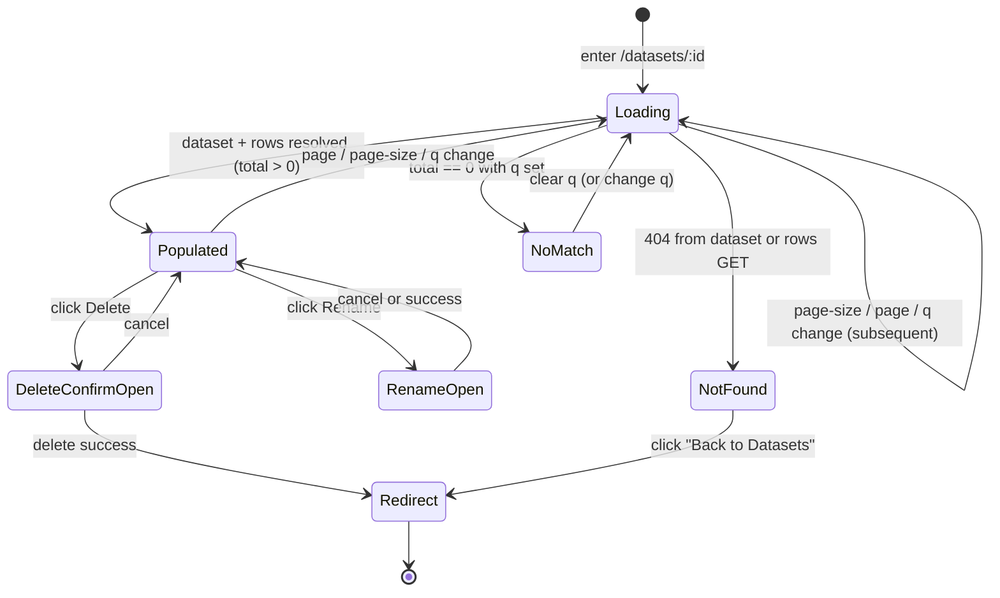

# Dataset detail — feature design

**Concept**: a per-dataset inspector page at
`/data-management/datasets/:id`. Shows the dataset's headline
metadata (workspace, format, sheet, rows, columns, size, uploaded
timestamp) and renders its row contents as a paged data table
with a substring search bar above the table for Cmd-F-style
row lookup. Reached by clicking a row in the Datasets list.
Carries the rename + delete affordances inherited
from [crud-hygiene.md](../_shared/crud-hygiene.md), placed in the page
header's `actions` slot (inside an `Actions ▾` menu).
**Status**: Accepted.
**Sibling docs**:
[datasets.md](datasets.md) (the noun this page inspects),
[upload.md](upload.md) (the verb that produced the rows),
[crud-hygiene.md](../_shared/crud-hygiene.md) (rename + delete affordances
reused here),
[dataset-filters.md](dataset-filters.md) (per-column typed
filters layered on this page),
[saved-query.md](../queries/queries.md) (the **second consumer** of this
page's paged-rows body, which it shares via the extracted `<PagedRowsView>`;
also the destination of this page's **Save filters as Query** action),
[query-construction.md](../queries/query-construction.md) (consolidates this
page's header actions — **Join with related dataset** lives in the `Actions ▾`
menu alongside Rename / Delete),
[workspace-shell.target.md](../../_platform/workspace-shell.target.md) (the chrome
this page renders inside).

---

## Why this exists separately from datasets.md

[datasets.md](datasets.md) covers the **collection** — the list
page, the workspace filter, the workspace-card handoff. This doc
covers the **per-dataset** surface.

The detail page exists because the user needs to **see** their
uploaded data outside the upload wizard's preview step — which
disappears the moment they commit. The detail page is the durable
readout.

This split keeps datasets.md focused on the noun's _catalog_
behavior and lets this doc focus on the noun's _single-instance_
behavior. The two cross-reference; clicking a row in the list
navigates here.

---

## Surfaces — layer / reuse / purity declaration

| Surface                                                               | Layer                                                         | Reusability  | Purity             | Allowed peer deps                                                   |
| --------------------------------------------------------------------- | ------------------------------------------------------------- | ------------ | ------------------ | ------------------------------------------------------------------- |
| `DatasetDetailPage` route component (contains the `MetadataStrip`, the `<Input.Search>` row-search bar, and the `SourceIcon` inline — no standalone `DatasetMetadataStrip` / `RowSearchBar` files) | `apps/builder/src/features/data-management/datasets`          | feature      | feature            | react, antd, @tanstack/react-query, react-router-dom, react-i18next |
| `<PagedRowsView>` (paged rows body — extracted from the inline `DataTableBody` when query-detail became a second consumer) | `apps/builder/src/features/data-management/_shared`             | feature (shared across datasets + queries) | plain-UI           | react, antd, react-i18next                                          |
| `useDatasetQuery(id)` hook                                            | `apps/builder/src/features/data-management/datasets`          | feature      | glue (server-data) | @tanstack/react-query                                               |
| `useDatasetRowsQuery(id, page, pageSize, q?)` hook                    | `apps/builder/src/features/data-management/datasets`          | feature      | glue (server-data) | @tanstack/react-query                                               |
| `datasetsApi.get(id)` + `datasetsApi.getRows(id, page, pageSize, q?)` | `apps/builder/src/api/`                                       | builder-only | glue               | (fetch — no extra peer dep)                                         |
| `GET /datasets/{id}` backend route                                    | `apps/backend/`                                               | backend      | feature            | (FastAPI — backend native)                                          |
| `GET /datasets/{id}/rows` backend route                               | `apps/backend/`                                               | backend      | feature            | (FastAPI — backend native; DuckDB `read_parquet` for the paged read) |
| `DatasetDetail` + `RowsPage` types (FE)                               | `apps/builder/src/features/data-management/datasets/types.ts` | feature      | data type          | none                                                                |

**Boundary check**: the metadata strip stays feature-local (inline in
`DatasetDetailPage`). The paged data-table is **extracted** into a shared
**`<PagedRowsView>`** because a second consumer exists — query-mode detail
([saved-query.md](../queries/queries.md)) renders the same paged-rows body.
Per the build-first rule (feature-local until two consumers exist,
[memory/2026-05-22-ui-boundary-build-first.md](../../../memory/2026-05-22-ui-boundary-build-first.md)),
two concrete consumers justify the extraction.

`<PagedRowsView>` is the inline `DataTableBody` + `<Pagination>` + the loading
/ zero-rows / no-match / 404 states, lifted into one `plain-UI` primitive. It
takes `columns` (carrying `dtype` for cell rendering) + the current page of
`rows` + paging props + an optional per-column header extra (e.g. the filter
popover) + an `emptyState` slot + the state flags; it owns no router, query,
or fetch, so each consumer supplies the rows via its own hook and keeps its
own empty-state copy. It lives in `data-management/_shared/` (the lowest common
ancestor of its two consumers, `datasets/` and `queries/`) rather than `@mdd/ui`,
because it depends on the builder-domain `formatCell` helper + the dataset
`Column`/`Dtype` types and `@mdd/ui` is dependency-free.

The **standard detail layout** is therefore: `<PageContainer fill width="data">`
(R95) + `PageHeader` (title / info / actions) + `PageCard variant="fill"` +
`<PagedRowsView>`. Dataset-detail and query-detail both instantiate it; each
adds its own sections (this page a metadata strip; query-detail a read-only
predicate summary).

The metadata strip and `<PagedRowsView>` are `plain-UI` purity — they take
props in, render JSX out, no router, no query, no zod. The hooks + page above
them carry the glue.

---

## Reference materials

- [datasets.md § Read/write boundary](datasets.md#readwrite-boundary)
  — the collection-side read/write split this page complements.
- [crud-hygiene.md](../_shared/crud-hygiene.md) — rename + delete modals
  reused unchanged. This page only adds a new _placement_ (page
  header actions) for the same affordances.
- [workspace-shell.target.md](../../_platform/workspace-shell.target.md) — the
  master-layout chrome (sidebar + topbar + page-card) this page
  renders inside.
- [upload.md](upload.md) — defines `Dataset.columns[].dtype`
  which drives this page's cell rendering.

External reference (none — Parquet-paged-reads + AntD `<Table>` +
`<Pagination>` are stock patterns; no novel UX research input).

---

## Layout — ASCII intent

The detail page renders inside the master-layout chrome — sidebar
shows "Data Management → Datasets" active; PageHeader shows
breadcrumb + title + actions; PageCard wraps metadata strip and
data table.

### Populated state (≥1 row)

```text
                                          ┌──────── PageHeader.actions ────────┐
Home ▸ … ▸ q1_pipeline_Deals        [Save filters as Query]   [Actions ▾]     │
📊 q1_pipeline_Deals                                                                  │
Excel · Sheet1 — 2,481 rows · 12 columns · 84 KB · Uploaded 14:02 today  ─────────────┘
                                  Actions ▾ = Join with related dataset · Refresh · Rename · Delete

┌──────────────────────────────────────────────────────────────────────────────────┐
│  PageCard                                                                         │
│  ─────────────────────────────────────────────────────────────────────────────  │
│   ┌─ Metadata strip ────────────────────────────────────────────────────────┐   │
│   │ Workspace    Rows     Cols   Size      Uploaded         Format          │   │
│   │ Marketing    2,481    12     84 KB     14:02 today      Excel · Sheet1  │   │
│   └─────────────────────────────────────────────────────────────────────────┘   │
│                                                                                   │
│   [🔍 Search rows…                  ]  Matched 2,481 / 2,481   [▦ Columns 9/12]│
│                                                                                   │
│   ┌──────────────────────────────────────────────────────────────────────────┐  │
│   │ deal_id [str] │ amount [int]  │ won_at [date]  │ stage [str]  │ ...      │  │
│   ├──────────────────────────────────────────────────────────────────────────┤  │
│   │ D-0001        │       12,400  │ 2026-03-01     │ won          │ ...      │  │
│   │ D-0002        │            —  │     —          │ open         │ ...      │  │
│   │ D-0003        │      102,000  │ 2026-04-12     │ negotiating  │ ...      │  │
│   │ D-0004        │        7,800  │ 2026-04-18     │ open         │ a-very…  │  │
│   │ …                                                                          │  │
│   └──────────────────────────────────────────────────────────────────────────┘  │
│                                                                                   │
│         ◀  1 ▸ 2  3  …  50  ▶     Page size: [50 ▾]   Go to: [   ] of 50         │
└──────────────────────────────────────────────────────────────────────────────────┘
```

- **Header title**: source-format icon (`📊` Excel / `📄` CSV) +
  dataset name. Subtitle: format · sheet (excel only) — row
  count · column count · size · uploaded (relative time).
- **Metadata strip**: same fields restated as a table-style row
  for scannable reading. Mirrors the list-row columns so the
  user sees the _same_ numbers they clicked on, only larger.
- **Column headers**: column name + dtype badge (small pill,
  muted color). Dtype badge tooltip on hover: full dtype name
  ("integer", "datetime", etc.).
- **Cells**:
  - **numeric** (`integer`, `float`) — right-aligned,
    `Intl.NumberFormat(locale)` with thousand separators;
    floats keep their decimal precision (no rounding;
    truncated-with-tooltip if too long for the column).
  - **date** / **datetime** — `Intl.DateTimeFormat(locale)`
    ISO-ish display (`2026-03-01` / `2026-03-01 14:02:00`).
  - **boolean** — plain `true` / `false` (lowercase).
  - **string** — left-aligned, truncated at column max-width
    with browser-native `title` tooltip showing full text.
  - **null** — faint `—` (em-dash, muted-color), centered in
    cell. Same glyph regardless of dtype.
- **Pagination**: AntD `<Pagination>` at the bottom — prev/next
  arrows, numbered pages with ellipsis, page-size selector
  (10 / 25 / 50 / 100), jumper input. Always-visible when total > 0;
  hidden for zero-rows state.
- **Columns control (R152/R153)**: to the right of the "Matched X / Y"
  counter, a `[▦ Columns N/M]` button (N visible of M total) opens
  the **Properties panel** (also opened from `Actions ▾ → Properties`) —
  see [§ Column visibility](#column-visibility-r152). The preview
  **default-hides** any `hidden` column; the panel carries the "show all"
  escape + the per-column schema.
- **Search bar** above the table: AntD `<Input.Search>` with a
  search-icon prefix and `placeholder: "Search rows…"`. To the
  right of the input, a muted-text "Matched X / Y" counter
  echoes the active match count (where `Y` is the dataset's
  full `rowCount`). When the input is empty, the counter shows
  the unfiltered total (`Y / Y`). Visible whenever the dataset
  has rows; hidden in zero-rows state. The wider goal is
  Cmd-F-style "find a row in this dataset" — not the full
  query/dashboard surface, which is out of scope here.

### Loading state (first load or page change)

```text
Home ▸ Data Management ▸ Datasets ▸ q1_pipeline_Deals   [Save filters as Query]  [Actions ▾]
📊 q1_pipeline_Deals
…loading…

┌──────────────────────────────────────────────────────────────────────────────────┐
│   ▁▁▁▁▁▁  ▁▁▁▁▁▁  ▁▁▁▁  ▁▁▁▁▁▁▁▁  ▁▁▁▁▁▁  ▁▁▁▁▁▁                                  │
│   ▁▁▁▁▁▁  ▁▁▁▁▁▁  ▁▁▁▁  ▁▁▁▁▁▁▁▁  ▁▁▁▁▁▁  ▁▁▁▁▁▁                                  │
│   …                                                                                │
└──────────────────────────────────────────────────────────────────────────────────┘
```

- Page header renders immediately from the dataset query (cached
  from the list page if entered via row click — the TanStack-Query
  cache covers this; React-router preload optional, not designed
  in).
- Table area shows AntD `<Skeleton>` rows — ~10 placeholder rows,
  header row is the real column headers if the dataset query
  resolved.
- Subsequent page changes (page 2, 3, …) keep the previous page's
  rows visible behind a `loading={true}` overlay (AntD `<Table>`
  native behavior; no skeleton flash).

### 404 / deleted state

```text
Home ▸ Data Management ▸ Datasets ▸ ?

┌──────────────────────────────────────────────────────────────────────────────────┐
│                                                                                   │
│                              🗑                                                    │
│                                                                                   │
│            This dataset no longer exists                                         │
│            It may have been deleted from another tab.                            │
│                                                                                   │
│                          [ ← Back to Datasets ]                                  │
│                                                                                   │
└──────────────────────────────────────────────────────────────────────────────────┘
```

- Triggered when `GET /datasets/{id}` returns 404 (or when
  `getRows` returns 404 — same handling; rare second case if the
  dataset was deleted between detail-GET and rows-GET).
- One-shot toast in addition to the in-page state: "Dataset
  deleted" (matches the list-page delete-success toast wording
  for visual continuity).
- `← Back to Datasets` button uses `history.back()` if there is
  a previous list-page entry, else `navigate('/data-management/datasets')`.

### Zero-rows state (rare but legit)

```text
Home ▸ Data Management ▸ Datasets ▸ commission_calc    [Save filters as Query]  [Actions ▾]
📄 commission_calc
CSV — 0 rows · 6 columns · 4 KB · Uploaded 1 week ago

┌─ Metadata strip ────────────────────────────────────────────────────────┐
│ Workspace    Rows     Cols   Size      Uploaded         Format          │
│ Finance      0        6      4 KB      1 week ago       CSV             │
└─────────────────────────────────────────────────────────────────────────┘

┌──────────────────────────────────────────────────────────────────────────────────┐
│ amount [int]  │ memo [str]   │ paid_at [date]  │ ...                              │
├──────────────────────────────────────────────────────────────────────────────────┤
│                                                                                   │
│                              📭                                                    │
│              No rows in this dataset                                              │
│              Re-upload the file to replace the data.                              │
│                                                                                   │
└──────────────────────────────────────────────────────────────────────────────────┘
```

- A dataset with 0 rows can happen via the wizard if every parsed
  row was empty after parse_options pruning (uncommon, but the
  type system allows `rowCount: 0`). Schema (column headers) is
  still meaningful and rendered.
- No pagination control — total is 0.

### No-match state (search returned zero rows)

```text
Home ▸ Data Management ▸ Datasets ▸ q1_pipeline_Deals   [Save filters as Query]  [Actions ▾]
📊 q1_pipeline_Deals
Excel · Sheet1 — 2,481 rows · 12 columns · 84 KB · Uploaded 14:02 today

┌─ Metadata strip ────────────────────────────────────────────────────────┐
│ Workspace    Rows     Cols   Size      Uploaded         Format          │
│ Marketing    2,481    12     84 KB     14:02 today      Excel · Sheet1  │
└─────────────────────────────────────────────────────────────────────────┘

[🔍 ZZZZZ                          ]  Matched 0 / 2,481  [Clear]

┌──────────────────────────────────────────────────────────────────────────────────┐
│ deal_id [str] │ amount [int]  │ won_at [date]  │ stage [str]  │ ...               │
├──────────────────────────────────────────────────────────────────────────────────┤
│                                                                                   │
│                              🔎                                                    │
│              No rows match "ZZZZZ"                                                │
│              Try a shorter substring or clear the search.                         │
│                                                                                   │
└──────────────────────────────────────────────────────────────────────────────────┘
```

- Triggered when `?q=` is set and the rows-GET returns
  `total: 0`. Column headers stay visible (the schema is still
  meaningful); the pagination control disappears.
- A `[Clear]` button (text link, muted color) next to the
  match counter strips `?q=` from the URL and restores the
  unfiltered view in one click. Same effect as emptying the
  input and Enter.

---

## Layout shell

This page is a **bounded view table** (R96): the card is capped at the
viewport, the table body owns the vertical scroll (so the sticky `<th>` has a
real scroll container), and the pager pins at the **viewport bottom** at every
realistic height. Use the shared `PageContainer fill="bounded"` (R96) + the
`PageCard variant="fill"` recipe:

- Outer page wrapper: `<PageContainer fill="bounded" width="data">`
  (`@mdd/ui`). `fill="bounded"` applies **`height: calc(100svh - 88px)`**
  (WorkspaceShell chrome math = Layout.Header 56 + Content padding 16×2) + flex
  column — a **hard cap** (R96), so a short viewport is absorbed by the table
  body's inner scroll (it shrinks) rather than growing the page and pushing the
  pager below the fold. (Contrast: forms/wizard/builder use `fill` = grow /
  `min-height`, R95 D2 — they have content below the fold, not an inner
  scroll.) `width="data"` caps + centers on wide screens (R95 D3), gutters on
  the shell `colorBgLayout`.
- `<PageCard variant="fill">` — fills the rest as a flex column.
- Metadata strip + search bar + (optional) error alert — each `flex: 0 0
  auto`, stack at the top (fixed; visible at the top of the bounded card).
- `<PagedRowsView>` `scrollMode="contained"` (default) — table body
  `flex: 1 1 auto; minHeight: 0; overflow: auto` (the sticky `<th>` sticks
  here) + pagination bar `flex: 0 0 auto`, pinned at the bottom = viewport
  bottom. **Not** CSS `position: sticky; bottom: 0` (which occludes rows).
- **Known limit** (R96, accepted): a *genuinely tiny* viewport where the fixed
  chrome alone exceeds the screen overflows the bounded card — fine for a
  desktop analytics app.

> The **builder preview** (Query Edit) is the *other* surface and uses the
> opposite knob — `<PagedRowsView scrollMode="flow">` (no inner scroll, pager
> at the natural end, "scroll to the end"). See
> [query-construction.md](../queries/query-construction.md).

Anti-patterns documented in
[2026-05-26-pagecard-fill-pattern-for-fixed-controls.md](../../../memory/2026-05-26-pagecard-fill-pattern-for-fixed-controls.md):
do **not** cap the table with `maxHeight: Xvh`, do **not** use
`position: sticky` without a bounding scroll container, and do **not**
paint the sticky header with `var(--ant-color-fill-quaternary)` (it
resolves to `rgba(0,0,0,0.02)` — rows bleed through).

---

## Token map

All cells are AntD `<ConfigProvider>` tokens derived from the six seeds
in [`themeTokens.ts`](../../../../workspace/packages/ui/src/themeTokens.ts)
(the source of truth). Values are informational (resolved via
`theme.getDesignToken()`, antd 6.x).

| Surface                       | AntD token                                | Value (informational) |
| ----------------------------- | ----------------------------------------- | --------------------- |
| Page background               | `colorBgLayout`                           | `#f5f5f5`             |
| Page card background          | `colorBgBase`                             | derived               |
| Page card border / shadow     | `colorBorderSecondary` + `boxShadowTertiary` | derived            |
| Header title text             | `colorText`                               | derived               |
| Header subtitle text          | `colorTextSecondary`                      | derived               |
| Breadcrumb text / active      | `colorTextTertiary` → `colorTextSecondary` | derived              |
| Metadata strip background     | `colorFillQuaternary`                     | derived               |
| Metadata strip label          | `colorTextTertiary`                       | derived               |
| Metadata strip value          | `colorText`                               | derived               |
| Table header background       | `colorFillQuaternary`                     | derived               |
| Table header text             | `colorTextSecondary`                      | derived               |
| Table row border              | `colorBorderSecondary`                    | `#f0f0f0`             |
| Table row hover               | `colorPrimaryBg`                          | `#e6f4ff`             |
| Cell text                     | `colorText`                               | derived               |
| Null cell glyph               | `colorTextTertiary`                       | derived               |
| Dtype badge background        | `colorFillQuaternary`                     | derived               |
| Dtype badge text              | `colorTextTertiary`                       | derived               |
| Dtype badge border            | `colorBorderSecondary`                    | `#f0f0f0`             |
| Pagination active page        | `colorPrimary`                            | `#1677ff`             |
| Search input border           | `colorBorder`                             | `#d9d9d9`             |
| Search input focus border     | `colorPrimary`                            | `#1677ff`             |
| Search match counter text     | `colorTextTertiary`                       | derived               |
| Search "Clear" link text      | `colorPrimary`                            | `#1677ff`             |
| Border radius (cards, badges) | `borderRadius`                            | `6`                   |
| Font family                   | `fontFamily`                              | system stack          |

No new token is introduced. Identifier parity against the live AntD
registry is enforced by
[`design-token-parity.mjs`](../../../../scripts/lint/design-token-parity.mjs).

---

## Behavior



### URL state

- Route: `/data-management/datasets/:id` where `:id` matches
  `^ds_[0-9a-f]{8}$`.
- Query params: `?page=N&page_size=M` (both 1-indexed page,
  page_size ∈ {10, 25, 50, 100}). Both omitted → defaults to
  `page=1&page_size=50`.
- Page-size change resets `page` to 1 (AntD default; documented
  explicitly so the cache key invalidation works as expected).
- Browser back/forward respects query-param history; each page
  change is a `navigate({ search: ... })` (replace=false), so
  hitting back returns to the previous page.
- Search: `?q=<substring>` appended when the input is non-empty.
  An empty input strips the param entirely. Changing `q` resets
  `page` to 1 — same trigger as page-size change. Search uses
  `navigate({ search: ... }, { replace: true })` so the URL
  history is not cluttered with one entry per keystroke.

### Back navigation

- The header's breadcrumb segments are clickable:
  `Home` → `/`, `Data Management` → `/data-management/workspaces`
  (the spine's landing page), `Datasets` → `/data-management/datasets`.
- The third breadcrumb segment is the dataset name (current page,
  not clickable).
- Direct browser back (`history.back()`) is the primary
  list-state-preservation lever — if the user clicked a row from
  a filtered list, browser back returns to the filtered list.
- No explicit `referrer` param — promote to a `?from=` query
  param if `history.back()` proves flaky.

### Rename / delete (inherited from crud-hygiene.md)

- Rename: opens the `<RenameModal>` with `resourceLabel="dataset"`
  and the current name pre-filled. Mutation hook:
  `useRenameDatasetMutation()`. Success → toast "Dataset renamed",
  and the header title updates from the re-cached dataset (TanStack
  Query invalidation already wired).
- Delete: opens the `<DeleteConfirmModal>` with
  `resourceLabel="dataset"` and the current name in the body. Mutation
  hook: `useDeleteDatasetMutation()`. Success → toast "Dataset
  deleted" + `navigate('/data-management/datasets')` (replace=true
  so back-button doesn't re-enter the deleted page's 404 state).
- Both modals render correctly inside the master shell; no
  modal-mount-point changes needed.

### Save filters as Query (placement only; spec in saved-query.md)

- A header action, **`[Save filters as Query]`**, sits left of the `Actions ▾`
  dropdown in the `PageHeader.actions` slot. It is **enabled iff ≥1 predicate is
  active** on this page — chip `filters` ([dataset-filters.md](dataset-filters.md)),
  the `advanced` DNF ([advanced-query.md](advanced-query.md)), or the `?q=`
  row search — and **disabled** otherwise with the tooltip _"Add a filter or
  search first."_
- Clicking it opens the `SaveQueryModal`, which captures the **current**
  predicate state (built from the live URL/hook state via the shipped
  serializers) as a named, persisted **Query**. This page only **hosts the
  action**; the modal, the persisted entity, the Queries catalog, and the
  query-mode detail view all live in [saved-query.md](../queries/queries.md). No
  change to this page's own states or data contract.

### Row search (`?q=`)

- **Affordance**: a single `<Input.Search>` above the table.
  Placeholder `"Search rows…"`. Default empty (unfiltered).
- **Match semantics**: case-insensitive substring against the
  **stringified cell value** of any column in the row.
  Effectively `LOWER(cell_as_string) LIKE '%q%'` evaluated
  row-major; a row matches if any cell does. No regex, no
  per-column scoping, no AND/OR composition in this round —
  Cmd-F-style "find anywhere in this dataset."
- **Where it runs**: server-side. The FE sends `?q=<value>`;
  the BE filters before paginating so `total` reflects the
  matched row count (not the full dataset row count). The FE
  renders "Matched X / Y" above the table where `Y` comes from
  `Dataset.rowCount` (already fetched) and `X` comes from the
  rows-GET `total` field.
- **Debounce**: the FE debounces user keystrokes by 300 ms
  before firing the next rows-GET. AntD `<Input.Search>` has
  built-in `onSearch` (fires on Enter / button click) plus
  `onChange` we wrap with `useDeferredValue` or a `setTimeout`
  to avoid hammering the BE.
- **Cleared state**: clearing the input restores the unfiltered
  view (counter becomes `Y / Y`, pagination total matches
  `rowCount`).
- **Cell rendering**: matched substring highlighting (mark
  matched chars in yellow) is **deferred** — useful but
  expensive at 100 rows × 12 cols × highlight-render. Promote if
  users complain they can't find their match on the page.
- **Zero matches**: table body shows a centered "No rows match
  `<q>`" placeholder; pagination disabled. Same chrome as the
  zero-rows state but with a different message.

### Concurrent delete (404 race)

If the dataset is deleted from another tab between the user
loading the detail page and clicking somewhere on it, the next
mutation/refetch surfaces a 404. The page transitions to the 404
state and the one-shot toast fires. No optimistic rollback (we're
already on the dataset; just re-render the empty state).

If the dataset is deleted _before_ the initial GET, the page
opens directly in the 404 state. Same toast wording, same back
button.

---

## Column visibility (R152)

> **R152 shipped** the `hidden` view-hint + `PATCH /datasets/{id}/columns` + the row-preview
> default; **R153** (D-gate signed off 2026-07-07) evolves the editing surface into the
> **Properties panel** (right-side Drawer, schema view + visibility editor). The **model field,
> the honor/ignore surface split, and the `PATCH` contract** live in
> [datasets.md § Column visibility](datasets.md#column-visibility-r152); this section owns the
> **editing surface** (the Properties panel) + how the row-preview honors the hint.

Wide tables scroll off-screen. A per-column **`hidden`** view-hint (presentation-only —
[never touches the parquet](datasets.md#column-visibility-r152)) lets the user focus the
row-preview on what matters, while every query / join / relationship picker keeps **all**
columns (Q1: an overridable default, not a projection).

### Row-preview default

`<PagedRowsView>` renders only the visible columns **by default** — it **skips** each column
whose `hidden` is true **in place** (not by filtering the array), so every remaining column keeps
its **original index**: `row[ci]` cell alignment and the per-column filter key
(`renderHeaderExtra(col, ci)`) are unchanged. A `showHiddenColumns` prop overrides the skip. The
header count `[▦ Columns N/M]` shows N visible of M total. When the "show all columns" toggle is
on (Properties-panel-controlled, **session-local — not persisted**), the preview renders every
column including hidden ones, so the hint is always an **overridable** default. Cell rendering,
search, filter, and pagination operate on whatever columns are currently rendered; the search /
filter / query pickers themselves still enumerate **all** columns.

### Properties panel (R153)

A **right-side Drawer** with two sections — a **Dataset** properties block + a **Columns**
schema/visibility editor. It **absorbs** the earlier toolbar-popover Columns manager (R152): the
visibility checklist now lives here alongside the per-column schema. Opened from **two entries to
one surface**: the `Actions ▾ → Properties` menu item, and the `[▦ Columns N/M]` toolbar button
(kept for the at-a-glance count + quick access). AntD `Drawer` (`placement="right"`) — a pattern
already shipped (`WidgetFilterDrawer`).

```text
Actions ▾ → Properties      opens →   ┊ Properties               ✕ ┊
                                      ┊ DATASET                      ┊
                                      ┊   Workspace   Weekly         ┊
                                      ┊   Rows        7              ┊
                                      ┊   Cols        2              ┊
                                      ┊   Size        1.4 MB         ┊
                                      ┊   Uploaded    2 days ago     ┊
                                      ┊   Format      Excel · Master ┊
                                      ┊ ──────────────────────       ┊
                                      ┊ COLUMNS      [ show all ] ⟳   ┊
                                      ┊   ☑ deal_id        string     ┊
                                      ┊   ☑ amount         integer    ┊
                                      ┊   ☐ internal_notes string     ┊  ← hidden, re-showable
                                      ┊   ☑ won_at         date        ┊
                                      ┊ ──────────────────────       ┊
                                      ┊               [ Apply ]       ┊
```

- **Dataset section** — the dataset-level facts (workspace · rows · cols · size · uploaded ·
  format/sheet), sourced from the same [`datasetMetaItems`](../../../../workspace/apps/builder/src/features/data-management/datasets/DatasetDetailPage.tsx)
  helper as the inline `MetadataStrip`, so the two never diverge. **Intentionally repeated** — the
  always-visible strip is the glance; the Properties drawer is the full panel opened deliberately
  (standard for a Properties surface). Zero backend (all on the `Dataset`).
- **Columns section — one row per column** (incl. hidden): **name · dtype · a visible/hidden
  checkbox**. It is the only surface that can **re-show** a hidden column (a header menu can't —
  the column isn't rendered). The dtype is the read-only schema; the checkbox is the sole editable
  thing. All read from the `Column` on `GET /datasets/{id}` — **no new backend**. `format` is
  deliberately **not** shown: it isn't on the committed `Column` (it lives only in `source.json`
  commitSettings, for date/datetime overrides). Deeper per-column facts (null % · distinct ·
  min–max) are **compute-only** (DuckDB profile) → a deferred round, not this surface.
- **Apply** sends the full visible/hidden set via `PATCH /datasets/{id}/columns`
  (`{ hidden: string[] }` — see [contract](datasets.md#column-visibility-r152)); on success the
  `['datasets', { id }]` cache is invalidated and the preview re-renders. Reuses the R152 mutation
  unchanged.
- **At-least-one-visible** is enforced client-side (Apply disabled if all unchecked) and
  server-side (`422 no_visible_columns`).
- **Scope guard:** a **schema view + visibility editor** only — no rename / reorder / dtype-edit
  (those are upload-time or deferred); **dataset-only** (query-detail's `resolvedColumns` +
  provenance are a deferred generality).
- i18n: `datasets.detail.columns.*` + `datasets.detail.properties.*` (en + vi).

---

## Data contract

> The OpenAPI 3.1 YAML files are authoritative. The prose YAML
> below stays as a reading aid, but if the two ever drift, the
> YAML wins.
>
> - [`detail-get.contract.yaml`](../../../../workspace/packages/contracts/datasets/detail-get.contract.yaml)
>   ([rationale](../../../../workspace/packages/contracts/datasets/detail-get.contract.md))
> - [`rows-get.contract.yaml`](../../../../workspace/packages/contracts/datasets/rows-get.contract.yaml)
>   ([rationale](../../../../workspace/packages/contracts/datasets/rows-get.contract.md))

### `GET /datasets/{id}`

```yaml
paths:
  /datasets/{id}:
    get:
      operationId: getDataset
      summary: Get a single dataset by id
      parameters:
        - name: id
          in: path
          required: true
          schema:
            type: string
            pattern: '^ds_[0-9a-f]{8}$'
      responses:
        '200':
          description: Dataset with its committed schema.
          content:
            application/json:
              schema:
                $ref: '../_shared/dataset.yaml#/components/schemas/Dataset'
        '404':
          description: No dataset with the given id exists.
          content:
            application/json:
              schema:
                $ref: '../_shared/api-error.yaml#/components/schemas/ApiErrorNotFound'
```

No new fields on `Dataset`. The list-GET shape suffices —
`name`, `workspaceId`, `sizeBytes`, `rowCount`, `columnCount`,
`columns[]`, `sourceFormat`, `sheetName?`, `createdAt`.

### `GET /datasets/{id}/rows`

```yaml
paths:
  /datasets/{id}/rows:
    get:
      operationId: getDatasetRows
      summary: Get a paged slice of a dataset's rows
      parameters:
        - name: id
          in: path
          required: true
          schema:
            type: string
            pattern: '^ds_[0-9a-f]{8}$'
        - name: page
          in: query
          required: false
          schema:
            type: integer
            minimum: 1
            default: 1
          description: 1-indexed page number.
        - name: page_size
          in: query
          required: false
          schema:
            type: integer
            enum: [10, 25, 50, 100]
            default: 50
        - name: q
          in: query
          required: false
          schema:
            type: string
            minLength: 1
            maxLength: 200
          description: |
            Optional substring filter. Case-insensitive match
            against the stringified value of any cell in the
            row. When present, `total` reflects the matched-
            row count (not the dataset's full row count). When
            absent, behavior is identical to the unfiltered
            paged read.
      responses:
        '200':
          description: Paged row slice.
          content:
            application/json:
              schema:
                type: object
                required: [rows, page, pageSize, total]
                additionalProperties: false
                properties:
                  rows:
                    type: array
                    items:
                      type: array
                      items:
                        type: [string, 'null']
                  page:
                    type: integer
                    minimum: 1
                  pageSize:
                    type: integer
                    enum: [10, 25, 50, 100]
                  total:
                    type: integer
                    minimum: 0
        '404':
          description: No dataset with the given id exists.
          content:
            application/json:
              schema:
                $ref: '../_shared/api-error.yaml#/components/schemas/ApiErrorNotFound'
        '422':
          description: |
            `page_size` outside the enum. A page beyond
            `ceil(total / pageSize)` is NOT a 422 — it returns 200
            with an empty `rows` array (see `rows-get.contract.yaml`).
            Body is the request-level validation shape.
```

**Cell stringification rationale**: cells come over the wire as
`string | null`. BE reads the page slice with DuckDB over the
Parquet file and stringifies each cell via SQL `CAST(col AS
VARCHAR)`; FE re-applies dtype-aware display formatting using
the column dtype carried on the parent `Dataset.columns[].dtype`.
This keeps the rows-payload schema-free and lets FE control
locale/format without round-tripping every change. The
alternative (typed cells with `(string | number | boolean |
null)[][]`) leaks BE's parser opinions; defer until a real need.

### FE types

```ts
export type DatasetDetail = Dataset; // No extra fields.

export type RowsPage = {
  rows: (string | null)[][];
  page: number;
  pageSize: number;
  /** Matched-row count when `q` is set; full dataset row count otherwise. */
  total: number;
};
```

### Query keys (TanStack)

- `['datasets', { id }]` — the detail GET. Existing
  `['datasets']` list-cache invalidation already matches this
  via prefix.
- `['datasets', { id }, 'rows', { page, pageSize, q }]` — the
  rows GET. `q` is part of the cache key so the same page across
  different searches stays cached independently. Invalidated on
  dataset delete (covered by the list-cache invalidation in
  `useDeleteDatasetMutation`); no separate invalidation needed on
  rename (rows don't change).
- **Column visibility mutation (R152)** — `useSetColumnVisibility`
  invalidates `['datasets', { id }]` so the detail GET (and its
  `columns[].hidden`) re-fetches. Rows are **not** invalidated: the
  parquet is untouched, only which columns the preview renders.

### `PATCH /datasets/{id}/columns` (R152)

```yaml
paths:
  /datasets/{id}/columns:
    patch:
      operationId: setColumnVisibility
      summary: Set the full hidden-column set (presentation-only view-hint)
      parameters:
        - name: id
          in: path
          required: true
          schema:
            type: string
            pattern: '^ds_[0-9a-f]{8}$'
      requestBody:
        required: true
        content:
          application/json:
            schema:
              type: object
              required: [hidden]
              additionalProperties: false
              properties:
                hidden:
                  type: array
                  items: { type: string }
                  description: |
                    The complete set of column names to mark hidden.
                    Replace semantics — names absent from this list
                    become visible. Writes `columns_json` only; the
                    parquet, counts, and storage dir are untouched.
      responses:
        '200':
          description: The updated dataset (columns[].hidden reflects the new set).
          content:
            application/json:
              schema:
                $ref: '../_shared/dataset.yaml#/components/schemas/Dataset'
        '404':
          description: No dataset with the given id exists.
          content:
            application/json:
              schema:
                $ref: '../_shared/api-error.yaml#/components/schemas/ApiErrorNotFound'
        '422':
          description: |
            `unknown_column` — a name in `hidden` is not a column of
            this dataset; or `no_visible_columns` — the set would hide
            every column (at-least-one-visible guard).
          content:
            application/json:
              schema:
                $ref: '../_shared/api-error.yaml#/components/schemas/ApiError'
```

---

## Read/write boundary

**Implemented** (this design's full scope):

- OpenAPI 3.1 contracts for both routes, with sibling rationale docs.
- `GET /datasets/{id}` BE route.
- `GET /datasets/{id}/rows?page=&page_size=&q=` BE route — reads the
  paged slice from the dataset's Parquet file via DuckDB; applies the
  optional substring filter before paginating.
- `datasetsApi.get(id)` + `.getRows(id, page, pageSize, q)`.
- `useDatasetQuery` + `useDatasetRowsQuery` hooks.
- `DatasetDetailPage` route at `/data-management/datasets/:id`
  with breadcrumb, header actions, metadata strip, search bar
  (debounced 300 ms, AntD `<Input.Search>`), the shared
  `<PagedRowsView>` (paged `<Table>` + AntD `<Pagination>`),
  loading skeleton, 404 state, zero-rows state, no-match state.
- List-page row-click handoff: `<Table>` `onRow` → navigate to the
  detail route.
- i18n keys: namespace `datasets.detail.*` for all user-facing
  strings; en + vi resource entries.

**In scope (R152, building)** — column visibility (F7):

- `PATCH /datasets/{id}/columns` BE route — writes `columns_json` only.
- `datasetsApi.setColumnVisibility(id, hidden[])` + `useSetColumnVisibility`.
- `<PagedRowsView>` default-hides `hidden` columns (via `showHiddenColumns`), with the
  Properties panel's "show all" escape.
- The Properties panel (right-side `Drawer` — schema view + visibility editor), opened from
  `Actions ▾ → Properties` and the `[▦ Columns N/M]` toolbar button.
- `hidden?: boolean` on the shared `Column` schema
  ([`column.yaml`](../../../../workspace/packages/contracts/_shared/column.yaml)).
- i18n keys `datasets.detail.columns.*` (en + vi).

> The R145 refresh affordance also exposes `GET /datasets/{id}/refresh-settings`
> (its `useRefreshSettingsQuery` hook lives in this feature) — the route's contract is
> owned by [upload.md](upload.md).

**Deferred**:

- **Column sorting**. Parquet is column-oriented but sort-by-
  arbitrary-column still requires full-file read. Promote when
  a query/dashboard surface needs it or when row counts make
  unsorted browsing impractical.
- **Matched-substring highlighting** in cell text. Cheap UX
  win but adds a per-cell render pass; defer until users
  actually complain they can't find their match on the page.
- **Virtualized scroll**. Offset pagination is sufficient
  through ~100k rows × 50 page-size. Promote when 100k+ row
  datasets become routine _and_ page-size-100 feels slow.
- **Column freeze / reorder**. Cosmetic; promote when a user is
  actually blocked. (**Column hide/show shipped R152** — see
  [§ Column visibility](#column-visibility-r152).)
- **Row-level CRUD** (edit / delete / insert). Datasets are
  immutable post-commit in this iteration.
- **Row inspection drawer** (click row → full-cell-text drawer
  for long-string blobs). Truncate-with-tooltip is the affordance
  today; drawer is a follow-up.
- **CSV / JSON / Parquet export**. Separate feature with its own
  auth + perms story.
- **Append / re-upload from this page**. Append-mode is reserved
  on the batch-commit contract but unimplemented; re-upload is
  delete + upload-new today.

---

## Acceptance criteria (Design gate exit)

Testable criteria the inspector satisfies, each mapping to at least
one automated test across F / B / I. Numbered `C1`–`C8`; they describe
the current inspector behaviour.

**User journey** — as a user I click a dataset to inspect it: I see its
metadata, page through its rows, and search for a row by substring.

1. **Metadata strip** _(FE component)_ — the populated state renders
   workspace / rows / cols / size / uploaded / format from
   `useDatasetQuery(id)`, plus a header title with the source-format
   icon and dataset name.
2. **Paged table** _(FE + BE)_ — `useDatasetRowsQuery(id, page,
   pageSize)` renders rows from `GET /datasets/{id}/rows?page=&page_size=`
   with an AntD `<Pagination>` (page sizes 10 / 25 / 50 / 100 + jumper);
   `page` / `page_size` live in the URL and a page-size change resets
   `page` to 1.
3. **Cell rendering** _(FE)_ — driven by `Dataset.columns[].dtype`:
   numeric right-aligned with thousands separators, date / datetime
   ISO-ish, boolean lowercase, null as a muted `—`, string truncated
   with a `title` tooltip.
4. **Row search** _(FE + BE)_ — `<Input.Search>` writes `?q=`,
   debounced 300 ms; the BE filters before paginating so `total` is the
   matched count; "Matched X / Y" shows `Y = Dataset.rowCount`; clearing
   restores `Y / Y`.
5. **States** _(FE)_ — loading skeleton; 404 / deleted state with the
   "Dataset deleted" toast and a "Back to Datasets" button; zero-rows
   state (schema shown, pagination hidden); no-match state ("No rows
   match `<q>`" + Clear).
6. **Rename / delete placement** _(FE)_ — the header actions open the
   [crud-hygiene.md](../_shared/crud-hygiene.md) modals; delete-success navigates
   back to the list with `replace=true`.
7. **Contract** _(pytest / contract)_ — `GET /datasets/{id}` → 200
   `Dataset` / 404; `GET /datasets/{id}/rows` → `{ rows, page, pageSize,
   total }`; `page_size` outside the enum → 422; a page beyond the last
   → 200 with an empty `rows` array.
8. **Cache keys** _(FE)_ — the rows query is keyed
   `['datasets', { id }, 'rows', { page, pageSize, q }]`; delete
   invalidation reaches it via the `['datasets', { id }]` prefix.

---

## Scope boundary

This concept covers:

- The `/datasets/:id` route, its layout, its states (populated,
  loading, 404, zero-rows), its data contract, and the
  rename/delete affordances it inherits.

This concept defers:

- All of the "Deferred" bullets in § Read/write boundary above.

This concept explicitly does NOT cover:

- The Datasets list page (lives in [datasets.md](datasets.md)).
- The upload wizard (lives in [upload.md](upload.md)).
- Rename/delete modal internals (live in
  [crud-hygiene.md](../_shared/crud-hygiene.md)). This page is a _placement_
  of those modals; the modals themselves are unchanged.
- The Saved Query feature — the modal internals, the persisted
  `Query` entity, the Queries catalog, and the query-mode detail
  view all live in [saved-query.md](../queries/queries.md). This
  page only _hosts_ the `[Save filters as Query]` action and _shares_ its
  paged-rows body via `<PagedRowsView>`.
- Future dashboard surfaces that will read the same dataset; those
  get their own design docs when they land.
