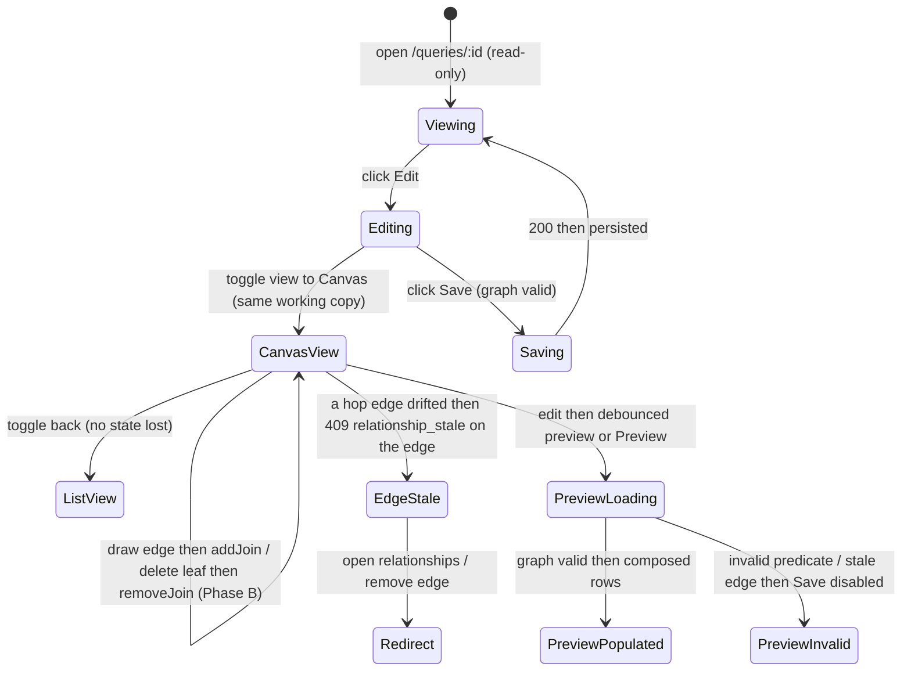

# Query Canvas — the free-form visual source-graph editor (a view/edit mode of the builder)

**Concept**: the **canvas** is a **visual presentation + editing mode** of the
[Query](queries.md) builder: it renders a Query's
[`definition.joins`](queries.md#joins-reading-related-datasets-as-one) **tree** as a **node-link graph** — each
table-source (the driving [`sourceId`](queries.md) + every joined dataset) is a
**node**, each governed [`JoinStep`](queries.md#joins-reading-related-datasets-as-one) is an **edge** — and lets a user
read and (later) **edit** that same tree by direct manipulation (drag nodes, draw an
edge to add a hop, delete a leaf edge to remove one). It is **not a new noun and not a
new page**: it edits the **identical** `definition.joins` tree the hop-list
[construction surface](query-construction.md) already edits, keyed on R79's unified
`sourceId`, runs the **same** stateless preview, and saves through the **same**
lifecycle. The canvas is a **second editor over one model**, not a second model.

**Status**: **Accepted — built.** The builder is two tabs — `Form` (hop list + preview)
and `Canvas` (graph + status chip) — over one working copy (`QueryBuilderPanel`). The
Canvas tab is a **read-only node-link render** of the join tree (`QueryCanvas`, a
hand-rolled SVG/DOM graph — no graph library) **and a pick-pair EDITOR** at hop-list
parity: `[+ Add a source]` stages a node, a column→column pick (or the eligible-pairs
`<Select>`) adds a hop, and a leaf edge's `[×]` removes one — bound to `useQueryBuilder`'s
shipped ops. R88 made the edge **query-owned** (picking copies the governed rel into the
query — copy-on-pick). **Free-form define + promote + the divergence-warn UI, and the
standalone "New query" create flow, are R89/later** (Scope boundary).

> **R85 Design-gate build decision (Phase A).** Render mechanism: **hand-rolled SVG/DOM**
> (AntD-styled nodes positioned by a small deterministic tree-layout fn; SVG edges with
> text labels) — **not** a graph library. This matches the surfaces table's declared
> `react, antd` peer deps (**no deviation**), adds zero bundle weight, and keeps full
> control over the token styling + text-label accessibility model; the bounded-small tree
> (2–4 nodes) makes a generic graph engine overkill. If Phase B (R87) drag-editing proves
> it needs a lib, that is R87's deviation to flag against R87's evidence. `flow-selector`
> at R85's Design gate scored **0/5 → F-only DCFBI** (read-only, FE-only, no new
> interaction), confirming J-3.
>
> **R87 Design-gate build decision (Phase B — editing).** Mechanism: a **pick-pair**,
> AntD-native, **zero-dep** editor (the human-ratified default, 2026-06-18) — **no graph
> library, no peer-dep deviation** (the `react, antd` surfaces-table deps hold). The
> human's two-step shape is honoured: **(1)** click `[+ Add a source]` to stage a node
> (a dataset or saved query) onto the canvas; **(2)** connect at **column granularity** —
> click a source column → click a target column (or a small `<Select>` of eligible
> governed pairs) — which **PICKS the existing governed `rel_`** whose key pair matches and
> **copies it into the query** (R88 copy-on-pick): `addJoin(governedRelId)` snapshots the
> rel's fields as a query-owned `QueryRelationship` and adds a `JoinStep{queryRelId}`. A
> **prior-art survey of 11 visual join/ER editors**
> ([brainstorm](../../../plan/brainstorms/2026-06-18-r87-canvas-editing-prior-art.md))
> established the decisive category split: **schema-authoring** tools (dbdiagram, drawSQL,
> Supabase Designer, Prisma) **DECLARE** an FK when you draw a link, whereas
> **query/analytics** tools (Metabase, Hasura, Looker, dbt) **PICK/consume** an existing
> relationship. **Our canvas edits a _query's_ join tree → query category → PICK.** So a
> drawn column pair with **no** matching governed `rel_` does **not** mint one — it guides
> to [relationships.md](../workspaces/relationships.md) (inline relationship _declaration_
> is schema-authoring, a **separate pull, OUT of R87**). React Flow (`@xyflow/react`) is
> the de-facto React standard for literal column-drag + pan/zoom and the
> evidence-backed library **if** drag is ever judged worth the flagged deviation — held in
> reserve, **not adopted at R87**: pick-pair is keyboard-accessible by construction
> (Metabase's dropdown path is the most accessible of all surveyed), tractable on our
> bounded-small 2–4-node trees, and reuses the list's exact eligibility/leaf controls
> (zero lib risk). This is R85's reserved "deviation against R87's evidence" note,
> **resolved: no deviation.** `flow-selector` at R87's Design gate (below).
>
> **What this doc specifies, by phase.** **Phase A** (the read-only view) is being built
> at R85 against this spec — its surfaces/states/accessibility below are the contract F
> confirms. **Phases B (editing) and C ("New query")** specify the canvas **as it will be
> built when their triggers fire** (Scope boundary); none of B/C is scaffolded today —
> treat those parts as the **inheritance** the later build rounds read. Each build round
> **re-confirms** the verdicts against the then-current builder before it starts (R85 did
> so at its Design gate — see the build-decision note above).

**Round introduced**: [Round_80](../../../plan/cycles/Round_80.md) — the **canvas
theme-opener**, a Design-only round. It fills the
[queries.md trajectory](queries.md#the-trajectory-what-queries-grows-into) step long reserved as the
"free-form visual join canvas", deferred since R74 (J-1′) under the named trigger
**"until the hop-list stops scaling"**.
**Domain folder**: `data-management/queries/` — a **mode** sibling of
[query-construction.md](query-construction.md) (the hop-list builder this re-presents),
[queries.md § Joins](queries.md#joins-reading-related-datasets-as-one) (the `joins` tree this visualizes), and
[queries.md](queries.md) (the create lifecycle the "New query" entry reuses)
under the [queries.md](queries.md) anchor; **not** a parallel page.
**Sibling docs**:
[queries.md](queries.md) (the domain anchor whose trajectory step this
fills; the [reuse invariant](queries.md#the-reuse-invariant-the-one-rule-this-domain-holds)
this obeys),
[query-construction.md](query-construction.md) (the editable builder —
`useQueryBuilder` + `QueryBuilderPanel` — this adds a canvas view/edit mode to; the
create lifecycle the "New query" entry generalizes),
[queries.md § Joins](queries.md#joins-reading-related-datasets-as-one) (the `definition.joins: JoinStep[]` connected acyclic
**tree** the canvas reads/writes — nodes = sources, edges = hops; the `add a hop from
any source` / `remove any leaf` affordances the canvas re-presents),
[queries.md](queries.md) (the base `QueryDefinition`, the catalog the "New
query" entry lives on, and the "Save filters as Query" / "Build on this query" create
verbs the empty-canvas entry sits beside),
[queries.md § Joins](queries.md#joins-reading-related-datasets-as-one) (the per-hop `409 relationship_stale` gate the canvas renders on an
edge),
[relationships.md](../workspaces/relationships.md) (the governed edges each canvas edge
consumes — one `rel_` per hop),
[dataset-detail.md](../datasets/dataset-detail.md) (owns `<PagedRowsView>`, reused for
the canvas's result + preview body),
[workspace-shell.target.md](../../_platform/workspace-shell.target.md) (the chrome all
surfaces render inside).

> **Why a mode, not a noun (the noun-vs-mode check — J-1).** A canvas introduces **no
> new readable-table-source kind, no new engine, and no new model**. It renders and
> edits the **same** `definition.joins` tree [queries.md § Joins](queries.md#joins-reading-related-datasets-as-one) sealed
> (each hop already names its own `leftDatasetId`/`rightDatasetId` — a tree, not a
> path), keyed on the **same** unified `sourceId` R79 landed, and previews/saves through
> the **same** `useQueryBuilder` lifecycle and stateless `POST …/preview`. So it
> **adds a view/edit mode** to the existing builder rather than minting a `/canvas`
> page or a `JoinGraph` / `Canvas` noun (the discarded-R69 trap, the
> [reuse invariant](queries.md#the-reuse-invariant-the-one-rule-this-domain-holds)).
> What is genuinely new is **only the visual rendering + direct-manipulation UX** over
> that tree, named honestly below — never laundered as a new capability.
> _Track: 1 (product feature — design). Pulled by ← R74 J-1′ canvas deferral +
> [queries.md](queries.md) trajectory + R79's unified `sourceId` +
> [purpose.md](../../../context/purpose.md) critical path / key decision #4._

---

## Verdict record — the five judgment calls (Design gate)

The crux of R80 is **not** new model design (the model is twice-validated, R73/R74,
and unified at R79); it is **two governance calls** — _is this a mode or a noun?_ and
_has the trigger fired?_ — plus their three consequences. Each verdict is recorded
here as the design's load-bearing decision, traced against the **real shipped model**,
not a green suite ([specious-model-lock-in](../../../memory/2026-06-13-specious-model-lock-in.md)).

### J-1 — Noun or mode? → **MODE** (a view/editor of the existing tree)

A canvas **node** is a table-source already named by the definition (`sourceId` for the
driving node; each `JoinStep`'s `rightDatasetId` for a joined node); a canvas **edge**
is a `JoinStep` already in `joins[]`. Drawing an edge is the **same** operation the
hop-list's `[+ Add a join]` performs (`addJoin(leftSource, rel_)`); deleting a leaf edge
is the **same** `removeJoin(rel_)`; the connected-acyclic invariant is **unchanged**.
The canvas therefore **mints nothing** — no new source kind, no new engine, no new
route, no new noun. It is the **same builder in a different projection**. A "canvas
page" that re-implemented the hop list, the predicate editors, or the run engine would
re-commit the discarded-R69 parallel-pages sin; the reuse invariant forbids it.
**Verdict: a view/edit MODE of `useQueryBuilder` / `QueryBuilderPanel`, parallel to the
hop-list over one working copy — not a noun, not a page.**

### J-2 — Has the trigger fired? → **NO. Defer the build; bank the design.**

The deferral trigger ([queries.md § Joins / Scope](queries.md#joins-reading-related-datasets-as-one)) is: _"the hop-list +
left-source `<Select>` stops scaling — a topology a human can no longer read as a
list."_ Evidence at R80:

| Signal | Reading at R80 |
| --- | --- |
| Real tree sizes today | The product reads CRM exports (Deals, Accounts, Owners, Contacts). The motivating reports are **2–4-node** stars/paths (`Deals ⋈ Accounts ⋈ Owners`; `Deals ⋈ Accounts` **and** `Deals ⋈ Owners`). A 2–4-row hop list is **trivially readable**. |
| Hop-list scaling pain | **None reported.** R73→R74 shipped the hop list + the left-source `<Select>` + leaf removal; no round, memory, or user signal records a tree too large to read as a list. |
| Acyclic-tree ceiling | The model is a **spanning tree** (no diamonds/self-joins). The branching factor a human must track is bounded by the workspace's declared `rel_` set, still small. |
| What a canvas would buy **now** | Spatial layout + drag editing — **desirable, not yet necessary**. The hop list already expresses every tree the model permits. |

**Verdict: the trigger is UNFIRED.** Building the visual editor now optimizes a surface
no current report strains. Per the **dynamic-equilibrium brake** and
**[[dont-mvp-rush-a-roadmap-home-surface]]**, the honest call is **defer the build,
bank the design**: a Design-only round is cheap and fully revertible, and this doc
gives R81+ a resolved home/flow the moment a real tree outgrows the list. The build
round **re-checks this trigger first** — if trees are still small, it defers again.

### J-3 — Model impact? → **NONE. Purely an FE editing surface; F-only build.**

The canvas reads/writes `definition.joins: JoinStep[]` (R74's tree) keyed on `sourceId`
(R79) — **no field added, no route added, no error code added, no engine touched.** A
node maps to a source already in the resolver; an edge maps to a `JoinStep` already
validated by `disconnected_join` / `cyclic_join`; preview runs the **same** stateless
`POST …/queries/preview`; the per-hop `409 relationship_stale` gate renders on the edge
it already names. The canvas is **discovered from the existing model**, not imposed on
it. **Verdict: a frontend-only surface.** When the build is pulled it is an **F-only
DCFBI** round (no contract/BE re-open) — confirm the canvas into the FE-on-MSW source of
truth; `flow-selector` runs at that build round's Design gate, not here.

### J-4 — Standalone "New query" entry → **reuse the Queries-catalog IA + R77's create lifecycle.**

Today's create entries are **source-rooted**: "Save filters as Query" (from a dataset,
[dataset-detail.md](../datasets/dataset-detail.md)) and "Build on this query" (from a
saved Query, [queries.md](queries.md)). The canvas implies the **missing
no-source start**: an empty graph onto which you place the first node. Its home is a
**`[+ New query]` action on the Queries catalog** (`/data-management/queries`) that
opens the builder in **create mode with no preset base** — the empty-source case R77
**explicitly deferred to ship with the canvas, built right**
([[dont-mvp-rush-a-roadmap-home-surface]]). It **reuses R77's create lifecycle**
(`/queries/new`, no `?base=`): no id, name-capture at Save via the reused
`SaveQueryModal`, `POST` carrying `{ name, sourceId, definition }`. The
canvas is the natural editor for that empty start (place a node = pick the driving
`sourceId`; draw an edge = add a hop). **Verdict: not a parallel surface — a catalog
entry into the same create lifecycle, with the canvas as its editor (noun-vs-mode brake
again).**

### J-5 — First-build scope (when build proceeds) → **a phased, thin-but-not-rushed slice.**

The design names the build's phasing so R81+ inherits a clear first cut that respects
both YAGNI and "don't MVP-rush a roadmap-home surface":

| Phase | Scope | Why this is the honest seam |
| --- | --- | --- |
| **A — read-only canvas VIEW** | Render the existing tree as nodes + labelled edges, as a **toggle beside the hop list** in the builder. **Zero** editing, zero model change — pure visualization of what `joins[]` already holds. | The thinnest slice that delivers the canvas's first real value (read a tree spatially) and proves the rendering before any editing risk. The list stays the editor. |
| **B — interactive editing** | Direct manipulation at **parity** with the hop list: draw an edge (`addJoin` from any in-graph source to a not-yet-joined dataset), delete a leaf edge (`removeJoin`), pick the `rel_` on the new edge. Reuses the same validation + preview. | Only pulled once Phase A proves the view **and** a real tree is large enough that drag editing beats the list. Adds no model surface. |
| **C — standalone "New query"** | The empty-canvas create entry (J-4): `[+ New query]` → builder in create mode, no preset base, place the first node on an empty graph. | The genuinely new IA entry; lands last because it depends on B's place-a-node interaction. |

**Verdict: Phase A (the read-only view) is the thin-but-not-rushed first build slice.**
It is doing the view *right* (a real graph render, not a sketch) without rushing the
editor; B and C are their own pulls, each its own round.

**Discovered-vs-imposed:** _discovered._ The canvas is pulled by a real, named trigger
(R74 J-1′, written before R80) and by the unified `sourceId` R79 landed **specifically
so the canvas reads one source, not two**. Nothing is minted to justify the surface;
R80 **declines to build** until a real tree outgrows the list, and banks the design in
the meantime.

---

## The model — unchanged; the canvas renders + edits it

The canvas introduces **no change of its own** to `QueryDefinition` — it is a
**read-write projection** of the same object the hop list edits (the tree was sealed in
[queries.md § Joins](queries.md#joins-reading-related-datasets-as-one); the source field
unified to `sourceId` in R79; R88 moved each edge into the query's own
`relationships[]`, referenced by `queryRelId`):

```ts
// the canvas renders this as a graph and edits it via the same ops. R88 — a hop
// references a query-OWNED relationship (`queryRelId`), not a governed `rel_` by id.
type JoinStep = {
  queryRelId: string; // `qrel_…` — the query-owned edge this EDGE consumes
  type: JoinType; // shipped: 'inner' | 'left' | 'right' | 'full' (types.ts)
};

type QueryDefinition = {
  q?: string | null;
  filters: FilterAtom[];
  advanced: FilterAtom[][];
  relationships: QueryRelationship[]; // the query's OWN edges (copy-on-pick); see queries.md
  joins: JoinStep[]; // R74 tree: each hop names its own left/right → a graph already
};
// the driving node is the Query's unified `sourceId` (R79: ds_ | qr_); each hop's
// query-owned rel (`relationships[]` by `queryRelId`) carries the rightDatasetId of a
// further node. The canvas reads exactly these.
```

- **Nodes** = the sources the resolver already walks: the driving `sourceId` plus each
  hop's right dataset. **Edges** = the `JoinStep`s in `joins[]`, each labelled with its
  key pair (`account_id ↔ id`) and advisory `cardinality`.
- **Editing maps 1:1 onto the hop-list ops** ([queries.md § Joins](queries.md#joins-reading-related-datasets-as-one)): draw an
  edge = `addJoin` (left ∈ graph, right ∉ graph — the connected-acyclic invariant,
  enforced unchanged); delete a leaf edge = `removeJoin` (a hop whose right is no other
  hop's left). The canvas **cannot express** anything the hop list can't — same tree,
  same guards.
- **Layout (node x/y positions) is view-only.** A graph layout is computed (or stored as
  FE-only view state); it is **never** added to the persisted `definition`, which stays
  the topological `joins[]` order. _(Whether positions persist as cosmetic FE state is a
  build-round detail, [[design-altitude-vs-build-home]]; the model does not carry them.)_

---

## What is genuinely new vs. reused (the honest split)

The canvas adds a **visual projection + direct-manipulation UX** over a sealed model +
shipped engines. Naming the split up front keeps the build from re-inventing anything:

| Reused verbatim (the true half) | Genuinely NEW (the visual UX only) |
| --- | --- |
| The `QueryDefinition.joins` tree + the unified `sourceId` resolver — **rendered + edited, not extended** | A **node-link rendering** of the tree (nodes = sources, edges = hops) as a builder mode |
| `useQueryBuilder`'s `addJoin` / `removeJoin` / working-copy / dirty-Save lifecycle | **Direct-manipulation bindings** (draw-edge → `addJoin`; delete-leaf → `removeJoin`) onto those same ops |
| The connected-acyclic invariant (`disconnected_join` / `cyclic_join`) + the per-hop `409 relationship_stale` gate | The same guards/states **rendered on a node/edge** instead of a list row |
| The stateless `POST …/queries/preview`, `query_joined_rows`, `<PagedRowsView>` | (nothing new — the canvas previews through the identical path) |
| R77's create lifecycle (`SaveQueryModal`, `useCreateQueryMutation`, `/queries/new`) | The **empty-canvas "New query"** entry on the catalog (the no-base create case) + place-first-node |

**No new model. No new engine. No new route. No new noun.** The genuinely new work is
the **graph render + drag/draw editing** + the **catalog "New query" entry** — every
model, validation, preview, and persistence concern is reuse.

---

## Surfaces — layer / reuse / purity declaration

> Specifies the canvas **as it will be built (R81+)**; nothing here is scaffolded at
> R80. Phase A = the read-only view; Phase B = editing; Phase C = the "New query" entry.

| Surface | Layer | Reusability | Purity | Allowed peer deps |
| --- | --- | --- | --- | --- |
| `QueryCanvas` (NEW: node-link render of the `joins` tree; Phase A) | `apps/builder/src/features/data-management/queries` | feature | feature | react, antd |
| `QueryBuilderPanel` (extended: a canvas/list view toggle over one working copy) | `apps/builder/src/features/data-management/queries` | feature | feature | react, antd |
| `useQueryBuilder` (reused: the canvas binds to its `addJoin`/`removeJoin`/Save) | `apps/builder/src/features/data-management/queries` | feature | glue | @tanstack/react-query, antd |
| `QueryCanvas` (the SVG/DOM graph render + pick-pair draw-edge / delete-leaf editing — editing lives inside this component, not a separate one) | `apps/builder/src/features/data-management/queries` | feature | feature | react, antd |
| `joinGraph.ts` (extracted shared selectors `graphDatasetIds` / `addEligibleRels` / `isLeafHop`, keyed on the query-owned rels — the list and canvas read one source) | `apps/builder/src/features/data-management/queries` | feature | glue | none |
| `<PagedRowsView>` (reused, not owned — preview + result body) | `apps/builder/src/features/data-management/_shared` | shared cross-domain | plain-ui | react, antd, react-i18next |
| `SaveQueryModal` (reused, not owned — R69; "New query" name capture; Phase C) | `apps/builder/src/features/data-management/queries` | feature | feature | react, antd |
| `useCreateQueryMutation` (reused, not owned — R69; the "New query" `POST`) | `apps/builder/src/features/data-management/queries` | feature | glue | @tanstack/react-query |
| `JoinStep[]` tree + `QueryRelationship[]` (the query-owned edges; frontend + contract type) | `.../features/data-management/queries/types.ts` | feature | data type | none |

**Boundary check**: the only shared-cross-domain row (`<PagedRowsView>`) is **reused,
not owned** ([dataset-detail.md](../datasets/dataset-detail.md)). `QueryCanvas` (render +
editing) **binds to** `useQueryBuilder`'s shipped `addJoin`/`removeJoin`/Save and
the stateless preview — they re-implement **no** validation, engine, predicate editor,
or detail page. The "New query" entry **reuses** R77's `SaveQueryModal` +
`useCreateQueryMutation`. No canvas surface re-implements a dataset/query page, a join
engine, or the hop-list's edit logic; the canvas and the list are **two views of one
working copy**.

---

## Token map

The canvas surfaces are AntD primitives (`<Button>`, `<Tag>`, `<Select>`, `<Alert>`,
`<Tooltip>`, `<Table>` via `<PagedRowsView>`) plus SVG/DOM node-link rendering, styled
by the `<ConfigProvider>` tokens derived from the six seeds in
[`themeTokens.ts`](../../../../workspace/packages/ui/src/themeTokens.ts) (the source of
truth — R66). **No new token is introduced**; the map reuses the identifiers already
cited by [queries.md § Joins](queries.md#joins-reading-related-datasets-as-one) and [query-construction.md](query-construction.md).
`Value` is informational.

| Surface | AntD token (themeTokens.ts) | Value (informational) |
| --- | --- | --- |
| Canvas background | `colorBgLayout` | `#f5f5f5` |
| Node card background | `colorBgBase` | derived |
| Driving-node / primary edge (`[+ New query]`, draw-edge) accent | `colorPrimary` | `#1677ff` |
| Edge label / cardinality `<Tag>` text | `colorTextSecondary` | derived |
| Node / edge border | `colorBorderSecondary` | `#f0f0f0` |
| Stale-edge `⚠` warning (hop unavailable) | `colorWarning` | `#faad14` |
| Canvas status chip — valid (`N rows ↗`) text (R86) | `colorTextSecondary` | derived |
| Canvas status chip — stale/invalid (`⚠ unavailable ↗`) (R86) | `colorWarning` | `#faad14` |
| Invalid / unrunnable-graph `<Alert>` | `colorError` | `#ff4d4f` |
| Border radius (node card, table, tag, button) | `borderRadius` | `6` |
| Font family | `fontFamily` | system stack |

Identifier parity is enforced by
[`design-token-parity.mjs`](../../../../scripts/lint/design-token-parity.mjs).

---

## Layout — ASCII intent

The canvas is a **view of the builder**, inside the **same** detail shell
(`PageHeader` + `PageCard`) the hop-list builder uses. **R85** shipped it as a
`[List]/[Canvas]` toggle inside the Build section (the preview below, shared). **R86
restructures this into two top-level tabs over the one working copy** — **`Form`** (the
hop-list builder + the live preview) and **`Canvas`** (the full-width node-link graph;
**no preview table** — a clickable **status chip** links to the Form preview). Both tabs
bind to the same `useQueryBuilder`; Save lives in the shared `PageHeader`. Still a
**mode, not a route** (J-1): switching tabs swaps the rendering of one copy, losing no
edit; the preview query keys on the working copy and runs regardless of the visible tab,
so the Save gate holds on either tab.

### The two-tab builder (R86 — `Form` / `Canvas`)

```text
Deals × Accounts × Owners                                         [Cancel] [Save]
[ Form ] ( Canvas )   ← top-level tabs; one working copy, shared header Save
┌─ Canvas ───────────────────────────────────────────────[ 1,204 rows ↗ ]─┐
│                          ┌───────────┐                   ↑ status chip:    │
│        ┌──────────┐      │  Accounts │     ┌────────┐      click → Form     │
│        │  Deals ◆ │──────┤           ├─────│ Owners │      tab, preview      │
│        └──────────┘ account_id↔id     └──┬─┘ owner_id↔id   expanded          │
│           (driving)     many:many        │     many:one                      │
│                                          └─ (edges: key pair + cardinality)  │
└──────────────────────────────────────────────────────────────────────────────┘
  (no preview table on the Canvas tab — results live on the Form tab)

[ Form ] tab → the hop-list editor + filter chips + advanced + search, with the
shared <PagedRowsView> preview below (the R85 builder, unchanged).
```

`◆` marks the **driving node** (`sourceId`). Edges carry **text** labels (the key pair +
cardinality `<Tag>`), not colour/glyph alone. The **Canvas tab is read-only at R86; R87
makes it an EDITOR** (the pick-pair Phase B below); the **`Form` tab remains the
keyboard/screen-reader-complete equivalent + assistive-tech default** (editing is available
on both tabs over the one working copy — the Form tab is not the _only_ editor, but it is
the AT-complete one).

**The canvas status chip** (`[ N rows ↗ ]`, top-right of the Canvas tab) is a labelled,
keyboard-reachable button that mirrors the preview gate and links to it (the "where the
results live" discovery affordance — preferred over a static note). Its states:

- _valid_ → `N rows ↗` (`colorTextSecondary`); clicking switches to the `Form` tab with
  the preview expanded.
- _loading_ → `Previewing…` (reuses the builder's existing preview-fetching state — no
  new spinner).
- _empty / zero_ → `0 rows ↗` (the definition matches nothing — **not** an error).
- _stale / invalid_ → `⚠ unavailable ↗` (`colorWarning`, **text + icon**, not colour
  alone), pointing to the `Form` tab where the blocked-state alert + the fix live. Save
  stays disabled (the gate reads preview validity regardless of the visible tab).

### Phase B — interactive editing (pick-pair, column-granularity, at hop-list parity, R87)

```text
  ┌─ Canvas (editing) ──────────────────────────────────────────────────────────┐
  │   ┌──────────┐                ┌───────────┐                                  │
  │   │  Deals ◆ │════════════[×]═│  Accounts │  ① [+ Add a source] stages a     │
  │   │  · id    │  account_id↔id  │  · id     │     not-yet-joined node (dataset │
  │   │  · …     │                 │  · …      │     or saved query)              │
  │   └──────────┘                 └───────────┘  ② click a source column → a     │
  │   ┌ · · · · · ┐  (staged, not yet joined)        target column → PICKS the     │
  │   ┊  Owners   ┊  ← click a column pair to        governed rel_ → addJoin       │
  │   └ · · · · · ┘     connect (or pick from <Select>)                            │
  │   [ + Add a source ]   (disabled w/ tooltip when no eligible rel_ remains)     │
  └──────────────────────────────────────────────────────────────────────────────┘
```

**Two steps (R87, the human's ratified shape).** **①** `[+ Add a source]` stages a
not-yet-joined node (a dataset or saved query) onto the canvas — **FE-only staging state**;
the node enters `joins[]` only when its column link is drawn (the model stays a connected
tree rooted at `sourceId` — an unjoined node is ephemeral, never persisted). **②** connect
at **column granularity**: click a source column → a target column (or a small `<Select>`
of eligible governed pairs), which **PICKS the existing governed `rel_`** whose key pair
matches → `addJoin(governedRelId)` — which **copies** it into the query's
`relationships[]` (R88 copy-on-pick) and adds a `JoinStep{queryRelId}` (the **same**
connected-acyclic guard, the **same**
eligibility set `JoinEditor` computes: `valid && left∈graph && right∉graph`). **Gesture
learnability (declared so F builds it):** after the source-column click, the **eligible
target columns are highlighted** (the draw.io row-highlight cue) and a transient hint names
the next step; the **`<Select>` of eligible governed pairs is the self-describing,
discoverable equivalent** for anyone who doesn't reach for the click-gesture (and the
keyboard/SR path — a11y section). A column pair
with **no** matching governed `rel_` does **not** create one this round — it guides to
[relationships.md](../workspaces/relationships.md); **defining a query-owned rel free-form
from that drawn pair is R89** (where drawing *creates*, the gesture finally earns a graph
library). A **leaf** edge shows a `[×]` delete affordance → `removeJoin`; a non-leaf edge's `[×]` is
**disabled with a text tooltip** (the shipped `removeJoinBlocked` reason). Exactly the hop
list's eligibility + leaf rules, on the graph — **no new model, route, error code, or
peer-dep** (J-3 holds). Mechanism = **pick-pair, zero-dep** (the build-decision note above).

### Phase C — empty-canvas "New query" (the no-source create entry)

```text
Home ▸ Data Management ▸ Queries                                   [ + New query ]
                                       ↓ opens builder, create mode, EMPTY canvas
  ┌─ Canvas ────────────────────────────────────────────────────────────────────┐
  │                                                                              │
  │            ( empty )   [ + Add a source ]  ← place the first node            │
  │                         pick a dataset or saved query (sets sourceId)        │
  └──────────────────────────────────────────────────────────────────────────────┘
  [ Save ] → SaveQueryModal (name) → POST {name, sourceId, definition}
```

`[+ New query]` lives on the **Queries catalog** beside the existing source-rooted
verbs; it opens R77's create lifecycle with **no preset base** and the canvas as editor.

### Stale-edge state (the `409 relationship_stale` gate, on an edge)

```text
  ⚠  The “Deals ⋈ Accounts” join is unavailable — “account_id” no longer exists.
     Fix the relationship in the workspace, or remove this edge.
     [ Open relationships ↗ ]   [ Remove edge ]
```

---

## Behaviour — states



- **View switch is lossless** — `[Form] ⇄ [Canvas]` (R86 tabs; R85's inline `[List]/
  [Canvas]` toggle was the first cut) swaps the **rendering** of one working copy; no edit
  is lost, no model is forked. Edits call the same `useQueryBuilder` ops.
- **Preview lives on the `Form` tab only; the Save gate holds on both (R86).** The Canvas
  tab carries **no preview table** — but `useQueryBuilder`'s preview query keys on the
  working copy and runs whenever the builder is active, **independent of the visible
  tab**, so `canSave` (preview-validity-gated) is correct on the Canvas tab too. The
  **canvas status chip** (`[ N rows ↗ ]`) mirrors that gate and links to the Form preview;
  its states (valid / loading / empty / stale-or-invalid) are declared in the Layout
  section. No change to the hook — an FE rendering addition only.
- **Phase-A trivial states (R85 — declared so F builds them, not infers them).** _Empty
  graph_: a Query with **no joins** (`joins[] === []`) renders the **lone driving node**
  (`sourceId`) — a single-node canvas, not a blank. _Loading_: the canvas mounts on the
  builder's **existing** load — it reads the resolved `joins` plus the same
  `useRelationshipsQuery` / `useDatasetsQuery` the hop-list (`JoinEditor`) already uses to
  name nodes/edges; **no new spinner state is invented** (until that data resolves, the
  Build section shows the same loading it shows today). The canvas resolves each hop's
  dataset names + key pair + cardinality exactly as the list does (reuse, not a parallel
  fetch path).
- **Editing (Phase B, R87 — pick-pair)** maps to the hop-list ops exactly: **①** stage a
  node via `[+ Add a source]` (FE-only, not yet in `joins[]`); **②** connect at column
  granularity (click source column → target column, or a `<Select>` of eligible governed
  pairs) → **PICK** the matching governed `rel_` → `addJoin` (connected-acyclic guard +
  eligibility set unchanged); delete-leaf → `removeJoin`; non-leaf delete disabled with the
  shipped `removeJoinBlocked` text tooltip. A drawn column pair with **no** matching
  governed `rel_` does **not** declare one — it guides to
  [relationships.md](../workspaces/relationships.md). When **no** source has an eligible
  outgoing edge, the add affordance is **disabled** with the same guiding tooltip the hop
  list uses (the `addJoinNone` state). **Mechanism = pick-pair, zero-dep — no graph lib**
  (the R87 build-decision note); React Flow held in reserve for literal drag only.
- **Preview / Save / discard** are **unchanged** — the stateless `POST …/queries/preview`
  and the dirty-Save/discard lifecycle; the canvas persists nothing new (positions are
  view-only).
- **Stale gates are flag-don't-crash, per edge** — a stale hop renders the
  "edge unavailable" `<Alert role="alert">` on its edge, naming the column, never a
  blank crash ([purpose.md](../../../context/purpose.md) #5). _Code reality:_
  `useQueryBuilder` exposes a **chain-wide** `relStale: boolean` (set when the preview
  returns `409 relationship_stale`) for the Save-guarded banner. The **per-edge** marker is
  computed on the FE by `QueryCanvas` via `columnMissing()` — checking whether the
  query-owned rel's key columns (`leftColumn` / `rightColumn`) still exist in the
  referenced datasets' **current** columns (R88 — the query owns its edge, so there is no
  governed `Relationship.status` to read; staleness is a column-drift check against the
  snapshot). No new wire field.
- **"New query" (Phase C)** opens create mode with no base; place the first node (sets
  `sourceId`), build the graph, Save captures a name and `POST`s — R77's lifecycle.

### Accessibility (declared here so F builds it, not infers it)

- **The canvas is not the only way to read/edit the tree.** The **`Form` tab is the
  keyboard-and-screen-reader-complete equivalent** (the shipped hop-list affordances + the
  preview); the `[Form] [Canvas]` tabs are labelled, keyboard-reachable controls, and
  **`Form` is the default for assistive-tech** — the canvas is an *additional*, not a
  *replacement*, affordance. No capability is canvas-only. _(R86 tabs; R85 shipped this as
  the inline `[List]/[Canvas]` toggle.)_
- **The canvas status chip** (`[ N rows ↗ ]`, R86) is a labelled, keyboard-reachable
  **button** (`aria-label` "View N result rows in Form builder"), not a static badge; its
  stale/invalid state reads as **text + icon** (`⚠ unavailable`), not colour alone; on
  activation it moves focus to the `Form` tab's preview. It makes "results live on Form"
  **discoverable** without a static instructional note (the Findability path).
- **Nodes and edges carry text, not colour/glyph alone** — each node names its source in
  **text**; each edge names its key pair (`account_id ↔ id`) + a labelled cardinality
  `<Tag>`; the driving node is marked with **text/icon + label**, not colour. Node/edge
  selection is keyboard-reachable in a defined focus order.
- **Editing affordances are labelled** — `[+ Add a source]` / the column-pick / per-edge
  delete are labelled controls; a **disabled non-leaf delete** keeps its label and
  exposes its reason as **text** via tooltip (`aria-disabled`, not a silent dead
  control), so the leaf rule is discoverable. The per-edge `[×]` delete is
  **always-visible and keyboard-reachable** (not hover-only).
- **Column-granularity editing has a keyboard/SR-complete path (R87).** Columns are in a
  **defined focus order** within each node; the **column-pick gesture** (click source
  column → click target column) has a **keyboard equivalent**: the **`<Select>` of eligible
  governed `rel_` pairs** is the self-describing, fully keyboard/screen-reader-navigable way
  to pick the same pair (the Metabase dropdown convention the prior-art brief found most
  accessible). No editing capability is mouse-only; the `Form` tab remains the AT default
  and the SR-complete equivalent.
- **The stale-edge state** is an `<Alert role="alert">` whose reason is **text** (the
  missing column + the edge named), icon + text — not a colour swatch; its
  `[Open relationships]` / `[Remove edge]` actions are focus-order reachable.
- **The "New query" entry + name capture** reuse `SaveQueryModal`'s shipped semantics
  (labelled input, autofocus, accessible `name_taken` error, Save-disabled reason).
- The result/preview reuses `<PagedRowsView>`'s shipped table semantics;
  collision-qualified headers keep every column name unique and screen-reader-navigable.

---

## Data contract (intent — no change)

The canvas is a **frontend-only** surface (J-3). It introduces **no new route, no new
wire field, and no new error code**:

- **Reads/writes** the existing `definition.joins: JoinStep[]` on the existing create /
  get / run / preview / update shapes ([queries.md § Joins](queries.md#joins-reading-related-datasets-as-one) /
  [query-construction.md](query-construction.md)); `sourceId` is R79's unified field.
- **Previews** through the existing stateless `POST /workspaces/{id}/queries/preview`.
- **"New query"** uses the existing `POST /workspaces/{id}/queries` (R76/R77 already
  carry the optional `sourceId`).
- **Consumes** the existing `409 relationship_stale` / `409 query_stale` /
  `422 disconnected_join` / `422 cyclic_join` gates per edge — **no new code**.

If the build round discovers a genuine contract need (e.g. persisting cosmetic node
positions), that is a **deviation flagged at the build's gate**, not assumed here; the
sealed intent is **FE-only over the existing tree**.

---

## Acceptance criteria (Design gate exit)

**This is a Design-only round.** Its acceptance is that the **design is sealed +
the verdicts are recorded**, not that code runs. The **design-gate** criteria below are
**design assertions** checked at this gate; the **handed-down** criteria are the
**future** build-round tests this doc passes to R81+ (run on the human's go-ahead
**if/when** J-2's trigger fires).

**Design-gate (this round):**

1. **Noun-vs-mode resolved → MODE** _(design assertion)_ — this doc records that the
   canvas is a view/edit mode of `useQueryBuilder` / `QueryBuilderPanel` over the
   existing `joins` tree + `sourceId`, minting no noun, page, model, or engine.
2. **Trigger verdict recorded → DEFER** _(design assertion)_ — this doc records the
   honest build-now/defer call with evidence (today's 2–4-node trees read fine as a
   list; the trigger is unfired) and **defers the build to R81+**, banking the design.
3. **Model-impact verdict → FE-only** _(design assertion)_ — this doc records that the
   canvas re-opens **no** model/contract/engine; the build (when pulled) is **F-only
   DCFBI**; `flow-selector` runs at that build round, not here.
4. **"New query" IA resolved** _(design assertion)_ — this doc records the empty-canvas
   "New query" as a **Queries-catalog entry into R77's create lifecycle** (no preset
   base), not a parallel surface — the noun-vs-mode brake on the entry point.
5. **First-build scope named** _(design assertion)_ — this doc names the phased slice
   (A read-only view → B editing → C "New query"), with **Phase A** the thin-but-not-
   rushed first build.
6. **Reuse invariant honoured in the spec** _(design assertion)_ — the surface table +
   honest split show the canvas reusing the builder lifecycle, validation, preview,
   `<PagedRowsView>`, and R77's create path; re-implementing none of them.

**Handed down to the build round (R81+, if the trigger fires):**

1. **Canvas renders the tree faithfully** _(FE)_ — nodes = `sourceId` + each hop's
   right; edges = `joins[]` labelled with the key pair + cardinality; a 2+-hop star
   renders correctly. _(Phase A)_
2. **View toggle is lossless** _(FE)_ — `[List] ⇄ [Canvas]` swaps the rendering of one
   working copy with no edit lost and no model fork.
3. **Canvas editing is at hop-list parity** _(FE)_ — draw-edge → `addJoin` (connected-
   acyclic guard), delete-leaf → `removeJoin`, non-leaf delete disabled with a tooltip;
   both update the live preview. _(Phase B)_
4. **Stale edge flags on the edge, not a crash** _(FE)_ — a drifted hop renders the
   "edge unavailable" alert naming the column on that edge; Save stays guarded.
5. **"New query" creates a Query through R77's lifecycle** _(FE + I)_ — `[+ New query]`
   opens create mode with no base; placing nodes builds the graph; Save name-captures
   and `POST`s — reusing `SaveQueryModal` + `useCreateQueryMutation`, no duplication.
   _(Phase C)_

---

## Scope boundary

### IN scope

- **The Canvas tab as a view + editor** over the one `useQueryBuilder` working copy: a
  read-only node-link render of the join tree, plus **pick-pair editing** (stage a node →
  column-pick / eligible-pairs `<Select>` → copy-on-pick `addJoin`; leaf `[×]` →
  `removeJoin`) at hop-list parity, the `Form` tab staying the keyboard/SR-complete
  equivalent.
- **Copy-on-pick** of a governed `rel_` into the query's own `relationships[]` (R88) — the
  canvas pick and the hop-list pick share this behaviour and the `joinGraph.ts` selectors.

### OUT of scope (deferred with named triggers)

- **Free-form define + promote + the divergence-warn UI** → **R89**: drawing a column pair
  with no governed match to *create* a query-owned rel (where the gesture earns React
  Flow), promoting one up to the governed ER, and the warn surface. This round only
  copies-on-pick.
- **`flow-selector` (DCFBI vs DFCFBI)** → the first build round's Design gate (a
  Design-only round has no contract/BE/FE code to gate; the F-only DCFBI lean recorded
  in J-3 is the build round's starting hypothesis, not a seal).
- **Persisting cosmetic node positions / auto-layout** → a build-round detail if pulled;
  the model carries **no** view state ([[design-altitude-vs-build-home]]).
- **Self-joins / diamonds / general DAGs; re-ordering hops; left/outer joins; composite
  keys; cross-workspace joins** → their own named triggers ([queries.md § Joins](queries.md#joins-reading-related-datasets-as-one));
  the canvas edits the **same tree** the model already permits, no more.
- **`qr_` on the RIGHT of a join hop; the raw-SQL → ORM data-access port; consumer-save
  / workflow / dashboard themes** → their own rounds, untouched here.

### This concept explicitly does NOT cover

- The `joins` tree model + engine (live in [queries.md § Joins](queries.md#joins-reading-related-datasets-as-one)) and the
  builder lifecycle (live in [query-construction.md](query-construction.md)) — the
  canvas **re-presents + edits** them, it does not restate them.
- The governed-edge model (declare / validate / stale) — lives in
  [relationships.md](../workspaces/relationships.md); the canvas **consumes** one edge
  per drawn edge.
- The create modal / catalog (live in [queries.md](queries.md)); the "New
  query" entry **reuses** them.
- The predicate vocabulary internals (live in the dataset filter/advanced docs).

---

## Reference materials (read-only)

- [queries.md § Joins](queries.md#joins-reading-related-datasets-as-one) — the `definition.joins` connected-acyclic **tree**
  (nodes + edges) this canvas renders and edits; the `add from any source` / `remove any
  leaf` affordances it re-presents; the per-hop stale gate.
- [query-construction.md](query-construction.md) — the hop-list builder
  (`useQueryBuilder` / `QueryBuilderPanel`) this adds a canvas view/edit mode to; R77's
  create lifecycle the "New query" entry generalizes.
- [queries.md](queries.md) — the domain anchor + trajectory step this fills;
  the reuse invariant this obeys.
- [queries.md](queries.md) — the catalog + create verbs the "New query" entry
  sits beside and reuses.
- [specious-model-lock-in](../../../memory/2026-06-13-specious-model-lock-in.md) — the
  noun-vs-mode / discovered-vs-imposed lesson the verdict record applies.
