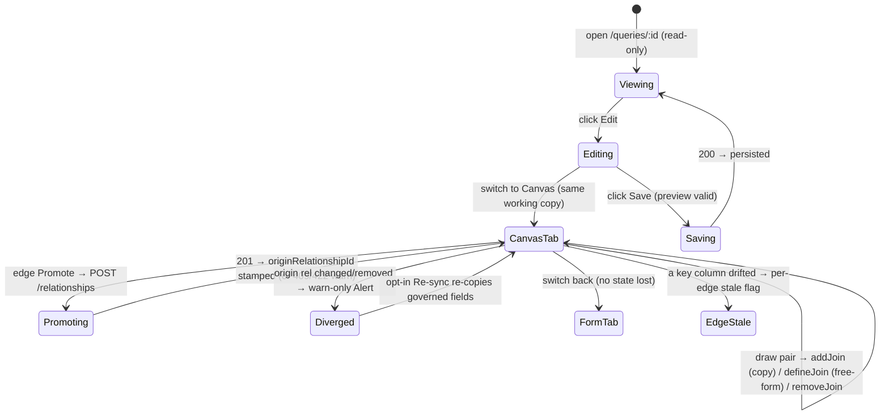

# Query Canvas — the free-form visual source-graph editor (a view/edit mode of the builder)

**Concept**: the **canvas** is a **visual presentation + editing mode** of the
[Query](queries.md) builder. It renders a Query's
[`definition.joins`](queries.md#joins-reading-related-datasets-as-one) **tree** as a
**node-link graph** — each table-source (the driving [`sourceId`](queries.md) + every
joined dataset) is a **node**, each [`JoinStep`](queries.md#joins-reading-related-datasets-as-one)
is an **edge** through the query's own relationship — and lets a user read and **edit**
that same tree by direct manipulation: drag nodes, **draw a column-to-column connection**
to add a hop (copy-on-pick a governed edge **or** define a free-form one), promote a
useful edge up into the governed ER, and delete a leaf edge. It is **not a new noun and
not a new page**: it reads and writes the **identical** `definition.relationships[]` +
`joins[]` the hop-list [construction surface](query-construction.md) edits, keyed on the
unified `sourceId`, runs the **same** stateless preview, and saves through the **same**
lifecycle. The canvas is a **second editor over one model**, not a second model.

**Status**: Accepted — built. The builder is two tabs — `Form` (hop list + filters +
live preview) and `Canvas` (graph + status chip) — over one working copy
(`QueryBuilderPanel`, AntD `<Tabs>`). The Canvas tab is a **React Flow editor**
(`QueryCanvas`): drag a column handle to another column handle to add a hop, an edge's
toolbar promotes / re-syncs / deletes it, and `[+ Add a source]` stages any not-yet-joined
**dataset** to draw to — all bound to `useQueryBuilder`'s shipped ops over
the same working copy. **Every source node is a dataset (`ds_`)**: the canvas joins datasets to
datasets, and nothing else.

> **R166–R167 — the canvas is datasets only.** It used to be symmetric: a source node could be a
> saved query (`qr_`), giving a "join anything to anything" space (R91/R92). That is
> `query⋈query`, which the closed Query concept refuses
> ([`_noun-model.md`](../_noun-model.md) § D5, closed R167). **R166** withdrew the offering (the
> picker went datasets-only and flat); **R167** deleted the rendering with the engine, so the two
> retire together in one place rather than leaving unreachable code for a round. The group was
> removed **with no replacement, deliberately** — the intent it served (_compare two shaped
> results_) is answered by the **within-group column** family (R163/R165), inside one query, not
> by joining two.
> The fidelity layer is built: **per-field column-type glyphs**, **rounded orthogonal edges**,
> a **draw-time dtype guard** (an incompatible key pair is rejected before it mints), **distinct
> action cursors** (pan / move-node / draw-join read differently), a **one-line top toolbar**,
> and an in-page **maximize** overlay.

**Domain folder**: `data-management/queries/` — a **mode** sibling of
[query-construction.md](query-construction.md) (the hop-list builder this re-presents),
[queries.md § Joins](queries.md#joins-reading-related-datasets-as-one) (the `joins` tree
this visualizes), and [queries.md](queries.md) (the domain anchor) — **not** a parallel
page.

**Sibling docs**:
[queries.md](queries.md) (the domain anchor whose trajectory step this fills; the
[reuse invariant](queries.md#the-reuse-invariant-the-one-rule-this-domain-holds) this
obeys; the query-owned-relationship model this reads/writes),
[query-construction.md](query-construction.md) (the editable hop-list builder —
`useQueryBuilder` + `QueryBuilderPanel` — this adds the Canvas tab to),
[queries.md § Joins](queries.md#joins-reading-related-datasets-as-one) (the
`definition.joins: JoinStep[]` connected acyclic **tree** the canvas reads/writes — nodes
= sources, edges = hops; the per-hop stale gate it renders),
[relationships.md](../workspaces/relationships.md) (the governed edges the canvas
copy-on-picks from and **promotes** to),
[dataset-detail.md](../datasets/dataset-detail.md) (owns `<PagedRowsView>`, reused for the
Form-tab preview body),
[workspace-shell.target.md](../../_platform/workspace-shell.target.md) (the chrome all
surfaces render inside).

> **Why a mode, not a noun (the noun-vs-mode check).** A canvas introduces **no new
> readable-table-source kind, no new engine, and no new model**. It renders and edits the
> **same** `definition.joins` tree [queries.md § Joins](queries.md#joins-reading-related-datasets-as-one)
> sealed (each hop already names its own left/right via a query-owned relationship — a
> tree, not a path), keyed on the **same** unified `sourceId`, and previews/saves through
> the **same** `useQueryBuilder` lifecycle and stateless `POST …/queries/preview`. So it
> **adds a view/edit mode** to the existing builder rather than minting a `/canvas` page or
> a `JoinGraph` / `Canvas` noun (the [reuse invariant](queries.md#the-reuse-invariant-the-one-rule-this-domain-holds)).
> What is genuinely new is **only the visual rendering + direct-manipulation UX** over that
> tree — including the free-form **define** and **promote** gestures, which create and push
> edges but mint no model field (free-form rides the already-nullable
> `QueryRelationship.originRelationshipId`; promote reuses the create-relationship
> endpoint). _Track: 1 (product feature). Pulled by ← the [queries.md](queries.md)
> trajectory + the unified `sourceId` + the [query-owned-relationships](../../../memory/2026-06-19-query-owned-relationships.md)
> doctrine + [purpose.md](../../../context/purpose.md) critical path / key decision #4._

---

## The model — unchanged; the canvas renders + edits it

The canvas introduces **no change of its own** to `QueryDefinition`. It is a
**read-write projection** of the same object the hop list edits — the query-owned join
tree ([queries.md § Joins](queries.md#joins-reading-related-datasets-as-one)):

```ts
// the canvas renders this as a graph and edits it via the SAME useQueryBuilder ops.
// A hop references a query-OWNED relationship (`queryRelId`), never a governed `rel_`.
type JoinStep = {
  queryRelId: string; // `qrel_…` — the query-owned edge this EDGE consumes
  type: 'inner' | 'left' | 'right' | 'full'; // per-hop join type (types.ts)
};

type QueryRelationship = {
  id: string; // `qrel_…` query-local id
  leftSourceId: string; // `ds_…` — the LEFT source; a hop's left is always a
  leftColumn: string; //   leaf dataset in-graph (the tree invariant)
  rightSourceId: string; // `ds_…` — the RIGHT dataset joined in (R167: was polymorphic)
  rightColumn: string;
  cardinality: 'one_to_one' | 'one_to_many' | 'many_to_many';
  originRelationshipId?: string | null; // `rel_…` provenance, or null = free-form
};

type QueryDefinition = {
  q?: string | null;
  filters: FilterAtom[];
  advanced: FilterAtom[][];
  relationships: QueryRelationship[]; // the query's OWN edges; see queries.md
  joins: JoinStep[]; // the tree: each hop → one query-owned rel
};
```

- **Nodes** = the sources the resolver already walks: the driving `sourceId` (root) plus
  each hop's right **dataset** (the pure
  `buildSourceGraph` selector, `joinGraph.ts`). A node carries a type **`<Tag>`** and a table
  icon, and renders its columns as connect handles (collapsed behind **"+ N more"** when wide).
  **A hop's LEFT is never its own node** — the tree invariant guarantees it is already in the
  graph, so a stored left IS a rendered node. **Edges** = the `joins[]`, each resolved through its `queryRelId` to a
  `QueryRelationship` and labelled with its key pair (`account_id ↔ id`), advisory
  `cardinality`, join type, and a **Free-form / Governed** tag.
- **Editing maps onto `useQueryBuilder`'s ops** ([query-construction.md](query-construction.md)):
  a drawn connection → `addJoin` (copy-on-pick) **or** `defineJoin` (free-form); a leaf
  edge's delete → `removeJoin`; the edge toolbar's promote → `promoteRel`, re-sync →
  `resyncRel`. The canvas cannot express anything the model forbids — same connected-acyclic
  tree, same guards.
- **Layout (node x/y) is view-only.** Positions are computed by a deterministic
  depth/row layout and held as FE-only drag overrides; they are **never** added to the
  persisted `definition` ([[design-altitude-vs-build-home]]).

---

## Editing — drawing creates (copy-on-pick · free-form define)

Editing is a **drag from one column handle to another** (React Flow connect): each
column row carries a `target` handle on its left and a `source` handle on its right. The
drawn connection is routed by `resolveConnect` (`joinGraph.ts`, a pure function — no
React, no I/O), which orients the in-graph endpoint as the hop's LEFT and decides:

| Drawn pair                                                                                                                        | Routes to                                                                                                | Result                                                                                                                                                                                                                                                        |
| --------------------------------------------------------------------------------------------------------------------------------- | -------------------------------------------------------------------------------------------------------- | ------------------------------------------------------------------------------------------------------------------------------------------------------------------------------------------------------------------------------------------------------------- |
| Matches a `valid` governed `rel_` (in-graph → new dataset)                                                                        | **copy-on-pick** → `addJoin(relId)`                                                                      | snapshots the governed rel's fields into a query-owned `QueryRelationship` (`originRelationshipId` = the `rel_`) and appends a `JoinStep`                                                                                                                     |
| No governed match (in-graph → new source)                                                                                         | **free-form define** → cardinality `<Modal>` (pre-set to an **inferred** default) → `defineJoin(fields)` | mints a query-owned rel with `originRelationshipId: null` (`freeFormRel`) and appends a `JoinStep`                                                                                                                                                            |
| **Incompatible key pair** (text ↔ number)                                                                                         | **invalid** → `dtype_mismatch`                                                                           | a warn `message`, mints nothing — rejected **before minting**, mirroring the backend `_compatible` rule (equal dtype, or both numeric); **FE-lenient on an unknown dtype** (a not-yet-loaded column isn't blocked — the backend stays the authoritative gate) |
| Self / cyclic (both endpoints in-graph) / disconnected (neither) / incomplete                                                     | **invalid**                                                                                              | a warn `message`, mints nothing                                                                                                                                                                                                                               |

**A hop's LEFT is a dataset already in the graph**, which the resolver matches by leaf id — so a
drawn column already names its own leaf and `resolveConnect` passes it straight through. R167
removed the **column-provenance rewrite** that used to sit here (it existed so a drag off a
**query** node's effective column could resolve to the leaf that owned it) along with its
`invalid: 'derived'` route for a column with no single owner. The wire still carries
`ownerSourceId` / `sourceColumn` per resolved column; the canvas no longer needs to read it.

**Drawing creates** is the load-bearing distinction: a pure pick gesture _selects_ an
existing governed edge, so it felt like the Form list; **define** makes the drag _produce_
a new edge. That is why the canvas now carries a graph library (Scope boundary) — the
gesture finally earns it.

**`[+ Add a source]`** stages **any** not-in-graph **dataset** (free-form — not only the
governed-reachable ones) so it can be drawn to. **R166 — the picker is a flat list of datasets**:
the "Saved queries" group is gone, and with one group left the "Datasets" heading labels a list
that cannot contain anything else, so the `<OptGroup>`s go with it. A group of one is chrome, not
structure. It is disabled only when every dataset is already on the canvas.

**What a user who reaches for a saved query meets.** Nothing — no disabled group, no tooltip, no
error. D4's standing rule is _unofferable at the gesture, never an error at run_, and the honest
form of "we do not join queries" is a picker that only ever contained datasets, not a greyed row
inviting the question. The **absence carries no explanation** because an explanation would
advertise a capability the product does not have. Datasets already on the canvas remain excluded
as before, so the picker's rule is now one rule, not two. A staged node is FE-only and ephemeral — it enters
`joins[]` only when its column connection is drawn; the model stays a connected tree rooted
at `sourceId`. An unconnected staged node carries a **`[×]` unstage** control (R97) that drops
it from the canvas (pure FE state — no `joins[]` / save impact); without it the only escape was
a tab-switch (unmounts the canvas, clears all staged).

**The edge: a compact cardinality badge → an expandable info-box** (R97; rendered on each edge
via React Flow's `EdgeLabelRenderer`). At rest the edge shows only a **small cardinality badge**
(`1:1` / `1:n` / `n:n`, sized like the Free-form tag, blue when free-form) + a **warn icon** when
diverged/stale — replacing the old crammed label (key-pair + 3 tags), which was hard to read.
**Clicking it selects the edge** and **expands an info-box** (animated in) with labelled rows —
**On** (key pair) · **Join type** · **Relationship** (cardinality) · **Relationship type**
(Free-form / Governed) — and an actions row: **Promote**, **Re-sync** (only when diverged), and a
leaf **Remove** (a non-leaf delete is disabled with the shipped `removeJoinBlocked` reason — only
leaves are removable, the tree invariant). The box is lifted above the node cards (`zIndex`) so it
never clips behind an adjacent node. Selection is **canvas-local state** (clicking the pane
background deselects), not React Flow's internal selection.

**Action cursors read distinctly** (CSS-only, scoped to the canvas) so each gesture is
self-evident on hover: the **pane** pans (`grab`, React Flow's default), a **node card**
repositions (`move`, held _steady while dragging_), a **column row** is neutral (`default`),
and a connect **handle** draws a join (`crosshair`) — the neutral-row → crosshair-dot contrast
makes the draw-a-join affordance obvious as the pointer reaches the dot. The handle's
**grab/hover area is enlarged** by a transparent `::before` (the event still targets the
handle, so a connection starts from anywhere in it) without enlarging the visible dot, plus a
hover grow + halo and a "drag to join" tooltip.

- **Promote** pushes a query-owned rel up into the governed ER via the existing
  `POST /workspaces/{id}/relationships` (`promoteRel` → `useCreateRelationshipMutation`).
  The endpoint already dedups (`409 relationship_exists`) and dtype-validates (`422`); on
  `201` the query-owned rel keeps running on its own snapshot but gains the new `rel_` id
  as its `originRelationshipId` (provenance closes the loop, and divergence now tracks it).
  **R167 — every edge is promotable, and the `promotable` guard is gone.** It existed because an
  edge anchored on a **query** node had no governed counterpart (the governed ER is dataset-only),
  so promote had to be suppressed there. Both operands are datasets now, so there is no longer a
  shape this could be offered for and then rejected — which is D4's rule (_unofferable at the
  gesture, never an error at run_) satisfied by the model instead of by a check.
  - **Reuse vs. write** stays the distinction underneath: **copy-on-pick** _reads_ the governed ER
    (a drawn pair matching a `valid` `rel_` is tagged **Governed** with warn-only divergence +
    re-sync — the query-owned-rel doctrine, [[query-owned-relationships]]), whereas **promote**
    _writes_ a new governed rel. Both are now available on every edge.
- **Divergence** is a frontend diff: `relDivergence(qrel, governedById)` →
  `null | 'removed' | 'changed'` — `removed` when the origin `rel_` is gone, `changed`
  when it still exists but its join fields/cardinality differ from the query's snapshot,
  `null` for free-form (nothing to diverge from) or in-sync. It is **warn-only**: a
  `<Alert>` flags the edge, and **Re-sync** (`resyncRel`) is the user's **opt-in** choice
  to re-copy the governed fields. The query keeps running on its own copy regardless —
  editing or deleting a governed rel can never silently break a saved query.
- **Per-edge column-drift staleness** (`columnMissing`) flags an edge whose key column no
  longer exists on its dataset's current columns — a frontend check against the snapshot
  (there is no governed `Relationship.status` to read once a query owns its edge). The
  backend run remains the authoritative gate (`409 relationship_stale`).

### Source nodes are datasets — what the symmetric canvas cost to keep

Every node is a **dataset (`ds_`)**. R91/R92 had made the node set symmetric so a **saved query**
could be a source too, and the machinery that took is worth recording, because it is what left at
R167 and what a future "join anything to anything" proposal would have to re-fund:

- a **`kind`** on every node (dataset | query), a second icon, and a second type-`<Tag>` value;
- a query's **effective columns** read off the wire (`resolvedColumns`) rather than its dataset's,
  with a **"+ N more"** disclosure for the wide result — _the disclosure stayed_, since a wide
  CRM-export dataset trips the same threshold;
- **column provenance** (`ownerSourceId` / `sourceColumn`) so a drag OFF a query node's effective
  column could resolve to the **owning leaf** the resolver matches against — plus an
  `invalid: 'derived'` route for a column with no single owner;
- a **re-anchoring** pass in `buildSourceGraph`, because a hop drawn off a query node stored that
  query's owning LEAF as its left, which would otherwise render as an orphaned card;
- an **unavailable** node state for a `qr_` that could not be resolved (deleted or cyclic base);
- a **`promotable`** flag, since an edge touching a query node had no governed counterpart.

All six are gone. The two that were doing work for datasets as well — the wide-column disclosure
and the draw-time dtype guard — stayed, and the dtype guard's unit tests moved to
`query-canvas-connect.test.ts` rather than going down with the provenance file they shared.

## Surfaces — layer / reuse / purity declaration

| Surface                                                                                                                                                                                                                                                                                                                                                                                                                                                  | Layer                                               | Reusability         | Purity             | Allowed peer deps                                 |
| -------------------------------------------------------------------------------------------------------------------------------------------------------------------------------------------------------------------------------------------------------------------------------------------------------------------------------------------------------------------------------------------------------------------------------------------------------- | --------------------------------------------------- | ------------------- | ------------------ | ------------------------------------------------- |
| `QueryCanvas` (the React Flow node-link render + drag-to-connect editor: copy-on-pick / free-form define / promote / re-sync / leaf delete; per-field dtype glyphs, rounded orthogonal edges, distinct action cursors, one-line toolbar, in-page maximize overlay)                                                                                                                                          | `apps/builder/src/features/data-management/queries` | feature             | feature            | react, antd, @xyflow/react, @phosphor-icons/react |
| `QueryBuilderPanel` (the `Form` / `Canvas` `<Tabs>` over one working copy; hosts the Canvas-tab status chip)                                                                                                                                                                                                                                                                                                                                             | `apps/builder/src/features/data-management/queries` | feature             | feature            | react, antd                                       |
| `useQueryBuilder` (the canvas binds to its `addJoin` / `defineJoin` / `removeJoin` / `promoteRel` / `resyncRel` / Save)                                                                                                                                                                                                                                                                                                                                  | `apps/builder/src/features/data-management/queries` | feature             | glue (server-data) | @tanstack/react-query, antd                       |
| `joinGraph.ts` (pure selectors shared by the list + canvas: `graphDatasetIds` / `buildSourceGraph` (the node/edge graph — root + hop rights) / `addEligibleRels` / `isLeafHop` / `resolveConnect` (dtype-guards via the injected `dtypeOf` → `dtype_mismatch`) / `relDivergence` / `inferCardinality`) | `apps/builder/src/features/data-management/queries` | feature             | pure               | none                                              |
| `chain.ts` (working-chain ↔ wire bridge: `readChain` / `readRels` / `writeDef` + `copyGovernedRel` / `freeFormRel`)                                                                                                                                                                                                                                                                                                                                      | `apps/builder/src/features/data-management/queries` | feature             | pure               | none                                              |
| `<PagedRowsView>` (reused, not owned — the Form-tab preview body)                                                                                                                                                                                                                                                                                                                                                                                        | `apps/builder/src/features/data-management/_shared` | shared cross-domain | plain-UI           | react, antd, react-i18next                        |
| `JoinStep[]` + `QueryRelationship[]` (the query-owned edges; frontend + contract type)                                                                                                                                                                                                                                                                                                                                                                   | `.../features/data-management/queries/types.ts`     | feature             | data type          | none                                              |

> **Flagged peer-dep deviation.** `QueryCanvas`'s allowed peer deps are `react, antd,
@xyflow/react, @phosphor-icons/react`. `@xyflow/react` (React Flow v12) is a **deviation**
> from the prior `react, antd`-only declaration, adopted because drawing now **creates**
> (free-form define), which earns a graph library for literal column-drag + pan/zoom; a pure
> pick gesture did not. `@phosphor-icons/react` supplies the per-field column-type glyphs (the
> fidelity item). React Flow's base CSS is imported once at the app entry (`main.tsx`); no new
> design token is introduced.

**Boundary check**: the only shared-cross-domain row (`<PagedRowsView>`) is **reused, not
owned** ([dataset-detail.md](../datasets/dataset-detail.md)). `QueryCanvas` **binds to**
`useQueryBuilder`'s shipped ops and the stateless preview — it re-implements no validation,
engine, predicate editor, or detail page; the canvas and the list are **two views of one
working copy**, sharing the `joinGraph.ts` selectors and `chain.ts` bridge.

---

## Token map

The canvas surfaces are AntD primitives (`<Button>`, `<Tag>`, `<Select>`, `<Modal>`,
`<Alert>`, `<Tooltip>`, `<Typography>`) plus React Flow's node-link rendering, styled by
the `<ConfigProvider>` tokens derived from the six seeds in
[`themeTokens.ts`](../../../../workspace/packages/ui/src/themeTokens.ts) (the source of
truth). React Flow's own base CSS is imported at the app entry; **no new token is
introduced**; the map reuses identifiers already cited by
[queries.md](queries.md) and [query-construction.md](query-construction.md). `Value` is
informational.

| Surface                                                  | AntD token (themeTokens.ts) | Value (informational) |
| -------------------------------------------------------- | --------------------------- | --------------------- |
| Canvas pane background                                   | `colorBgLayout`             | `#f5f5f5`             |
| Node card background                                     | `colorBgBase`               | derived               |
| Driving-node border · free-form edge · source handle     | `colorPrimary`              | `#1677ff`             |
| Edge label / cardinality `<Tag>` text                    | `colorTextSecondary`        | derived               |
| Node / governed-edge / non-driving border                | `colorBorderSecondary`      | `#f0f0f0`             |
| Stale-or-diverged edge · stale column · status chip warn | `colorWarning`              | `#faad14`             |
| Canvas status chip — valid (`N rows ↗`) text             | `colorTextSecondary`        | derived               |
| Invalid / unrunnable `<Alert>`                           | `colorError`                | `#ff4d4f`             |
| Per-field column-type glyph                              | `colorTextQuaternary`       | `#bfbfbf`             |
| Border radius (node card, tag, button, modal)            | `borderRadius`              | `6`                   |
| Font family                                              | `fontFamily`                | system stack          |

Identifier parity is enforced by
[`design-token-parity.mjs`](../../../../scripts/lint/design-token-parity.mjs).

---

## Layout — ASCII intent

The canvas is a **view of the builder**, inside the **same** detail shell the hop-list
builder uses. The builder is two top-level tabs over one working copy — **`Form`** (the
hop-list builder + filters + the live `<PagedRowsView>` preview) and **`Canvas`** (the
full-width React Flow graph; **no preview table** — a **status chip** in the canvas toolbar
links to the Form preview). Both tabs bind to the same `useQueryBuilder`; Save lives in the
shared `PageHeader`. Still a **mode, not a route**: switching tabs swaps the rendering of one
copy, losing no edit; the preview query keys on the working copy and runs regardless of the
visible tab, so the Save gate holds on either tab.

```text
Deals × Accounts × Owners                                         [Cancel] [Save]
[ Form ] ( Canvas )   ← top-level tabs; one working copy, shared header Save
┌─ Canvas ──────────────────[ + Add a source ] [👁 1,204 rows ↗] [? Help] ─┐
│ ┌ Controls ┐             ┌───────────────┐    ↑ one-line top toolbar:       │
│ │ + − ⤢ ⤡ │  ┌────────┐ │  Accounts     │  ┌──────────┐  Add · status chip │
│ └──────────┘  │ ◆ Deals│ ○──╮│ #  id     ├○─┤ Owners   │  (→ Form) · Help    │
│  ↑ zoom/fit/  │ # id  ○│   ╰┤ Aa region   │  │ # id   ○ │                    │
│    maximize   │ Aa …  ○│    └───────────────┘  └──────────┘  (╮╰ = rounded   │
│  (TOP-left)   └────────┘   account_id ↔ id     owner_id ↔ id ◄selected  edge)│
│         (driving)         [many:many][inner]    [many:one][left][Free-form]   │
│                           [Governed]          ┌ info-box + actions ┐ ←R97 box │
│        ┌ Background grid ┐                     └────────────────────┘(on select)│
└──────────────────────────────────────────────────────────────────────────────┘
  (no preview table on the Canvas tab — results live on the Form tab)

[ Form ] tab → the hop-list editor + filter chips + advanced + search, with the
shared <PagedRowsView> preview below.
```

`◆` marks the **driving node** (`sourceId`). `○` marks a per-column connect handle
(target-left, source-right; enlarged hit-area, `crosshair` cursor, hover grow + halo, a
"drag to join" tooltip). A muted **type glyph** precedes each column name (`#` number, `Aa`
text, etc. — supplementary to the name). A node carries a type **`<Tag>`** in its header
(`Dataset` / `Query`) + a **default kind icon** (R97 — a **table** for a dataset, a **filter**
for a query; replaced the old `🔎`) and renders its **effective** columns behind a **"+ N more"**
toggle when wide. An unconnected staged node carries a **`[×]` unstage** (R97). Each edge is a
**rounded orthogonal** connector showing, at rest, a **compact cardinality badge** (R97 —
`1:1`/`1:n`/`n:n`, + a warn icon when diverged); **clicking it selects the edge and expands an
info-box** (On · Join type · Relationship · Relationship type) + actions (Promote · Re-sync when
diverged · leaf Remove), lifted above the node cards so it never clips. The canvas's controls live
in **one top-right toolbar row** — `[+ Add a source]` · the preview **status chip** · a `[? Help]`
popover (which holds the verbose drag tip) — all uniform text+icon. The
**`Form` tab remains the keyboard/screen-reader-complete equivalent + assistive-tech default**
(React Flow drag is mouse-first); the `<Controls>` give zoom/fit/recenter **and a maximize
toggle** (an in-page overlay that fills the browser tab to draw with room — `Esc` exits — not
the OS Fullscreen API, which left the pane unmeasured → blank). The pane has a **viewport-relative
height** (`clamp(420px, calc(100svh − 280px), 2400px)` — definite, so React Flow always measures it;
it fills large screens, R97), and `fitView` (capped at **1× zoom** so a small graph isn't blown up,
R97) re-runs whenever the node set changes or maximize toggles so a newly-staged node stays in view.
The controls are
pinned **top-left** (not React Flow's default bottom-left), so they stay reachable without a
scroll on a short viewport.

**The canvas status chip** (`[ N rows ↗ ]`, in the top-right canvas toolbar between Add and
Help) is a labelled, keyboard-reachable button that mirrors the preview gate and links to it. States: _valid_ →
`N rows ↗` (`colorTextSecondary`), click switches to the `Form` tab with the preview
expanded; _stale / invalid_ → `⚠ unavailable ↗` (`colorWarning`, **text + icon**),
pointing to the Form tab where the blocked-state alert + the fix live (Save stays disabled,
gated by preview validity regardless of the visible tab).

### Free-form define — cardinality picker (inferred, confirmable default)

```text
  drawn column pair has no governed match →
  ┌─ Define this relationship ──────────────────────────────┐
  │  Deals.owner_id ↔ Owners.id                              │
  │  Cardinality:  [ one to many ▾ ]   ← inferred from cols  │
  │  Suggested from the join columns — change it if wrong.   │
  │                                  [ Cancel ]  [ Define ]  │
  └─────────────────────────────────────────────────────────┘
  → defineJoin → a query-owned rel (originRelationshipId: null) + a JoinStep
```

The modal opens **pre-set to a cardinality inferred from the drawn column names** — the
only pre-run signal available (`inferCardinality`, `joinGraph.ts`): both columns key-like
(`id` / `*_id` / `*_key` / `*_code` / `uuid`) → `one_to_one`; exactly one key-like →
`one_to_many` (the common parent-key ↔ child-FK case); neither → `many_to_many` (a non-key
join can fan out — surfaced so the analyst notices). Cardinality is **advisory** metadata —
it does not change the join SQL (the join **type** does) — so a wrong guess is
non-destructive and the user confirms or overrides it before `defineJoin`.

### Divergence / stale state (warn-only, per edge)

```text
  ⚠  The “Deals ⋈ Accounts” relationship has changed in the workspace.
     [ Re-sync ] re-copies the governed fields — or keep your current snapshot.

  ⚠  The “Deals ⋈ Accounts” join is unavailable — “account_id” no longer exists.
```

---

## Behaviour — states



- **Tab switch is lossless** — `[Form] ⇄ [Canvas]` swaps the **rendering** of one working
  copy; no edit is lost, no model is forked. Both tabs call the same `useQueryBuilder` ops.
- **Preview lives on the `Form` tab only; the Save gate holds on both.** The Canvas tab
  carries no preview table, but `useQueryBuilder`'s preview query keys on the working copy
  and runs whenever the builder is active, **independent of the visible tab**, so `canSave`
  is correct on the Canvas tab too; the status chip mirrors that gate.
- **Empty graph** — a Query with no joins renders the lone driving node (`sourceId`), a
  single-node canvas, not a blank. The canvas mounts on the builder's existing data load
  (`useRelationshipsQuery` / `useDatasetsQuery` / `useQueriesQuery`) — node labels, columns,
  key pairs, and cardinality resolve from that shared fetch, no parallel path.
- **Editing** routes each drawn pair through `resolveConnect` (copy / define / invalid),
  stages free-form sources via `[+ Add a source]`, deletes leaves via the edge `[×]`, and
  exposes Promote / Re-sync on the edge toolbar — all over the same connected-acyclic guard
  and eligibility/leaf rules the list uses (the shared `joinGraph.ts` selectors).
- **Promote** is a single mutation per edge with in-flight (`loading`) and error
  (`409 relationship_exists` / `422`) feedback; success stamps `originRelationshipId`.
- **Divergence is warn-only** — a copied edge whose origin changed/was removed renders a
  warning `<Alert>`; Re-sync is opt-in. The query never auto-mutates its snapshot.
- **Stale gates are flag-don't-crash, per edge** — a drifted key column renders an
  "edge unavailable" `<Alert role="alert">` naming the column, never a blank crash
  ([purpose.md](../../../context/purpose.md) #5). An unresolvable hop (a `queryRelId` with
  no matching rel) is named with a link to the workspace relationships, not silently
  dropped.
- **Preview / Save / discard** are unchanged — the stateless `POST …/queries/preview` and
  the dirty-Save / discard lifecycle; the canvas persists nothing new (positions are
  view-only).

### Accessibility

- **The canvas is not the only way to read/edit the tree.** The **`Form` tab is the
  keyboard-and-screen-reader-complete equivalent** (the hop-list affordances + the preview)
  and the **assistive-tech default**; the `[Form] [Canvas]` `<Tabs>` are a real
  tablist/tab. React Flow drag is mouse-first, so no capability is canvas-only — every edit
  the canvas offers is reachable on the Form tab.
- **The canvas status chip** is a labelled, keyboard-reachable **button** (`aria-label`),
  not a static badge; its stale/invalid state reads as **text + icon** (`⚠ unavailable`),
  not colour alone; on activation it moves to the Form tab's preview.
- **Nodes and edges carry text, not colour/glyph alone** — each node names its source in
  text; the driving node is marked with a **text glyph + label** (`◆`); each edge shows a
  cardinality badge at rest and, on select, an expandable info-box with labelled rows (key pair ·
  join type · cardinality · Free-form/Governed) + actions.
- **Editing affordances are labelled** — `[+ Add a source]` (grouped Datasets / Saved
  queries), the per-edge Promote / Re-sync / delete are labelled controls; the **disabled
  non-leaf delete** keeps its label and exposes its reason as **text** via tooltip
  (`aria-label`), so the leaf rule is discoverable.
- **The "+ N more" disclosure is a keyboard-reachable control** (a real `<Button>`, not a
  hover-only reveal), so a column hidden behind it stays focusable and drawable — the
  reveal-to-draw affordance is not mouse-only.
- **Warn / stale / promote-error states** are `<Alert role="alert">`s whose reason is
  **text** (the edge named, the missing column, the failed promote), icon + text — not a
  colour swatch.
- The Form-tab preview reuses `<PagedRowsView>`'s shipped table semantics;
  collision-qualified headers keep every column name unique and screen-reader-navigable.

---

## Data contract: consumes the resolver's column provenance

The canvas introduces **no new route and no new error code**, and **writes** no new field. It
**reads** one resolver-emitted field — `resolvedColumns[].ownerSourceId/sourceColumn` — to
orient a query-column draw onto its owning leaf:

- **Reads/writes** the existing `definition.relationships: QueryRelationship[]` +
  `definition.joins: JoinStep[]` on the existing create / get / run / preview / update
  shapes ([queries.md § Joins](queries.md#joins-reading-related-datasets-as-one)).
  Free-form rides the **already-nullable** `QueryRelationship.originRelationshipId` (null =
  free-form) — no field is added.
- **Previews** through the existing stateless `POST /workspaces/{id}/queries/preview`. The
  join resolver is **origin-agnostic**, so a free-form rel joins exactly like a copied one with
  no engine change.
- **Column provenance is read off the wire.** The resolver emits, per effective column on
  `resolvedColumns`, the leaf it traces to — `ownerSourceId` (always a leaf `ds_`) +
  `sourceColumn` (the pre-qualification name; the collision-qualified `name` stays the
  display) — computed-on-read (no persisted change, no migration). The canvas reads it
  straight off `q.resolvedColumns` to resolve a query-column draw to its owning leaf `ds_`;
  the earlier frontend re-derivation (`provenance.ts`) is **retired**. A derived/aggregate
  column has no single owner → omits the fields (optional on the wire) → not a legal left key.
- **Promote** reuses the existing `POST /workspaces/{id}/relationships`
  ([relationships.md](../workspaces/relationships.md)) — its `409 relationship_exists`
  dedup and `422` dtype validation pre-exist.
- **Divergence** is a pure frontend diff (`relDivergence`) against the live workspace rels;
  there is no wire signal for it.
- **Consumes** the existing per-hop `409 relationship_stale` run gate; the per-edge
  staleness marker is a frontend column-drift check (`columnMissing`).

---

## Acceptance criteria

1. **Canvas renders the tree faithfully** — nodes = `sourceId` + each hop's right **source**
   (dataset or saved query); edges = `joins[]` resolved through their query-owned rels, shown
   as a cardinality badge (expand for key pair · join type · type); a star (one source
   driving 2+ hops) renders correctly; an empty Query renders the lone driving node.
2. **Tab switch is lossless** — `[Form] ⇄ [Canvas]` swaps the rendering of one working copy
   with no edit lost and no model fork; the Save gate holds on both tabs via the
   working-copy-keyed preview.
3. **Drawing a governed pair copies-on-pick** — a drawn column pair matching a `valid`
   governed `rel_` calls `addJoin`, snapshotting it into a query-owned rel + a `JoinStep`
   (`originRelationshipId` = the `rel_`).
4. **Drawing a no-match pair defines free-form** — a drawn pair with no governed match
   opens a cardinality picker, then `defineJoin` mints a query-owned rel with
   `originRelationshipId: null` + a `JoinStep`; it joins with no engine change.
5. **Invalid draws mint nothing** — self / cyclic / disconnected / incomplete / derived /
   **dtype-incompatible** (`dtype_mismatch`) connections are rejected with a warning, leaving
   the tree unchanged.
6. **Promote pushes an edge up to the governed ER** — the edge Promote action POSTs to
   `…/relationships`, surfacing `409`/`422`; on success the query-owned rel gains the new
   `rel_` id as `originRelationshipId`.
7. **Divergence is warn-only with opt-in re-sync** — a copied edge whose origin
   changed/was removed renders a warning; Re-sync re-copies the governed fields on the
   user's choice; the query keeps running on its snapshot.
8. **Stale flags on the edge, not a crash** — a drifted key column renders the
   "edge unavailable" alert naming the column; Save stays guarded.
9. **Leaf-only delete** — a leaf edge's `[×]` calls `removeJoin`; a non-leaf delete is
   disabled with a text-reason tooltip.
10. **Form tab stays AT-complete** — every capability is reachable on the keyboard/SR
    Form tab; the canvas is an additional, not a replacement, affordance.
11. **`[+ Add a source]` offers datasets, and only datasets (R166)** — a **flat** list, no
    `<OptGroup>`s, saved queries absent with no disabled row and no explanatory tooltip. A user
    cannot construct `query⋈query` by any gesture on this surface.
12. **Criteria 11–13 of R91/R92 are retired, not regressed** — the `qr_` source node, its
    wire-provenance leaf resolution, the non-promotable `qr_`-side edge and the
    unavailable-`qr_` card were **acceptance criteria of a capability the closed concept
    refuses**. Withdrawn at R166, code deleted at R167. A reader comparing this list to R92's
    should find them **absent by decision** — this line is the record of that. (The **"+ N more"**
    disclosure is the exception: it survived, because a wide CRM-export dataset trips the same
    threshold a wide query result did.)

---

## Scope boundary

### IN scope

- **The Canvas tab as a React Flow editor** over the one `useQueryBuilder` working copy: a
  node-link render of the join tree plus **drag-to-connect editing** — copy-on-pick a
  governed edge (`addJoin`), **free-form define** an unmatched pair (`defineJoin`),
  **promote** any edge up to the governed ER (`promoteRel`), opt-in **re-sync** a diverged
  edge (`resyncRel`), and leaf `[×]` delete (`removeJoin`) — the `Form` tab staying the
  keyboard/SR-complete equivalent.
- **Divergence warn** (`relDivergence`, warn-only `<Alert>`) and **per-edge column-drift
  staleness** (`columnMissing`), both frontend computations over the query's snapshot.
- **Draw-time dtype guard** — `resolveConnect` rejects an incompatible key pair before minting
  (`dtype_mismatch`), mirroring the backend `_compatible` rule; FE-lenient on unknown dtypes.
- **Fidelity** — per-field column-type glyphs, rounded orthogonal edges, distinct action
  cursors with an enlarged handle hit-area, a one-line top toolbar, and an in-page maximize
  overlay.
- **`@xyflow/react`** as the canvas graph engine (the flagged peer-dep deviation, earned
  because drawing now creates); **`@phosphor-icons/react`** for the column-type glyphs.

### OUT of scope (deferred with named triggers)

- **Query sources of any kind** — retired at R166/R167 (§ Source nodes are datasets). With them
  went the `derived` left-key rejection, which existed only because a query's effective column
  could have no single leaf owner; a dataset column always owns itself.
- **The standalone "New query" empty-canvas create entry** — a `[+ New query]` on the Queries
  catalog opening the builder on an empty graph (place the first node yourself). **Still not
  built, and R166 changed why**: the old blocker was that `QueryCreatePage` required a preset
  `?base=`; that page is now **deleted**, so the entry no longer has a half-built path to inherit —
  it would be built clean, from the catalog, when a round pulls it
  ([[dont-mvp-rush-a-roadmap-home-surface]]). **Today a Query is created from a dataset
  ("Save filters as Query") or by duplicating one**; neither needs an empty canvas.
- **Further canvas polish** — the usability batch (edge-label / node overlap → context pad;
  cardinality-at-draw → inferred default; handle discoverability) and the fidelity pass
  (type glyphs, rounded edges, dtype guard, cursor scheme, maximize) are **built**; any
  further refinement is its own follow-up, not a redesign.
- **Persisting cosmetic node positions / auto-layout** — the model carries **no** view
  state ([[design-altitude-vs-build-home]]).
- **Dashboards / charts** (downstream value-out) and the data-saver "save before staling"
  lifecycle — their own future themes.
- **Self-joins / diamonds / general DAGs; composite keys; cross-workspace joins** — their
  own named triggers ([queries.md § Joins](queries.md#joins-reading-related-datasets-as-one));
  the canvas edits the **same tree** the model permits, no more.

### This concept explicitly does NOT cover

- The `joins` tree model + engine (live in [queries.md § Joins](queries.md#joins-reading-related-datasets-as-one))
  and the builder lifecycle (live in [query-construction.md](query-construction.md)) — the
  canvas **re-presents + edits** them, it does not restate them.
- The governed-edge model (declare / validate / stale) — lives in
  [relationships.md](../workspaces/relationships.md); the canvas **copy-on-picks from** and
  **promotes to** it, one edge per hop.
- The `<PagedRowsView>` component boundary — [dataset-detail.md](../datasets/dataset-detail.md).
- The predicate vocabulary internals — the dataset filter / advanced docs.

---

## Reference materials (read-only)

- [queries.md § Joins](queries.md#joins-reading-related-datasets-as-one) — the
  `definition.joins` connected-acyclic **tree** this canvas renders and edits; the
  query-owned-relationship model; the per-hop stale gate.
- [query-construction.md](query-construction.md) — the hop-list builder
  (`useQueryBuilder` / `QueryBuilderPanel`) this adds the Canvas tab to.
- [queries.md](queries.md) — the domain anchor + trajectory step this fills; the reuse
  invariant this obeys.
- [relationships.md](../workspaces/relationships.md) — the governed edge copy-on-pick
  copies from and promote pushes to; the `relationship_stale` gate.
- [query-owned-relationships](../../../memory/2026-06-19-query-owned-relationships.md) —
  the doctrine the canvas's copy-on-pick / free-form / promote / warn-only-divergence model
  implements.
