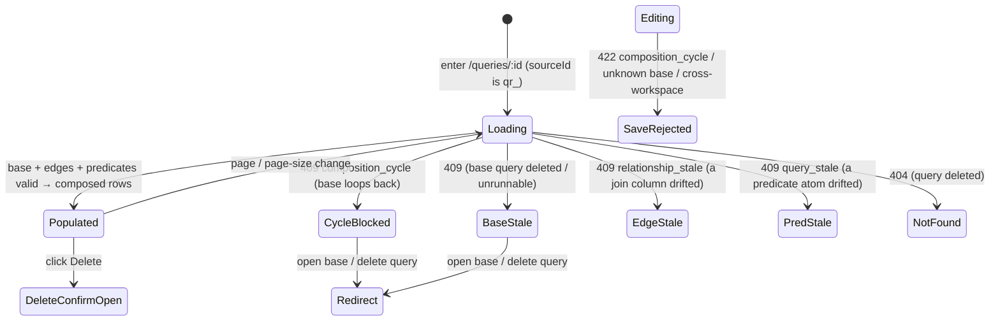

# Composition — build a Query on top of another Query (a Query as a join source)

**Concept**: **composition** is the fifth construction mode of a
[Query](saved-query.md): a Query whose **driving source is itself a saved Query**
(`qr_`) rather than a raw dataset (`ds_`), so its live re-run reads **another
Query's virtual table as one of its sources**. "Join my *Won-deals* Query to
Accounts" — inexpressible R71→R75 because every join source is a `ds_` parquet — is
now expressible. It is **not a new noun**: a composed Query keeps its `qr_`
identity, its catalog, its `/data-management/queries/:id` detail, the
[builder](query-construction.md) R72→R74 shipped, and its run / preview routes. What
is genuinely new is the **polymorphic source reference** (`datasetId` → a
`ds_ | qr_` **`sourceId`**) and the **unified `ds_`/`qr_` table-source resolver**
that R71 deferred as **J-2′** ([joins.md § route-vs-resolver](joins.md#data-contract-intent-formalized-at-the-contract-gate)) — the resolver finally earns its place because composition is its trigger.

**Status**: Accepted (R76 design — **sealed at the Design gate**; the build chain
**pends the human's model-review STOP per J-2** — this round **re-opens the
source-reference model**, unlike R73→R75's field widenings, so the closed model is
reviewed by a human before any build). This doc records the **source-model
confidence valve** (the source-ref + recursive resolver are the re-opened surface)
and the **noun-vs-mode / discovered-vs-imposed** checks.
**Round introduced**: [Round_76](../../../plan/cycles/Round_76.md) — the sixth step
of the Query trajectory (`data → relationships → joins → construction → multi-join →
**composition**`), pulling R71's J-2′ unified-resolver deferral.
**Domain folder**: `data-management/queries/` — a sibling **mode** of
[joins.md](joins.md) / [multi-join.md](multi-join.md) under the
[query-builder.md](query-builder.md) anchor; **not** a parallel page.
**Sibling docs**:
[query-builder.md](query-builder.md) (the domain anchor whose "later — Query ×
Query: a Query as a join input; the unified `ds_`/`qr_` resolver" trajectory step
this doc fills),
[saved-query.md](saved-query.md) (the base `QueryDefinition` + single-source run
path this extends),
[joins.md](joins.md) (the join model + `query_joined_rows` engine this composes
over; the J-2′ resolver this pulls),
[multi-join.md](multi-join.md) (the `joins: JoinStep[]` tree fold a composed source
plugs into),
[relationships.md](../workspaces/relationships.md) (the governed edge — **unchanged
this round**: endpoints stay dataset↔dataset),
[datasets.md](../datasets/datasets.md) +
[dataset-detail.md](../datasets/dataset-detail.md) (the leaf table-sources + the
`<PagedRowsView>` the composed result reuses),
[workspace-shell.target.md](../../_platform/workspace-shell.target.md) (the chrome
all surfaces render inside).

> **Why a mode, not a noun (the noun-vs-mode check).** Composition introduces **no
> new readable-table-source kind** — a composed Query is still a **virtual dataset**,
> the same archetype [saved-query.md](saved-query.md) established; it only reads from
> a `qr_` source where it used to read a `ds_`. The
> [query-builder.md](query-builder.md) anchor already declares **"a Query is the same
> readable-table-source kind as a Dataset"** — composition makes that declaration
> *executable*. So it **extends** the source reference + the resolver rather than
> minting a `ComposedView` noun (the discarded-R69 trap). The
> [reuse invariant](query-builder.md#the-reuse-invariant-the-one-rule-this-domain-holds)
> binds the surfaces; what is genuinely new — the polymorphic ref + the recursive
> resolver + the cycle guard — is named honestly below, not laundered through
> "reuse."
> _Track: 1 (product feature). Pulled by ← R71's J-2′ unified-resolver deferral +
> the [query-builder.md trajectory](query-builder.md#the-trajectory-what-queries-grows-into)
>
> + the "a Query is the same readable-table-source kind as a Dataset" anchor._

---

## Source-model confidence valve (the re-opened surface — R76)

_Unlike R73 (`join`→`joins`), R74 (path→tree), and R75 (`type` enum) — three rounds
that **re-confirmed** the model without re-opening it — R76 **re-opens the
source-reference model**. The valve fires here on **real model surface**, not merely
to confirm._

**What was `ds_`-bound, and why composition forces a change.** A join source is
**doubly Dataset-bound** today:

1. **The driving source** is `Query.datasetId`, typed `^ds_[0-9a-f]{8}$`
   ([common.py](../../../../workspace/apps/backend/app/models/common.py)) — the root
   of the join tree is always a dataset.
2. **The engine fold** is a chain of `read_parquet(?)`
   ([rows_reader.py](../../../../workspace/apps/backend/app/ingest/rows_reader.py)) —
   `query_joined_rows` resolves every source to a parquet path on disk
   (`dataset_dir(ws, ds) / "parsed.parquet"`).

Admitting a `qr_` source changes the **source-reference shape** (1) and makes the
**resolver recursive** (2). That is a genuine **model-altitude** move — the kind
[R73's doctrine](../../../plan/cycles/Round_73.md) says must **STOP at Design** for a
human, not ride through as a field widening.

**The sealed model leaning (the human reviews this at the J-2 STOP).** The cheapest
coherent model that delivers composition **without re-opening the governed edge**:

| Decision | Sealed leaning | Why |
| --- | --- | --- |
| **Where the `qr_` attaches** | The **driving/root** source ref widens: `Query.datasetId` (`^ds_`) → **`sourceId: ds_ \| qr_`**. A composed Query is "built on top of" a base Query, then joined to datasets via existing relationships. | The root is the one source not already mediated by a `rel_`; widening it is the minimal, expressible point. The join *tree* (R74) then hangs off a possibly-`qr_` root. |
| **The relationship edge** | **Unchanged — endpoints stay dataset↔dataset.** A composed join reuses the **dataset-level** `rel_` whose left dataset is a **member of the base Query's source set**; the ON key resolves against the base's **effective columns** by provenance. | Keeps R70's governed edge (declare / validate / stale) **out of this round** — no relationships.md re-open. Honors "one capability per round" + the [dynamic-equilibrium brake](../../../context/purpose.md#dynamic-equilibrium). |
| **The resolver (J-2′)** | One **unified `ds_`/`qr_` table-source resolver**: given a `sourceId`, it returns the source's **effective columns** + its **SQL relation** — `read_parquet(?)` for a `ds_`, a **recursively-composed subquery** for a `qr_`. Both save-validation and run consume it. | This *is* the J-2′ abstraction R71 named "truer but deferred." Composition is its trigger; the resolver is the single unification point, not a special-case branch. |
| **Nesting + cycles (J-1)** | **Arbitrary nesting**, with a **visited-set cycle guard**: the resolver tracks the `qr_` ids on its recursion path; a Query that **transitively composes itself** is rejected (`composition_cycle`) at **save** and **run** — never an infinite recursion. | J-1 ratified arbitrary depth; the guard is its cost. The guard is the **composition analogue** of R74's `cyclic_join` (which guards *dataset* re-entry within one tree). |

**Discovered-vs-imposed:** _discovered._ The inner-only-Dataset limit genuinely
blocks a real expression a user wants ("join my saved Query to another table"); the
`qr_` source is **pulled** by that gap, and the unified resolver was **named** by R71
(J-2′) long before this round minted anything. Nothing here was invented to justify a
surface.

**The fork the human adjudicates at the STOP** (named, not pre-decided): this leaning
admits a `qr_` only as the **driving/base** source. Admitting a `qr_` on the **right
of a hop** (joined *in* via a rel) would require generalizing **relationship
endpoints** to `ds_ | qr_` — a governed-edge re-open with a much larger blast radius
(relationships.md, declare-time dtype validation against a derived schema, a new
edge-staleness cascade). R76 **defers** that with a named trigger (below); the human
confirms base-only is the right MVP cut, or redirects.

---

## The model — the polymorphic source reference

A composed Query widens **one field** of the base [`QueryDefinition`](saved-query.md#data-model)

+ the `Query` entity; the rest (chip `filters`, `advanced` DNF, `?q=`, the
`joins: JoinStep[]` tree) is **unchanged in shape**:

```ts
// features/data-management/queries/types.ts — R76 extension
type SourceId = `ds_${string}` | `qr_${string}`; // R76: was DatasetId only

type Query = {
  id: string; // qr_…
  workspaceId: string;
  sourceId: SourceId; // R76: the driving source — a Dataset OR another Query
  // …name, definition, resolvedColumns, createdAt unchanged…
};
```

+ **`ds_` source (unchanged)** — every R69→R75 Query keeps `sourceId = ds_…`; the
  migration is a **rename + widen** of `datasetId`, additive, no stored definition
  becomes invalid.
+ **`qr_` source (new)** — the driving source is another saved Query in the **same
  workspace**; its rows feed the join tree exactly as a dataset's would.

**Effective column space across a composed source (the resolution rule).** A
composed Query's effective columns are the ordered concatenation **`base.effective ++
right₁.columns ++ … ++ rightₙ.columns`**, where **`base.effective`** is the inner
Query's own resolved (already collision-qualified) columns — *not* a single
dataset's. The existing collision rule (R71/R73 — qualify duplicate names by source)
applies over the wider space; a `FilterAtom`'s `col` indexes into it exactly as
today (a strict superset — for a `ds_` base it is unchanged). The base's effective
columns come from the **same resolver**, so provenance (which leaf dataset a column
traces to) is available to match a relationship's join key.

**Live re-run, no materialization.** A composed Query stores **only its
definition** (including its `qr_` `sourceId`), never a result or a snapshot of the
base — same always-fresh discipline as [saved-query.md § Execution](saved-query.md).
Mutating a leaf dataset, or editing the **base** Query's definition, changes the
composed result on the next run. _A row-explosion / materialization guard is **not
built** (the [Query-is-a-connection-not-a-load](../../../memory/2026-06-13-specious-model-lock-in.md)
principle — a composed result is the truthful product of the declared relationships;
runtime cost / report-drift are a **consumer-side** concern). The resolver recurses
over the **definition**; it does not pre-materialize the base unless a future round
proves a performance need (a named trigger, below)._

---

## The unified `ds_`/`qr_` resolver (J-2′) — execution

The run path generalizes [joins.md § Execution model](joins.md#execution-model-live-re-run-two-sources-no-materialization):
the source-resolution step that today maps a dataset id → a parquet path becomes the
**unified resolver**, and `query_joined_rows`' fold takes a **SQL relation** per
source instead of always a `read_parquet(?)`.

```text
resolve_source(con, source_id, *, visited) -> { name, effective_columns, relation_sql, params }
  1. if source_id starts with "ds_":
       relation_sql = "read_parquet(?)"          # the existing leaf
       params       = [dataset_dir(ws, ds)/parsed.parquet]
       effective    = json.loads(datasets.columns_json)
  2. elif source_id starts with "qr_":
       if source_id in visited:  -> composition_cycle   # the guard (save + run)
       inner = load Query(source_id); parse definition
       sub   = resolve_chain(con, inner, visited = visited ∪ {source_id})  # RECURSE
       relation_sql = "( " + sub.sql + " )"       # the inner Query as a subquery
       params       = sub.params
       effective    = sub.effective_columns       # already collision-qualified
```

`query_joined_rows`' fold (R73/R74/R75) is unchanged in **shape** — it still emits
`FROM <T0> {KW1} JOIN <T1> ON … {KW2} JOIN <T2> …` with per-hop keyword (R75) over a
tree (R74). The **only** generalization: `<Ti>` is `read_parquet(?) AS Ti` for a
dataset leaf, or `(<subquery>) AS Ti` for a composed `qr_` source. DuckDB executes a
join over a subquery natively; the predicate fragment builders
([filters.py](../../../../workspace/apps/backend/app/ingest/filters.py)) and the
effective-column CTE stay **reused, unchanged** — they already operate over the
collision-qualified effective space, whatever its sources.

**Join-key provenance (the base × dataset ON clause).** When a hop joins a dataset
to the (possibly composed) base via a `rel_`, the resolver checks the rel's **left
dataset is a member of the base's source set** and its **left column is present +
unambiguous in the base's effective columns** — the generalization of R74's
`disconnected_join` membership check from "the dataset is `T{idx}`" to "the dataset
is reachable through the resolved sources." The ON clause then references the base's
effective column. _This provenance match is the subtlety the human should scrutinize
at the STOP: a base whose effective space ambiguously exposes the join column (two
leaf datasets both contributing it) must be a clear validation error, not a silent
wrong join — handled by the existing collision-qualification + a `422` at save._

---

## Cycle / self-reference guard

Arbitrary nesting (J-1) means the resolver recurses; the **visited-set guard** makes
that safe:

+ A Query whose `sourceId` is itself, **directly or transitively**, is rejected with
  a named error — **`composition_cycle`** — at **save** (`422`, before persistence)
  **and** at **run** (`409`, in case a later edit to a base introduced a cycle).
+ The guard is the composition analogue of R74's `cyclic_join` (which guards a
  *dataset* re-entering one tree); `composition_cycle` guards a *Query* re-entering
  its own resolution path.
+ Depth is **not** capped this round (J-1 ratified arbitrary depth); the cycle guard
  is sufficient to guarantee termination. _A depth/cost cap is a separate named
  trigger if a real composition chain proves too deep to run interactively._

---

## Surfaces — layer / reuse / purity declaration

> R76 ships the surface to **build + run** a Query whose base source is another
> Query, plus the recursive resolver + cycle guard. The base-source picker
> **extends** R74's existing source `<Select>` in the `JoinEditor` — it does not add
> a new canvas (the free-form visual canvas stays deferred).

| Surface | Layer | Reusability | Purity | Allowed peer deps |
| --- | --- | --- | --- | --- |
| `BaseSourcePicker` (the driving-source `<Select>`, now lists Datasets **and** Queries) | `apps/builder/src/features/data-management/queries` | feature | feature | react, antd |
| `CompositionSummary` (read-only "based on Query X" header on detail) | `apps/builder/src/features/data-management/queries` | feature | feature | react, antd |
| `QueryDetailPage` (extended for the composed mode) | `apps/builder/src/features/data-management/queries` | feature | feature | react, antd, @tanstack/react-query |
| `<PagedRowsView>` (reused, not owned) | `apps/builder/src/features/data-management/_shared` | shared cross-domain | plain-ui | react, antd, react-i18next |
| `resolve_source` (NEW unified `ds_`/`qr_` resolver) | `apps/backend/app/ingest` | backend | feature | (duckdb — backend native) |
| `SourceId` union type (frontend) | `.../features/data-management/queries/types.ts` | feature | data type | none |

**Boundary check**: the only shared-cross-domain row (`<PagedRowsView>`) is **reused,
not owned** — its boundary lives in
[dataset-detail.md](../datasets/dataset-detail.md). `resolve_source` is the genuinely
new backend abstraction (the J-2′ resolver); it **reuses** `query_joined_rows`, the
predicate fragment builders, and the effective-column CTE, never re-implementing
them. No composition surface re-implements a dataset / query page.

---

## Token map

The composition surfaces are AntD primitives (`<Select>`, `<Tag>`, `<Alert>`,
`<Table>` via `<PagedRowsView>`, `<Button>`) styled by the `<ConfigProvider>` tokens
derived from the six seeds in
[`themeTokens.ts`](../../../../workspace/packages/ui/src/themeTokens.ts) (the source
of truth — R66). **No new token is introduced**; the map reuses identifiers already
cited by [joins.md](joins.md) and [saved-query.md](saved-query.md). `Value` is
informational.

| Surface | AntD token (themeTokens.ts) | Value (informational) |
| --- | --- | --- |
| Page background | `colorBgLayout` | `#f5f5f5` |
| Page card background | `colorBgBase` | derived |
| Base-source `<Select>` / primary | `colorPrimary` | `#1677ff` |
| "based on Query X" `<Tag>` text | `colorTextSecondary` | derived |
| Table row border | `colorBorderSecondary` | `#f0f0f0` |
| Cycle / unavailable `⚠` warning | `colorWarning` | `#faad14` |
| Border radius (card, table, tag) | `borderRadius` | `6` |
| Font family | `fontFamily` | system stack |

Identifier parity is enforced by
[`design-token-parity.mjs`](../../../../scripts/lint/design-token-parity.mjs).

---

## Layout — ASCII intent

The composed run renders inside the existing query-mode detail — the **same**
standard layout (`PageHeader` + `PageCard` + `<PagedRowsView>`), with a read-only
**"based on" composition summary** above the join summary. The base-source picker is
the R74 source `<Select>` whose option list now includes Queries (grouped under a
"Queries" `<OptGroup>`, Datasets under "Datasets").

```text
Home ▸ Data Management ▸ Queries ▸ Won-deals × Accounts                      [Delete]
Won-deals × Accounts                          🔎 Query · live re-run · composed · join

  ┌─ Based on (read-only) ─────────────────────────────────────────────────────┐
  │  Query: “Won deals over $1k (2026)”  →  qr_9c2f10ab      [ Open base ↗ ]      │
  └────────────────────────────────────────────────────────────────────────────┘
  ┌─ Join (read-only) ─────────────────────────────────────────────────────────┐
  │  Won-deals  ⋈ left ⋈  Accounts      on  account_id ↔ id      many:many        │
  └────────────────────────────────────────────────────────────────────────────┘

  Matched 1,204 rows
  ┌────────────────────────────────────────────────────────────────────────┐
  │ <the shared <PagedRowsView> — combined columns: base.effective ++        │
  │  Accounts.*, duplicate names collision-qualified>                        │
  └────────────────────────────────────────────────────────────────────────┘
```

### Cycle / unavailable state

If saving or running would compose a cycle, or the base Query was deleted / went
stale, the action is **blocked**, not silently wrong:

```text
Won-deals × Accounts                              🔎 Query · ⚠ composition unavailable

  ⚠  This query is built on “Won deals…”, which (directly or indirectly) builds
     on this query — that would loop forever. Pick a different base.

     [ Open base query ↗ ]     [ Delete query ]
```

---

## Behaviour — states



+ **Build (in the R74 builder)**: the **base-source `<Select>`** lists this
  workspace's Datasets **and** Queries; choosing a `qr_` base + (optionally) adding
  join hops + Save persists a composed Query. The cycle guard runs on save (`422
  composition_cycle` if the chosen base loops back).
+ **Run** is a GET (idempotent), re-executing the saved definition through the
  recursive resolver; pagination is the only query param (the definition is the
  source of truth), mirroring the dataset-source run.
+ **Stale / cycle gates** are **flag-don't-crash**: a deleted/unrunnable base → `409`;
  a cycle introduced by a later edit → `409 composition_cycle`; a drifted edge → `409
  relationship_stale`; a drifted predicate → `409 query_stale`; each renders a guided
  state, never a blank crash ([purpose.md](../../../context/purpose.md) #5).
+ **Delete** reuses `<DeleteConfirmModal>`
  ([crud-hygiene.md](../_shared/crud-hygiene.md)); deleting a Query that is a **base**
  of another surfaces the dependency (the composition analogue of R71's
  relationship-consumed-by-a-join dependency — the guard/cascade is decided at the
  Backend gate, not here).

### Accessibility (declared here so F builds it, not infers it)

+ The **base-source `<Select>`** carries a **visible label** ("Build on (data source
  or query)", label-above per AntD Data-Entry guidance), is keyboard-reachable, and
  groups options under **text** `<OptGroup>` headings ("Datasets" / "Queries") — kind
  is conveyed by text + grouping, never colour or glyph alone.
+ The **read-only "based on" summary** names the base Query in **text** (its name +
  `qr_` id), with a focus-order-reachable `[Open base ↗]` link carrying an accessible
  name.
+ The **cycle / unavailable state** is an `<Alert role="alert">` whose reason is
  **text** (the loop named in plain language), icon + text status — not a colour
  swatch; its `[Open base]` / `[Delete query]` actions are focus-order reachable.
+ The composed result reuses `<PagedRowsView>`'s shipped table semantics; the
  collision-qualified headers keep every column name **unique and readable** for
  screen-reader table navigation.

---

## Data contract (intent — formalized at the Contract gate)

This states the **design intent**; the Contract phase formalizes it (a real shape
change this round, larger than R75's enum widen).

| Route | Change for R76 |
| --- | --- |
| `POST /workspaces/{id}/queries` | body gains the polymorphic **`sourceId: ds_ \| qr_`** (renamed + widened from `datasetId`); validate-on-save resolves the base (must exist, be in-workspace, runnable) and runs the **`composition_cycle`** guard (`422`). |
| `GET /queries/{id}` | the returned `Query` carries `sourceId`; **`resolvedColumns`** (already present for joined Queries) now spans `base.effective ++ joined.*` when the base is a `qr_`. |
| `GET /queries/{id}/rows` | **same `RowsPage` shape**; adds **`409 composition_cycle`** + reuses `409 relationship_stale` / `409 query_stale` beside a `409` for an unrunnable base. |

+ **`sourceId` is a real shape change.** Widening `^ds_` to a `ds_ | qr_` union (a
  `oneOf` over the two id patterns) is additive — every stored `datasetId` reads as a
  `ds_` `sourceId` (a `model_validator` normalizes the legacy field on read, mirroring
  R73's `join → joins` fold). The Contract gate re-checks OpenAPI validity + dual
  conformance against the widened shape.
+ **`composition_cycle` is a new error code** — added at the Contract gate
  (centralized via `values.yaml` → generated constants, mirroring `cyclic_join` /
  `relationship_stale`). The shared
  [api-error.yaml](../../../../workspace/packages/contracts/_shared/api-error.yaml)
  envelope is reused.
+ **No new route** — composition is a **field-shape change** on the existing create /
  get / run / preview / update shapes, exactly as R73's chain was.

---

## Acceptance criteria (Design gate exit)

**User journey** — as a user who saved a "Won deals over $1k" Query, I open the Query
builder, choose that **saved Query as my base source** (not a raw dataset), join it
to **Accounts** on the account key, and save a composed Query that — every time I open
it — re-runs the base **and** the join against current data; if I accidentally pick a
base that builds back on this query, I get a clear "that would loop" message instead
of a hang; if the base is later deleted, I see "base unavailable" rather than wrong or
empty rows.

Each criterion maps to ≥1 future automated test across F / (F1 if DFCFBI) / C / B / I
(built on the human's go-ahead after the J-2 STOP):

1. **Composed definition round-trips** _(FE + contract)_ — saving a composed Query
   POSTs `sourceId = qr_…`; the `filters`/`advanced`/`joins` shapes are unchanged; a
   `ds_` source still round-trips identically (back-compat).
2. **Unified resolver runs a `qr_` source** _(pytest)_ — `GET /queries/{id}/rows` on a
   composed definition returns the base Query's rows fed through the join tree, paged,
   in the `base.effective ++ joined.*` order, via the recursive `resolve_source` +
   `query_joined_rows`; mutating a leaf dataset between two runs changes the result
   (no materialization).
3. **Arbitrary nesting resolves** _(pytest)_ — a Query composing a Query that itself
   composes a dataset-rooted Query resolves to the correct rows (recursion depth ≥ 2).
4. **Cycle guard rejects a self-reference** _(pytest + FE)_ — a Query whose base
   (directly or transitively) is itself is rejected `422 composition_cycle` at save
   **and** `409 composition_cycle` at run (if introduced by a later edit) — never a
   hang.
5. **Join-key provenance resolves against the base** _(pytest)_ — joining a dataset to
   a composed base via a `rel_` whose left dataset is a member of the base's sources
   resolves the ON key against the base's effective column; an **ambiguous** base join
   column is a save-time `422`, not a silent wrong join.
6. **Base-stale / unrunnable blocks the run** _(pytest + FE)_ — a deleted or
   unrunnable base returns a `409` and the detail renders "composition unavailable"
   (not a crash, not wrong rows) — [purpose.md](../../../context/purpose.md) #5.
7. **Effective columns span the base** _(FE + contract)_ — a composed Query surfaces
   `resolvedColumns` = `base.effective ++ joined.*`, collision-qualified, so
   `<PagedRowsView>` renders headers it cannot get from one dataset.
8. **Back-compat: every `ds_` Query is unchanged** _(pytest + contract)_ — a stored
   `datasetId` normalizes to a `ds_` `sourceId`; R69→R75 Queries run byte-identically.
9. **Mode, not noun; reuse not duplication** _(FE)_ — the composed Query reuses the
   Queries catalog, the `/queries/:id` detail, the R74 builder, and `<PagedRowsView>`
   (no parallel "composed view" page); the only new surfaces are the base-source
   picker + the read-only "based on" summary — the noun-vs-mode check.
10. **Source-model valve recorded** _(design assertion)_ — this doc documents that R76
    **re-opens the source-reference model** (polymorphic `sourceId` + recursive
    resolver), names the **fork** (base-only vs. generalizing rel endpoints) the human
    adjudicates at the J-2 STOP, and the **discovered** (not imposed) pull.

---

## Scope boundary

### IN scope (R76)

+ The polymorphic **`sourceId: ds_ | qr_`** driving-source ref (rename + widen of
  `datasetId`); the **unified `ds_`/`qr_` resolver** (`resolve_source`, recursive); the
  **`composition_cycle`** guard at save + run; the effective-column space spanning a
  `qr_` base; the base-source picker (Datasets + Queries) in the R74 builder + the
  read-only "based on" summary; the composed result via the reused `<PagedRowsView>`.

### OUT of scope (deferred with named triggers)

+ **A `qr_` on the _right_ of a join hop** (a Query joined *in* via a `rel_`, not as
  the base) → future. _Trigger: generalizing **relationship endpoints** to `ds_ |
  qr_` — a governed-edge re-open (relationships.md, declare-time dtype validation
  against a derived schema, an edge-staleness cascade). R76 keeps `rel_` endpoints
  dataset↔dataset; the `qr_` source is the **base** only._
+ **The free-form visual join-graph canvas** (drag nodes / draw edges) → later. _Its
  "the hop-list + source `<Select>` stops scaling" trigger has not fired._
+ **Composite / multi-column join keys; self-joins; cross-workspace composition** —
  standing R70/R71 triggers hold; R76 keeps single-column, **within-workspace**
  sources.
+ **Result materialization / pinned snapshots / a depth-or-cost cap** → **not built**:
  a composed result is the truthful product of declared relationships (the
  [Query-is-a-connection-not-a-load](../../../memory/2026-06-13-specious-model-lock-in.md)
  principle); the resolver recurses over the **definition**. _Trigger: a real
  composition chain too deep/slow to run interactively at data scale._
+ **`is_empty` / null-aware predicate operators** — a separate named future trigger
  (R75); composition does not add them.

### This concept explicitly does NOT cover

+ The governed-edge model itself (declare / validate / list / stale) — lives in
  [relationships.md](../workspaces/relationships.md); **unchanged this round**.
+ The base single-source / joined `QueryDefinition`, catalog, detail, builder — live
  in [saved-query.md](saved-query.md) / [joins.md](joins.md) /
  [multi-join.md](multi-join.md) / [query-construction.md](query-construction.md);
  this **extends**, does not restate them.
+ The predicate vocabulary internals — live in
  [dataset-filters.md](../datasets/dataset-filters.md) +
  [advanced-query.md](../datasets/advanced-query.md).

---

## Reference materials (read-only)

+ [query-builder.md](query-builder.md) — the domain anchor + trajectory this fills
  ("a Query is the same readable-table-source kind as a Dataset"); the R76 step.
+ [joins.md](joins.md) — the join model + `query_joined_rows` engine this composes
  over; the **J-2′** unified-resolver deferral this pulls.
+ [multi-join.md](multi-join.md) — the `joins: JoinStep[]` tree fold a composed source
  plugs into; the seal-then-STOP + truth-test precedent R76 mirrors.
+ [saved-query.md](saved-query.md) — the base `QueryDefinition` + live-re-run, no-
  materialization discipline composition preserves.
+ [specious-model-lock-in](../../../memory/2026-06-13-specious-model-lock-in.md) — the
  noun-vs-mode / discovered-vs-imposed / cheap-to-do-later (defer the resolver until
  pulled) lessons this round applies.
