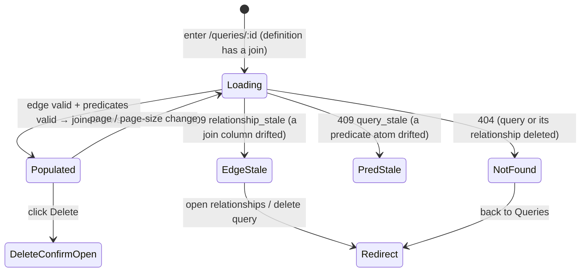

# Joins — execute a Query across two related datasets (consume a Relationship)

**Concept**: a **join** is the second construction mode of a
[Query](saved-query.md): a Query whose definition references a governed
[Relationship](../workspaces/relationships.md) so its live re-run reads **two
related datasets as one virtual table**. It is **not a new noun** — it extends
the existing `QueryDefinition` with an optional **join step** (`{ relationshipId,
type }`); the Query keeps its `qr_` identity, its catalog, its
`/data-management/queries/:id` detail, and its `/queries/{id}/rows` run route. R71
ships **join execution only** — producing joined rows from a declared edge; the
interactive construction surface that makes this join **editable** (and previewable
before save) is **R72**, specified in
[query-construction.md](query-construction.md) — where R71's **read-only** join
summary below becomes the builder's **editable** join editor
([Round_71](../../../plan/cycles/Round_71.md) J-1 → [Round_72](../../../plan/cycles/Round_72.md)).

**Status**: Accepted (R71 design + **shipped R71** — full DCFBI chain: a Query
consumes a `Relationship` to produce joined rows). This doc **seals the join
model** (J-2) at the Design gate and records the **Relationship-edge truth-test**
(J-4) that R70 earmarked for this round — the edge was **validated** (no revision).
**Round introduced**: [Round_71](../../../plan/cycles/Round_71.md) — the third
step of the critical path (`data → relationships → **joins** → dashboards`) and
the second, independent consumer that **truth-tests** R70's governed edge.
**Domain folder**: `data-management/queries/` — a sibling **mode** of
[saved-query.md](saved-query.md) (single-source) under the
[query-builder.md](query-builder.md) anchor; **not** a parallel page.
**Sibling docs**:
[query-builder.md](query-builder.md) (the domain anchor whose R71 trajectory
step this doc fills),
[saved-query.md](saved-query.md) (the first construction mode; owns the base
`QueryDefinition` + the single-source run path this extends),
[relationships.md](../workspaces/relationships.md) (the **join input** — the
governed edge this mode consumes; the `409 relationship_stale` it reserved for
exactly this consumer),
[datasets.md](../datasets/datasets.md) +
[dataset-detail.md](../datasets/dataset-detail.md) (the two table-sources a join
reads + the `<PagedRowsView>` the joined result reuses),
[crud-hygiene.md](../_shared/crud-hygiene.md) (the delete-confirm modal reused),
[workspace-shell.target.md](../../_platform/workspace-shell.target.md) (the
chrome all surfaces render inside).

> **Why a mode, not a noun (the noun-vs-mode check).** A join does not introduce
> a new readable-table-source kind — a joined Query is still a **virtual
> dataset**, the same archetype [saved-query.md](saved-query.md) established; it
> only reads from two parquet sources instead of one. So it **extends** the Query
> definition + run path rather than minting a `JoinedView` noun (which would be
> the discarded-R69 trap). The
> [reuse invariant](query-builder.md#the-reuse-invariant-the-one-rule-this-domain-holds)
> binds the surfaces; what is genuinely new is the **execution engine**, named
> honestly below (not laundered through "reuse").
> _Track: 1 (product feature). Pulled by ← R70 trajectory + R69's
> "Query-as-join-input" deferral +
> [purpose.md](../../../context/purpose.md) critical path._

---

## Truth-test record (J-4)

_Does R70's governed edge carry what a real join needs?_

R70 shipped the `Relationship` model as **conformant, not truth-validated**, and
named R71 as its truth-test with a **kill-condition**: if the edge can't carry a
real join, that is a **model revision, not an implementation detail**
([Round_70 § Watch-item](../../../plan/cycles/Round_70.md)). This section is that
test — performed by tracing a concrete join end to end against the **real read
path**, not by trusting R70's green suite (the
[self-manufactured-evidence trap](../../../memory/2026-06-13-specious-model-lock-in.md),
mechanism #1).

**Trace** — `Deals.account_id ↔ Accounts.id`, declared `many:many`, to joined
rows:

| What producing joined rows requires       | Does the R70 edge carry it?                                                                                                                                          |
| ----------------------------------------- | -------------------------------------------------------------------------------------------------------------------------------------------------------------------- |
| The two table-sources (left + right)      | **Yes** — `leftDatasetId` / `rightDatasetId` resolve both parquet sources.                                                                                           |
| The `ON` key pair                         | **Yes** — `leftColumn` / `rightColumn` are the join keys, already **dtype-compatibility-validated** at declare time (`_compatible`, integer/float numeric).          |
| A freshness / drift gate                  | **Yes** — `status: valid\|stale` is recomputed on read against current schemas; R70 **reserved `409 relationship_stale`** for this consumer.                         |
| Join direction / multiplication semantics | **Yes (advisory)** — the ordered pair + `cardinality` enum carry direction; for an inner join cardinality is advisory (affects expected row count, not correctness). |
| Join **type** (inner / left / …)          | **No — and correctly so.** This is a **query-time** choice, not a property of the edge. It belongs in the `QueryDefinition` join step, not the governed edge.        |
| Result-column **projection / collision**  | **No — and correctly so.** Which columns the result carries (and how duplicate names disambiguate) is a query/execution concern, not edge metadata.                  |
| Predicate **column qualification**        | **No — and correctly so.** Which side a filtered column lives on is resolved when the join executes, against the combined column space — not stored on the edge.     |

**Verdict — the edge model is VALIDATED; J-4 does NOT fire.** Everything the edge
is _responsible for_ as a join **input** — the two sources, the validated key
pair, the freshness gate, declared cardinality — it carries. Everything it does
**not** carry (join type, projection, predicate qualification) is **correctly a
query-time concern**, exactly the boundary R70 drew ("governance metadata the
Query Builder consumes"). The ordered-pair shape, the within-workspace scoping,
and declared-cardinality MVP all hold up under a real join. **R70 needs no
revision.**

**But the truth-test splits a half-truth** (the
[specious discipline](../../../memory/2026-06-13-specious-model-lock-in.md): name
which part is true, test whether the rest only rides on it). The J-2(a) lean
("extend the Query") silently carried _"…and reuse the run path verbatim."_ The
trace **refutes that at the execution layer**:

- **The predicate + SQL engine is single-source by construction.** A `FilterAtom`'s
  `col` is _"the 0-based index into the source Dataset.columns[]"_
  ([common.py](../../../../workspace/apps/backend/app/models/common.py)), and
  [`_predicate_sql`](../../../../workspace/apps/backend/app/ingest/filters.py)
  emits an **unqualified** `"col_name"`. Over two joined sources a bare index /
  name is **ambiguous** (both `Deals` and `Accounts` may have an `id`).
- **`query_dataset_rows` is hardcoded to one `read_parquet(?)`**
  ([rows_reader.py](../../../../workspace/apps/backend/app/ingest/rows_reader.py))
  — there is **no JOIN composition** anywhere.

So the **honest split** R71 builds on (true reuse vs genuinely new):

| Reused verbatim (the true half)                                                                                                          | Genuinely NEW (named, not hidden under "reuse")                                                                                                                                                |
| ---------------------------------------------------------------------------------------------------------------------------------------- | ---------------------------------------------------------------------------------------------------------------------------------------------------------------------------------------------- |
| The Query archetype, catalog, `/queries/{id}` + `/queries/{id}/rows` route, live-re-run discipline                                       | A `QueryDefinition.join` step `{ relationshipId, type }`                                                                                                                                       |
| The predicate **operator vocabulary** + per-predicate SQL fragment builders (`_predicate_sql`, `build_filter_sql`, `build_advanced_sql`) | A **multi-source execution path** (`query_joined_rows`) building `FROM read_parquet(L) <join> read_parquet(R) ON L.k = R.k`, calling the fragment builders with **side-qualified** identifiers |
| The `409 *_stale` flag-don't-crash pattern (`query_stale` → now `relationship_stale`)                                                    | An **effective combined column space** (left ++ right) + a **collision rule** (qualify duplicate names by dataset) the atoms index into                                                        |
| `RowsPage` response shape (`rows`/`page`/`pageSize`/`total`)                                                                             | The joined Query exposing its **effective columns** so the FE can render headers it can't get from a single source dataset                                                                     |

This is **not** a model failure — it is the build-layer reality the design
declares now instead of papering over. **J-2 → (a) Extend the Query, SEALED**, at
the IA / archetype / route level; the "reuse the engine verbatim" sub-claim is
**refuted and replaced** with the explicit engine-extension above (a Design-gate
refinement, the [build-first](../../../memory/2026-05-22-ui-boundary-build-first.md)
twin: the altitude — _a join is a virtual dataset, reuse the archetype_ — is
right; the build corrects the _mechanism_).

**Discovered-vs-imposed:** _discovered._ The join keys, the freshness gate, the
two sources — a real join genuinely needs each, and the edge already held them
before R71 existed; nothing here was minted to justify the edge. The one thing
R71 _adds_ (the join step + multi-source engine) is pulled by the actual read
path's single-source limit, not by R70's suite.

---

## The model — the extended `QueryDefinition`

A join is expressed by adding **one optional field** to the base
[`QueryDefinition`](saved-query.md#data-model); the rest of the definition (chip
`filters`, `advanced` DNF, `?q=`) is unchanged in shape:

```ts
// features/data-management/queries/types.ts — R71 extension
type JoinStep = {
  relationshipId: string; // `rel_…` — the governed edge this join consumes
  type: 'inner'; // MVP: inner join only (left/outer deferred — Scope)
};

type QueryDefinition = {
  q?: string | null;
  filters: FilterAtom[]; // chip filters (unchanged atom shape)
  advanced: FilterAtom[][]; // advanced DNF (unchanged atom shape)
  join?: JoinStep; // R71: when present, the Query reads two sources as one
};
```

**Effective column space (the resolution rule).** When `join` is present, the
Query's **effective columns** are the ordered concatenation
`left.columns ++ right.columns`, where `left`/`right` come from the
relationship's datasets. A `FilterAtom`'s `col` indexes into **this combined
list** (for a single-source Query it indexes the one dataset, exactly as today —
the rule is a strict superset). The execution path maps a combined index back to
`(side, original-column-name)` to emit a **side-qualified** identifier
(`L."account_id"` / `R."id"`), resolving the ambiguity the single-source engine
can't.

**Result-column collision rule.** Duplicate column **names** across the two
sources (e.g. both have `id`) are disambiguated **for display** by qualifying
with the dataset name (`Deals.id` / `Accounts.id`); names unique across the join
stay bare. Row cells stay a positional `string[][]` aligned to the effective
column order — the [`RowsPage`](../datasets/dataset-detail.md) shape is unchanged;
only the **header list** is new information the joined Query must expose.

**Cardinality / row multiplication.** MVP executes a straight SQL **inner join**;
the result reflects its natural cardinality (a `many:many` edge can multiply
rows — no dedup, no implicit aggregation this round). The declared `cardinality`
on the edge is **advisory** (it set expectations at declare time); it does not
alter execution. A row-explosion guard/warning is a future concern (Scope).

---

## Surfaces — layer / reuse / purity declaration

> R71 ships the **minimal** surface to _create and run_ a joined Query (J-1): one
> "join with a related dataset" affordance + the read-only joined result. The
> rich interactive multi-source builder (multiple joins, visual cross-source
> predicate construction) is **R72**.

| Surface                                          | Layer                                               | Reusability         | Purity    | Allowed peer deps                  |
| ------------------------------------------------ | --------------------------------------------------- | ------------------- | --------- | ---------------------------------- |
| `AddJoinAction` (minimal: pick a valid `rel_`)   | `apps/builder/src/features/data-management/queries` | feature             | feature   | react, antd                        |
| `JoinSummary` (read-only join header on detail)  | `apps/builder/src/features/data-management/queries` | feature             | feature   | react, antd                        |
| `QueryDetailPage` (extended for the join mode)   | `apps/builder/src/features/data-management/queries` | feature             | feature   | react, antd, @tanstack/react-query |
| `<PagedRowsView>` (reused, not owned)            | `apps/builder/src/features/data-management/_shared` | shared cross-domain | plain-ui  | react, antd, react-i18next         |
| `query_joined_rows` (NEW multi-source read path) | `apps/backend/app/ingest`                           | backend             | feature   | (duckdb — backend native)          |
| `JoinStep` type (frontend)                       | `.../features/data-management/queries/types.ts`     | feature             | data type | none                               |

**Boundary check**: the only shared-cross-domain row (`<PagedRowsView>`) is
**reused, not owned** — its boundary lives in
[dataset-detail.md](../datasets/dataset-detail.md). `query_joined_rows` is a
genuinely new backend read path (the truth-test's named engine extension); it
**reuses** the predicate fragment builders in
[filters.py](../../../../workspace/apps/backend/app/ingest/filters.py) and sits
beside `query_dataset_rows`, never re-implementing the operator vocabulary. No
join surface re-implements a dataset/query page.

---

## Token map

The join surfaces are AntD primitives (`<Select>`, `<Tag>`, `<Alert>`,
`<Table>` via `<PagedRowsView>`, `<Button>`) styled by the `<ConfigProvider>`
tokens derived from the six seeds in
[`themeTokens.ts`](../../../../workspace/packages/ui/src/themeTokens.ts) (the
source of truth — R66). **No new token is introduced**; the map reuses the
identifiers already cited by [saved-query.md](saved-query.md) and
[relationships.md](../workspaces/relationships.md). `Value` is informational.

| Surface                                 | AntD token (themeTokens.ts) | Value (informational) |
| --------------------------------------- | --------------------------- | --------------------- |
| Page background                         | `colorBgLayout`             | `#f5f5f5`             |
| Page card background                    | `colorBgBase`               | derived               |
| `[Join with related dataset]` / primary | `colorPrimary`              | `#1677ff`             |
| Join-summary / cardinality `<Tag>` text | `colorTextSecondary`        | derived               |
| Table row border                        | `colorBorderSecondary`      | `#f0f0f0`             |
| Stale-edge `⚠` warning (join blocked)   | `colorWarning`              | `#faad14`             |
| Border radius (card, table, tag)        | `borderRadius`              | `6`                   |
| Font family                             | `fontFamily`                | system stack          |

Identifier parity is enforced by
[`design-token-parity.mjs`](../../../../scripts/lint/design-token-parity.mjs).

---

## Layout — ASCII intent

The join run renders inside the existing query-mode detail
([saved-query.md § Query mode](saved-query.md)) — the **same** standard detail
layout (`PageHeader` + `PageCard` + `<PagedRowsView>`), with a read-only **join
summary** section added above the predicate summary. The minimal create
affordance is a single Select of the source dataset's **valid** relationships.

```text
Home ▸ Data Management ▸ Queries ▸ Deals × Accounts                         [Delete]
Deals × Accounts                                          🔎 Query · live re-run · join

  ┌─ Join (read-only) ─────────────────────────────────────────────────────────┐
  │  Deals  ⋈ inner ⋈  Accounts      on  account_id ↔ id      many:many          │
  └────────────────────────────────────────────────────────────────────────────┘
  ┌─ Applied predicates (read-only) ───────────────────────────────────────────┐
  │  Deals.stage = won     Accounts.region = APAC                                │
  └────────────────────────────────────────────────────────────────────────────┘

  Matched 1,204 rows
  ┌────────────────────────────────────────────────────────────────────────┐
  │ <the shared <PagedRowsView> — combined columns: Deals.* then Accounts.*, │
  │  duplicate names qualified (Deals.id · Accounts.id)>                      │
  └────────────────────────────────────────────────────────────────────────┘
```

### Stale-edge state (the `409 relationship_stale` gate)

If the consumed relationship is **stale** at run time (a join column was
removed/retyped after declare — [purpose.md](../../../context/purpose.md) #5),
the run is **blocked**, not silently wrong:

```text
Deals × Accounts                                       🔎 Query · ⚠ join unavailable

  ⚠  This query joins on “account_id”, which no longer exists in Deals.
     Fix the relationship in the workspace, or remove the join.

     [ Open relationships ↗ ]     [ Delete query ]
```

---

## Execution model (live re-run, two sources, no materialization)

A joined Query stores **only its definition** (including the `rel_` reference),
never a result — same always-fresh discipline as
[saved-query.md § Execution](saved-query.md). The run path adds source-resolution
and the `relationship_stale` gate, then delegates to the **new** `query_joined_rows`:

```text
run path — routers/queries.py (extended; sketch)
  1. load the Query row (404 if absent); parse definition_json
  2. if definition.join is ABSENT → the existing single-source path (unchanged)
  3. else (join present):
     a. load the Relationship by definition.join.relationshipId
        (404 if the edge was deleted)
     b. recompute the edge status vs CURRENT schemas (reuse _compute_status)
        → if stale: 409 relationship_stale  (R70's reserved code, now consumed)
     c. resolve left + right parquet paths + build the effective column space
        (left.columns ++ right.columns; collision-qualified for headers)
     d. re-validate every FilterAtom against the EFFECTIVE columns
        (reuse build_definition_predicates over the combined list)
        → a drifted predicate atom: 409 query_stale (mirrors single-source)
     e. rows, total = query_joined_rows(left_pq, right_pq, on=(L.k,R.k),
           type='inner', columns=effective, page=…, page_size=…,
           q=q, filters=filters, advanced=advanced)
  4. return the SAME RowsPage shape as GET /datasets/{id}/rows
```

`query_joined_rows` is the named new engine: it opens the same ephemeral
`duckdb.connect(":memory:")`, builds `FROM read_parquet(?) L INNER JOIN
read_parquet(?) R ON L."leftCol" = R."rightCol"`, and composes the **reused**
fragment builders (`build_filter_sql` / `build_advanced_sql` / the `?q=`
substring) — but with **side-qualified** identifiers derived from the combined
column index. No new Parquet, no result cache. _Trigger to materialize:_ a join
too slow to be interactive at real data scale (Scope).

---

## Behaviour — states



- **Create (minimal, J-1)**: from a dataset/query, **[Join with related
  dataset]** lists that dataset's **valid** relationships (a `<Select>` of
  `rel_` edges); choosing one + Save persists a Query with a `join` step. No
  multi-step canvas — that is R72.
- **No eligible relationships (create empty/guidance state)**: when the dataset
  has **zero valid** relationships (none declared, or all stale), the
  `[Join with related dataset]` affordance is **disabled** with a guiding
  tooltip — _"Declare a relationship for this dataset first"_ — linking to the
  workspace [Relationships](../workspaces/relationships.md) view. A join is never
  offered with nothing to join on (no dead-end empty `<Select>`).
- **Run** is a GET (idempotent), re-executing the saved definition; pagination
  is the only query param (the definition is the source of truth), mirroring the
  single-source run.
- **Stale gates** are **flag-don't-crash**: a stale edge → `409
relationship_stale`; a drifted predicate atom → `409 query_stale`; both render
  a guided state, never a blank crash ([purpose.md](../../../context/purpose.md) #5).
- **Delete** reuses `<DeleteConfirmModal>`
  ([crud-hygiene.md](../_shared/crud-hygiene.md)); deleting the consumed
  relationship or either dataset cascades/blocks per the existing query
  lifecycle. _(R71 also surfaces the first **dependency** a relationship has: a
  relationship consumed by a join — see Scope for the delete-guard question.)_

### Accessibility (declared here so F builds it, not infers it)

- The **join create `<Select>`** carries a **visible label** ("Join with a
  related dataset", label-above per the AntD Data-Entry guidance), is
  keyboard-reachable, and each option names the edge in **text** (`Deals.account_id
↔ Accounts.id`), not by colour or glyph alone.
- The **read-only join summary** conveys the join with **icon + text** (`⋈ inner`,
  a labelled cardinality `<Tag>`), never colour-only; the source dataset names are
  text links with accessible names.
- The **stale-edge "join unavailable" state** is an `<Alert role="alert">` whose
  reason is **text** (the missing column named), with icon + text status — not a
  colour swatch; its `[Open relationships]` / `[Delete query]` actions are
  focus-order reachable.
- The combined result reuses `<PagedRowsView>`'s shipped table semantics; the
  collision-qualified headers (`Deals.id` / `Accounts.id`) keep every column name
  **unique and readable** for screen-reader table navigation.

---

## Data contract (intent — formalized at the Contract gate)

The Contract phase extends `workspace/packages/contracts/queries/` (the join is a
**field on the existing shapes**, not new routes). This states the **design
intent**.

| Route                           | Change for R71                                                                                                                                              |
| ------------------------------- | ----------------------------------------------------------------------------------------------------------------------------------------------------------- |
| `POST /workspaces/{id}/queries` | body `definition` gains optional `join: { relationshipId, type }`; validate-on-save also checks the edge exists, is in-workspace, and is valid.             |
| `GET /queries/{id}`             | the returned `Query` exposes its **effective columns** (combined + collision-qualified) when a join is present — the FE can't derive them from one dataset. |
| `GET /queries/{id}/rows`        | **same `RowsPage` shape**; adds `409 relationship_stale` (joined, stale edge) beside the existing `409 query_stale`.                                        |

- **`relationship_stale` is now consumed** — R70 reserved the `409` for exactly
  this. The error envelope reuses the shared
  [api-error.yaml](../../../../workspace/packages/contracts/_shared/api-error.yaml);
  the `relationship_stale` code is added at the Contract gate (centralized via
  `values.yaml` → generated constants, mirroring `query_stale`).
- **Open contract questions (flag for the Contract gate, not pre-decided):**
  (1) **where effective columns are exposed** — a new `resolvedColumns` field on
  `Query`, or a small run-response header block. (2) The parked
  **route-vs-resolver** question (J-2′): R71 keeps the existing
  `/queries/{id}/rows` route and resolves both **datasets** internally; a
  **unified `ds_`/`qr_` table-source resolver** is **not pulled** this round
  (join inputs are two Datasets via a `rel_`; Query×Query composition is
  deferred), so it stays the truer-but-deferred abstraction
  ([specious-model-lock-in](../../../memory/2026-06-13-specious-model-lock-in.md):
  cheap-to-do-later is permission to defer).

---

## Acceptance criteria (Design gate exit)

**User journey** — as a user who has declared that `Deals.account_id` joins
`Accounts.id`, I open a dataset, choose **Join with a related dataset**, pick that
relationship, and save a Query that — every time I open it — re-runs the join
against current data and shows me the combined rows; if a join column later
disappears, I see a clear "join unavailable, fix the relationship" message rather
than wrong or empty results.

Each criterion maps to ≥1 future automated test across F / B / I (built in the
R71 chain on the human's go-ahead):

1. **Join definition round-trips** _(FE + contract)_ — saving a joined Query
   POSTs a `definition.join = { relationshipId, type:'inner' }`; the atom shapes
   for `filters`/`advanced` are unchanged.
2. **Validate-on-save guards the edge** _(pytest)_ — saving a join whose `rel_`
   is unknown / cross-workspace / **stale** at save time is rejected `422`; a
   valid edge succeeds.
3. **Join executes correct rows** _(pytest)_ — `GET /queries/{id}/rows` on a
   joined definition returns the inner-join of the two datasets on the validated
   keys, paged, in the effective `left ++ right` column order, via
   `query_joined_rows`; predicates apply across the combined space.
4. **Side-qualified predicates are unambiguous** _(pytest)_ — a predicate on a
   column whose **name** exists in both sources resolves to the correct side (no
   ambiguous-column SQL error); duplicate names are collision-qualified in the
   exposed columns.
5. **Stale edge blocks the join** _(pytest + FE)_ — when a join column is
   removed/retyped after save, the run returns **`409 relationship_stale`** and
   the detail renders the "join unavailable" state (not a crash, not wrong rows)
   — [purpose.md](../../../context/purpose.md) #5.
6. **Drifted predicate still flags** _(pytest)_ — a drifted **filter** atom over
   a joined definition returns `409 query_stale`, as in the single-source path.
7. **Effective columns are exposed** _(FE + contract)_ — a joined Query surfaces
   its combined, collision-qualified column list so `<PagedRowsView>` renders
   headers it cannot get from one source dataset.
8. **Live re-run, no materialization** _(pytest)_ — mutating either dataset's
   rows between two runs changes the joined result (no pinned snapshot).
9. **Mode, not noun; reuse not duplication** _(FE)_ — the joined Query reuses the
   Queries catalog, the `/queries/:id` detail, and `<PagedRowsView>` (no parallel
   "joined view" page); the only new surfaces are the minimal join affordance +
   the read-only join summary — the noun-vs-mode check
   ([specious-model-lock-in](../../../memory/2026-06-13-specious-model-lock-in.md)).
10. **Edge truth-test recorded** _(design assertion)_ — this doc documents that
    R70's edge **carries** a real join's input needs (J-4 did **not** fire), and
    names the **engine extension** (`query_joined_rows` + side-qualified columns)
    that the J-2(a) "reuse" lean did not.

---

## Scope boundary

### IN scope (R71)

- Extending `QueryDefinition` with an optional `join` step
  (`{ relationshipId, type:'inner' }`); the effective combined column space +
  collision rule; side-qualified predicate resolution.
- The new `query_joined_rows` execution path (two-source inner join, reusing the
  predicate fragment builders); the `409 relationship_stale` run gate.
- The **minimal** create affordance (pick a valid `rel_` + save) and the
  read-only join summary on the existing query-mode detail; the joined result via
  the reused `<PagedRowsView>`.

### OUT of scope (deferred with named triggers)

- **The interactive multi-source construction surface** (visual cross-source
  predicate building, multiple joins, a builder canvas) → **R72** (J-1).
  _Trigger: a Query must be built from more than one minimal join + the saved
  filters._
- **Left / right / outer joins**; **composite / multi-column** join keys;
  **self-joins**; **cross-workspace** joins → future (R70's named triggers hold;
  R71 executes a single-column, within-workspace, **inner** join).
- **Query × Query joins / composition** (a Query as a join input) → later; R71's
  join inputs are two **Datasets** via a `rel_`. This is also why the **unified
  table-source resolver** stays deferred (J-2′).
- **Row-explosion guard / aggregation / dedup** on `many:many` joins → future.
  _Trigger: a real report's join multiplies rows past usability._
- **Relationship delete-guard** when an edge is consumed by a join → flagged as
  the first relationship **dependency** (R70 deferred dependency checks to "R71's
  joins"); R71 may add a `409`-style guard or document the cascade — decided at
  the Backend gate, not here.
- **Result materialization / pinned snapshots; Excel export of a join;
  dashboards** → downstream value-out.

### This concept explicitly does NOT cover

- The governed-edge model itself (declare / validate / list / stale) — lives in
  [relationships.md](../workspaces/relationships.md); this doc only **consumes** it.
- The base single-source `QueryDefinition` / catalog / detail (live in
  [saved-query.md](saved-query.md); this extends, does not restate them).
- The predicate vocabulary internals (live in
  [dataset-filters.md](../datasets/dataset-filters.md) +
  [advanced-query.md](../datasets/advanced-query.md)).

---

## Reference materials (read-only)

- [relationships.md](../workspaces/relationships.md) — the governed edge this
  mode consumes; the `409 relationship_stale` it reserved for this consumer.
- [saved-query.md](saved-query.md) — the base `QueryDefinition` + single-source
  run path this extends; the `query_stale` precedent the join gate mirrors.
- [query-builder.md](query-builder.md) — the domain anchor + trajectory this
  fills (R71 join execution).
- [specious-model-lock-in](../../../memory/2026-06-13-specious-model-lock-in.md)
  — the noun-vs-mode / discovered-vs-imposed / split-the-half lesson the
  truth-test applies.
