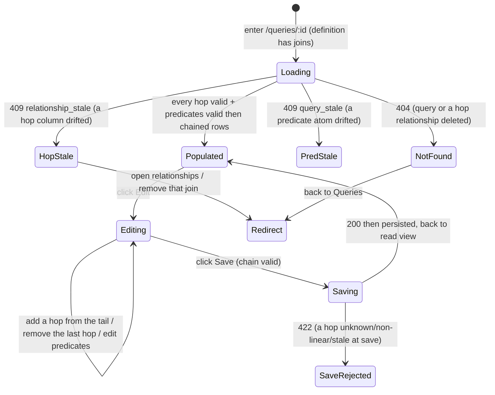

# Multi-join — join a Query across more than two related datasets

> ⚠️ **OUT OF SYNC** — `design-sync --check` (2026-06-17) found this doc has drifted from the
> implementation: **5 claim(s) diverge from code** (the body still asserts the *linear-chain*
> invariant while the code runs the R74 join **tree** — `disconnected_join`/`cyclic_join`; plus
> `datasetId` → `sourceId`). This doc folds into the `saved-query.md` spine at R83 (redirect-stub on
> merge). See `.agents/tmp/design-sync/queries.md`. Re-sync before trusting or designing on it: run
> `design-sync .agents/design/data-management/queries`.
<!-- design-sync:out-of-sync domain=data-management/queries detected=2026-06-17 claims=5 -->

**Concept**: a **multi-join** is the fourth construction mode of a
[Query](saved-query.md): a Query whose definition joins **two or more** governed
[Relationships](../workspaces/relationships.md) so its live re-run reads **three or
more related datasets as one virtual table** (e.g. `Deals ⋈ Accounts ⋈ Owners`).
It is **not a new noun** — it generalizes the existing
[`QueryDefinition.join`](joins.md#the-model-the-extended-querydefinition) (a
**single** edge, R71) into an **ordered list of edges**, executed by growing
`query_joined_rows` from a fixed two-source join into a **fold over the list**.
The Query keeps its `qr_` identity, its catalog, its
`/data-management/queries/:id` detail, the [builder](query-construction.md) R72
shipped, and its run / preview routes. **R73** shipped the **linear chain** (each
hop extends from the previous — tail — dataset); **R74** generalizes the topology
to a **connected acyclic join graph (a tree)** — each hop's left/driving dataset is
**any** source already in the graph, so one dataset can be joined to **two or more
others** (a star/tree). The linear chain is the degenerate **path** case of the
tree. The **free-form visual source-graph canvas** (drag nodes / draw edges) stays
deferred → **R75** ([Round_74](../../../plan/cycles/Round_74.md) J-1′).

**Status**: Accepted — **shipped R73** (linear chain) and **R74** (the tree
generalization). R73 (DFCFBI: D → F1 → C → F2 → B → I) was sealed at the Design gate
(J-2: seal-then-STOP); on the human's go-ahead the chain built through F1 (chain
editor + multi-hop preview, human-reviewed) → C (`QueryDefinition.join` → `joins`
migrated across the contract corpus) → F2 → B (`query_joined_rows` grown to an
N-source fold; per-hop + linear-chain validate-on-save) → I. R73 **re-opened the join
model** (singular `join` → a chain) under the **design-model confidence valve**; the
**chain truth-test** held in running code — the R70 `Relationship` edge needed **no
revision**, only the `QueryDefinition` + engine generalized. **R74** (run straight
through, J-2) then **relaxed the linear invariant to a tree** — and the model held a
**second** time: the [topology truth-test](#topology-truth-test-record-r74) confirmed
`joins: JoinStep[]` already carries a tree (each hop names its own
`leftDatasetId`/`rightDatasetId`), so **no model change** was needed — only the
**validation invariant** (tail → any prior source) + the **engine ON-clause**
(`T{k}` → `T{left_idx}`) + the **builder affordance** (a left-source `<Select>` +
leaf removal) generalized.

> **As-built notes (O-rule reconciliation).** ① The wire/contract migrated `join` →
> **`joins`** (the FE bridge that briefly kept a length-≤1 chain on the legacy field
> during F1 was **collapsed at the Contract gate**); the backend **normalizes a
> legacy persisted single `join` → length-1 `joins` on read** (a
> `model_validator`), so responses always carry `joins`. ② The chain editor is the
> R72 `JoinEditor` extended in place (single-edge affordance for ≤1 hop; hop rows +
> `[+ Add a join]` from the tail + `[Remove]` last for ≥2) — **not** a new canvas.
> ③ No new route + no new error code (the chain is a field-shape change on the
> existing create / get / run / preview / update shapes).
>
> **R74 as-built (O-rule).** ④ The topology relaxed linear → **tree** with **no model,
> wire, route, or error-code change**: `_resolve_chain` swapped its `nonlinear_chain`
> invariant for `disconnected_join` (left ∉ graph) / `cyclic_join` (right ∈ graph),
> both free-form `422` detail messages; `query_joined_rows`' `join_keys` grew to
> `(left_idx, left_col, right_col)` so each hop joins against `T{left_idx}`. ⑤ The
> builder's `JoinEditor` gained a **left-source `<Select>`** (`BuilderAddJoinSource`,
> shown only when 2+ in-graph sources can branch) + **leaf-only `[Remove]`**
> (`removeLastJoin` → `removeJoin(relationshipId)`). ⑥ Known limit: the **MSW preview
> is topology-blind** (length-based canned rows) — tree-execution correctness lives in
> the backend's real DuckDB engine (pytest), the FE confirms builder mechanics.

**Round introduced**: [Round_73](../../../plan/cycles/Round_73.md) — the fifth
step of the critical path (`data → relationships → joins → construction →
**multi-join** → dashboards`) and the **first time the join engine grows past a
single edge**.
**Domain folder**: `data-management/queries/` — a sibling **mode** of
[joins.md](joins.md) (single-edge execution) and
[query-construction.md](query-construction.md) (the editable builder) under the
[query-builder.md](query-builder.md) anchor; **not** a parallel page.
**Sibling docs**:
[query-builder.md](query-builder.md) (the domain anchor whose R73 trajectory step
this fills),
[joins.md](joins.md) (the single-edge join model + `query_joined_rows` this
generalizes; the `409 relationship_stale` gate this applies **per hop**),
[query-construction.md](query-construction.md) (the editable builder whose
`JoinEditor` this extends into a **chain editor** — add a hop from the tail /
remove the last hop),
[saved-query.md](saved-query.md) (the base `QueryDefinition` + single-source run
path the chain extends),
[relationships.md](../workspaces/relationships.md) (the governed edges the chain
consumes — one `rel_` per hop),
[dataset-detail.md](../datasets/dataset-detail.md) (owns `<PagedRowsView>`, reused
for the result + preview),
[workspace-shell.target.md](../../_platform/workspace-shell.target.md) (the chrome
all surfaces render inside).

> **Why a mode, not a noun (the noun-vs-mode check).** A chained join introduces
> **no new readable-table-source kind** — the result is still a **virtual
> dataset**, the same archetype [saved-query.md](saved-query.md) established; it
> only reads from N parquet sources instead of two. So it **generalizes** the
> Query definition + run path rather than minting a `ChainedView` / `JoinGraph`
> noun (the discarded-R69 trap). The
> [reuse invariant](query-builder.md#the-reuse-invariant-the-one-rule-this-domain-holds)
> binds the surfaces; what is genuinely new — the **chained definition** + the
> **multi-hop engine fold** — is named honestly below, not laundered through
> "reuse".
> _Track: 1 (product feature). Pulled by ← R72 J-1′ deferral +
> [query-builder.md](query-builder.md) trajectory ("R73 multi-join canvas") +
> [purpose.md](../../../context/purpose.md) critical path / key decision #4._

---

## Truth-test record (the chain truth-test — design-model confidence valve)

_Does the R70 governed edge — and R71's single-edge join model — carry what a
**multi-hop chain** needs, or does chaining re-open them?_ R73 invokes the valve
[joins.md § J-4](joins.md#truth-test-record-j-4) earned (the inverse of R72, which
declined it because its model was settled). The test traces a concrete **2-hop**
chain against the **real read path**, not a green suite
([self-manufactured-evidence trap](../../../memory/2026-06-13-specious-model-lock-in.md)).

**Trace** — `Deals.account_id ↔ Accounts.id`, then `Accounts.owner_id ↔
Owners.id`, to chained rows:

| What chaining requires                           | Does the existing model carry it?                                                                                                                                                                                                                    |
| ------------------------------------------------ | ---------------------------------------------------------------------------------------------------------------------------------------------------------------------------------------------------------------------------------------------------- |
| Each hop's two sources + validated key pair      | **Yes** — each hop is **one governed `rel_`**; `leftDatasetId`/`rightDatasetId` + `leftColumn`/`rightColumn` (dtype-validated at declare) carry it, exactly as R71's single join. The `Relationship` edge is **unchanged**.                          |
| Per-hop freshness / drift gate                   | **Yes** — `status: valid\|stale` is recomputed per edge on read; the `409 relationship_stale` R70 reserved applies **per hop** (the run fails on the first stale edge, naming it).                                                                   |
| An **ordered** representation of the hops        | **No — the model is singular.** `QueryDefinition.join: JoinStep \| None` holds exactly **one** edge. A chain needs an **ordered list**. → **J-3: a `QueryDefinition` model change** (not an edge change).                                            |
| Composing N sources into one SQL statement       | **No — the engine is two-source.** `query_joined_rows` emits a fixed `FROM read_parquet(?) L INNER JOIN read_parquet(?) R ON …` ([rows_reader.py](../../../../workspace/apps/backend/app/ingest/rows_reader.py)). → an **engine fold**, named below. |
| Effective columns + predicate side-qualification | **Generalizes** — R71's `left ++ right` + collision-by-dataset-name + side-qualified identifiers already model "the combined space". The chain extends it to `D1 ++ D2 ++ … ++ Dn` with per-source qualifiers `T0..Tn`.                              |
| Join **topology** (which dataset joins which)    | **New, but constrained.** R73 fixes it to a **linear path** — each hop's left dataset is the chain's **tail** (J-4). A non-linear graph (a dataset joined to 2+ others) is **R74's** canvas, not the linear chain.                                   |

**Verdict — the `Relationship` edge is VALIDATED (no revision); the
`QueryDefinition` + engine genuinely re-open (J-3).** Everything an edge is
_responsible for_ as a join **input** — its two sources, the validated key pair,
the per-edge freshness gate — it carries for **each hop** exactly as for one;
chaining is a **query-time composition** concern, not edge metadata. So the
**design-model confidence valve fires on the `QueryDefinition`/engine, not the
edge**: R73 changes the definition (singular → chain) and folds the engine over
the chain, while R70's edge holds — the same split [joins.md](joins.md) drew
(reuse the archetype; the build corrects the _mechanism_).

**Discovered-vs-imposed:** _discovered._ The chain is pulled by a real report need
(a Deal's account **and** that account's owner in one table) and by R72's named
J-1′ trigger written before R73 existed; nothing was minted to justify a model.
The one thing R73 adds (the ordered `joins` + the fold) is pulled by the singular
model's actual limit, not by a green suite.

---

## Topology truth-test record (R74)

_The design-model confidence valve, second firing._

_Does the R70 governed edge — and R73's `joins: JoinStep[]` model — carry a
**non-linear topology** (a dataset joined to 2+ others — a star/tree), or does the
tree re-open them?_ R74 **runs the valve straight through** (J-2): the model is not
sealed-then-STOPPED, but the test still runs to **confirm** the model holds before
the build relaxes the invariant. The test traces a concrete **star** against the
**real read path**, not a green suite.

**Trace** — `Deals.account_id ↔ Accounts.id` (hop 0) **and** `Deals.owner_id ↔
Owners.id` (hop 1) — both driving from **Deals** (the source), a star, not a path:

| What a tree topology requires                          | Does the existing model carry it?                                                                                                                                                                                                                                                       |
| ------------------------------------------------------ | --------------------------------------------------------------------------------------------------------------------------------------------------------------------------------------------------------------------------------------------------------------------------------------- |
| Each hop's left/driving + right dataset                | **Yes — already explicit.** Each `JoinStep` consumes **one governed `rel_`** carrying `leftDatasetId`/`rightDatasetId`. A hop driving from the **source** (Deals) rather than the tail (Accounts) is **already a valid `JoinStep`** — the model never stored "tail"; it stored the edge.  |
| A non-linear shape (one dataset → 2+ others)           | **Yes — the model already permits it.** `joins: JoinStep[]` is an ordered **list of edges**, not a path. R73 **constrained** it to a path with a runtime **invariant** (`rel.left == tail` → `nonlinear_chain`), not with the shape. → R74 **relaxes the invariant**, no model change.    |
| Composing a tree into one SQL statement                | **No — the engine is path-shaped.** `query_joined_rows` hardcodes hop `k`'s ON clause to the **immediately-previous** source `T{k}` ([rows_reader.py](../../../../workspace/apps/backend/app/ingest/rows_reader.py)). A star needs hop `k` to join against its **own** left source `T{left_idx}`. → an **engine ON-clause generalization**, named below. |
| Connected + acyclic guarantee (a tree, not a cycle)    | **New validation.** R73's invariant did connectedness (left = tail) + acyclicity (right never revisited) at once. R74 **splits** them: left ∈ graph (connected) + right ∉ graph (acyclic) = a **spanning tree**. → a relaxed `_resolve_chain` rule (`disconnected_join` / `cyclic_join`). |
| Effective columns + per-hop freshness gate             | **Unchanged** — still the ordered concat across all sources (collision-qualified), and the per-hop `409 relationship_stale` gate applies edge-by-edge exactly as in the chain.                                                                                                            |

**Verdict — the model is VALIDATED a second time (no revision); only the invariant +
engine ON-clause + builder affordance generalize.** R73's truth-test re-opened the
`QueryDefinition` (singular → ordered); R74's re-opens **nothing in the model** —
`joins: JoinStep[]` already expresses a tree because each hop names its own left
source. What R73 made *linear* was a **policy** (an invariant + a path-shaped engine),
not the data shape. So the **design-model confidence valve fires on neither the edge
nor the definition** — only on the **invariant + engine + UX**. This is the cleanest
possible "grow the topology" change: relax a guard, generalize one ON-clause index,
add a `<Select>`. Naming that honestly (rather than inventing a `JoinGraph` noun the
model doesn't need) is the
[noun-vs-mode brake](../../../memory/2026-06-13-specious-model-lock-in.md) applied a
second time.

**Discovered-vs-imposed:** _discovered._ The tree is pulled by R73's named J-1′
trigger (a Query must join one dataset to 2+ others — a branch the linear path cannot
express) written before R74, and by a real report need (a Deal's **account** and its
**owner**, both hanging off the Deal). Nothing was minted; R74 removes a constraint
the model never needed, rather than adding a concept.

---

## The model — the chained `QueryDefinition` (J-3 resolved)

**J-3 → migrate the singular `join` to an ordered `joins: JoinStep[]`** (option
(a), sealed). A single join becomes a **length-1 chain** — the cleanest superset,
one field expressing one concept, rather than a singular `join` plus a separate
overflow list (option (b), a model smell). Each `JoinStep` is unchanged in shape
(one `rel_` + `type:'inner'`); only the **arity** grows:

```ts
// features/data-management/queries/types.ts — R73: singular join → an ordered chain
type JoinStep = {
  relationshipId: string; // `rel_…` — the governed edge this hop consumes
  type: 'inner'; // MVP: inner only (left/outer deferred — Scope)
};

type QueryDefinition = {
  q?: string | null;
  filters: FilterAtom[]; // chip filters (unchanged atom shape)
  advanced: FilterAtom[][]; // advanced DNF (unchanged atom shape)
  joins: JoinStep[]; // R73: ordered chain. [] = single-source; [e] = one join (R71);
  //                          [e0,e1,…] = a multi-hop chain. Replaces R71's `join?`.
};
```

- **Back-compat read shim (J-3).** Stored R71/R72 definitions hold a singular
  `join?: JoinStep`. The model reads a legacy `join` as `joins: [join]` (and a
  missing/absent join as `joins: []`) on load, so **no stored Query is lost** and
  the wire shape stays single-sourced. New writes always use `joins`. _(The exact
  migration seam — read-shim vs. a one-time rewrite — is a Contract/Backend-gate
  detail; the design fixes the **shape**.)_
- **The topology invariant — linear path (R73) → connected acyclic tree (R74).**
  R73 fixed the topology to a **path**: `joins[0]`'s left is the source, each
  `joins[k]`'s left is the **tail** (the right of `joins[k-1]`). **R74 relaxes this
  to a tree**: `joins[0]`'s left is still the source, but each subsequent
  `joins[k]`'s left may be **any dataset already in the graph** (`datasetId` or any
  prior hop's right) — so one dataset can drive **two or more** hops (a star). The
  guarantee is **connected + acyclic**: each hop's left must already be present
  (connected) and its right must be **new** (acyclic — no dataset joined twice). The
  joins are stored in a **topological order** (each hop's left precedes it), which the
  builder produces naturally by appending a hop onto an existing source. The linear
  chain is the **path** special case (each hop's left = the prior tail). _A dataset
  joined to itself (self-join) or joined-into from two parents (a diamond / general
  DAG) is still **out** — the acyclic rule blocks revisiting a dataset; those stay
  deferred. The **free-form visual canvas** is **R75**._

**Effective column space (the resolution rule, generalized).** When `joins` is
non-empty, the Query's **effective columns** are the ordered concatenation across
**every** dataset in the chain, in chain order:
`D0.columns ++ D1.columns ++ … ++ Dn.columns`. A `FilterAtom`'s `col` indexes into
**this combined list** (a single-source Query — `joins: []` — indexes the one
dataset, exactly as today; the rule is a strict superset). Execution maps a
combined index back to `(source-position, original-column-name)` and emits a
**source-qualified** identifier (`T0."account_id"`, `T2."region"`), resolving the
ambiguity a bare index can't across N sources.

**Result-column collision rule (unchanged, generalized).** Duplicate column
**names** across any two chained sources are disambiguated **for display** by
qualifying with the dataset name (`Deals.id` / `Accounts.id` / `Owners.id`); names
unique across the whole chain stay bare. Row cells stay a positional `string[][]`
aligned to the effective column order — the [`RowsPage`](../datasets/dataset-detail.md)
shape is unchanged; only the **header list** grows.

**Cardinality / row multiplication compounds across hops.** Each hop executes a
straight SQL **inner join**; a `many:many` edge multiplies rows, and a **chain**
of them **compounds** (a 2-hop chain can multiply more than either hop alone — no
dedup, no implicit aggregation this round). The declared `cardinality` per edge is
**advisory** (it set expectations at declare time); it does not alter execution.
A **row-explosion guard/warning** is a named future concern (Scope) — more likely
to bite on a chain than on a single join.

---

## What is genuinely new vs. reused (the honest split)

R73 adds a **chained definition + a multi-hop engine fold** over R72's shipped
builder and R71's shipped predicate/run engines. Naming the split up front (the
[specious-discipline](../../../memory/2026-06-13-specious-model-lock-in.md) habit)
keeps the build from re-inventing anything:

| Reused verbatim (the true half)                                                                                                                         | Genuinely NEW (named, not hidden under "reuse")                                                                                                   |
| ------------------------------------------------------------------------------------------------------------------------------------------------------- | ------------------------------------------------------------------------------------------------------------------------------------------------- |
| The Query archetype, catalog, detail, the R72 builder (`useQueryBuilder`, the live preview, Save/discard), the `<PagedRowsView>` result + preview       | The `QueryDefinition.joins: JoinStep[]` **chain** (singular `join` generalized) + the back-compat read shim                                       |
| The predicate **operator vocabulary** + per-predicate SQL fragment builders (`build_filter_sql`, `build_advanced_sql`, the `?q=` substring)             | A **multi-hop fold** in `query_joined_rows`: `FROM read_parquet(D0) T0 INNER JOIN read_parquet(D1) T1 ON … INNER JOIN read_parquet(Dn) Tn ON …`   |
| R71's eligible-relationships `<Select>` + R72's `JoinEditor` (change/clear one edge); the `409 relationship_stale` / `409 query_stale` flag-don't-crash | A **chain editor**: the `JoinEditor` extended to **append a hop from the tail** (edges whose left = the tail dataset) and **remove the last hop** |
| The effective-column-space + collision-qualified-headers concept (R71)                                                                                  | Its **generalization to N sources** (`D0..Dn`, qualifiers `T0..Tn`) + the **linear-chain invariant** (tail-extension) the builder enforces        |

**No new noun. No new predicate engine.** The genuinely new work is the **ordered
`joins`** + the **engine fold** + the **chain-editor affordance** — everything
else is reuse.

---

## Surfaces — layer / reuse / purity declaration

> R73 ships the **linear** chain (J-1): edit a chain of hops in R72's builder +
> the multi-hop run/preview. The **free-form visual source-graph canvas**
> (non-linear topology) is **R74**.

| Surface                                                    | Layer                                               | Reusability         | Purity    | Allowed peer deps                  |
| ---------------------------------------------------------- | --------------------------------------------------- | ------------------- | --------- | ---------------------------------- |
| `ChainEditor` (NEW: append-hop-from-tail / remove-last)    | `apps/builder/src/features/data-management/queries` | feature             | feature   | react, antd                        |
| `QueryBuilderPanel` (extended: a list of hops, not one)    | `apps/builder/src/features/data-management/queries` | feature             | feature   | react, antd                        |
| `useQueryBuilder` (extended: `joins[]` working copy)       | `apps/builder/src/features/data-management/queries` | feature             | glue      | @tanstack/react-query, antd        |
| `QueryDetailPage` (chain summary in the read view)         | `apps/builder/src/features/data-management/queries` | feature             | feature   | react, antd, @tanstack/react-query |
| `<PagedRowsView>` (reused, not owned)                      | `apps/builder/src/features/data-management/_shared` | shared cross-domain | plain-ui  | react, antd, react-i18next         |
| `query_joined_rows` (extended: two-source → N-source fold) | `apps/backend/app/ingest`                           | backend             | feature   | (duckdb — backend native)          |
| `JoinStep[]` chain (frontend + contract type)              | `.../features/data-management/queries/types.ts`     | feature             | data type | none                               |

**Boundary check**: the only shared-cross-domain row (`<PagedRowsView>`) is
**reused, not owned** — its boundary lives in
[dataset-detail.md](../datasets/dataset-detail.md). `ChainEditor` **reuses** R72's
`JoinEditor` + R71's eligible-relationships `<Select>` (now scoped to tail-eligible
edges); the predicate editors are **reused by reference** over the generalized
`resolvedColumns`. `query_joined_rows` **grows** (the fold) but reuses the
predicate fragment builders in
[filters.py](../../../../workspace/apps/backend/app/ingest/filters.py), never
re-implementing the operator vocabulary. No surface re-implements a dataset / query
page or a predicate engine.

---

## Token map

The multi-join surfaces are AntD primitives (`<Select>`, `<Button>`, `<Tag>`,
`<Alert>`, `<Table>` via `<PagedRowsView>`) styled by the `<ConfigProvider>`
tokens derived from the six seeds in
[`themeTokens.ts`](../../../../workspace/packages/ui/src/themeTokens.ts) (the
source of truth — R66). **No new token is introduced**; the map reuses the
identifiers already cited by [joins.md](joins.md) and
[query-construction.md](query-construction.md). `Value` is informational.

| Surface                                        | AntD token (themeTokens.ts) | Value (informational) |
| ---------------------------------------------- | --------------------------- | --------------------- |
| Page background                                | `colorBgLayout`             | `#f5f5f5`             |
| Page card background                           | `colorBgBase`               | derived               |
| `[Add a join]` / primary action                | `colorPrimary`              | `#1677ff`             |
| Chain-hop / cardinality `<Tag>` text           | `colorTextSecondary`        | derived               |
| Chain / table border                           | `colorBorderSecondary`      | `#f0f0f0`             |
| Stale-hop `⚠` warning (chain blocked)          | `colorWarning`              | `#faad14`             |
| Invalid predicate / unrunnable-chain `<Alert>` | `colorError`                | `#ff4d4f`             |
| Border radius (card, table, tag, button)       | `borderRadius`              | `6`                   |
| Font family                                    | `fontFamily`                | system stack          |

Identifier parity is enforced by
[`design-token-parity.mjs`](../../../../scripts/lint/design-token-parity.mjs).

---

## Layout — ASCII intent

The chain renders inside the existing query-mode detail + R72's builder — the
**same** standard detail shell (`PageHeader` + `PageCard` + `<PagedRowsView>`) and
the same Build / Preview collapsible sections. The single `JoinEditor` becomes a
**list of hops** with one **`[+ Add a join]`** affordance that appends from the
tail and a **remove** on the last hop.

### Read view — the chain summary

```text
Home ▸ Data Management ▸ Queries ▸ Deals × Accounts × Owners        [Edit] [Delete]
Deals × Accounts × Owners                       🔎 Query · live re-run · 2 joins

  ┌─ Joins (read-only) ─────────────────────────────────────────────────────────┐
  │  Deals  ⋈ inner ⋈  Accounts   on  account_id ↔ id        many:many           │
  │  Accounts  ⋈ inner ⋈  Owners  on  owner_id ↔ id          many:one            │
  └──────────────────────────────────────────────────────────────────────────────┘
  Matched 1,204 rows   <the shared <PagedRowsView> — Deals.* then Accounts.* then
                        Owners.*; duplicate names qualified (Deals.id · Accounts.id)>
```

### Edit mode — the chain editor (extends R72's builder)

```text
Deals × Accounts × Owners                                          [Cancel] [Save]

  ▾ Build
  ┌─ Joins ─────────────────────────────────────────────────────────────────────┐
  │  Deals  ⋈  [ account_id ↔ Accounts.id   (many:many)        ▾ ]               │
  │  Accounts  ⋈  [ owner_id ↔ Owners.id    (many:one)         ▾ ]   [ Remove ]   │  ← last hop
  │  [ + Add a join ]   (extends from “Owners” — the chain’s tail)               │
  └──────────────────────────────────────────────────────────────────────────────┘
  (columns from all three datasets)
  Deals.stage = won  ×    Owners.region = APAC  ×            ← active-filter chips
  ▾ Preview · 1,204 rows  ⟳   [ Preview ]
  ┌────────────────────────────────────────────────────────────────────────┐
  │  <preview of the UNSAVED chain; combined columns across all hops>        │
  └────────────────────────────────────────────────────────────────────────┘
```

`[+ Add a join]` lists only edges whose **left/driving dataset is the chain's
tail** (Owners, above) — keeping the chain a **linear path**; **`[Remove]`** drops
the **last** hop (re-binding the predicate columns to the now-shorter space).
Removing a non-last hop, or branching onto a non-tail dataset, is **R74**.

### Stale-hop state (the `409 relationship_stale` gate, per hop)

```text
Deals × Accounts × Owners                          🔎 Query · ⚠ chain unavailable

  ⚠  This query joins on “owner_id”, which no longer exists in Accounts (hop 2).
     Fix the relationship in the workspace, or remove that join.

     [ Open relationships ↗ ]     [ Remove join ]
```

---

## Execution model (live re-run, N sources, no materialization)

A chained Query stores **only its definition** (the ordered `rel_` references),
never a result — same always-fresh discipline as
[joins.md § Execution](joins.md#execution-model-live-re-run-two-sources-no-materialization).
The run path resolves each hop, gates per-hop staleness, then delegates to the
**grown** `query_joined_rows`:

```text
run path — routers/queries.py (extended; sketch — R74 relaxes step 3a)
  1. load the Query (404 if absent); parse definition_json; read joins (legacy `join` → [join])
  2. if joins is EMPTY → the existing single-source path (unchanged)
  3. else (graph present):
     a. resolve the joins in order: sources = [D0 = query.datasetId]; for each hop k,
        load joins[k].rel (404 if deleted); require rel.left ∈ sources (else 422
        disconnected_join) and rel.right ∉ sources (else 422 cyclic_join — a tree, not
        a diamond/self-join); record left_idx = index of rel.left in sources; append
        rel.right to sources    [R73 was: require rel.left == tail (linear path)]
     b. recompute each edge's status vs CURRENT schemas (reuse _compatible)
        → first stale hop: 409 relationship_stale (naming the hop + column)
     c. build the effective column space (D0 ++ D1 ++ … ++ Dn; collision-qualified)
     d. re-validate every FilterAtom against the EFFECTIVE columns
        (reuse the predicate builders) → a drifted atom: 409 query_stale
     e. rows, total = query_joined_rows(sources=[D0..Dn],
           join_keys=[(left_idx, left_col, right_col), …], type='inner',
           columns=effective, page=…, page_size=…, q, filters, advanced)
  4. return the SAME RowsPage shape (+ resolvedColumns when joined)
```

`query_joined_rows` is a **fold** over the sources: it opens the same ephemeral
`duckdb.connect(":memory:")` and builds `FROM read_parquet(?) AS T0 INNER JOIN
read_parquet(?) AS T1 ON T{left_idx0}."k0"=T1."k0'" INNER JOIN read_parquet(?) AS T2
ON T{left_idx1}."k1"=T2."k1'" …`. **R74's only engine change**: each hop joins the
new source `T{k+1}` against its **own** left source `T{left_idx}` (R73 hardcoded
`T{k}`, the previous source — correct only for a path). Because the joins are in
topological order, every `T{left_idx}` is already in the FROM clause when its hop is
appended. It composes the **reused** fragment builders with **source-qualified**
identifiers from the combined column index. No new Parquet, no result cache.
_Trigger to materialize:_ a graph too slow / too row-multiplying to be interactive at
real data scale (Scope).

---

## Behaviour — states



- **Add a hop (R74 — from any source, not just the tail)** — `[+ Add a join]` lets
  the user pick **which existing source to extend from** (a **left-source `<Select>`**
  over the datasets already in the graph that have ≥1 valid outgoing edge to a
  not-yet-joined dataset), then the **relationship `<Select>`** offers the edges
  driving from that chosen source whose right is **new**. Choosing one appends a
  `JoinStep` and extends the effective column space. _R73 fixed the left source to the
  tail; R74 makes it a choice — this is the entire UX delta._ When **no** source has
  an eligible outgoing edge (none declared, or all stale / all targets already joined),
  the add control is **disabled** with the same guiding tooltip R71 set — _"Declare a
  relationship first"_, linking to the workspace
  [Relationships](../workspaces/relationships.md) view — so the graph is never offered
  with nothing to extend onto (no dead-end empty `<Select>`).
- **Remove a hop (R74 — any leaf, not just the last)** — `[Remove]` is enabled on any
  **leaf** hop: a hop whose **right dataset is no other hop's left** (removing it
  orphans nothing). Removing a non-leaf hop would orphan its descendants, so it is
  **disabled** with a tooltip (_"remove the joins that depend on this one first"_).
  Removal re-binds predicate columns to the smaller space; predicates over a
  now-absent column flag invalid **in the builder** (caught before save), mirroring
  `query_stale`. _R73 allowed removing only the last hop (the single leaf of a path);
  a tree has multiple leaves._
- **Run / preview** are unchanged routes (GET run; the R72 stateless preview POST),
  now executing a chain; pagination is the only run param (definition is SoT).
- **Stale gates are flag-don't-crash, per hop**: the first stale edge → `409
relationship_stale` naming the hop; a drifted predicate → `409 query_stale`;
  both render a guided state, never a blank crash ([purpose.md](../../../context/purpose.md) #5).
- **Validate-on-save** mirrors create/update (`422`): every hop must be a valid,
  in-workspace, **non-stale** edge **and** satisfy the linear-chain invariant
  (each hop's left = the prior tail); else save is blocked.

### Accessibility (declared here so F builds it, not infers it)

- Each **hop `<Select>`** carries a **visible label** (label-above per the AntD
  Data-Entry guidance), is keyboard-reachable, and names the edge in **text**
  (`account_id ↔ Accounts.id`), not colour/glyph alone; **`[+ Add a join]`** and
  per-hop **`[Remove]`** are labelled controls in focus order.
- **(R74) The left-source `<Select>`** — the "extend from which source" control —
  carries its own **labelled accessible name** (_"Join from"_), is keyboard-reachable
  in focus order **before** the relationship `<Select>` it gates, and names each
  source option in **text** (the dataset name). A **`[Remove]` disabled on a non-leaf
  hop** keeps its label and exposes its reason as **text** via the tooltip (_"remove
  the joins that depend on this one first"_) — `aria-disabled`, not a silent dead
  control — so the leaf rule is discoverable, not colour/affordance-only.
- The **read-only chain summary** lists each hop with **icon + text** (`⋈ inner`, a
  labelled cardinality `<Tag>`); dataset names are text links with accessible names.
- The **stale-hop "chain unavailable" state** is an `<Alert role="alert">` whose
  reason is **text** (the missing column **and the hop number** named), with icon +
  text — not a colour swatch; its `[Open relationships]` / `[Remove join]` actions
  are focus-order reachable.
- The chained result reuses `<PagedRowsView>`'s shipped table semantics;
  collision-qualified headers (`Deals.id` / `Accounts.id` / `Owners.id`) keep every
  column name **unique and readable** for screen-reader table navigation.

---

## Data contract (intent — formalized at the Contract gate)

The chain is a **field-shape change on existing routes** (no new route): `joins`
replaces the singular `join` across the create / get / run / preview / update
shapes the R71/R72 contracts already define. This states the **design intent**.

| Route                           | Change for R73                                                                                                                                              |
| ------------------------------- | ----------------------------------------------------------------------------------------------------------------------------------------------------------- |
| `POST /workspaces/{id}/queries` | `definition.join?` → `definition.joins: JoinStep[]`; validate-on-save checks **each** hop (exists, in-workspace, valid) **and** the linear-chain invariant. |
| `PUT /queries/{id}`             | same `joins` shape on the update body; the builder's Save persists the working-copy chain.                                                                  |
| `POST …/queries/preview`        | the stateless preview (R72) runs an **unsaved chain**; `resolvedColumns` spans all hops.                                                                    |
| `GET /queries/{id}` + `…/rows`  | the returned `Query` exposes its **effective columns** across the chain; `…/rows` keeps the `RowsPage` shape, adds **per-hop** `409 relationship_stale`.    |

- **`_shared/query.yaml`** is where `JoinStep` lives (R71); R73 changed the field
  from `join` to `joins` there, so all routes that `$ref` it inherit the list.
- **No new error codes** — `relationship_stale` / `query_stale` / `not_found` /
  the `422` envelope all exist (R69/R70/R71); the joins **consume** them per hop.
- **R74 changes NO wire shape and NO enumerated error code.** `joins: JoinStep[]` is
  unchanged (a tree is the same ordered list of edges; only the *validation* relaxes).
  The path-invariant rejection R73 emitted as a **free-form `422` detail message**
  (`nonlinear_chain`) is replaced by two equally free-form messages —
  **`disconnected_join`** (a hop's left dataset isn't in the graph) and **`cyclic_join`**
  (a hop's right dataset is already in the graph — a diamond/self-join, deferred).
  Both are `value_error` strings in the existing `422` envelope, **not** enumerated
  codes in `values.yaml`, so — like R73 — there is **no generated-constants change**.

---

## Acceptance criteria (Design gate exit)

**User journey** — as a user who has declared `Deals.account_id ↔ Accounts.id`
and `Accounts.owner_id ↔ Owners.id`, I open my joined Query, click **Edit**,
**add a second join** that extends from Accounts to Owners, filter on a column
from **Owners**, **see the three-dataset result update live before I commit**, then
**Save** — and if a join column later disappears, I see a clear "this hop is
unavailable" message naming the hop, rather than wrong or empty rows.

Each criterion maps to ≥1 future automated test across F1 / F2 / B / I (built on
the human's go-ahead, per J-2):

1. **The chain definition round-trips** _(FE + contract)_ — `definition.joins` is
   an ordered `JoinStep[]`; a length-1 chain behaves exactly as R71's single join;
   a legacy singular `join` reads back as `joins:[join]` (no data loss).
2. **Validate-on-save guards every hop + the linear invariant** _(pytest)_ — saving
   a chain with an unknown / cross-workspace / **stale** hop, or a hop whose left
   ≠ the prior tail (non-linear), is rejected `422`; a valid linear chain succeeds.
3. **The chain executes correct rows** _(pytest)_ — `…/rows` on a 2+-hop definition
   returns the inner-join fold across all sources on the validated keys, paged, in
   the effective `D0 ++ … ++ Dn` order, via the grown `query_joined_rows`.
4. **Source-qualified predicates are unambiguous across N sources** _(pytest)_ — a
   predicate on a column whose **name** exists in 2+ sources resolves to the correct
   one (no ambiguous-column SQL error); duplicates are collision-qualified.
5. **A stale hop blocks the chain, naming the hop** _(pytest + FE)_ — when a hop's
   join column is removed/retyped after save, the run returns **`409
relationship_stale`** and the detail renders the "chain unavailable" state for
   that hop (not a crash, not wrong rows) — [purpose.md](../../../context/purpose.md) #5.
6. **Drifted predicate still flags** _(pytest)_ — a drifted filter atom over a
   chained definition returns `409 query_stale`, as in the single-source/join path.
7. **The chain editor extends from the tail / removes the last hop** _(FE)_ — `[+
Add a join]` offers only tail-eligible edges; `[Remove]` drops the last hop and
   re-binds the predicate columns; both update the live preview.
8. **Live re-run, no materialization** _(pytest)_ — mutating any chained dataset's
   rows between two runs changes the result (no pinned snapshot).
9. **Mode, not noun; reuse not duplication** _(FE)_ — the chain reuses the catalog,
   the `/queries/:id` detail, R72's builder, and `<PagedRowsView>` (no parallel
   "chain view" / canvas page); the only new surfaces are the `ChainEditor` + the
   read-only chain summary — the noun-vs-mode check.
10. **Chain truth-test recorded** _(design assertion)_ — this doc documents that
    R70's **edge** carries each hop (no revision) while the **`QueryDefinition` +
    engine** genuinely re-open (J-3), and names the **engine fold** + the
    **linear-chain invariant** the change introduces.

### R74 — the tree generalization (Design gate exit)

Each maps to ≥1 future test (FE / B / I); they run straight through (J-2):

1. **A star executes correct rows** _(pytest)_ — a definition where two hops both
   drive from the **source** dataset (`Deals ⋈ Accounts` **and** `Deals ⋈ Owners`)
   returns the inner-join fold across all three sources, paged, in the effective
   `D0 ++ D1 ++ D2` order — the `T{left_idx}` engine joins each new source against its
   own left, not the previous one.
2. **Validate-on-save guards the tree (connected + acyclic)** _(pytest)_ — a hop
   whose left dataset is **not yet in the graph** is rejected `422 disconnected_join`;
   a hop whose right dataset is **already in the graph** (a diamond/self-join) is
   rejected `422 cyclic_join`; a valid tree (and the R73 linear path, a tree) saves.
3. **The builder adds from any source + removes any leaf** _(FE)_ — `[+ Add a join]`
   offers a **left-source `<Select>`** over eligible in-graph sources, then edges from
   the chosen source; `[Remove]` is enabled on **leaf** hops and disabled (tooltip) on
   a hop another hop depends on; both update the live preview.
4. **Model held — topology truth-test recorded** _(design assertion)_ — this doc
   documents that R74 needed **no model change** (`joins: JoinStep[]` already carries
   a tree), only the **invariant** (tail → any prior source), the **engine ON-clause**
   (`T{k}` → `T{left_idx}`), and the **builder affordance** generalized — the
   noun-vs-mode brake applied a second time (no `JoinGraph` noun).

---

## Scope boundary

### IN scope (R73 + R74)

- **R73** — Generalizing `QueryDefinition.join` (singular) → **`joins: JoinStep[]`**
  (an ordered **linear** chain) with the back-compat read shim; the generalized
  effective column space + collision rule; source-qualified predicate resolution
  across N sources. Growing `query_joined_rows` from a two-source join into a
  **multi-hop inner-join fold**; the **per-hop** `409 relationship_stale` gate. The
  **chain editor** (append a hop from the tail / remove the last hop) + the read-only
  chain summary; the result/preview via the reused `<PagedRowsView>`.
- **R74** — Relaxing the **linear invariant to a connected acyclic tree**: each hop's
  left/driving dataset may be **any** source already in the graph (so one dataset
  joins to 2+ others — a star). The **engine ON-clause generalization** (`T{k}` →
  `T{left_idx}`); the **`disconnected_join` / `cyclic_join`** validation (a spanning
  tree, not a diamond/self-join); the **builder affordance** — a **left-source
  `<Select>`** when adding a hop, and **leaf removal** (any hop whose right is no
  other hop's left). No model change, no wire change, no new error code.

### OUT of scope (deferred with named triggers)

- **The free-form visual builder canvas / source graph** (drag datasets as nodes,
  draw edges on a canvas) → **R75** (R74 J-1′). _Trigger: the hop-list + left-source
  `<Select>` stops scaling — a topology a human can no longer read as a list._
- **Self-joins / diamonds / general DAGs** (a dataset joined to itself, or
  joined-into from two parents) → future; R74's graph is a **tree** (the acyclic rule
  blocks revisiting a dataset). _Trigger: a report needs a dataset to appear in two
  join roles._
- **Left / right / outer joins; composite / multi-column keys; cross-workspace
  joins** → future (R70/R71 triggers hold); R73/R74 join **single-column,
  within-workspace, inner** hops.
- **Query × Query composition** (a Query as a hop input) → later; with it the
  **unified `ds_`/`qr_` table-source resolver** (R71 J-2′) earns its place.
- **Row-explosion guard / aggregation / dedup** on multiplying graphs → future.
  _Trigger: a real report's graph multiplies rows past usability (likelier on a tree
  of `many:many` edges than on a chain)._
- **Re-ordering hops** → the canvas's editing model (R75); R74 appends a leaf onto
  any source and removes any leaf.
- **Renaming a Query from the builder; result materialization / pinned snapshots;
  Excel export; dashboards** → downstream value-out; preview + save stay live re-run.

### This concept explicitly does NOT cover

- The governed-edge model itself (declare / validate / list / stale) — lives in
  [relationships.md](../workspaces/relationships.md); this **consumes** one edge per
  hop.
- The single-edge join model + engine origin (live in [joins.md](joins.md)); this
  **generalizes** them, it does not restate them.
- The editable-builder lifecycle (Edit/preview/Save/discard) — lives in
  [query-construction.md](query-construction.md); this **extends** its `JoinEditor`
  into a chain editor.
- The predicate vocabulary internals (live in
  [dataset-filters.md](../datasets/dataset-filters.md) +
  [advanced-query.md](../datasets/advanced-query.md)).

---

## Reference materials (read-only)

- [joins.md](joins.md) — the single-edge join model + `query_joined_rows` +
  effective-column-space this generalizes; the `409 relationship_stale` precedent.
- [query-construction.md](query-construction.md) — the editable builder whose
  `JoinEditor` + preview/Save lifecycle this extends into a chain editor.
- [relationships.md](../workspaces/relationships.md) — the governed edge consumed
  once per hop; the per-hop freshness gate.
- [query-builder.md](query-builder.md) — the domain anchor + trajectory this fills
  (R73 multi-join chain).
- [specious-model-lock-in](../../../memory/2026-06-13-specious-model-lock-in.md) —
  the noun-vs-mode / discovered-vs-imposed / split-the-half lesson the truth-test
  applies.
