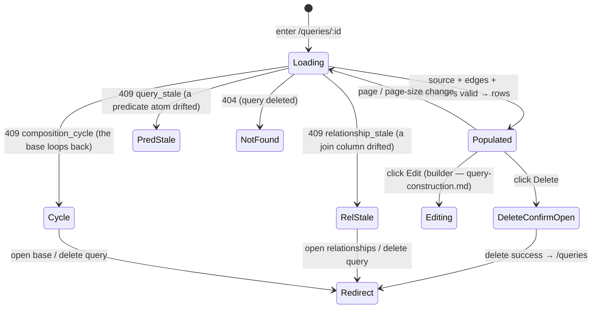

# Queries — the Query domain (noun · model · routes · engine)

**Concept**: a **Query** is a named, saved definition that produces a **virtual
dataset** by re-running a set of predicates — and, optionally, a tree of joins —
against a driving table-source. It is the **same readable-table-source kind** as a
[Dataset](../datasets/datasets.md) but a **different archetype**: it has its own
identity (`qr_…`), its own home (the **Queries catalog**), and its own URL — yet it
**reuses the dataset surfaces' layout and components** rather than duplicating them.
A Query stores **only its definition**, never a materialized result: opening one
re-runs it against current data, so the result is always fresh.

This doc is the **domain anchor + spine** of `queries/` — the single home for the
Query **noun**, the **reuse invariant** every surface here obeys, the **trajectory** the
domain grows along, and the Query **model · routes + error codes · execution engine**
(single-source read, the join-tree fold, and composed `qr_` sources). The interactive
builder UX lives in the sibling [query-construction.md](query-construction.md); the
visual source-graph editor is [canvas.md](canvas.md) (the Canvas tab — built).

**Status**: Accepted (extended R120–R129 — transform `steps` / workflows).
**Sibling docs**:
[query-construction.md](query-construction.md) (the editable builder surface: edit a
Query's definition + preview before save; the create-mode "Build on this query"),
[canvas.md](canvas.md) (the visual source-graph editor — the React Flow Canvas tab, built:
draw-to-connect copy-on-pick + free-form define, promote, and the divergence warn),
[dataset-detail.md](../datasets/dataset-detail.md) (the surface a Query is saved _from_,
and whose extracted `<PagedRowsView>` + standard detail layout this archetype reuses),
[dataset-filters.md](../datasets/dataset-filters.md) +
[advanced-query.md](../datasets/advanced-query.md) (the predicate vocabulary the saved
definition round-trips — `FilterAtom` chips + the advanced DNF),
[datasets.md](../datasets/datasets.md) (the leaf table-source a Query reads from; the
catalog + workspace-filter conventions the Queries catalog mirrors),
[relationships.md](../workspaces/relationships.md) (the governed edge a join consumes),
[workspaces.md](../workspaces/workspaces.md) (the container a Query is scoped to),
[crud-hygiene.md](../_shared/crud-hygiene.md) (the delete-confirm modal reused),
[workspace-shell.target.md](../../_platform/workspace-shell.target.md) (the chrome all
surfaces render inside).

---

## Why this exists separately from dataset-detail.md

The dataset detail page is the **ephemeral** verb surface: a user filters, searches,
and reads rows, and the URL (`f<N>_*`, `aq`, `q`) is the only durability — it survives
a refresh and a deep-link, nothing more. A Query is the **persisted** view: the same
predicate state (now possibly spanning joined sources), given a name and a `qr_`
identity, listed in a catalog and reopenable.

+ `dataset-detail.md` — the **ephemeral view**: build predicates, read rows, share via
  URL. Predicates live in the URL.
+ `queries.md` (this file) — the **persisted view + the engine that runs it**.
  The definition lives in a `queries` row; the run re-executes it live.

A Query is **not** a Dataset (no Parquet of its own — see § Execution model) and
**not** a new query language (it reuses the shipped `FilterAtom` / advanced-DNF
vocabulary verbatim). Because a Query has a stable id, it can itself be a **source** of
another Query (§ Composed source).

---

## The reuse invariant (the one rule this domain holds)

`queries/` is a first-class domain because the Query-Builder complexity (joins,
composition, the construction surface) genuinely pulled one — the domain is
**discovered, not imposed**. But **doc-home and UI-duplication are independent axes**:
having a `queries/` folder does **not** license parallel pages that re-implement the row
table. So the one rule every surface here obeys — every `queries/` surface is **composed
from existing shared components/layouts**, never a parallel page or a re-invented engine
([specious-model-lock-in](../../../memory/2026-06-13-specious-model-lock-in.md)):

| Concern                 | Reused from                                                                                                  |
| ----------------------- | ------------------------------------------------------------------------------------------------------------ |
| Row table               | `<PagedRowsView>` (`data-management/_shared/`, extracted from dataset-detail) — [dataset-detail.md](../datasets/dataset-detail.md) |
| Catalog list            | the Page-List layout (`PageHeader` + `PageCard` + AntD `<Table>`)                                            |
| Detail layout           | the standard detail layout (`PageHeader` + `PageCard` + `<PagedRowsView>`)                                   |
| Predicate (de)serialize | the shipped `FilterAtom` / advanced-DNF serializers + validators, verbatim                                   |
| Row execution           | `query_dataset_rows` (single source) — extended, never replaced, by `query_joined_rows`                      |

What is genuinely **new** to the Query archetype: persistence (the `queries` table),
the `qr_` identity, the Save-as-Query / Build-on modals, the Queries catalog + detail
routes, and the multi-source / composed **execution engine**. Everything else is reuse.

---

## Surfaces — layer / reuse / purity declaration

| Surface                                                       | Layer                                                                  | Reusability         | Purity             | Allowed peer deps                  |
| ------------------------------------------------------------- | ---------------------------------------------------------------------- | ------------------- | ------------------ | ---------------------------------- |
| `<PagedRowsView>` (reused; declared in dataset-detail.md)     | `apps/builder/src/features/data-management/_shared`                    | shared cross-domain | plain-UI           | react, antd, react-i18next         |
| `SaveQueryModal` (name capture for save + create)             | `apps/builder/src/features/data-management/queries`                    | feature             | feature            | react, antd                        |
| `QueriesPage` (Queries catalog; reuses Page-List layout)      | `apps/builder/src/features/data-management/queries`                    | feature             | feature            | react, antd, @tanstack/react-query |
| `QueryDetailPage` (read-only summary + run + inline Edit)     | `apps/builder/src/features/data-management/queries`                    | feature             | feature            | react, antd, @tanstack/react-query |
| `hooks.ts` (`useQueries` / `useQuery` / `useQueryRows` + create/update/delete mutations) | `apps/builder/src/features/data-management/queries` | feature             | glue (server-data) | @tanstack/react-query              |
| `chain.ts` (`readChain` / `writeDef` — working-chain ↔ wire bridge) | `apps/builder/src/features/data-management/queries`             | feature             | pure               | none                               |
| `POST/GET/PUT/DELETE …/queries` + `…/rows` + `…/preview` routes | `workspace/apps/backend/app/routers/queries.py`                      | backend             | feature            | (FastAPI — backend native)         |
| `query_dataset_rows` / `query_joined_rows` / `resolve_source` (engine) | `workspace/apps/backend/app/ingest/rows_reader.py`            | backend             | feature            | (duckdb — backend native)          |
| `Query` Pydantic models (`Query`, `*Body`)                    | `workspace/apps/backend/app/models/common.py`                          | backend             | data type          | pydantic                           |
| `Query` / `QueryDefinition` / `JoinStep` types (frontend)     | `workspace/apps/builder/src/features/data-management/queries/types.ts` | feature             | data type          | none                               |

**Boundary check**: no query surface re-implements a dataset surface. The row table is
the shared `data-management/_shared/` `<PagedRowsView>` (its boundary lives in
[dataset-detail.md](../datasets/dataset-detail.md)). The catalog and detail are
feature-local pages that **compose** the `@mdd/ui` shells (`PageHeader` / `PageCard`).
The engine (`query_joined_rows` / `resolve_source`) reuses the predicate fragment
builders in [filters.py](../../../../workspace/apps/backend/app/ingest/filters.py),
never re-implementing the operator vocabulary.

---

## Token map

The Saved-Query surfaces are AntD primitives (`<Table>`, `<Modal>`, `<Input>`, `<Tag>`,
`<Select>`, `<Alert>`, `<Empty>`, `<Button>`, `<Breadcrumb>`) styled by the AntD
`<ConfigProvider>` tokens derived from the six seeds in
[`themeTokens.ts`](../../../../workspace/packages/ui/src/themeTokens.ts) (the source of
truth). **No new token is introduced**; the map reuses identifiers already cited by
[datasets.md](../datasets/datasets.md) and [dataset-detail.md](../datasets/dataset-detail.md).
`Value` is informational (resolved via `theme.getDesignToken()`, antd 6.x).

| Surface                                    | AntD token                     | Value (informational) |
| ------------------------------------------ | ------------------------------ | --------------------- |
| Page background                            | `colorBgLayout`                | `#f5f5f5`             |
| Page card background                       | `colorBgBase`                  | derived               |
| Table header background                    | `colorFillQuaternary`          | derived               |
| Table row border                           | `colorBorderSecondary`         | `#f0f0f0`             |
| Table row hover                            | `colorPrimaryBg`               | `#e6f4ff`             |
| Cell text                                  | `colorText`                    | derived               |
| Primary action (`[Save]`, `[Build on this query]`, base/relationship `<Select>`) | `colorPrimary` | `#1677ff`             |
| Read-only predicate / join / cardinality `<Tag>` | `colorFillSecondary` / `colorTextSecondary` | derived    |
| Stale / unavailable warning (`⚠`)          | `colorWarning`                 | `#faad14`             |
| Invalid predicate / unrunnable `<Alert>`   | `colorError`                   | `#ff4d4f`             |
| Border radius (card, table, modal, button) | `borderRadius`                 | `6`                   |
| Font family                                | `fontFamily`                   | system stack          |

Identifier parity against the live AntD registry is enforced by
[`design-token-parity.mjs`](../../../../scripts/lint/design-token-parity.mjs).

---

## Data model

A `Query` persists to the `queries` table; the schema-of-record is the SQLModel `Query`
in [db_models.py](../../../../workspace/apps/backend/app/db_models.py) (Alembic migrates
prod; `create_all_for_tests()` builds the test DB), while the router handlers read/write
through **raw `sqlite3`** (`get_conn()`), not the ORM. The wire/FE shapes live in
[common.py](../../../../workspace/apps/backend/app/models/common.py) +
[types.ts](../../../../workspace/apps/builder/src/features/data-management/queries/types.ts).

```ts
// frontend — features/data-management/queries/types.ts
type SourceId = `ds_${string}` | `qr_${string}`; // polymorphic driving source

type Query = {
  id: string;                  // backend-generated, `^qr_[0-9a-f]{8}$`
  workspaceId: string;         // the IA scope
  sourceId: SourceId;          // the single canonical driving source — a Dataset OR a Query
  name: string;                // user-supplied; unique per (workspaceId)
  definition: QueryDefinition; // the saved predicate + join state (below)
  resolvedColumns?: { name: string; dtype: string }[]; // effective columns, present when multi-source
  createdAt: string;           // ISO-8601 UTC, backend commit time
};

type QueryDefinition = {
  q?: string | null;                  // the `?q=` row search (≤200 chars)
  filters: FilterAtom[];              // chip filters (dataset-filters.md)
  advanced: FilterAtom[][];           // advanced-query DNF (advanced-query.md)
  relationships: QueryRelationship[]; // the query's OWN join edges (default []); see § Joins
  joins: JoinStep[];                  // ordered join tree (default []); each hop → a query-owned rel
};

// A query OWNS its join relationships (copy-on-pick from the governed ER, or — R89 —
// defined free-form). The query runs on this snapshot, so editing/deleting the governed
// rel never breaks it.
type QueryRelationship = {
  id: string;                  // query-local, `^qrel_[0-9a-f]{8}$`
  leftDatasetId: string;       // `ds_…` — the LEFT/driving dataset of this edge
  leftColumn: string;          // the join key on the left
  rightDatasetId: string;      // `ds_…` — the RIGHT dataset joined in
  rightColumn: string;         // the join key on the right
  cardinality: 'one_to_one' | 'one_to_many' | 'many_to_many';
  originRelationshipId?: string | null; // `rel_…` provenance back-ref (null = free-form)
};

type JoinStep = {
  queryRelId: string;                            // `qrel_…` — the query-owned rel this hop consumes
  type: 'inner' | 'left' | 'right' | 'full';     // per-hop join type (default 'inner')
};

// FilterAtom = { col: number; dtype; op; val?; min?; max? } — col is the 0-based index
// into the EFFECTIVE columns (the single source's columns when joins is empty).
```

**`sourceId` is the single canonical source field — there is no `datasetId`.** The
`queries.source_id` column is `TEXT NOT NULL` with **no FK** (it is polymorphic
`ds_ | qr_`). The dataset-delete → query cascade that a dataset FK would provide lives in
the **app layer** (`routers/datasets.py`), since a polymorphic column can't carry one. A
legacy persisted single `join` key is folded to a length-1 `joins` list on read by a
`model_validator` (`_fold_legacy_join`); new writes always use `joins`.

**Migrations are a single fresh baseline.** Alembic carries one revision —
`0001_baseline.py` (`down_revision = None`) — that creates all four tables at their
current shape directly. The query-owned-relationships model lives entirely inside the
opaque `definition_json` blob, so it needs no DDL; the history was collapsed to this one
baseline (clean-slate: on `dev`, no backward-compat), and the pre-Alembic adoption bridge
was retired — a stale dev DB is re-created (`pnpm dev:seed --reset`), not migrated.

**Persistence (the `queries` table, code-true).**

```sql
CREATE TABLE queries (
    id TEXT PRIMARY KEY,                                   -- qr_xxxxxxxx
    workspace_id TEXT NOT NULL REFERENCES workspaces(id) ON DELETE CASCADE,
    source_id TEXT NOT NULL,                               -- polymorphic ds_|qr_, NO FK
    name TEXT NOT NULL CHECK (length(name) BETWEEN 1 AND 120),
    definition_json TEXT NOT NULL,                         -- QueryDefinition
    created_at TEXT NOT NULL
);
CREATE INDEX idx_queries_workspace_id ON queries(workspace_id);
CREATE UNIQUE INDEX idx_queries_name_unique ON queries(workspace_id, name);
```

**Definition fidelity (anti-drift).** The FE builds `QueryDefinition` from the live
builder/URL state and the BE re-runs it verbatim; both sides **reuse the shipped
serializers/validators** — the chip/advanced serializers + `chain.ts`'s
`readChain`/`writeDef` on the FE; `parse_filters_from_query` / `parse_advanced_from_query`
/ `_build_aq_atom` (ingest/filters.py) on the BE. No predicate is re-derived.

---

## Execution model (live re-run, no materialization)

A Query stores **only its definition**, never a result. Opening (or running) a Query
re-executes the saved definition against current data **now**, so the result always
reflects the latest source rows. There is no Parquet of its own, no result cache, no
execution log.

The run path branches on whether the Query reads one source or many —
`_is_multi_source(source_id, chain) = source_id.startswith("qr_") or bool(chain)`:

```text
run path — routers/queries.py
  1. load the Query row (404 not_found if absent); parse definition_json
  2. single-source (sourceId is ds_ AND joins == []):
       rows, total = query_dataset_rows(parquet_path, columns, page, page_size,
                                         q, filters, advanced)
  3. multi-source (sourceId is qr_, OR joins is non-empty):
       resolve the driving source + each hop (→ § Joins, § Composed source),
       gate per-hop / composition staleness, then:
       rows, total = query_joined_rows(sources, join_keys, columns=effective, …)
  4. return the SAME RowsPage shape as GET /datasets/{id}/rows
     (+ resolvedColumns on the multi-source preview branch)
```

Both paths share the ephemeral `duckdb.connect(":memory:")` read and the **reused**
predicate fragment builders (`build_filter_sql` / `build_advanced_sql` / the `?q=`
substring). _Trigger to materialize:_ a Query whose live re-run is too slow at real data
scale, or a downstream surface (dashboard) that needs a pinned snapshot — neither built.

---

## Joins: reading related datasets as one

When `definition.joins` is non-empty, the Query reads **two or more** datasets as one
virtual table through its **own** join edges — `definition.relationships`, a list of
`QueryRelationship`s the query OWNS. A join is **not a new noun** — it is a `JoinStep` in
the `joins` list referencing a query-owned rel by `queryRelId`; the Query keeps its `qr_`
identity, catalog, detail, and run/preview routes.

**A query owns its relationships (copy-on-pick).** Picking a governed
[Relationship](../workspaces/relationships.md) (`rel_…`) **copies** its current join
fields into the definition as a `QueryRelationship` (a fresh `qrel_` id, the same
datasets/columns/cardinality, `originRelationshipId` recording provenance). The join then
resolves through that **embedded copy** — the resolver never re-reads the workspace
`relationships` table — so editing or deleting the governed rel can no longer break a
saved query (it runs on its own snapshot). The join **type**, the result projection, and
predicate qualification are query-time concerns that live in the definition. A query-owned
rel is seeded either by **copy-on-pick** (from a governed `rel_`, `originRelationshipId`
set) or **defined free-form** (no governed origin, `originRelationshipId: null`); a useful
one can be **promoted** up to the governed ER. The free-form / promote / divergence-warn UX
lives on the canvas ([canvas.md](canvas.md)); the model supports it via the nullable
`originRelationshipId`.

### Join tree (topology)

`joins: JoinStep[]` is an ordered list of edges forming a **connected acyclic tree**
(not merely a linear chain). Resolution (`_resolve_chain` in `queries.py`):

+ The driving source (`sourceId`) is the root; for each hop `k`, the query-owned rel's
  left dataset (`leftDatasetId`) must already be a member of **some source in the graph**
  (else `disconnected_join`), and its right dataset (`rightDatasetId`) must be **new**
  (else `cyclic_join` — a diamond/self-join is rejected). So one dataset can drive **two
  or more** hops (a star).
+ Hops are stored in **topological order**; the builder produces this naturally by
  appending a hop onto an existing source. The linear chain is the degenerate **path**
  case (each hop's left = the prior tail). A single join is a length-1 `joins`.
+ `join_keys[k] = (left_idx, leftColumn, rightColumn, type)` — the engine joins source
  `T{k+1}` against `T{left_idx}` (its own left, **not** the previous source), so a star
  resolves correctly.

`disconnected_join`, `cyclic_join`, `unknown_relationship` (a hop's `queryRelId` has no
matching `QueryRelationship`), `relationship_dataset_missing`, and
`composition_base_missing` are **internal reason strings** folded into a FastAPI `422`
`detail[].msg` at create/update/preview validation — they are **not** top-level response
codes. At run time any non-cycle resolve failure collapses to `409 relationship_stale` —
including a query-owned key column that drifted away from its dataset (re-checked against
current columns on every run).

### Effective columns + predicate qualification

The Query's **effective columns** are the ordered concatenation across every source in
the graph (`build_effective_columns`): names colliding across 2+ sources are qualified
`Dataset.col` (e.g. `Deals.id` / `Accounts.id`); names unique across the graph stay
bare. A `FilterAtom`'s `col` indexes into this combined list; `select_exprs` alias
`T{i}."x" AS "effective_name"` so predicates reference the effective names. Row cells
stay a positional `string[][]` aligned to the effective column order — the `RowsPage`
shape is unchanged; only the **header list** (exposed as `resolvedColumns`) is new.

### Join types

`_JOIN_KEYWORDS` maps each hop's `type` to `INNER JOIN` / `LEFT JOIN` / `RIGHT JOIN` /
`FULL OUTER JOIN` (unknown defaults to INNER). A graph may **mix** types per hop. An
outer join keeps unmatched rows, so a relationship can be **expressed**, not just used to
filter; the unmatched side is NULL → an empty cell in `<PagedRowsView>` (every effective
cell is `CAST(... AS VARCHAR)`d). The reused predicate builders behave as standard SQL —
`equals` / `contains` / comparisons over a now-nullable column exclude NULL rows; a
null-matching operator (`is_empty` / `is_set`) is not built.

### Cardinality / row multiplication

Each hop is a straight SQL join; a `many:many` edge multiplies rows and a chain of them
compounds (no dedup, no implicit aggregation). The declared `cardinality` on the edge is
**advisory** (it set expectations at declare time) and does not alter execution. No
row-explosion guard is built: a multiplied result is the **truthful** product of the
declared relationships, and runtime cost / report drift are a **consumer-side** concern
(the surface that _loads_ the Query), not the Query definition's.

### Per-hop freshness gate

At run, each edge's status is recomputed against current schemas
(`_compatible(_dtype_of(left, qrel.leftColumn), _dtype_of(right, qrel.rightColumn))`,
reading the query-owned rel); a missing/incompatible key fails on the first stale hop with
`409 relationship_stale`,
naming the hop and column — flag-don't-crash, never wrong or empty rows.

---

## Composed source (`qr_`)

A Query's driving `sourceId` may itself be a saved Query (`qr_`) rather than a raw
dataset (`ds_`), so its run reads **another Query's virtual table as its base source**.
A composed Query is still a **virtual dataset** — no new noun; only the source reference
is polymorphic and the resolver recursive.

`resolve_source(con, source_id, *, visited)` returns a source's effective columns + its
SQL relation:

```text
resolve_source(con, source_id, *, visited) -> { name, effective_columns, relation_sql, params }
  ds_ : relation_sql = "read_parquet(?)"            # the leaf
        params       = [dataset parsed.parquet path]
        effective    = the dataset's columns
  qr_ : if source_id in visited -> composition_cycle
        inner = load Query(source_id); parse its definition
        sub   = resolve_chain(con, inner, visited ∪ {source_id})   # RECURSE
        relation_sql = "( <sub.sql> )"               # the base Query baked as a subquery
        params       = sub.params
        effective    = sub.effective_columns         # already collision-qualified
```

`query_joined_rows`' fold is unchanged in shape — each `T{i}` is `read_parquet(?) AS Ti`
for a dataset leaf or `(<subquery>) AS Ti` for a composed `qr_` base; DuckDB joins over a
subquery natively. A composed Query's effective columns are `base.effective ++
right₁.columns ++ …`. Joins onto a composed base extend from datasets **inside** the base
(provenance tracked via `dataset_id_sets`), so a `rel_` whose left dataset is a member of
the base's source set resolves its ON key against the base's effective column.

**Cycle guard.** Recursion is cycle-guarded via the `visited: frozenset` of `qr_` ids on
the resolution path. A Query that transitively composes itself is rejected
**`composition_cycle`** — returned as **`409`** at create/update/preview (a
`JSONResponse(status_code=409, ApiErrorCompositionCycle)`) **and** at run. Depth is not
capped; the cycle guard alone guarantees termination. _(Relationship endpoints stay
dataset↔dataset; a `qr_` on the **right** of a hop — joined in via a `rel_` — is not
built, as it would re-open the governed edge.)_

---

## Transform steps (workflows) — R120–R141

A `QueryDefinition` carries an optional ordered **`steps`** list applied **after** the
source/join/filter resolve — saved, reusable **data shaping** (the "workflow"). A query
with no steps is a plain select (unchanged). `steps` is a **`kind`-discriminated union**:

+ **`aggregate`** — `GROUP BY (dimensions) → measures`. R140 measure vocabulary:
  `sum`/`avg` (numeric col), `min`/`max` (numeric or date/datetime col), `count_distinct`
  (any col), `count` (no col). Output dtypes: `avg` → `float`; `count`/`count_distinct` →
  `integer`; `sum`/`min`/`max` keep the col's dtype; `count` is named `count`, every other
  measure keeps the col's name. `sum`/`avg` coalesce an all-NULL group to `0` (client
  parity); `min`/`max` stay honest `NULL`.
+ **`derive`** — a new `float` column from a **formula-free** binary op (`name = left <op>
  right`, `op ∈ + − × ÷`, `right` a numeric column or a literal; `÷0 → NULL`).
+ **`filter`** — keep rows matching name-referenced predicates (AND), a post-aggregate
  `WHERE` (HAVING-like). Distinct from `definition.filters` (which filter the SOURCE rows).
+ **`top_n`** — `ORDER BY col [DESC] LIMIT n` (= a single-key `sort` + limit).
+ **`sort`** — R141 deliverable ordering: an ordered list of **`keys`**
  (`{col, descending}`, min 1 — later keys tie-break earlier ones), each `col` an
  effective column at this step, **any dtype** (strings sort lexically). Column space
  unchanged; no limit. Explicit **`NULLS LAST` in both directions** — a deliverable
  keeps blanks at the bottom, deterministically. **Order is an output property**: it is
  meaningful when `sort` is the last *reshaping* step — a following `aggregate` discards
  it; the engine carries it through `derive`/`filter`/`select` wrappers and the final
  stringify. Two chained sorts do NOT compose into multi-key (the later one wins) —
  that's what `keys` is for.
+ **`date_bucket`** — R144 time-axis bucketing _(D-gate signed off 2026-07-03)_:
  **append** a new column holding `col` truncated to a **`granularity`**.
  Body: `{col, granularity, name}` — `col` must be `date`/`datetime` **at this step**
  (else 422 `bucket_col_not_date`; unknown col → `unknown_column`); `granularity` ∈
  **`day · week · month · quarter · year`**; `name` is required and follows the `derive`
  naming vocabulary (collision → 422 `column_exists`). Output: a new **`date`** column
  named `name`, value = the **period's start date** (month → its 1st, week → its
  **Monday**: **ISO-8601 Monday-start**, DuckDB's native `date_trunc('week')` — human
  decision, R144). Column space folds like `derive` (base ++ the new column); the source
  column stays available to later steps. Compiles to
  `CAST(date_trunc('<granularity>', col) AS DATE)` — DuckDB SQL like every other step;
  the appended column is a **data value** (sortable, chart-axis-friendly), not a display
  label — week/month LABELS are presentation. THE weekly report's shape is
  `date_bucket(week) → aggregate(count_distinct/count per agent per bucket)`.
+ **`select`** — R141 column shaping: **projection + rename + reorder in ONE body** —
  an ordered list of **`cols`** (`{col, name?}`, min 1). The output is EXACTLY these
  columns in THIS order, each keeping its source **dtype**, named **`name ?? col`**
  (`name` — the same rename vocabulary as `derive.name`; the wire avoids the Python
  keyword `as`). Rules: every `col` must exist at this step (`unknown_column`); output
  names must be unique (`duplicate_output_column`). Later steps — and
  `resolvedColumns` — see the NEW names/order, so a rename is a real re-binding, not a
  display alias. Closes the R140 naming wart: `count_distinct(product)` (output col
  `product`) → `select {col: product, name: distinct_products}`.

**Engine** (`rows_reader.run_steps` / `_apply_step`): a **TYPED** relation is threaded
through each step and stringified only at the end, so steps **chain** (a `top_n` after an
`aggregate` sorts the measure numerically). All steps compile to **DuckDB SQL** — no Polars.
Steps are validated against the **evolving** effective column space (`_step_plan` folds the
list); a bad step → **`422`** on save, **`409 query_stale`** on run-time drift. A query with
steps exposes its **POST-step** columns as `resolvedColumns`; the preview additionally
returns the **PRE-step** `baseColumns` (R129) so the builder's editors author against the
base while the steps editor + table use the result (see [query-construction.md](query-construction.md)).

**Consumers.** A dashboard widget bound to a **pre-shaped** query (one with steps) renders
its rows **directly** (no re-aggregation, R127). The stateless `POST /queries/{id}/aggregate`
(R119) is the *ad-hoc* widget-driven aggregate over a raw query — the same DuckDB GROUP BY,
not saved; steps are the *saved* equivalent.

**The wall (deferred).** Steps cover every **static-schema, single-table, SQL** transform.
A **pivot/crosstab** (data-dependent output columns), **multi-output**, or **non-SQL**
(stats/fuzzy → Polars) transform does NOT fit the live-query model — it pulls a separate
**materialized `Workflow` noun** (R124). Not built; see § Scope boundary.

## Routes (data contract)

Wire shapes live under
[`workspace/packages/contracts/queries/`](../../../../workspace/packages/contracts/queries/);
error envelopes reuse [api-error.yaml](../../../../workspace/packages/contracts/_shared/api-error.yaml),
and `page_size` ∈ the centralized [`PageSize`](../../../../workspace/packages/contracts/_shared/pagination.yaml)
set **`10 / 25 / 50 / 100`**. Error `code` strings actually emitted as top-level
envelopes: `not_found`, `name_taken`, `query_stale`, `relationship_stale`,
`composition_cycle`.

| Method | Path | Request body | Success | Error statuses + `code` |
| --- | --- | --- | --- | --- |
| `POST` | `/workspaces/{id}/queries` | `{ name, sourceId, definition }` | `201` → `Query` | `409 name_taken`; `409 composition_cycle`; `422` (unknown/cross-ws source, bad atom, or join reason in `detail[].msg`) |
| `GET` | `/workspaces/{id}/queries` | — | `200` → `Query[]`, `ORDER BY created_at DESC, id DESC` | (none — per-row resolve failure simply omits `resolvedColumns`) |
| `GET` | `/queries/{id}` | — | `200` → `Query` | `404 not_found` |
| `GET` | `/queries/{id}/rows?page=&page_size=` | — | `200` → `RowsPage {rows, page, pageSize, total}`; a query with `steps` returns its **shaped** rows | `404 not_found`; `409 query_stale`; `409 relationship_stale`; `409 composition_cycle`; `422` (bad `page_size`) |
| `POST` | `/workspaces/{id}/queries/preview?page=&page_size=` | `{ sourceId, definition }` | `200` → `RowsPage` **+ `resolvedColumns`** when multi-source; a stepped preview also returns **`baseColumns`** (pre-step) | `409 query_stale`; `409 relationship_stale`; `409 composition_cycle`; `422` (structurally-bad source/edge, bad `page_size`) |
| `POST` | `/queries/{id}/aggregate` | `{ dimensions, measures, filters }` | `200` → `{ columns, rows, total }` (server GROUP BY; R119) | `404 not_found`; `409 query_stale`; `409 relationship_stale`; `409 composition_cycle`; `422` (bad aggregate spec) |
| `PUT` | `/queries/{id}` | `{ definition }` only | `200` → updated `Query` | `404 not_found`; `409 composition_cycle`; `422` (bad atom / join reason). **No `name_taken`** (definition-only). |
| `DELETE` | `/queries/{id}` | — | `204` (no body) | `404 not_found` |

+ **`preview` vs `rows-get`.** `GET /queries/{id}/rows` re-runs a **persisted**
  definition and returns a bare `RowsPage` (never `resolvedColumns`). `POST …/preview`
  runs an **unsaved** body and adds `resolvedColumns` only on the multi-source branch
  (single-source preview omits it). Both share `_execute_chain` / `query_dataset_rows`.
+ **Create vs update.** Create takes `name` + `sourceId` + `definition` and validates
  the source (exists, in-workspace, not a cycle) and every atom/edge at save time
  (`422` otherwise). Update is **definition-only** — name + source are unchanged, so no
  `name_taken`. Run drift (a source schema that changed *after* save) surfaces as
  `409 query_stale` / `409 relationship_stale` / `409 composition_cycle`.

---

## IA and navigation

A **Queries** sub-item under the "Data Management" nav group, peer to Workspaces and
Datasets. Routes:

+ `/data-management/queries` → `QueriesPage` (catalog).
+ `/data-management/queries/:id` → `QueryDetailPage` (read-only summary + run + inline
  Edit); `:id` matches `^qr_[0-9a-f]{8}$`.
+ `/data-management/queries/new?base=qr_…` → create mode of the builder, reached **only**
  via the "Build on this query" verb (no nav item) — [query-construction.md](query-construction.md).

### Build on this query (R77): the create entry

A **`[Build on this query]`** action on the runnable Query detail header (peer to
`[Edit]` / `[Delete]`, absent on stale/unavailable states) opens the builder in **create
mode** with this Query preset as the base (`sourceId = qr_…`) at
`/data-management/queries/new?base=<qr_>`, then name + Save (`POST` carrying `sourceId`).
It is the same create rhythm as "Save filters as Query" (a verb on the surface you're on
→ name + `POST`). The full create lifecycle + states live in
[query-construction.md § Create mode (R77)](query-construction.md#create-mode-r77-build-a-new-query-on-a-preset-base).

---

## Layout — ASCII intent

All surfaces render inside the master-layout chrome
([workspace-shell.target.md](../../_platform/workspace-shell.target.md)).

### Queries catalog — `/data-management/queries`

```text
Home ▸ Data Management ▸ Queries                                  [Workspace: All ▾]
Queries — saved views across your workspaces. Open one to re-run it against fresh data.

┌──────────────────────────────────────────────────────────────────────────────────┐
│   Name                  │ Source             │ Workspace  │ Predicates │ Saved      │
│   🔎 Won deals over $1k │ q1_pipeline_Deals  │ Marketing  │ 2 + 1 aq   │ 14:02      │
│   🔎 Deals × Accounts   │ Deals (+1 join)    │ Marketing  │ 1 filter   │ Yesterday  │
└──────────────────────────────────────────────────────────────────────────────────┘
```

Columns: Name (sortable), Source (links to the `ds_`/`qr_` it drives from), Workspace,
Predicates (compact count), Saved (relative date). Workspace filter via `?workspace=`;
empty state: _"No saved queries yet. Open a dataset, filter it, and choose **Save filters
as Query**."_ — no drop zone.

### Query detail — `/data-management/queries/:id`

Standard detail layout + read-only summary sections (Based-on / Join / Applied
predicates) + the shared `<PagedRowsView>`; an inline `[Edit]` switches to the builder
([query-construction.md](query-construction.md)), `[Build on this query]` opens create
mode on a runnable Query.

```text
Home ▸ … ▸ Won-deals × Accounts          [Build on this query] [Edit] [Delete]
Won-deals × Accounts                       🔎 Query · live re-run · composed · join

  ┌─ Based on (read-only) ─────────────────────────────────────────────────────┐
  │  Query: "Won deals over $1k"  →  qr_9c2f10ab            [ Open base ↗ ]      │
  └────────────────────────────────────────────────────────────────────────────┘
  ┌─ Joins (read-only) ────────────────────────────────────────────────────────┐
  │  Won-deals  ⋈ left ⋈  Accounts      on  account_id ↔ id      many:many       │
  └────────────────────────────────────────────────────────────────────────────┘
  ┌─ Applied predicates (read-only) ───────────────────────────────────────────┐
  │  Deals.stage = won     Accounts.region = APAC                               │
  └────────────────────────────────────────────────────────────────────────────┘
  Matched 1,204 rows   <the shared <PagedRowsView> — base.effective ++ Accounts.*,
                        duplicate names collision-qualified (Deals.id · Accounts.id)>
```

### Unavailable states (flag-don't-crash)

A run that can't execute renders a guided state, never a blank crash
([purpose.md](../../../context/purpose.md) #5):

```text
🔎 Query · ⚠ join unavailable        409 relationship_stale — "account_id" no longer
                                     exists in Deals; fix the relationship or remove the join.
🔎 Query · ⚠ composition unavailable 409 composition_cycle — the base (directly or
                                     indirectly) builds on this query; pick a different base.
🔎 Query · ⚠ needs attention         409 query_stale — a saved predicate references a
                                     column that no longer exists; re-save from the source.
```

Each carries `[ Open source / base / relationships ↗ ]` + `[ Delete query ]`.

---

## Behaviour — run + lifecycle



+ **Run / preview** are idempotent re-executions of the definition; pagination is the
  only run param. Preview runs an unsaved body (the builder's live preview).
+ **Caching (TanStack query keys, `hooks.ts`)**: `['queries', {workspaceId}]` (list) ·
  `['query', id]` (single) · `['query-rows', id, {page,pageSize}]` (run) ·
  `['query-preview', workspaceId, sourceId, defKey, {page,pageSize}]` (preview,
  `retry:false`). Create invalidates `['queries']`; update invalidates `['queries']` +
  `['query', id]` + `['query-rows', id]`; delete invalidates `['queries']` and removes
  `['query', id]` / `['query-rows', id]`.
+ **Delete** reuses `<DeleteConfirmModal>` ([crud-hygiene.md](../_shared/crud-hygiene.md),
  `resourceLabel="query"`). Deleting the source dataset cascades its queries away (the
  app-layer cascade, since the `dataset_id` FK was dropped). A delete from another tab
  surfaces `404` on the next fetch → NotFound.

---

## Acceptance criteria

1. **Save round-trips the exact predicate state** — saving from a dataset POSTs
   `{ name, sourceId, definition }` where `definition` is built from the live
   filters/advanced/`q` via the shipped serializers; atoms are byte-for-byte the wire
   shape `{ col, dtype, op, val?, min?, max? }`.
2. **Create / list / get / delete** — create persists a `queries` row (`qr_` id,
   per-workspace-unique name); a duplicate name → `409 name_taken`; an unknown/cross-ws
   source or bad atom → `422`. List returns the workspace's queries `created_at` desc.
   Get returns the saved definition; `404` if absent. Delete removes the row and
   redirects to `/queries`.
3. **Run = live re-run, always fresh** — `GET /queries/{id}/rows` re-executes the saved
   definition against current data; mutating source rows between runs changes the result
   (no materialized snapshot).
4. **Joins read multiple sources as one** — a definition with `joins` returns the
   tree-fold of its sources on the validated keys, paged, in effective-column order, via
   `query_joined_rows`; predicates resolve unambiguously across the combined space
   (collision-qualified); a star (one source driving 2+ hops) resolves correctly;
   `disconnected_join` / `cyclic_join` are rejected at save (`422`).
5. **Join types** — each hop's `type` (inner/left/right/full) applies per hop; an outer
   join keeps unmatched rows (NULL → empty cell).
6. **Composed source** — a `qr_`-driven Query runs the base through the recursive
   `resolve_source` + `query_joined_rows`; a self/transitive cycle → `409
   composition_cycle` at save and run; back-compat: every `ds_`-driven Query is unchanged.
7. **Stale is flagged, not crashed** — a drifted join column → `409 relationship_stale`;
   a drifted predicate atom → `409 query_stale`; a looping base → `409 composition_cycle`
   — each renders a guided state ([purpose.md](../../../context/purpose.md) #5).
8. **Reuse, not duplication** — the catalog + detail **compose** the shared `@mdd/ui`
   shells + `<PagedRowsView>`; the engine reuses the predicate fragment builders; no
   copy-pasted dataset page, no re-implemented operator vocabulary.

---

## The trajectory (what queries grows into)

The domain grows by **adding construction modes + inputs**, each obeying the reuse
invariant. What is **built** today is this doc; what is **next** is named with its home
and trigger:

```text
BUILT  → this doc (queries.md)
         · single-source save (filter a dataset, Save as Query)
         · join execution + the multi-hop join TREE (connected acyclic; inner/left/right/full)
         · query-OWNED relationships (copy-on-pick): a query carries its own join edges,
           runs on its snapshot (the governed ER can't break a saved query)
         · composition (a Query as the driving source; the unified ds_/qr_ resolver)
         · the interactive construction surface (query-construction.md):
           edit + live-preview + the "Build on this query" create mode
         · the visual source-graph canvas (canvas.md): the React Flow editor —
           draw-to-connect copy-on-pick + free-form define, promote, divergence warn
NEXT   → consumer-save / dashboards (downstream value-out) — read the clean single-spine
         Query model.
```

Each step is **pulled, not pre-built** (the Evolution Rule + the
[dynamic-equilibrium brake](../../../context/purpose.md#dynamic-equilibrium)).

---

## Scope boundary

### IN scope

+ The Query model (`sourceId` polymorphic `ds_|qr_`,
  `definition{q,filters,advanced,relationships,joins}` with query-owned rels),
  the `queries` table, and the `qr_` identity + Queries catalog.
+ The 7 routes (create / list / get / run / preview / update / delete) with the error
  codes above; run/preview are **live re-runs**.
+ The execution engine: single-source `query_dataset_rows`; the multi-source join-tree
  fold `query_joined_rows` (inner/left/right/full per hop); the recursive composed-source
  resolver `resolve_source` + the `composition_cycle` guard.
+ The catalog, the read-only detail summary + run, and delete; nav + routes + i18n.

### OUT of scope (deferred with named triggers)

+ **A `qr_` on the right of a join hop** (a Query joined *in* via a `rel_`) → defers a
  governed-edge re-open (relationship endpoints `ds_ | qr_`). `rel_` endpoints stay
  dataset↔dataset; the `qr_` source is the **base** only.
+ **Free-form define + promote + the divergence-warn UX** are a **canvas** concern, built in
  [canvas.md](canvas.md); this model doc owns only the shape that supports them (the nullable
  `originRelationshipId` + the origin-agnostic resolver).
+ **Composite / multi-column join keys; self-joins / diamonds; cross-workspace joins;
  null-aware predicate operators** → future; the engine joins single-column,
  within-workspace, tree (no diamond) hops.
+ **Result materialization / pinned snapshots; a depth/cost cap on composition** → when
  live re-run is too slow at real scale.
+ **A materialized `Workflow` noun** (R124's wall) → for transforms the live-query `steps`
  model can't carry: **pivot/crosstab** (data-dependent output columns), **multi-output**, or
  **non-SQL** compute (stats/fuzzy → Polars). Trigger: a concrete pivot/multi-output pull.
+ **Excel export of a Query result; dashboards** → downstream value-out.
+ **An ORM data-access port** (handlers use raw `sqlite3`; the schema-of-record is
  SQLModel + Alembic) → pulled only when schema churn needs it.

### This concept explicitly does NOT cover

+ The interactive builder UX (edit/preview/save lifecycle, the `JoinEditor`, create
  mode) — [query-construction.md](query-construction.md).
+ The dataset detail page's own states / contract — [dataset-detail.md](../datasets/dataset-detail.md);
  this archetype only adds the `[Save filters as Query]` action there.
+ The `<PagedRowsView>` component boundary — [dataset-detail.md](../datasets/dataset-detail.md).
+ The governed-edge model (declare / validate / list / stale) —
  [relationships.md](../workspaces/relationships.md); a join **consumes** one edge per hop.
+ The predicate vocabulary internals — [dataset-filters.md](../datasets/dataset-filters.md)
  + [advanced-query.md](../datasets/advanced-query.md).

---

## Reference materials (read-only)

+ [dataset-detail.md](../datasets/dataset-detail.md) — the `<PagedRowsView>` host + the
  surface a Query is saved from.
+ [relationships.md](../workspaces/relationships.md) — the governed edge copy-on-pick
  copies from; the `relationship_stale` gate.
+ [specious-model-lock-in](../../../memory/2026-06-13-specious-model-lock-in.md) — the
  noun-vs-mode / reuse-not-duplicate discipline this archetype enforces.
