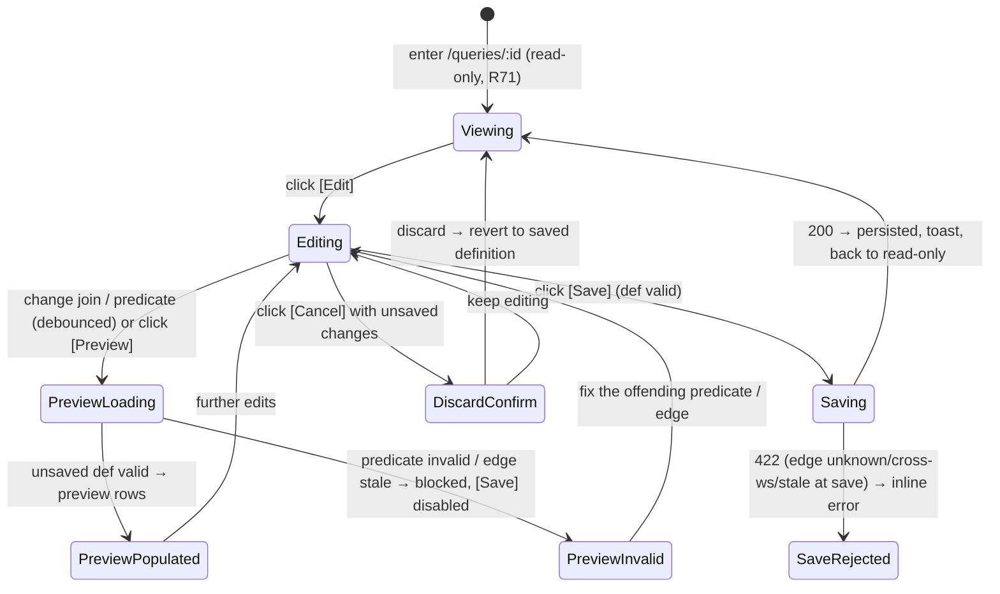

# Query Construction — the interactive builder: edit a Query's definition + preview before save

> ⚠️ **OUT OF SYNC** — `design-sync --check` (2026-06-17) found this doc has drifted from the
> implementation: **6 claim(s) diverge from code** (the "vestigial `datasetId`" section is fiction —
> the code reads `body.sourceId` only and `datasetId` was dropped in migration 0002; plus the rest of
> the `datasetId` → `sourceId` drift and builder-surface details). Proposed surviving **sibling** doc
> of the R83 spine. See `.agents/tmp/design-sync/queries.md`. Re-sync before trusting or designing on
> it: run `design-sync .agents/design/data-management/queries`.
<!-- design-sync:out-of-sync domain=data-management/queries detected=2026-06-17 claims=6 -->

**Concept**: the **construction surface** is the third construction mode of a
[Query](saved-query.md): an **editable mode of the existing query-mode detail**
that lets a user **build** a Query's definition — change its
[join](joins.md) edge and compose **cross-source predicates** over the combined
column space — and **preview** the resulting rows **before saving**. It is **not a
new noun and not a new page**: it adds an **Edit mode** to the
`/data-management/queries/:id` detail R69 + R71 shipped, reusing the same shells,
the same predicate vocabulary, and the same `query_joined_rows` /
`query_dataset_rows` engines. R72 ships the **minimal editable builder** for a
**single** join + cross-source predicates; the multi-join **canvas** is **R73**
([Round_72](../../../plan/cycles/Round_72.md) J-1′).

**Status**: Accepted — **shipped R72** (DFCFBI: D → F1 → C → F2 → B → I), then
**reconciled to the as-built** after human review (the O-rule /
[purpose.md](../../../context/purpose.md) #7 truth-check). The design was sealed at
the Design gate (J-2: seal-then-STOP); the F1 prototype + the human's hands-on
review then **moved several interaction choices**, and this doc now describes
**what shipped**, not the pre-build seal. The round's risk axis was **UX /
interaction**, not model (the join model is twice-validated, R71) — so F1 was the
valve, and F1 is exactly where the build diverged from the seal.

> **As-built deltas from the Design-gate seal (reconciled here).** ① **Layout** —
> not a single stacked view but **two collapsible sections, Build + Preview** (both
> open by default; collapse Build to give the preview full height on short
> screens). ② **Filters** — not a separate "add filter" row but **per-column
> funnels in the preview table headers** (`<PagedRowsView renderHeaderExtra>`, the
> dataset-detail pattern), so Build stays compact for wide joined results.
> ③ **Actions** — `[Cancel] [Save]` live in the **page header** (the app's
> header-actions convention; state lifted into a `useQueryBuilder` hook); the
> sealed `⬤ Editing` chip was dropped. ④ **Preview** is **debounced (300ms)** with
> an explicit **`[Preview]`** flush and a **user-controllable items-per-page**
> (`10 / 25 / 50 / 100`). ⑤ **J-3 resolved** → a **stateless `POST
/workspaces/{id}/queries/preview`** (below). ⑥ The dataset-page entry is
> **"Save filters as Query"** and **"Join with related dataset"** moved into the
> `Actions ▾` menu ([dataset-detail.md](../datasets/dataset-detail.md)).
> _A tabs layout was tried during F1 and **reverted** — tabs break live preview
> (edit → switch → check → switch back); collapsible sections keep it live._
>
> **R77 extends this builder with a CREATE mode (the create lifecycle, J-3).**
> R72→R76 made the builder **edit-only**: it always opens on an **existing** saved
> Query (seeded from `query.definition`, Save = `PUT` definition-only). R76 shipped
> the composed source model + engine + the **"Build on" base picker**, but the FE
> **create** path never sent `sourceId` — so a composed Query could only be built /
> run **once it already existed**; a first-time user **could not save a new composed
> Query from the UI**. R77 closes that with a **create mode** of this same builder:
> no `id`, a **preset base** (`sourceId` = the saved Query you chose to build on),
> **name capture at Save** (the reused `SaveQueryModal`), and **Save = `POST`**
> carrying `{ name, datasetId, sourceId, definition }` → the new `qr_` detail. The
> entry verb **"Build on this query"** lives on the Query detail header
> ([saved-query.md § Build on this query](saved-query.md#build-on-this-query-r77-the-create-entry)).
> **No model / contract / engine change** — R76's create handler already accepts
> `sourceId` and the unified `ds_`/`qr_` resolver already runs a composed source
> ([composition.md](composition.md)); R77 is the **FE create-lifecycle** half. See
> [§ Create mode (R77)](#create-mode-r77-build-a-new-query-on-a-preset-base).
> _(Status: **Design** — R77, run-straight-through per its J-2; the build chain is
> chosen by `flow-selector` at the Design gate.)_

**Round introduced**: [Round_72](../../../plan/cycles/Round_72.md) — the fourth
step of the critical path (`data → relationships → joins → **construction** →
dashboards`); it fills the
[query-builder.md trajectory](query-builder.md#the-trajectory-what-queries-grows-into)
step reserved as **"R72 construction surface"**, and closes two deferrals at once:
R71 J-1 (the interactive join-construction surface) **and** R69's deferred
[edit-a-saved-query's-predicates](saved-query.md#scope-boundary) (_"Trigger: a
user repeatedly re-saves near-identical queries to tweak one predicate"_).
**Domain folder**: `data-management/queries/` — a **mode** sibling of
[saved-query.md](saved-query.md) (single-source create) and
[joins.md](joins.md) (join execution) under the
[query-builder.md](query-builder.md) anchor; **not** a parallel page.
**Sibling docs**:
[query-builder.md](query-builder.md) (the domain anchor whose R72 trajectory step
this fills; the [reuse invariant](query-builder.md#the-reuse-invariant-the-one-rule-this-domain-holds)
this obeys),
[saved-query.md](saved-query.md) (owns the base `QueryDefinition`, the
single-source predicate surfaces this makes editable, and the `query_stale` gate),
[joins.md](joins.md) (owns the `QueryDefinition.join` step, `query_joined_rows`,
`resolvedColumns`, and the `409 relationship_stale` gate this builder edits +
previews against; its **read-only** join summary becomes this builder's
**editable** join editor),
[dataset-filters.md](../datasets/dataset-filters.md) +
[advanced-query.md](../datasets/advanced-query.md) (the chip + advanced-DNF
predicate **editors** reused verbatim — now bound to `resolvedColumns`),
[dataset-detail.md](../datasets/dataset-detail.md) (owns `<PagedRowsView>`, reused
for the live preview),
[crud-hygiene.md](../_shared/crud-hygiene.md) (the discard-changes confirm
pattern),
[workspace-shell.target.md](../../_platform/workspace-shell.target.md) (the chrome
all surfaces render inside).

> **Why a mode, not a noun (the noun-vs-mode check).** Building a Query introduces
> **no new readable-table-source kind** and **no new engine** — it edits the
> `QueryDefinition` [joins.md](joins.md) sealed and runs the engines R71 shipped.
> So it **extends the detail with an Edit mode** rather than minting a `/builder`
> page or a `QueryBuilder` noun (the discarded-R69 trap). What is genuinely new is
> only the **edit + preview UX**, named honestly below — never laundered as a new
> capability.
> _Track: 1 (product feature). Pulled by ← R71 J-1 deferral + R69's deferred
> "edit a saved query's predicates" +
> [query-builder.md](query-builder.md) trajectory +
> [purpose.md](../../../context/purpose.md) critical path / key decision #4._

---

## What is genuinely new vs. reused (the honest split)

R72 adds **construction UX over a sealed model + shipped engines**. Naming the
split up front (the [specious-discipline](../../../memory/2026-06-13-specious-model-lock-in.md)
habit R71 used) keeps the build from re-inventing anything:

| Reused verbatim (the true half)                                                                                                                                                         | Genuinely NEW (the edit + preview UX only)                                                                     |
| --------------------------------------------------------------------------------------------------------------------------------------------------------------------------------------- | -------------------------------------------------------------------------------------------------------------- |
| The `QueryDefinition` shape (`q` / `filters` / `advanced` / `join`) — **edited, not extended**                                                                                          | An **Edit mode** on `/queries/:id` (a builder panel; the read-only summaries become editable controls)         |
| The chip-filter + advanced-DNF **editors** ([dataset-filters.md](../datasets/dataset-filters.md) / [advanced-query.md](../datasets/advanced-query.md)) and their serializers/validators | Those editors **bound to `resolvedColumns`** (the combined `left ++ right` space) when a join is present       |
| R71's eligible-relationships `<Select>` (from `JoinWithRelatedModal`) + the `JoinSummary` read view                                                                                     | A **join editor** (change / clear the single `rel_` edge in place) — the same `<Select>`, now mutating the def |
| `query_joined_rows` / `query_dataset_rows`, `resolvedColumns`, the `409 query_stale` / `409 relationship_stale` gates                                                                   | A **stateless preview run** of the **unsaved** definition (the J-3 contract question — _not_ a new engine)     |
| `<PagedRowsView>`, the `RowsPage` shape, the `<DeleteConfirmModal>` confirm pattern                                                                                                     | A **dirty-state / Save / discard** lifecycle on the detail (validate-on-save reused from R71's create guard)   |

**No new model. No new predicate engine. No new join engine.** The one new
_backend_ concern is whether previewing an **unsaved** definition needs a
stateless endpoint — flagged as **J-3** for the Contract gate, not pre-decided.

---

## The model — unchanged; the builder edits it

R72 introduces **no change** to `QueryDefinition` (sealed in
[saved-query.md](saved-query.md#data-model) + [joins.md](joins.md#the-model-the-extended-querydefinition)).
The builder is a **read-write view** over the same object:

```ts
// unchanged — query-construction edits this in place, adds no field
type QueryDefinition = {
  q?: string | null;
  filters: FilterPredicate[]; // chip filters — col indexes resolvedColumns when joined
  advanced: FilterPredicate[][]; // advanced DNF — same indexing rule
  join?: JoinStep; // { relationshipId, type:'inner' } — editable in this mode
};
```

- **The join editor** mutates `definition.join` (set to a chosen valid `rel_`, or
  cleared back to a single-source Query). Changing/clearing the join **recomputes
  the effective column space** (`resolvedColumns`), so the predicate editors
  re-bind to the new column list — predicates that referenced a now-absent column
  surface as invalid **in the builder** (caught before save), mirroring the
  run-time `query_stale` rule.
- **The predicate editors** are the **shipped** chip + advanced-DNF surfaces,
  unchanged in vocabulary; only their **column source** is `resolvedColumns` (the
  combined, collision-qualified list) instead of one dataset's columns. R71 already
  proved predicates resolve over this combined space (side-qualified at execution).

---

## Surfaces — layer / reuse / purity declaration

> R72 ships the **minimal** editable builder (J-1): edit one join + cross-source
> predicates, preview, save. The multi-join **canvas / source graph** is **R73**.

| Surface                                                                  | Layer                                                | Reusability         | Purity   | Allowed peer deps                  |
| ------------------------------------------------------------------------ | ---------------------------------------------------- | ------------------- | -------- | ---------------------------------- |
| `QueryDetailPage` (Edit toggle; header `[Cancel] [Save]`)                | `apps/builder/src/features/data-management/queries`  | feature             | feature  | react, antd, @tanstack/react-query |
| `QueryBuilderPanel` (NEW: presentational, collapsible Build/Preview)     | `apps/builder/src/features/data-management/queries`  | feature             | feature  | react, antd                        |
| `useQueryBuilder` hook (NEW: builder state + preview + Save lifecycle)   | `apps/builder/src/features/data-management/queries`  | feature             | glue     | @tanstack/react-query, antd        |
| `JoinEditor` (NEW: change/clear the `rel_` in place)                     | `apps/builder/src/features/data-management/queries`  | feature             | feature  | react, antd                        |
| chip-filter + advanced-DNF editors (reused, not owned)                   | `apps/builder/src/features/data-management/datasets` | feature (by reuse)  | feature  | react, antd                        |
| `<PagedRowsView>` (reused; preview body **+ per-column filter headers**) | `apps/builder/src/features/data-management/_shared`  | shared cross-domain | plain-ui | react, antd, react-i18next         |
| `preview` + `update` routes (NEW backend, **shipped**)                   | `apps/backend/app/routers/queries.py`                | backend             | feature  | (reuses `query_joined_rows`)       |
| `QueryCreatePage` (R77: create mode at `/queries/new?base=qr_…`; reuses the panel) | `apps/builder/src/features/data-management/queries`  | feature             | feature  | react, antd, @tanstack/react-query |
| `useQueryBuilder` (R77: extended with a CREATE mode — no-id, preset base, Save=`POST`) | `apps/builder/src/features/data-management/queries`  | feature             | glue     | @tanstack/react-query, antd        |
| `SaveQueryModal` (reused, not owned — R69; the create name-capture step)  | `apps/builder/src/features/data-management/queries`  | feature (by reuse)  | feature  | react, antd                        |
| `useCreateQueryMutation` (reused, not owned — R69; the create `POST`)     | `apps/builder/src/features/data-management/queries`  | feature (by reuse)  | glue     | @tanstack/react-query              |

**Boundary check**: the only shared-cross-domain row (`<PagedRowsView>`) is
**reused, not owned** ([dataset-detail.md](../datasets/dataset-detail.md)). The
predicate editors are **reused by reference** from the datasets feature (their
boundary lives in [dataset-filters.md](../datasets/dataset-filters.md) /
[advanced-query.md](../datasets/advanced-query.md)) — the builder **composes**
them over `resolvedColumns`, never re-implements them. `JoinEditor` reuses R71's
eligible-relationships `<Select>`. No builder surface re-implements a dataset /
query page or a predicate / join engine.

---

## Token map

The builder surfaces are AntD primitives (`<Select>`, `<Button>`, `<Tag>`,
`<Alert>`, `<Segmented>` for view/edit, `<Table>` via `<PagedRowsView>`, the
reused chip/advanced editors) styled by the `<ConfigProvider>` tokens derived from
the six seeds in
[`themeTokens.ts`](../../../../workspace/packages/ui/src/themeTokens.ts) (the
source of truth — R66). **No new token is introduced**; the map reuses the
identifiers already cited by [saved-query.md](saved-query.md) and
[joins.md](joins.md). `Value` is informational.

| Surface                                        | AntD token (themeTokens.ts) | Value (informational) |
| ---------------------------------------------- | --------------------------- | --------------------- |
| Page background                                | `colorBgLayout`             | `#f5f5f5`             |
| Builder panel card background                  | `colorBgBase`               | derived               |
| `[Edit]` / `[Save]` / primary action           | `colorPrimary`              | `#1677ff`             |
| Editable join / predicate `<Tag>` text         | `colorTextSecondary`        | derived               |
| Builder section / table border                 | `colorBorderSecondary`      | `#f0f0f0`             |
| Dirty-state / unsaved-changes hint             | `colorWarning`              | `#faad14`             |
| Invalid predicate / unavailable-edge `<Alert>` | `colorError`                | `#ff4d4f`             |
| Border radius (card, table, tag, button)       | `borderRadius`              | `6`                   |
| Font family                                    | `fontFamily`                | system stack          |

Identifier parity is enforced by
[`design-token-parity.mjs`](../../../../scripts/lint/design-token-parity.mjs).

---

## Layout — ASCII intent

The builder is an **Edit mode** of the existing query-mode detail
([saved-query.md § Query mode](saved-query.md) + [joins.md § Layout](joins.md)) —
the **same** standard detail shell (`PageHeader` + `PageCard` +
`<PagedRowsView>`). A `[Edit]` action (page header) swaps to `[Cancel] [Save]`
(header) and reveals the builder: **two collapsible sections** — **Build** (join +
predicate editors) and **Preview** (the live rows). Both open by default; collapse
Build to give the preview the full height on a short screen. Per-column filters
live in the **preview table headers** (filter where you see the data).

### View mode (read-only — R71, unchanged)

```text
Home ▸ Data Management ▸ Queries ▸ Deals × Accounts              [Edit]  [Delete]
Deals × Accounts                                  🔎 Query · live re-run · join
  ┌─ Join (read-only) ─────────────────────────────────────────────────────────┐
  │  Deals  ⋈ inner ⋈  Accounts      on  account_id ↔ id      many:many          │
  └────────────────────────────────────────────────────────────────────────────┘
  ┌─ Applied predicates (read-only) ───────────────────────────────────────────┐
  │  Deals.stage = won     Accounts.region = APAC                                │
  └────────────────────────────────────────────────────────────────────────────┘
  Matched 1,204 rows   <the shared <PagedRowsView> — saved definition's rows>
```

### Edit mode (the builder — as shipped)

```text
Home ▸ Data Management ▸ Queries ▸ Deals × Accounts                  [Cancel] [Save]
Deals × Accounts                                  🔎 Query · editing (unsaved)

  ▾ Build
  ┌─ Join ──────────────────────────────────────────────────────────────────────┐
  │  Join with a related dataset                                                  │
  │  [ Deals.account_id ↔ Accounts.id   (many:many)            ▾ ]   [ Clear join ]│
  └───────────────────────────────────────────────────────────────────────────────┘
  (columns from both datasets)
  Deals.stage = won  ×    Accounts.region = APAC  ×            ← active-filter chips
  Advanced query  [ stage:won AND amount:>1000 ]
  Search          [ Match any cell…                                              ]

  ▾ Preview · 1,204 rows   ⟳        [ Preview ]      ← collapse to free screen height
  ┌────────────────────────────────────────────────────────────────────────┐
  │  Deals.id ⏷  Deals.stage ⏷ … Accounts.id ⏷ Accounts.region ⏷   ← per-col filter
  │  <the shared <PagedRowsView> — preview of the UNSAVED definition; combined │
  │   columns, duplicate names qualified; items-per-page 10 / 25 / 50 / 100>  │
  └────────────────────────────────────────────────────────────────────────┘
```

The `▾ Build` / `▾ Preview` bars are independently collapsible (both open by
default). `[Cancel] [Save]` are in the **page header**; the preview re-runs the
unsaved copy **debounced** (`[Preview]` flushes it); filters are the **shipped
chip / advanced editors**, the chips shown in Build and the per-column funnels in
the table headers.

### Invalid-edit / preview-blocked states (flag-don't-crash)

The builder surfaces drift/invalidity **before save**, reusing the run-time gate
semantics so the editing surface never shows wrong rows:

```text
  ⓧ  This predicate references “amount”, which isn’t in the joined columns.
     Remove it or pick a current column.                         (predicate invalid)

  ⚠  This join is unavailable — “account_id” no longer exists in Deals.
     Pick a different relationship, or clear the join.        (relationship_stale)
```

`[Save]` is **disabled** while any predicate is invalid or the chosen edge is
stale (the builder mirrors the server's `422` validate-on-save guard — the user
can't save a definition that wouldn't run).

---

## Behaviour — states



- **Enter Edit** — `[Edit]` flips the read-only join + predicate summaries into the
  `JoinEditor` + the reused chip/advanced editors, seeded from the **saved**
  `definition`. The detail's row body switches to **preview** of the working copy.
- **Edit the join** — the `JoinEditor` lists the source dataset's **valid**
  relationships (R71's `<Select>`); choosing one sets `definition.join`, **Clear
  join** removes it (the Query reverts to single-source) and re-binds the predicate
  editors to the new column space. When the dataset has **zero valid**
  relationships the join control is **disabled** with the same guiding tooltip R71
  declared (no dead-end empty `<Select>`).
- **Edit predicates** — the chip + advanced editors operate over `resolvedColumns`
  (combined, collision-qualified when joined; one dataset's columns when not),
  reusing the shipped serializers/validators verbatim. A predicate over a column
  not in the current space is flagged invalid **in the builder**.
- **Live preview** — the working-copy definition runs and the result fills
  `<PagedRowsView>` (auto-run on change, **debounced 300ms**; an explicit
  `[Preview]` flushes it). It runs through the **stateless `POST …/queries/preview`**
  (J-3 resolved), reusing the live-re-run engines (`query_joined_rows` /
  `query_dataset_rows`), **persisting nothing**. Preview is **paged** with a
  user-controllable items-per-page (`10 / 25 / 50 / 100`).
- **Save** — persists the working copy to the Query (the server re-validates:
  unknown / cross-workspace / **stale** edge → `422`, mirroring R71's create
  guard). Success returns to **Viewing** with the new saved definition; this is
  the first **mutate-existing-query** path (R69 was create + read; R72 adds edit).
- **Discard** — `[Cancel]` with unsaved changes asks to confirm (the
  [crud-hygiene](../_shared/crud-hygiene.md) confirm pattern), then reverts to the
  saved definition — no partial writes.
- **Create still enters via R71's modal** — `JoinWithRelatedModal` stays the
  minimal **create** entry (pick a `rel_` + name → a minimal joined Query); the
  builder is where that Query is **refined**. Create is not folded into the builder
  this round (the edit-vs-create reconciliation, J-1′): one minimal entry, one
  editable detail — no parallel create-builder path.

### Accessibility (declared here so F builds it, not infers it)

- The **`[Edit]` / `[Save]` / `[Cancel]`** actions and the **view/edit** state are
  keyboard-reachable with visible text labels (not icon-only); the editing state is
  announced (the `⬤ Editing` chip carries text, `aria-current`/`role="status"`).
- The **`JoinEditor` `<Select>`** carries a visible label ("Join with a related
  dataset", label-above per AntD Data-Entry guidance); each option names the edge in
  **text** (`Deals.account_id ↔ Accounts.id`), never colour/glyph alone; **Clear
  join** is a labelled control.
- The **predicate editors** inherit the shipped chip/advanced accessibility; column
  options read as **text** (`Deals.id` / `Accounts.id`) so duplicate names stay
  unique and screen-reader-navigable.
- The **live-preview status** ("Preview · N rows", loading, updated) is a
  `role="status"` live region; the **invalid-predicate** and **stale-edge** blocks
  are `<Alert role="alert">` whose reason is **text** (the offending column named),
  with icon + text — not a colour swatch. `[Save]`-disabled state has an accessible
  reason.
- The preview reuses `<PagedRowsView>`'s shipped table semantics; collision-qualified
  headers keep every column name unique and readable.

---

## Create mode (R77): build a new Query on a preset base

R72→R76's builder is **edit-only**: it opens on an **existing** Query, seeds the
working copy from `query.definition`, and Saves with `PUT` (definition-only).
**Create mode** is the **second mode of the same builder** — it constructs a
**brand-new** Query whose **driving source is preset** to a saved Query you chose to
build on (`sourceId = qr_…`). It is the **missing FE create-lifecycle half** of R76
([composition.md](composition.md)): the composed source model, the recursive resolver,
and the create handler's `sourceId` acceptance all **shipped R76**; R77 only makes the
UI **send** `sourceId` on create. **No model / contract / engine change** — the
design-model valve is invoked **to confirm**, not to re-open (§ Acceptance criteria).

> **Why a create MODE, not a new builder / page (the noun-vs-mode check).** A new
> composed Query is the **same readable-table-source kind** the catalog + detail +
> `<PagedRowsView>` already serve; building one introduces **no new noun and no new
> engine**. So R77 **generalizes the shipped `useQueryBuilder` from edit-only to
> edit + create** and renders it through the **same** `QueryBuilderPanel` — never a
> parallel "QueryBuilder" page (the discarded-R69 trap, the
> [reuse invariant](query-builder.md#the-reuse-invariant-the-one-rule-this-domain-holds)).
> The only genuinely-new work is the **no-id lifecycle** (preset base → name capture →
> `POST`) + the **"Build on this query" verb** ([saved-query.md](saved-query.md#build-on-this-query-r77-the-create-entry)).

### The lifecycle (J-3) — how edit-only generalizes to edit + create

`useQueryBuilder` gains a **mode**. In **create mode** there is no `query`/`id`; the
baseline working copy is the **empty definition** (`{ q: null, filters: [], advanced:
[] }`) and the **base is preset** from the entry verb, not seeded from a saved
`sourceId`:

| Concern | Edit mode (R72→R76, shipped) | **Create mode (R77, new)** |
| --- | --- | --- |
| Identity | an existing `query` (`qr_…`) | **no id** — a draft until Saved |
| Baseline | `normalize(query.definition)` | the **empty definition** (build up from nothing) |
| Driving source | seeded `query.sourceId ?? query.datasetId`; editable | **preset** `sourceId = the source Query's qr_`; the base picker is seeded to it |
| `workspaceId` / `datasetId` | from `query` | from the **source Query** (`base.workspaceId`; `datasetId = base.datasetId`, the legacy NOT-NULL field — see below) |
| Live preview | the composed `POST …/preview` (already branches on a `qr_` base — **unchanged**) | the **same** composed preview, keyed on the preset base |
| Name | unchanged (`PUT` is definition-only) | **captured at Save** via the reused `SaveQueryModal` |
| Save | `PUT /queries/{id}` `{ definition }` | **`POST /workspaces/{id}/queries`** `{ name, datasetId, sourceId, definition }` via `useCreateQueryMutation` → navigate to the new `qr_` detail |
| Gate | `canSave = dirty && previewOk && …` | `canSave = previewOk && !pending && invalidCount === 0` **+ a non-empty name** (no `dirty` baseline — nothing saved to diverge from; a base + zero edits is a valid, if trivial, composed Query) |

**The vestigial `datasetId` on a composed create (a real grounding, named honestly).**
The backend create handler still **requires a valid `datasetId`** in the workspace
(`queries.dataset_id` is the legacy `NOT NULL` column; `source_id` was added
**additively** at R76 — the `datasetId → sourceId` rename is a **deferred named
cleanup**). A "Build on this" create therefore sends **`datasetId = base.datasetId`**
(the source Query always has one) **and** **`sourceId = base.id`** (the `qr_` that
actually drives the composed run — `source_id = body.sourceId or body.datasetId`
server-side). This needs **no contract change**: R76's `CreateQueryBody` already
carries the optional `sourceId`; only the FE `CreateQueryRequest` type is **widened to
match the YAML** (a request-only alignment, not a wire change).

### Routing + entry

- **Entry**: the **"Build on this query"** verb on the Query detail header (owned by
  [saved-query.md](saved-query.md#build-on-this-query-r77-the-create-entry)) opens the
  builder in create mode with the current Query preset as the base.
- **Home**: a **base-gated create route — `/data-management/queries/new?base=qr_…`** —
  reachable **only** via the verb (no nav item, no empty source picker). It is **not**
  the deferred standalone "New query" surface (that ships with the canvas, built right —
  [[dont-mvp-rush-a-roadmap-home-surface]]); it is the create lifecycle's URL home, so a
  refresh / deep-link / back-button work (the durability a transient overlay lacks).
  _Home/mechanism sealed loosely (build-first, [[design-altitude-vs-build-home]]): the
  build may render create mode as a transient builder over the catalog/detail instead if
  that proves simpler — the deviation is flagged at the gate commit; the **intent** (a
  base-preset, no-id, name-then-`POST` lifecycle) is what's sealed._

### States (create mode)


- **A new node cannot self-cycle.** The create draft has no id, so nothing composes
  it — a *direct* `composition_cycle` is structurally impossible at create. What the
  create path **does** surface pre-save is the **base's own** resolve failure: if the
  chosen base is deleted, unrunnable, transitively cyclic, or its edge/predicate
  drifted, the **composed preview** returns the existing `409`
  (`composition_cycle` / `relationship_stale` / `query_stale`), the builder renders the
  guided **base-unavailable** state, and **`[Save]` stays disabled** (you cannot save a
  query whose base won't run). The server re-validates on `POST` (`422` for a bad atom /
  unknown dataset; `409 composition_cycle` if a base loops) — flag-don't-crash, mirroring
  the edit-mode and run-time gates ([composition.md § states](composition.md#behaviour-states)).
- **Name capture mirrors "Save filters as Query".** `[Save]` opens the reused
  `SaveQueryModal` — name input (`maxLength` = `QUERY_MAX`, `showCount`, Save disabled
  until the trimmed name is non-empty), a read-only "Source: «base query» · «workspace»"
  line, and the inline `409 name_taken` error pattern. One create rhythm, not two: both
  "Save filters as Query" and "Build on this" route through `SaveQueryModal` +
  `useCreateQueryMutation`, so create logic is never duplicated.

### Accessibility (create mode — declared so F builds it, not infers it)

- The **"Build on this query"** action is keyboard-reachable with a **visible text
  label** (not icon-only); on activation, focus moves into the builder.
- The **preset base** is shown in the builder with a **visible, text** label naming the
  base Query (the `BaseSourcePicker` from R76, seeded + still editable), never colour or
  glyph alone; its `<OptGroup>` headings ("Datasets" / "Saved queries") stay text.
- The **name-capture modal** reuses `SaveQueryModal`'s shipped semantics: labelled
  `<Input>`, autofocus, an accessible `name_taken` error tied to the field, Save-disabled
  reason.
- The **base-unavailable** block is an `<Alert role="alert">` whose reason is **text**
  (the base named, the failure stated in plain language), icon + text — not a colour
  swatch; its actions (open base / back) are focus-order reachable.

---

## Data contract (as shipped)

R72 edits the existing `QueryDefinition` and runs the existing engines, and added
**two routes** (the open J-3 question, resolved at F1):

| Route (as shipped)                                                                                                                            | Shape                                                                                                                                                                                                                                                                                                                                                                                                                                 |
| --------------------------------------------------------------------------------------------------------------------------------------------- | ------------------------------------------------------------------------------------------------------------------------------------------------------------------------------------------------------------------------------------------------------------------------------------------------------------------------------------------------------------------------------------------------------------------------------------- |
| **`POST /workspaces/{id}/queries/preview`** ([preview.contract.yaml](../../../../workspace/packages/contracts/queries/preview.contract.yaml)) | **J-3 resolved → a stateless preview** (option (b)): body `{ datasetId, definition }` → the `RowsPage` shape **+ `resolvedColumns`** when joined, **persisting nothing**. Reuses `query_joined_rows` / `query_dataset_rows`. Mirrors the saved run's drift semantics (`409 relationship_stale` / `409 query_stale`); a structurally-bad request → `422`. Save-then-run (a) was rejected (orphan drafts; can't preview before commit). |
| **`PUT /queries/{id}`** ([put.contract.yaml](../../../../workspace/packages/contracts/queries/put.contract.yaml))                             | The builder's Save (first **mutate-existing** path). Body `{ definition }` only — **definition-only edit**; the Query's **name + source are unchanged** this round (rename deferred — see Scope), so **no `name_taken`**. Validate-on-save mirrors create (`422` for a bad atom or an unknown / cross-workspace / stale edge; `404` if absent). Returns the updated `Query` with `resolvedColumns` recomputed.                        |

- **No new error codes** — `query_stale`, `relationship_stale`, and the `422`
  envelope (shared
  [api-error.yaml](../../../../workspace/packages/contracts/_shared/api-error.yaml))
  all already exist; the builder **consumes** them at edit / preview / save time.
- **Page size is centralized** (R72): the `page_size` param + the response
  `pageSize` on `preview` (and the dataset / saved-query run) `$ref` the shared
  [pagination.yaml#/PageSize](../../../../workspace/packages/contracts/_shared/pagination.yaml)
  enum — now **`10 / 25 / 50 / 100`** (the smaller `10` keeps a paged preview usable
  on short screens). The set is single-sourced in `values.yaml` → generated
  `PAGE_SIZES` (BE + FE); adding a size is a one-line change.
- The **J-2′ unified `ds_`/`qr_` table-source resolver** stays deferred (R71): R72's
  join inputs are still two Datasets via a `rel_`; Query × Query composition is R73+.

---

## Acceptance criteria (Design gate exit)

**User journey** — as a user who has a saved (or just-created) joined Query, I open
it, click **Edit**, change which relationship it joins on and add a filter on a
column from the _other_ dataset, **see the resulting rows update live before I
commit**, then **Save** — and if I pick a predicate or edge that wouldn't run, the
builder tells me **before** I can save, rather than saving a broken query.

Each criterion maps to ≥1 future automated test across F1 / F2 / B / I (built on
the human's go-ahead, per J-2):

1. **Edit mode is a mode, not a page** _(FE)_ — `[Edit]` on `/queries/:id` reveals
   the builder in place (the same detail shell); there is **no** new `/builder`
   route and **no** copy-pasted detail page — the noun-vs-mode check.
2. **Join is editable in place** _(FE + contract)_ — the `JoinEditor` changes /
   clears `definition.join` (valid `rel_` options only); clearing reverts the Query
   to single-source and re-binds the predicate columns; a dataset with no valid
   edge disables the control with the guiding tooltip.
3. **Predicates compose over the combined space** _(FE)_ — the reused chip +
   advanced editors bind to `resolvedColumns` when joined (collision-qualified
   names) and to the single dataset's columns when not; the atom shapes round-trip
   through the shipped serializers unchanged.
4. **Live preview runs the unsaved definition** _(FE + B + I)_ — editing the join /
   a predicate updates the previewed rows (via the J-3 path) **without** persisting;
   the preview is paged and reuses `<PagedRowsView>`; mutating source data between
   two previews changes the result (live, no snapshot).
5. **Invalid edits block save, flag-don't-crash** _(FE + B)_ — a predicate over an
   absent column, or a stale chosen edge, renders the in-builder invalid/stale state
   and **disables `[Save]`**; the server `422`s a bad definition on save (mirroring
   R71's create guard) — never a saved-but-unrunnable query.
6. **Save mutates the existing Query** _(B + contract + I)_ — `[Save]` persists the
   working copy through the update path; reopening shows the new definition; the
   first edit-existing path (R69 was create+read; R72 adds mutate).
7. **Discard reverts cleanly** _(FE)_ — `[Cancel]` with unsaved changes confirms,
   then restores the saved definition with no partial write.
8. **Reuse, not duplication** _(FE)_ — the builder composes the shipped predicate
   editors, R71's relationship `<Select>`, and `<PagedRowsView>`; it re-implements
   **no** predicate engine, join engine, or detail page — the reuse invariant.
9. **Model is not re-opened** _(design assertion)_ — R72 adds **no** field to
   `QueryDefinition` and **no** new engine; it edits the sealed model and runs
   `query_joined_rows` / `query_dataset_rows`. The design-model valve is **not**
   invoked (UX risk, not model risk); the **F1 timebox** is the round's valve.
10. **Contract questions named, not pre-decided** _(design assertion)_ — the
    **J-3 preview path** (save-then-run vs. stateless `POST …/preview`) and the
    **update verb** are flagged for the Contract gate (after F1), reusing existing
    error codes; the unified resolver stays deferred.

### Create mode (R77) — acceptance criteria

**User journey (R77)** — as a first-time user looking at a saved Query, I click
**Build on this query**, the builder opens with that Query **preset as my base**, I add
a join + a filter and **see the composed rows live**, then **Save**, **name** it, and
land on the **new** query's detail running composed against current data — so I can
**create** a composed Query from the UI, not only edit one that already exists.

Each criterion maps to ≥1 future automated test across the build chain (chosen by
`flow-selector`):

1. **Create mode is a MODE of the builder, not a new page** _(FE)_ — "Build on this
   query" opens the **same** `QueryBuilderPanel` in create mode; **no** copy-pasted
   builder/page, **no** re-invented engine — the noun-vs-mode check.
2. **Base is preset, composed preview runs unsaved** _(FE + I)_ — the create draft's
   `sourceId` is preset to the source Query (`qr_`); the composed `POST …/preview`
   runs the **unsaved** draft on that base and `<PagedRowsView>` renders the
   `base.effective ++ joined.*` columns — no persistence until Save.
3. **Save POSTs `sourceId` → a new composed Query** _(FE + contract + I)_ — `[Save]`
   captures a name and `POST`s `{ name, datasetId: base.datasetId, sourceId: base.id,
   definition }`; a `qr_` composed Query is persisted and the user is navigated to its
   detail, which runs composed — closing R76's create gap. The wire is **unchanged**
   (R76 shipped `sourceId` on create); only the FE request type is aligned.
4. **One create rhythm (no duplication)** _(FE)_ — both "Save filters as Query" and
   "Build on this" route through `SaveQueryModal` + `useCreateQueryMutation`; name
   capture, `name_taken`, and the `POST` are **not** duplicated.
5. **An unrunnable base is flagged pre-save, not crashed** _(FE + B)_ — a deleted /
   unrunnable / transitively-cyclic / stale base makes the composed preview `409`, the
   builder renders the guided **base-unavailable** state and **disables `[Save]`**; on
   `POST` the server re-validates (`422` bad atom; `409 composition_cycle`) — never a
   saved-but-unrunnable composed Query.
6. **Model is not re-opened** _(design assertion)_ — R77 adds **no** field, **no**
    error code, **no** engine, **no** route; it sends `sourceId` (R76's field) on the
    create path. The **design-model confidence valve is invoked to CONFIRM** (no model
    surface re-opened) — unlike R76, which re-opened the source-reference model.

---

## Scope boundary

### IN scope (R77)

- A **create mode** of `useQueryBuilder` rendered through the shipped
  `QueryBuilderPanel`: no-id, **preset base** (`sourceId = qr_…`), the composed preview,
  **name capture at Save** (reused `SaveQueryModal`), **Save = `POST`** carrying
  `{ name, datasetId, sourceId, definition }` via `useCreateQueryMutation`, then navigate
  to the new `qr_` detail.
- The **"Build on this query"** verb (owned by
  [saved-query.md](saved-query.md#build-on-this-query-r77-the-create-entry)) + the
  base-gated `/queries/new?base=qr_…` route.
- The FE `CreateQueryRequest` widened to carry `sourceId` (request-only alignment to the
  R76 YAML; **no** wire/contract/engine change).
- The pre-save **base-unavailable** state (reusing R76's `409` gates) blocking Save.

### IN scope (R72)

- An **Edit mode** on `/queries/:id`: the `JoinEditor` (change/clear a **single**
  `rel_` edge in place) + the reused chip/advanced predicate editors bound to
  `resolvedColumns`; a **dirty/Save/discard** lifecycle.
- **Live preview** of the unsaved definition through `<PagedRowsView>` (the J-3
  run path decided at Contract); in-builder **invalid-predicate / stale-edge**
  blocking of save.
- The **update (mutate-existing-Query)** path; validate-on-save reusing R71's
  create guard; existing error codes consumed.

### OUT of scope (deferred with named triggers)

- **Multiple joins (a linear chain)** → **R73**, specified in
  [multi-join.md](multi-join.md) — the join engine's first growth past a single
  edge. The **free-form visual builder canvas / source graph** (non-linear
  topology) → **R74** (R73 J-1′). _Trigger: a Query must chain more than one
  relationship — a multi-hop join the single-edge `query_joined_rows` cannot
  express._
- **Left / right / outer joins; composite / multi-column keys; self-joins;
  cross-workspace joins** → future (R70/R71 triggers hold); R72 edits a
  **single-column, within-workspace, inner** join.
- **Query × Query composition** (a Query as a join input) → later; with it, the
  **unified `ds_`/`qr_` table-source resolver** (R71 J-2′) earns its place.
- **Workflow / complex query (YAML + polars)** → later.
- **Renaming a Query from the builder** → the name is unchanged this round; the
  builder edits the **definition** only. _Trigger: a separate rename affordance is
  pulled (it is not part of constructing a definition)._
- **Result materialization / pinned snapshots; Excel export; dashboards** →
  downstream value-out; preview + save stay live re-run.

### This concept explicitly does NOT cover

- The base `QueryDefinition` / catalog / create modal (live in
  [saved-query.md](saved-query.md)) and the join **execution** model + engine
  (live in [joins.md](joins.md)); this **edits + previews** them, it does not
  restate them.
- The predicate vocabulary internals (live in
  [dataset-filters.md](../datasets/dataset-filters.md) +
  [advanced-query.md](../datasets/advanced-query.md)).
- The governed-edge model (declare / validate / stale) — lives in
  [relationships.md](../workspaces/relationships.md); this consumes it via the join.

---

## Reference materials (read-only)

- [joins.md](joins.md) — the join-execution mode this builder edits + previews
  (`QueryDefinition.join`, `query_joined_rows`, `resolvedColumns`, the stale gate).
- [saved-query.md](saved-query.md) — the base model + the deferred
  edit-a-saved-query's-predicates this round fulfils; the `query_stale` precedent.
- [query-builder.md](query-builder.md) — the domain anchor + trajectory this fills
  (R72 construction surface).
- [specious-model-lock-in](../../../memory/2026-06-13-specious-model-lock-in.md) —
  the noun-vs-mode / honest-split discipline this doc applies.
