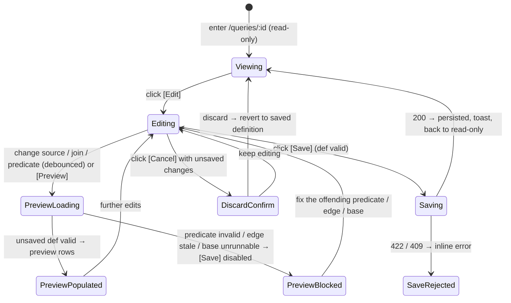

# Query Construction — the interactive builder: edit a Query's definition + preview before save

**Concept**: the **construction surface** is the editable builder for a
[Query](queries.md): an **Edit mode** of the query detail — **edit-only** — that
lets a user build a Query's definition: pick its
driving source, edit its [join tree](queries.md#joins-reading-related-datasets-as-one),
and compose **cross-source predicates** over the combined column space — and **preview**
the resulting rows **before saving**. It is **not a new noun and not a new engine**: it
edits the [`QueryDefinition`](queries.md#data-model) the spine owns and runs the spine's
`query_joined_rows` / `query_dataset_rows` / `resolve_source` engines through a stateless
preview. This doc owns the **builder UX** — layout, the edit/create lifecycle, the live
preview, and the in-builder validation — while the model, routes, and engine live in the
[queries.md spine](queries.md).

**Status**: Accepted.
**Sibling docs**:
[queries.md](queries.md) (the domain spine — the `QueryDefinition` model, all routes +
error codes (`POST …/preview` / `PUT /queries/{id}` / `POST …/queries`), the engines + the
`query_stale` / `relationship_stale` gates this builder edits against,
and the [reuse invariant](queries.md#the-reuse-invariant-the-one-rule-this-domain-holds)
this obeys),
[canvas.md](canvas.md) (the visual editor that adds a canvas view/edit mode over this
same builder — design banked, build deferred),
[dataset-filters.md](../datasets/dataset-filters.md) +
[advanced-query.md](../datasets/advanced-query.md) (the chip + advanced-DNF predicate
**editors** reused verbatim — bound to the Query's effective columns),
[dataset-detail.md](../datasets/dataset-detail.md) (owns `<PagedRowsView>`, reused for
the live preview),
[crud-hygiene.md](../_shared/crud-hygiene.md) (the discard-changes confirm pattern),
[workspace-shell.target.md](../../_platform/workspace-shell.target.md) (the chrome all
surfaces render inside).

---

## Why a mode, not a noun

Building a Query introduces **no new readable-table-source kind** and **no new engine** —
it edits the `QueryDefinition` the spine seals and runs the spine's engines through a
stateless preview. So construction is an **Edit mode** of the existing detail and
catalog rather than a `/builder` page or a `QueryBuilder` noun. What is genuinely this
doc's: the **edit + preview UX**, named below — never laundered as new
capability. The reuse invariant binds it: the builder **composes** the shipped predicate
editors, the relationship/base `<Select>`s, and `<PagedRowsView>`; it re-implements no
predicate engine, join engine, or detail page.

---

## What the builder edits (reused vs new)

| Reused verbatim                                                                                                                 | New (the edit + preview + create UX only)                                                                |
| ------------------------------------------------------------------------------------------------------------------------------- | -------------------------------------------------------------------------------------------------------- |
| The `QueryDefinition` (`q` / `filters` / `advanced` / `joins`) + its `sourceId` — **edited, not extended**                      | An **Edit mode** on `/queries/:id` (there is no create mode)                                             |
| The chip-filter + advanced-DNF **editors** + their serializers/validators                                                       | Those editors **bound to the effective columns** (the combined `joins`-tree space)                       |
| The base/relationship `<Select>`s + per-hop join-type `<Select>`                                                                | The **`JoinEditor`** that mutates the `joins` tree (base source, add/remove hops, per-hop type) in place |
| `query_joined_rows` / `query_dataset_rows` / `resolve_source`; the `409 query_stale` / `409 relationship_stale` gates           | A **stateless preview** of the **unsaved** definition (`POST …/queries/preview`)                         |
| `<PagedRowsView>`, the `RowsPage` shape, `SaveQueryModal`, `useCreateQueryMutation`, the `<DeleteConfirmModal>` confirm pattern | A **dirty / Save / discard** lifecycle on the detail                                                     |

**No new model. No new engine. No new route beyond the spine's `preview` + `update`.**

---

## Surfaces — layer / reuse / purity declaration

| Surface                                                                                                | Layer                                                | Reusability         | Purity   | Allowed peer deps                  |
| ------------------------------------------------------------------------------------------------------ | ---------------------------------------------------- | ------------------- | -------- | ---------------------------------- |
| `QueryDetailPage` (Edit toggle; header `[Cancel] [Save]`)                                              | `apps/builder/src/features/data-management/queries`  | feature             | feature  | react, antd, @tanstack/react-query |
| `QueryBuilderPanel` (presentational, collapsible Build + Preview)                                      | `apps/builder/src/features/data-management/queries`  | feature             | feature  | react, antd                        |
| `useQueryBuilder` (builder state + debounced preview + Save lifecycle; **edit mode only**)             | `apps/builder/src/features/data-management/queries`  | feature             | glue     | @tanstack/react-query, antd        |
| `JoinEditor` (base-source picker + join-tree editor: ≤1-hop single edit; hop-rows + add/remove for ≥2) | `apps/builder/src/features/data-management/queries`  | feature             | feature  | react, antd                        |
| `JoinWithRelatedModal` (minimal join-create entry from a dataset)                                      | `apps/builder/src/features/data-management/queries`  | feature             | feature  | react, antd                        |
| `SaveQueryModal` (reused — name capture for save + create)                                             | `apps/builder/src/features/data-management/queries`  | feature             | feature  | react, antd                        |
| chip-filter + advanced-DNF editors (reused, not owned)                                                 | `apps/builder/src/features/data-management/datasets` | feature             | feature  | react, antd                        |
| `<PagedRowsView>` (reused; preview body + per-column filter headers)                                   | `apps/builder/src/features/data-management/_shared`  | shared cross-domain | plain-UI | react, antd, react-i18next         |

**Boundary check**: the only shared-cross-domain row (`<PagedRowsView>`) is **reused, not
owned** ([dataset-detail.md](../datasets/dataset-detail.md)). The predicate editors are
**reused by reference** from the datasets feature; the builder composes them over the
Query's effective columns, never re-implementing them. `JoinEditor` reuses the
relationship/base `<Select>`s. No builder surface re-implements a dataset/query page or a
predicate/join engine.

---

## Token map

The builder surfaces are AntD primitives (`<Select>`, `<Button>`, `<Tag>`, `<Alert>`,
`<Collapse>`, `<Table>` via `<PagedRowsView>`, the reused chip/advanced editors) styled by
the `<ConfigProvider>` tokens derived from the six seeds in
[`themeTokens.ts`](../../../../workspace/packages/ui/src/themeTokens.ts) (the source of
truth). **No new token is introduced**; the map reuses identifiers already cited by
[queries.md](queries.md). `Value` is informational.

| Surface                                        | AntD token (themeTokens.ts) | Value (informational) |
| ---------------------------------------------- | --------------------------- | --------------------- |
| Page background                                | `colorBgLayout`             | `#f5f5f5`             |
| Builder panel card background                  | `colorBgBase`               | derived               |
| `[Edit]` / `[Save]` / primary action           | `colorPrimary`              | `#1677ff`             |
| Editable join / predicate `<Tag>` text         | `colorTextSecondary`        | derived               |
| Step-card grain line + steps hint (advisory)   | `colorTextSecondary`        | derived               |
| Builder section / table border                 | `colorBorderSecondary`      | `#f0f0f0`             |
| Step-card border                               | `colorBorderSecondary`      | `#f0f0f0`             |
| Dirty-state / unsaved-changes hint             | `colorWarning`              | `#faad14`             |
| Invalid predicate / unavailable-edge `<Alert>` | `colorError`                | `#ff4d4f`             |
| Border radius (card, table, tag, button)       | `borderRadius`              | `6`                   |
| Font family                                    | `fontFamily`                | system stack          |

Identifier parity is enforced by
[`design-token-parity.mjs`](../../../../scripts/lint/design-token-parity.mjs).

---

## Layout — ASCII intent

The builder is an **Edit mode** of the query detail — the same standard detail shell
(`PageHeader` + `PageCard` + `<PagedRowsView>`). An `[Edit]` action (page header) swaps to
`[Cancel] [Save]` and reveals the builder as **two collapsible sections** — **Build**
(source + join editor + predicate editors) and **Preview** (the live rows). Both open by
default; collapse Build to give the preview full height on a short screen. Per-column
filters live in the **preview table headers** (filter where you see the data).

The preview renders `<PagedRowsView scrollMode="flow">` — a **peek**: the table flows
(no inner scroll), the page scrolls, and the pager sits at the natural end ("scroll to the
end"). This is the deliberate opposite of the **view tables** (dataset detail / query view),
which use `scrollMode="contained"` + `PageContainer fill="bounded"` for a fixed header and a
viewport-pinned pager — see [dataset-detail.md](../datasets/dataset-detail.md). Giving the
preview _more_ space (maximize / a dedicated tab) is a separate, deferred concern.

### View mode (read-only)

```text
Home ▸ Data Management ▸ Queries ▸ Deals × Accounts              [Edit]  [Delete]
Deals × Accounts                                  🔎 Query · live re-run · join
  ┌─ Join (read-only) ─────────────────────────────────────────────────────────┐
  │  Deals  ⋈ inner ⋈  Accounts      on  account_id ↔ id      many:many          │
  └────────────────────────────────────────────────────────────────────────────┘
  ┌─ Applied predicates (read-only) ───────────────────────────────────────────┐
  │  Deals.stage = won     Accounts.region = APAC                               │
  └────────────────────────────────────────────────────────────────────────────┘
  Matched 1,204 rows   <the shared <PagedRowsView> — saved definition's rows>
```

### Edit mode (the builder)

```text
Home ▸ Data Management ▸ Queries ▸ Deals × Accounts × Owners        [Cancel] [Save]
Deals × Accounts × Owners                          🔎 Query · editing (unsaved)

  ▾ Build
  ┌─ Source ─────────────────────────────────────────────────────────────────────┐
  │  Build on:  [ Deals (dataset)                                          ▾ ]    │  ← base: ds_ or qr_
  └───────────────────────────────────────────────────────────────────────────────┘
  ┌─ Joins ──────────────────────────────────────────────────────────────────────┐
  │  Deals  ⋈ [inner ▾]  [ Deals.account_id ↔ Accounts.id  (many:many)     ▾ ]    │
  │  Accounts ⋈ [left ▾] [ Accounts.owner_id ↔ Owners.id  (many:one) ▾ ]  [Remove]│  ← leaf
  │  [ + Add a join ]   from: [ Owners ▾ ]   (a left-source for 2+ in-graph nodes) │
  └───────────────────────────────────────────────────────────────────────────────┘
  (columns from all sources)
  Deals.stage = won  ×    Owners.region = APAC  ×            ← active-filter chips
  Advanced query  [ stage:won AND amount:>1000 ]      Search [ Match any cell… ]

  ▾ Preview · 1,204 rows   ⟳        [ Preview ]      ← collapse to free screen height
  ┌────────────────────────────────────────────────────────────────────────┐
  │  Deals.id ⏷  Deals.stage ⏷ … Owners.region ⏷       ← per-col filter funnels │
  │  <the shared <PagedRowsView> — preview of the UNSAVED definition; combined │
  │   columns, duplicate names qualified; items-per-page 10 / 25 / 50 / 100>  │
  └────────────────────────────────────────────────────────────────────────┘
```

The `▾ Build` / `▾ Preview` bars are independently collapsible. `[Cancel] [Save]` live in
the page header; the preview re-runs the unsaved copy **debounced** (`[Preview]` flushes
it). The `JoinEditor` renders a single-edge affordance for ≤1 hop and hop-rows with a
left-source `<Select>` + per-hop type + add/leaf-remove for ≥2 (the spine's join tree).

### Transform — the ordered operations editor (`StepsEditor`)

> This section is a reconciliation to the code ([[design-docs-are-source-code]]) — the
> `StepsEditor` shipped over many rounds with no design-doc home until it was backfilled here.

A **`▾ Transform`** bar under `▾ Build` (`steps.section` — VN **Biến đổi**; rendered by
`TransformSection`) holds `definition.steps` — the **ordered** operations applied
after the source/join/filter resolve ([queries.md § Transform steps](queries.md)). Each step is
a card: `{n}. {kind label}` + `[↑] [↓] [🗑]` + a per-kind body. `[+ Add step]` is a `<Select>` of
kinds. The column space is threaded client-side by `threadColumns` (`steps.ts`, a pure mirror of
the backend `_step_plan`), so **each card's pickers offer exactly the columns that exist at that
position** — the backend re-validates on preview/save and stays the source of truth.

```text
  ▾ Transform
  ┌─ 1. Group & aggregate ──────────────────────────── [↑] [↓] [🗑] ┐
  │  Group by [ agent × ] [ team × ]   Measure [ Count rows ▾ ]      │
  └──────────────────────────────────────────────────────────────────┘
  ┌─ 2. Group value ────────────────────────────────── [↑] [↓] [🗑] ┐
  │  Measure      Within each        New column name                 │
  │  [ Average of ▾ ] [ rate ▾ ]   [ team × ]   [ team_rate      ]   │
  │  ⓘ Each row here is one agent × team. This averages agents —     │
  │     not the rows underneath them.                                │
  └──────────────────────────────────────────────────────────────────┘
  [ Add step ▾ ]
```

**Labels, not sentence chrome.** Every control carries a **visible `FieldLabel` above** it (the
AntD Data-Entry label-above convention the sibling cards already use), not an inline reading
sentence: the reused `steps.measure` **Measure** / VN **Giá trị đo** over the agg + column pair
(verbatim from the `aggregate` card — one vocabulary, not a lookalike), a new
`steps.withinEach` **Within each** / VN **Trong từng nhóm** over the group multi-`<Select>`, and
the reused `steps.newColumn` **New column name** / VN **Tên cột mới** over the name `<Input>`. The card still _reads_ as a sentence left-to-right; the labels are what make it
navigable and screen-reader-addressable.

#### The within-group column

The step kind is **`group_column`** on the wire; the user never sees that word, nor "window
function", nor "partition".

|              | EN                                                   | VN                                                           |
| ------------ | ---------------------------------------------------- | ------------------------------------------------------------ |
| Kind label   | **Group value**                                      | **Giá trị theo nhóm**                                        |
| The sentence | `[Average of ▾] [rate ▾]` **within each** `[team ×]` | `[Trung bình của ▾] [rate ▾]` **trong từng nhóm** `[team ×]` |
| New column   | _New column name_ (reused `steps.newColumn`)         | _Tên cột mới_                                                |

- **The agg picker reuses the shipped measure vocabulary verbatim** — `sumOf` / `avgOf` /
  `minOf` / `maxOf` / `countDistinct` / `countRows`, the same labels the `aggregate` card
  uses, with the same dtype-gated column options (`isNumericCol` / `isOrderableCol`). One
  vocabulary, two placements: **"Group & aggregate" collapses the rows; "Group value" keeps
  them.**
- **`within each` takes ≥1 column** (a multi-`<Select>` over the columns at this step). It is
  **not optional** — "across everything" (`% of total`) is the ordered-window family's.
- **Output** appends one column; the row count is visibly unchanged in the preview.

#### How the surface answers "pooled or per-member?" — without asking

The two readings of _"the team's average"_ (all the underlying rows pooled, vs the average of
the already-grouped values) differ by **where the step sits**, not by a parameter. The design
choice at this gate is therefore: **no `basis` field.** A parameter would give two ways to say
one thing, and would contradict the ordered-operations rule the whole concept rests on.

What makes the choice legible instead is a **grain line** on every `group_column` card — one
sentence naming _what one row means at this position_, derived from the step list alone (no
data, no extra wire field):

- If a collapsing `aggregate` precedes this step, one row is one of its `dimensions`:
  **"Each row here is one `agent × team`. This averages agents — not the rows underneath
  them."** (VN: _"Mỗi dòng ở đây là một `agent × team`. Phép này lấy trung bình theo agent —
  không phải các dòng bên dưới."_)
- If none does, one row is one source row: **"Each row here is one row of your source data."**
  (VN: _"Mỗi dòng ở đây là một dòng dữ liệu gốc."_)

Moving the card with `[↑]`/`[↓]` past an `aggregate` **rewrites the grain line**, so the two
readings are one keystroke apart and each is named in business words at the moment of choosing.
The column pickers reinforce it for free: before the aggregate only raw columns are offered,
after it only the grouped ones.

**This is the round's primary risk made testable** — if the human cannot tell which reading
they got from the grain line alone, the round has moved the complexity rather than removed it,
green gates notwithstanding ([Round_162 § Risks](../../../plan/cycles/Round_162.md)).

#### Card states (declared so F builds them, not infers them)

The reorder gesture is the affordance, so **its failure mode is part of the affordance.**

| State                   | Built?             | When                                                                                                  | What the card shows                                                                                                                                                                                                                                                                                                                    |
| ----------------------- | ------------------ | ----------------------------------------------------------------------------------------------------- | -------------------------------------------------------------------------------------------------------------------------------------------------------------------------------------------------------------------------------------------------------------------------------------------------------------------------------------- |
| **Normal**              | ✅ built           | every reference resolves at this position                                                             | the sentence + the grain line                                                                                                                                                                                                                                                                                                          |
| **Orphaned by a move**  | ✅ built           | `[↑]` past an `aggregate` would leave `col` / a `within each` column non-existent at the new position | the move still happens (never trap the user mid-thought); the card renders `<Alert role="alert">` naming the column(s) — _"`rate, team` doesn't exist this early. Move this card back down, or pick a column that does."_ — and **`[Save]` is disabled** by the existing invalid-edit gate (the preview 422s, so `previewOk` is false) |
| **Nothing to offer**    | ✅ built           | no column at this position satisfies the chosen agg's dtype rule                                      | the column `<Select>` is disabled with a guiding tooltip naming why (the same shape as the join editor's no-eligible-edge control, acceptance #2)                                                                                                                                                                                      |
| **Name collision**      | ✅ built           | `name` already exists at this position (`column_exists`)                                              | inline field error on the name `<Input>`, tied to the field via `aria-invalid` + `aria-errormessage` — never a page-level alert                                                                                                                                                                                                        |
| **Repeat group column** | ✅ by construction | the same column picked twice in `within each` (`duplicate_group_column`)                              | unreachable by construction — the multi-`<Select>` cannot repeat a value; the backend check stays as the wire-level backstop                                                                                                                                                                                                           |

The first two are the ones the reorder gesture creates; the last three mirror the 422 vocabulary
[queries.md § Transform steps](queries.md) already declares, rendered **at the card**, never as a
page-level error.

> **All five states are built.** Each mirrors a server guard rather than inventing a second
> vocabulary — `groupColumnIssues()` in `steps.ts` computes them from the threaded column space,
> and the backend re-validates on preview/save regardless.
>
> **Why the card-level alert earns its place**, confirmed on the live stack: the **preview**
> path maps _every_ bad step to `409 query_stale` (uniform
> across `derive` / `date_bucket` / `group_column` — not a `group_column` quirk). Only the
> **save** path returns the precise 422 (`column_exists: 'agent' is already a column`). So
> without the card state, a user who reorders into an invalid position sees only "stale" and is
> never told _which_ column moved out of reach.

### The ordered-window family — share · running total · rank · previous period

The wire kind is **`window_column`** with an **`op`** discriminator. **The user never picks the
kind.** `[Add step ▾]` gains **four entries**, one per op, each a business phrase; the card's
title is that op's label, and a `[What ▾]` picker on the card switches between them. This is
deliberately unlike `group_column`, which needed a kind label ("Group value") because it _is_ one
operation — four operations hidden behind one abstract category would be a findability tax on a
player who is looking for the words _"running total"_.

```text
  ▾ Transform
  ┌─ 3. Previous period's value ────────────────────── [↑] [↓] [🗑] ┐
  │  What            Value      In order of      per                │
  │  [ Previous ▾ ]  [ calls ▾ ] [ month ▾ ]    [ Month ▾ ]         │
  │  Within each              New column name                       │
  │  [ agent × ]              [ prev_calls              ]           │
  │  ⓘ Each row here is one agent × month. Rows were already        │
  │     filtered by status, so this covers only those rows.         │
  └──────────────────────────────────────────────────────────────────┘
```

| op              | EN                          | VN                      | fields shown                                                              |
| --------------- | --------------------------- | ----------------------- | ------------------------------------------------------------------------- |
| `pct_of_total`  | **Share of total**          | **Tỷ trọng**            | Value · Within each · New column name                                     |
| `running_total` | **Running total**           | **Lũy kế**              | Value · In order of · Within each · New column name                       |
| `rank`          | **Rank in group**           | **Xếp hạng trong nhóm** | In order of · Within each · New column name                               |
| `prior_period`  | **Previous period's value** | **Giá trị kỳ trước**    | Value · In order of (a date column) · per · Within each · New column name |

New field labels: **In order of** / VN **Theo thứ tự** (`thứ tự` is already this corpus's word for
ordering); **Across everything** / VN **Trên toàn bộ** for the empty-group state (`toàn bộ` is
already the corpus's word for "the whole" — cf. `rangeFull` = _"(toàn bộ)"_). The **per** control
reuses `date_bucket`'s `granularity_*` labels **verbatim** — one period vocabulary, two steps.

**`[Add step ▾]` gains groups, because four new entries break a flat list.** The menu is a flat
8-option `<Select>` would become **12**, of which **five append a column**. A flat twelve
is a scan, not a choice. The options become three AntD `<OptGroup>`s — the same `<OptGroup>`
mechanism the base/join `<Select>`s already use, so this is reuse, not a new pattern:

| Group | EN                   | VN                    | contains                                                                                                               |
| ----- | -------------------- | --------------------- | ---------------------------------------------------------------------------------------------------------------------- |
| 1     | **Summarise**        | **Tổng hợp**          | Group & aggregate                                                                                                      |
| 2     | **Add a column**     | **Thêm cột**          | Group value · Share of total · Running total · Rank in group · Previous period's value · Computed column · Date bucket |
| 3     | **Shape the result** | **Định hình kết quả** | Filter result · Top N · Sort · Select columns                                                                          |

Group 2 leads with the **five within-group/ordered ops** because they are what a player comes
looking for; `derive` and `date_bucket` follow as the older, more mechanical members of the same
"append a column" family. **Group headings are text**, never colour or indentation alone.

**Share of total emits a ratio (0..1), and is therefore not called "% of total".** Percent
_formatting_ is presentation and belongs to the widget. A control labelled _"% of total"_ that
produced `0.19` would be the product itself shipping a name that lies about its contents — the
exact failure this family inherits from [hand-use](../../../plan/cycles/Round_163.md). **Tỷ trọng**
names the ratio truthfully in both languages.

**Previous period walks the CALENDAR, not the rows.** On a Jan / Feb / **Apr** axis, a
row-positional read makes April silently report February's number. This op compiles to a
`RANGE … INTERVAL` frame, so a missing March makes April read **blank**. _A blank is the correct
answer to "what was the previous month" when there was no previous month_, and it is the only
reading that cannot put a confident wrong number on a dashboard.

**It emits the previous period's VALUE — not the delta, not the % change.** The comparison is one
`derive` away, and `derive` is already the formula-free binary op. Emitting a delta would bake a
subtraction direction into a column the user cannot inspect. The cost is honest: **a
month-over-month tile is two steps, not one**.

**And the card says so — the second step is offered, not assumed.** A user who wants _"vs last
month"_ and gets _"last month's value"_ has half a tile and no signal that a half is what they
have. The realised failure was exactly this shape: a human built a plausible chain with two
`derive` steps missing, and the product agreed all the way to a dashboard-ready table. So the
`prior_period` card carries **one advisory line under the grain line**, styled like it
(`colorTextSecondary`, ⓘ + text, `role="status"`, **not** an `<Alert>` — nothing is wrong):

> EN — _"This column holds last month's `calls`. To compare, add a **Computed column**:
> `calls − prev_calls`."_
> VN — _"Cột này chứa `calls` của tháng trước. Để so sánh, hãy thêm **Cột tính toán**:
> `calls − prev_calls`."_

It **names the next step in the menu's own words** so the user can find it, and interpolates the
real column names so it is not generic advice. It is **advisory only** — it never blocks Save, and
it does **not** auto-insert the `derive` step: silently adding an operation the user did not ask
for is the opposite of the ordered-operations concept. This is the one op that gets such a line,
because it is the one whose output is a _component of_ the answer rather than the answer.

**The Computed column card's second operand is a labelled two-button radio group**
(`Radio.Group optionType="button" buttonStyle="solid"`, under the `Second value` `FieldLabel`) —
by-column or by-number. It took two rounds and both halves matter: R165 gave it the label, which
made it **findable**; the re-walk still could not tell it was **pressable**, because antd's
`Segmented` paints the selected item as a white raised thumb and the step card is white, so the
only shaded half was the *un*selected one. Boxing both halves makes the control read as a switch
from either state. _Worth generalising past this card: on a white surface, `Segmented`'s selected
state is the one that disappears._

**Rank offers exactly one ranking.** Ties share a rank and the next rank skips (what "ranked 2nd"
means outside a database). Consecutive numbering is **refused on correctness grounds, not scope**:
it invents an order between genuinely equal rows, so the same query can reshuffle a tie between
runs. _Named trigger to revisit_: a real user asking for gapless numbering.

**Default names describe the operation** — `<col>_share`, `<col>_running`, `rank`, `prev_<col>` —
rather than the generic `new_column` / `bucket` / `group_value` the older steps default to. A
default that already carries a claim is the cheapest push away from a user typing one that lies.
It is a **default, not a rule**: any name is still allowed, and **no name validator is specced**
here (parked — see [queries.md § Transform steps](queries.md#transform-steps-workflows--r120r141)).

**"Across everything" is a visible state, not a blank field.** `group_column` refuses an empty
group (`group_by_required`) so a whole-table window can never arise _silently_. That reason is
about silence, not emptiness — so here the group control renders an explicit **Across everything**
state when empty, making the whole-table reading a choice the user can see and a screen reader can
announce. **`group_column`'s guard is unchanged**: one way to say a thing.

#### The grain line learns that filters narrow groups

The grain line shipped tracking one thing: the nearest preceding collapsing `aggregate`. That is
why a `filter` moved _above_ a Group value card changed no words on screen while making every rate
read **100.0%** — demonstrated on real data. It now also names the **row-narrowing steps**
(`filter`, `top_n`) that precede this position, by the columns they narrow on:

> EN — _"Each row here is one `agent × month`. Rows were already filtered by `status`, so this
> covers only those rows."_
> VN — _"Mỗi dòng ở đây là một `agent × month`. Các dòng đã được lọc theo `status`, nên phép này
> chỉ tính trên những dòng đó."_

**Both card families get the clause** — this repairs the shipped "Group value" card, not only the
new one. **Deliberately not added: a clause about ordering.** `running_total` and `prior_period`
are order-dependent, but the card already shows an **In order of** control, so the order is
visible; a sentence about it would be ceremony. One new clause, for the one invisible thing.

#### Offer-nothing at the gesture

Per the standing **D4 rule** ([`_noun-model.md`](../_noun-model.md)), an op the columns at this
position cannot satisfy is **disabled in `[Add step ▾]` and in `[What ▾]`, with a tooltip naming
why** — never an error at run. `prior_period` needs a **date/datetime** column (its producer is
`date_bucket`, so the two steps are coupled more tightly than any earlier pair); `pct_of_total` /
`running_total` need a **numeric** one; `rank` accepts any. This reuses the shipped
`noEligibleColumn` shape rather than minting a second one.

#### Card states — the ordered family

| State                             | When                                                                                      | What the card shows                                                                                                                                                  |
| --------------------------------- | ----------------------------------------------------------------------------------------- | -------------------------------------------------------------------------------------------------------------------------------------------------------------------- |
| **Normal**                        | every reference resolves at this position                                                 | the fields + the grain line                                                                                                                                          |
| **Orphaned by a move**            | `[↑]` past an `aggregate` leaves `col` / `In order of` / a group column non-existent here | the same `<Alert role="alert">` naming the column(s) as the "Group value" card, `[Save]` disabled by the existing invalid-edit gate                                  |
| **Name collision**                | `name` already exists here (`column_exists`)                                              | inline field error on the name `<Input>` (`aria-invalid` + `aria-errormessage`)                                                                                      |
| **No date axis**                  | `prior_period` chosen where no `date`/`datetime` column exists                            | the op is **unofferable** (disabled + tooltip); it cannot be reached, so there is no error state to render                                                           |
| **No previous period**            | the row's previous period has no rows                                                     | the cell reads **blank** — the correct answer, not an error (§ above)                                                                                                |
| **Gaps exist in the period axis** | at least one row has no previous period                                                   | the card's advisory line gains a clause: _"3 rows have no previous `month` — those cells are blank."_ / VN _"3 dòng không có `month` trước đó — các ô đó để trống."_ |

The first three mirror `group_column`'s states verbatim rather than inventing a second vocabulary;
the last three are this family's own. The gap COUNT needed real result rows, so it landed one
round after the rest, because an FE-on-MSW half has no real result to count.

**Why the gap state earns a row of its own — blank means two things.** _"There was no previous
period"_ and _"the previous period's value was itself empty"_ render identically, and the first is
the one a user must not misread as a data problem. Rather than mark the cell (which would put
presentation into a compute step and require a per-cell wire signal the response shape does not
carry), the **card counts them and says so** — the count is derivable from the preview the builder
already holds. **Deliberately not built**: a distinct in-cell rendering for the two cases. That is
a `<PagedRowsView>`-level concern affecting every nullable column in the product, not this step's
to invent; if it is ever wanted, it is its own pull.

#### The self-join boundary, in the Builder

The same dataset may not appear twice in one Query (a locked boundary — [`_noun-model.md`](../_noun-model.md)).
The form `JoinEditor` **already complies**: `addEligibleRels(rels, graphDatasets)` offers only
edges whose right side is not yet in the graph, so the gesture is simply absent
([JoinEditor.tsx:114](../../../../workspace/apps/builder/src/features/data-management/queries/JoinEditor.tsx#L114)).
The **canvas** does not — its free-form draw is node-level, so it lets you draw an edge that
fails later as `cyclic_join` (noun-model **D4**). Bringing the canvas to offer-nothing parity is
**not** built; it is tracked as D4.

#### Join option labels — qualify BOTH sides (decided 2026-08-10, **not yet built**)

Every relationship option and hop label reads **`<Dataset>.<column> ↔ <Dataset>.<column>`**, both
sides qualified — `Deals.account_id ↔ Accounts.id`, never a bare `account_id ↔ id`. The
cardinality suffix follows as today.

**Why both, not just the right.** An earlier version of this doc qualified only the right side, on
the reasoning that the hop row already prefixes the left (`Deals ⋈ …`). That reasoning holds for
the hop _display_ row and fails everywhere else: the single-edge `<Select>` has no left prefix,
and at the **add-a-join** picker the left-source `<Select>` renders only when 2+ sources can
branch — so in the common single-source case **neither** side is named and the actual decision,
_join to what?_, is invisible. Both-sides is also what the canvas free-form modal already shows
([canvas.md](canvas.md) — `Deals.owner_id ↔ Owners.id`), so one rule now covers every surface
instead of three context-dependent ones. Human's call, 2026-08-10.

**Built** (R171, `[F-join-label-qualify]`). `optionLabel` takes the two dataset ids alongside the
rel, so it serves both shapes — a governed `Relationship` (`…DatasetId`) in the pickers and a
query-owned one (`…SourceId`) on the hop row. The overflow question the earlier build note left
open is answered rather than hoped: each option carries an explicit `title` with the full label, so
the visible text may ellipsize in a narrow `<Select>` while the whole label stays reachable on
hover — in the dropdown **and** in the closed selection. No custom option renderer.

### Invalid-edit / preview-blocked states (flag-don't-crash)

```text
  ⓧ  This predicate references "amount", which isn't in the joined columns.
     Remove it or pick a current column.                         (predicate invalid)

  ⚠  This join is unavailable — "account_id" no longer exists in Deals.
     Pick a different relationship, or remove the join.       (relationship_stale)

```

`[Save]` is **disabled** while any predicate is invalid, an edge is stale, or the base is
unrunnable — the builder mirrors the server's validate-on-save guard, so a user can't save
a definition that wouldn't run.

**A failed preview is a fifth state, and it is not about the query** (R171, R165 W-2). An
unreachable backend produces the same three symptoms as a rejected step — no rows, `Save` off, no
message — so the panel used to let a dead server read as _"my step is wrong"_. It now carries its
own sentence (_"Couldn't reach the server… Your query is unchanged — this isn't a problem with
it"_) and, alone among these states, a **retry**: re-asking is the next action here and is useless
for the other four, where the query itself is what needs the edit.

---

## Behaviour — states



- **Enter Edit** — `[Edit]` flips the read-only summaries into the `JoinEditor` + reused
  predicate editors, seeded from the **saved** definition; the row body switches to a
  **preview** of the working copy.
- **Edit the source / joins** — the base `<Select>` picks the driving `sourceId` (a
  Dataset or a Query); `JoinEditor` adds a hop from any in-graph source (left-source
  `<Select>` when 2+ can branch), removes any leaf, and sets each hop's type. **Adding a
  hop is copy-on-pick**: picking a governed relationship copies its current join fields
  into the working copy as a query-owned `QueryRelationship` (with an `originRelationshipId`
  back-ref) and the new `JoinStep` references it by `queryRelId` — so the query carries its
  own edge snapshot, not a live `rel_` reference (see [queries.md § Joins](queries.md#joins-reading-related-datasets-as-one)).
  Editing the tree recomputes the effective columns, so the predicate editors re-bind; a
  predicate over a now-absent column flags invalid **in the builder**.
- **Edit predicates** — the chip + advanced editors operate over the effective columns
  (collision-qualified when joined; one dataset's columns when not), reusing the shipped
  serializers/validators verbatim.
- **Live preview** — the working-copy definition runs through the stateless
  `POST /workspaces/{id}/queries/preview` (auto-run on change, **debounced 300ms**; an
  explicit `[Preview]` flushes it), reusing the spine's engines and **persisting nothing**.
  Preview is paged (`10 / 25 / 50 / 100`).
- **Save (edit mode)** — persists the working copy via `PUT /queries/{id}` (**definition
  only** — name + source unchanged, so no `name_taken`); the server re-validates (a bad
  atom / unknown / cross-workspace / stale edge → `422`). Success returns to Viewing.
- **Discard** — `[Cancel]` with unsaved changes confirms (the
  [crud-hygiene](../_shared/crud-hygiene.md) pattern), then reverts to the saved
  definition — no partial writes.

---

## Create mode: deleted

The builder used to run in a **create mode** at `/queries/new?base=qr_…` (`QueryCreatePage`),
reached from `[Build on this query]`, to construct a new Query whose driving source was preset to
another saved Query. **That page, that route and that mode are gone**, and nothing replaced them
_in the builder_.

**Why a mode disappeared rather than being renamed.** Create mode existed because a
composition-created query had **no definition yet** — so it needed a page that could preview
against a base before the query existed. A **duplicate** has a complete, runnable definition the
moment it is created, so the whole apparatus is unnecessary: `[Duplicate]` → name modal → `POST` →
open the new query → `[Edit]` reaches the builder through the ordinary edit path. The replacement
is **smaller than the thing it replaces**, which is why its removal was net-negative on the front end.

The Duplicate verb, its labels, and the copy invariant are specified in the spine —
[queries.md § Duplicate](queries.md#duplicate-r166-make-a-variant-without-rebuilding-it) — because
Duplicate never enters this surface. This section exists only so a reader who remembers create mode
learns where it went instead of assuming a regression.

**What went with it**: the `?base=` route ([main.tsx](../../../../workspace/apps/builder/src/main.tsx)),
`QueryCreatePage` (180 LOC), `useQueryBuilder`'s `mode` flag and its no-id/no-baseline branch, the
`BaseUnavailable` create state, and the `queries.create.*` i18n block (EN + VN).

---

## Accessibility (declared so F builds it, not infers it)

- `[Edit]` / `[Save]` / `[Cancel]` / **`[Duplicate]`** are keyboard-reachable with
  **visible text labels** (not icon-only); the editing state is announced
  (`role="status"`). `[Duplicate]` opens the name modal, which takes focus on its **name field**
  with the default `{{name}} (copy)` **selected**, so accepting it is one keystroke and renaming
  needs no clearing gesture.
- The **base `<Select>`** and **`JoinEditor` `<Select>`s** (relationship, left-source,
  per-hop type) carry visible labels (label-above per AntD Data-Entry guidance); options
  name the edge / source / type in **text** (`Deals.account_id ↔ Accounts.id`, `inner`),
  never colour/glyph alone. **The source picker's `<OptGroup>`s are gone**: with
  "Saved queries" withdrawn, a lone "Datasets" heading labels a list that cannot contain anything
  else, so the picker is a **flat** list of datasets. A group of one is chrome, not structure;
  a disabled non-leaf `[Remove]` keeps its label and exposes its reason via tooltip
  (`aria-disabled`), so the leaf rule is discoverable.
- The **predicate editors** inherit the shipped chip/advanced accessibility; column options
  read as **text** (`Deals.id` / `Accounts.id`) so duplicate names stay unique and
  screen-reader-navigable.
- The **live-preview status** ("Preview · N rows", loading, updated) is a `role="status"`
  live region; the **invalid-predicate**, **stale-edge**, and **base-unavailable** blocks
  are `<Alert role="alert">` whose reason is **text** (the offending column / base named),
  icon + text — not a colour swatch; `[Save]`-disabled state has an accessible reason.
- The **`▾ Transform` step cards**: each card is a labelled group
  (`{n}. {kind label}`); the reorder/remove buttons are icon-only and therefore carry
  `aria-label`s (`steps.up` / `steps.down` / `steps.remove`, already shipped). Every step
  control has a **visible `FieldLabel`** _and_ an accessible name — including the
  "Group value" card's **Value** / **Within each** / **New column name**; no control relies
  on the reading-sentence order for its meaning.
- The **grain line is a live region** (`role="status"`, `aria-live="polite"`). It is the one
  thing that tells a user _which_ reading a within-group column computes, and it **changes
  when the card moves** — so a keyboard user pressing `[↑]` must hear the new grain, not
  discover it in the result. It is **icon + text** (ⓘ + sentence), never colour alone, and it
  is advisory: it is **not** an `<Alert>` and must not read as an error. There is also the
  **filter clause** to the same live region, so moving a `filter` past the card is announced by
  the same mechanism that already announces moving an `aggregate` past it.
- The **ordered-window cards** keep the same contract: every control carries a visible
  `FieldLabel` (**What** / **Value** / **In order of** / **per** / **Within each** / **New column
  name**), and the empty-group state renders the **text** "Across everything" rather than an empty
  control — a blank multi-select cannot be announced, a named state can. An op the current columns
  cannot satisfy is `aria-disabled` with its reason in a tooltip, matching the shipped
  no-eligible-column control.
- The **`[Add step ▾]` groups** are AntD `<OptGroup>`s with **text** headings (**Summarise** /
  **Add a column** / **Shape the result**) — so group membership is announced, never conveyed
  by indentation or colour. (This is the **only** grouped `<Select>` in the builder — flattening
  the source picker, whose "Datasets" / "Saved queries" pairing this used to point at. The step menu
  keeps its groups because it genuinely has three, not one.)
- The **`prior_period` advisory line** shares the grain line's contract — `role="status"`,
  `aria-live="polite"`, ⓘ + text, `colorTextSecondary`, **never an `<Alert>`**. It names the next
  step using the menu's own label ("Computed column") so a screen-reader user can find that entry,
  and it never blocks `[Save]`.
- The **orphaned-by-a-move** state is `<Alert role="alert">` naming the offending column in
  **text**, and `[Save]`-disabled carries an accessible reason — the same contract the
  invalid-predicate and stale-edge blocks already keep.
- The **name-capture modal** reuses `SaveQueryModal`'s shipped semantics: labelled
  `<Input>`, autofocus, an accessible `name_taken` error tied to the field.
- The preview reuses `<PagedRowsView>`'s shipped table semantics; collision-qualified
  headers keep every column name unique and readable.

---

## Acceptance criteria

1. **Edit mode is a mode, not a page** — `[Edit]` on `/queries/:id` reveals the builder in
   place (the same detail shell); there is **no** new `/builder` route and **no**
   copy-pasted detail page.
2. **Source + join tree are editable in place** — the base `<Select>` sets the driving
   `sourceId` (Dataset or Query); `JoinEditor` adds a hop from any in-graph source, removes
   any leaf, and sets each hop's type; editing re-binds the predicate columns; a source
   with no eligible edge disables the add control with a guiding tooltip.
3. **Predicates compose over the effective space** — the reused chip + advanced editors
   bind to the effective columns when joined (collision-qualified) and to the single
   dataset's columns when not; atoms round-trip through the shipped serializers unchanged.
4. **Live preview runs the unsaved definition** — editing updates the previewed rows via
   `POST …/queries/preview` **without** persisting; the preview is paged and reuses
   `<PagedRowsView>`; mutating source data between two previews changes the result.
5. **Invalid edits block save, flag-don't-crash** — a predicate over an absent column, a
   stale edge, or an unrunnable base renders the in-builder state and **disables `[Save]`**;
   the server `422`s / `409`s a bad definition on save — never a saved-but-unrunnable query.
6. **Save mutates the existing Query** — `[Save]` (edit) persists via `PUT /queries/{id}`
   (definition-only); reopening shows the new definition.
7. **The builder has no create mode** — a new Query is created from a **dataset**
   ("Save filters as Query") or by **duplicating** an existing one
   ([queries.md § Duplicate](queries.md#duplicate-r166-make-a-variant-without-rebuilding-it)).
   Neither route enters the builder without an id, so `useQueryBuilder` is edit-only and its
   `mode` flag is gone.
8. **One create rhythm (no duplication)** — both "Save filters as Query" and **Duplicate**
   route through `SaveQueryModal` + `useCreateQueryMutation`.
9. **The within-group column is authorable without engine words** — a "Group value"
   card reads as a sentence (`Average of rate within each team → team_rate`), reuses the
   `aggregate` card's agg labels and dtype-gated column options, and offers only columns
   that exist at its position. Its **grain line** names what one row means there, and
   **changes** when the card is moved past a `Group & aggregate` — so pooled vs
   average-of-groups is chosen by placement, visibly, with no `basis` control anywhere.
10. **The ordered-window family is authorable in business words** — `[Add step ▾]` lists
    **Share of total · Running total · Rank in group · Previous period's value** as four entries;
    no control anywhere reads "window", "partition", "frame", `rank`/`dense_rank`, or the wire kind
    `window_column`. An op whose columns don't exist at this position is **absent/disabled with a
    reason**, never an error at run.
11. **"Previous period" is blank on a gap, never the wrong period** — on a Jan / Feb / Apr
    axis, April's previous-month column reads **blank**. This is the round's correctness
    acceptance and is testable on both a fixture and the real 2025 call log.
12. **A mis-placed filter is legible** — moving a `filter` above a within-group card
    changes the **grain line**, which names the filtered column; the sentence is announced through
    the existing live region. Verified on the case that produced 100.0% rates.
13. **Reuse, not duplication** — the builder composes the shipped predicate editors, the
    relationship/base `<Select>`s, and `<PagedRowsView>`; it re-implements no engine or page.

---

## Scope boundary

### IN scope

- An **Edit mode** on `/queries/:id`: the `JoinEditor` (base source + the full `joins`
  tree: add from any source, remove any leaf, per-hop type) + the reused chip/advanced
  predicate editors bound to the effective columns; a dirty/Save/discard lifecycle via
  `PUT /queries/{id}`.
- The **`▾ Transform` steps editor** (`StepsEditor` + the pure `steps.ts` column threading):
  ordered step cards with reorder/remove, per-kind bodies bound to the columns available
  **at that position**, the **"Group value"** card with its grain line, and
  the **ordered-window family** (Share of total · Running total · Rank in group · Previous
  period's value) plus the grain line's **filter clause**.
- **Live preview** of the unsaved definition through `POST …/queries/preview` +
  `<PagedRowsView>`; in-builder invalid-predicate / stale-edge / base-unavailable blocking
  of Save (the existing gates, consumed pre-save).

### OUT of scope (deferred with named triggers)

- **The visual source-graph canvas** (the React Flow canvas view/edit mode over this builder)
  is **built** — it lives in [canvas.md](canvas.md), not here. The standalone "New query"
  empty-canvas create entry remains deferred ([canvas.md](canvas.md) Scope).
- **Renaming a Query from the builder** → the builder edits the **definition** only; a
  separate rename affordance is its own pull.
- **Composite keys; cross-workspace joins; null-aware predicate operators** → spine-level
  future triggers ([queries.md § Scope](queries.md#scope-boundary)). **Self-joins are not
  deferred — they are a locked boundary** ([`_noun-model.md`](../_noun-model.md)); the form
  editor already offers nothing, and canvas parity is D4.
- **The rest of the within-group family** (% of total · running total · rank within group ·
  vs prior period) → [program item 2](../../../plan/programs/query-shaping-surface.plan.md);
  each needs an in-window `ORDER BY` + frame that `group_column` deliberately omits.
- **Workflow / complex query (YAML + polars); result materialization; Excel export;
  dashboards** → downstream value-out; preview + save stay live re-run.

### This concept explicitly does NOT cover

- The `QueryDefinition` model, the routes + error codes, and the join/composition engines —
  [queries.md](queries.md); this **edits + previews** them, it does not restate them.
- The predicate vocabulary internals — [dataset-filters.md](../datasets/dataset-filters.md)
  - [advanced-query.md](../datasets/advanced-query.md).
- The governed-edge model (declare / validate / stale) —
  [relationships.md](../workspaces/relationships.md); this consumes it via a join.

---

## Reference materials (read-only)

- [queries.md](queries.md) — the Query model, routes, engines, and gates this
  builder edits + previews.
- [queries.md](queries.md) — the domain anchor + reuse invariant + trajectory.
- [canvas.md](canvas.md) — the visual source-graph editor (built) that re-presents this builder.
- [specious-model-lock-in](../../../memory/2026-06-13-specious-model-lock-in.md) — the
  noun-vs-mode / honest-split discipline this doc applies.
