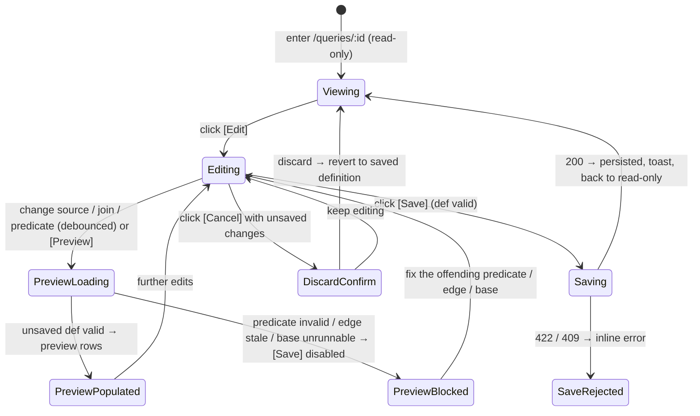
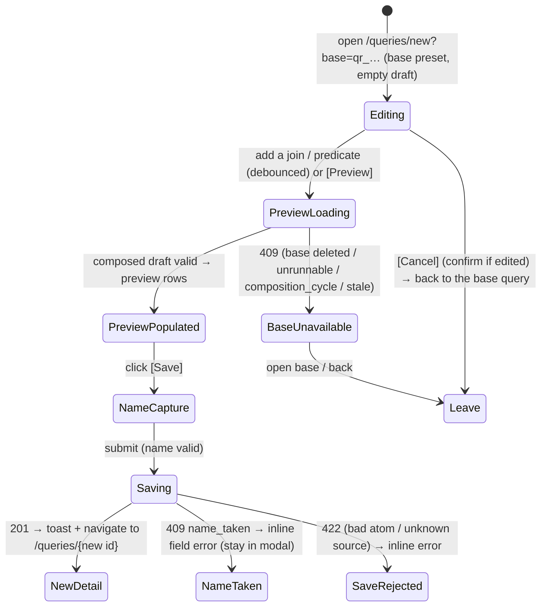

# Query Construction — the interactive builder: edit a Query's definition + preview before save

**Concept**: the **construction surface** is the editable builder for a
[Query](queries.md): an **Edit mode** of the query detail (and a **Create mode**
reached from "Build on this query") that lets a user build a Query's definition — pick its
driving source, edit its [join tree](queries.md#joins-reading-related-datasets-as-one),
and compose **cross-source predicates** over the combined column space — and **preview**
the resulting rows **before saving**. It is **not a new noun and not a new engine**: it
edits the [`QueryDefinition`](queries.md#data-model) the spine owns and runs the spine's
`query_joined_rows` / `query_dataset_rows` / `resolve_source` engines through a stateless
preview. This doc owns the **builder UX** — layout, the edit/create lifecycle, the live
preview, and the in-builder validation — while the model, routes, and engine live in the
[queries.md spine](queries.md).

**Status**: Accepted.
**Sibling docs**:
[queries.md](queries.md) (the domain spine — the `QueryDefinition` model, all routes +
error codes (`POST …/preview` / `PUT /queries/{id}` / `POST …/queries`), the engines + the
`query_stale` / `relationship_stale` / `composition_cycle` gates this builder edits against,
and the [reuse invariant](queries.md#the-reuse-invariant-the-one-rule-this-domain-holds)
this obeys),
[canvas.md](canvas.md) (the visual editor that adds a canvas view/edit mode over this
same builder — design banked, build deferred),
[dataset-filters.md](../datasets/dataset-filters.md) +
[advanced-query.md](../datasets/advanced-query.md) (the chip + advanced-DNF predicate
**editors** reused verbatim — bound to the Query's effective columns),
[dataset-detail.md](../datasets/dataset-detail.md) (owns `<PagedRowsView>`, reused for
the live preview),
[crud-hygiene.md](../_shared/crud-hygiene.md) (the discard-changes confirm pattern),
[workspace-shell.target.md](../../_platform/workspace-shell.target.md) (the chrome all
surfaces render inside).

---

## Why a mode, not a noun

Building a Query introduces **no new readable-table-source kind** and **no new engine** —
it edits the `QueryDefinition` the spine seals and runs the spine's engines through a
stateless preview. So construction is an **Edit/Create mode** of the existing detail and
catalog rather than a `/builder` page or a `QueryBuilder` noun. What is genuinely this
doc's: the **edit + preview + create UX**, named below — never laundered as new
capability. The reuse invariant binds it: the builder **composes** the shipped predicate
editors, the relationship/base `<Select>`s, and `<PagedRowsView>`; it re-implements no
predicate engine, join engine, or detail page.

---

## What the builder edits (reused vs new)

| Reused verbatim | New (the edit + preview + create UX only) |
| --- | --- |
| The `QueryDefinition` (`q` / `filters` / `advanced` / `joins`) + the polymorphic `sourceId` — **edited, not extended** | An **Edit mode** on `/queries/:id` + a **Create mode** at `/queries/new?base=qr_…` |
| The chip-filter + advanced-DNF **editors** + their serializers/validators | Those editors **bound to the effective columns** (the combined `joins`-tree space) |
| The base/relationship `<Select>`s + per-hop join-type `<Select>` | The **`JoinEditor`** that mutates the `joins` tree (base source, add/remove hops, per-hop type) in place |
| `query_joined_rows` / `query_dataset_rows` / `resolve_source`; the `409 query_stale` / `409 relationship_stale` / `409 composition_cycle` gates | A **stateless preview** of the **unsaved** definition (`POST …/queries/preview`) |
| `<PagedRowsView>`, the `RowsPage` shape, `SaveQueryModal`, `useCreateQueryMutation`, the `<DeleteConfirmModal>` confirm pattern | A **dirty / Save / discard** lifecycle on the detail, and a **no-id create** lifecycle (preset base → name capture → `POST`) |

**No new model. No new engine. No new route beyond the spine's `preview` + `update`.**

---

## Surfaces — layer / reuse / purity declaration

| Surface                                                                  | Layer                                                | Reusability         | Purity   | Allowed peer deps                  |
| ------------------------------------------------------------------------ | ---------------------------------------------------- | ------------------- | -------- | ---------------------------------- |
| `QueryDetailPage` (Edit toggle; header `[Cancel] [Save]`)                | `apps/builder/src/features/data-management/queries`  | feature             | feature  | react, antd, @tanstack/react-query |
| `QueryCreatePage` (create mode at `/queries/new?base=qr_…`)              | `apps/builder/src/features/data-management/queries`  | feature             | feature  | react, antd, @tanstack/react-query |
| `QueryBuilderPanel` (presentational, collapsible Build + Preview)        | `apps/builder/src/features/data-management/queries`  | feature             | feature  | react, antd                        |
| `useQueryBuilder` (builder state + debounced preview + Save lifecycle; edit + create modes) | `apps/builder/src/features/data-management/queries` | feature       | glue     | @tanstack/react-query, antd        |
| `JoinEditor` (base-source picker + join-tree editor: ≤1-hop single edit; hop-rows + add/remove for ≥2) | `apps/builder/src/features/data-management/queries` | feature | feature | react, antd                  |
| `JoinWithRelatedModal` (minimal join-create entry from a dataset)        | `apps/builder/src/features/data-management/queries`  | feature             | feature  | react, antd                        |
| `SaveQueryModal` (reused — name capture for save + create)               | `apps/builder/src/features/data-management/queries`  | feature             | feature  | react, antd                        |
| chip-filter + advanced-DNF editors (reused, not owned)                   | `apps/builder/src/features/data-management/datasets` | feature             | feature  | react, antd                        |
| `<PagedRowsView>` (reused; preview body + per-column filter headers)     | `apps/builder/src/features/data-management/_shared`  | shared cross-domain | plain-UI | react, antd, react-i18next         |

**Boundary check**: the only shared-cross-domain row (`<PagedRowsView>`) is **reused, not
owned** ([dataset-detail.md](../datasets/dataset-detail.md)). The predicate editors are
**reused by reference** from the datasets feature; the builder composes them over the
Query's effective columns, never re-implementing them. `JoinEditor` reuses the
relationship/base `<Select>`s. No builder surface re-implements a dataset/query page or a
predicate/join engine.

---

## Token map

The builder surfaces are AntD primitives (`<Select>`, `<Button>`, `<Tag>`, `<Alert>`,
`<Collapse>`, `<Table>` via `<PagedRowsView>`, the reused chip/advanced editors) styled by
the `<ConfigProvider>` tokens derived from the six seeds in
[`themeTokens.ts`](../../../../workspace/packages/ui/src/themeTokens.ts) (the source of
truth). **No new token is introduced**; the map reuses identifiers already cited by
[queries.md](queries.md). `Value` is informational.

| Surface                                        | AntD token (themeTokens.ts) | Value (informational) |
| ---------------------------------------------- | --------------------------- | --------------------- |
| Page background                                | `colorBgLayout`             | `#f5f5f5`             |
| Builder panel card background                  | `colorBgBase`               | derived               |
| `[Edit]` / `[Save]` / primary action           | `colorPrimary`              | `#1677ff`             |
| Editable join / predicate `<Tag>` text         | `colorTextSecondary`        | derived               |
| Step-card grain line + steps hint (advisory)   | `colorTextSecondary`        | derived               |
| Builder section / table border                 | `colorBorderSecondary`      | `#f0f0f0`             |
| Step-card border                               | `colorBorderSecondary`      | `#f0f0f0`             |
| Dirty-state / unsaved-changes hint             | `colorWarning`              | `#faad14`             |
| Invalid predicate / unavailable-edge `<Alert>` | `colorError`                | `#ff4d4f`             |
| Border radius (card, table, tag, button)       | `borderRadius`              | `6`                   |
| Font family                                    | `fontFamily`                | system stack          |

Identifier parity is enforced by
[`design-token-parity.mjs`](../../../../scripts/lint/design-token-parity.mjs).

---

## Layout — ASCII intent

The builder is an **Edit mode** of the query detail — the same standard detail shell
(`PageHeader` + `PageCard` + `<PagedRowsView>`). An `[Edit]` action (page header) swaps to
`[Cancel] [Save]` and reveals the builder as **two collapsible sections** — **Build**
(source + join editor + predicate editors) and **Preview** (the live rows). Both open by
default; collapse Build to give the preview full height on a short screen. Per-column
filters live in the **preview table headers** (filter where you see the data).

The preview renders `<PagedRowsView scrollMode="flow">` (R96) — a **peek**: the table flows
(no inner scroll), the page scrolls, and the pager sits at the natural end ("scroll to the
end"). This is the deliberate opposite of the **view tables** (dataset detail / query view),
which use `scrollMode="contained"` + `PageContainer fill="bounded"` for a fixed header and a
viewport-pinned pager — see [dataset-detail.md](../datasets/dataset-detail.md). Giving the
preview *more* space (maximize / a dedicated tab) is a separate, deferred concern.

### View mode (read-only)

```text
Home ▸ Data Management ▸ Queries ▸ Deals × Accounts              [Edit]  [Delete]
Deals × Accounts                                  🔎 Query · live re-run · join
  ┌─ Join (read-only) ─────────────────────────────────────────────────────────┐
  │  Deals  ⋈ inner ⋈  Accounts      on  account_id ↔ id      many:many          │
  └────────────────────────────────────────────────────────────────────────────┘
  ┌─ Applied predicates (read-only) ───────────────────────────────────────────┐
  │  Deals.stage = won     Accounts.region = APAC                               │
  └────────────────────────────────────────────────────────────────────────────┘
  Matched 1,204 rows   <the shared <PagedRowsView> — saved definition's rows>
```

### Edit mode (the builder)

```text
Home ▸ Data Management ▸ Queries ▸ Deals × Accounts × Owners        [Cancel] [Save]
Deals × Accounts × Owners                          🔎 Query · editing (unsaved)

  ▾ Build
  ┌─ Source ─────────────────────────────────────────────────────────────────────┐
  │  Build on:  [ Deals (dataset)                                          ▾ ]    │  ← base: ds_ or qr_
  └───────────────────────────────────────────────────────────────────────────────┘
  ┌─ Joins ──────────────────────────────────────────────────────────────────────┐
  │  Deals  ⋈ [inner ▾]  [ Deals.account_id ↔ Accounts.id  (many:many)     ▾ ]    │
  │  Accounts ⋈ [left ▾] [ Accounts.owner_id ↔ Owners.id  (many:one) ▾ ]  [Remove]│  ← leaf
  │  [ + Add a join ]   from: [ Owners ▾ ]   (a left-source for 2+ in-graph nodes) │
  └───────────────────────────────────────────────────────────────────────────────┘
  (columns from all sources)
  Deals.stage = won  ×    Owners.region = APAC  ×            ← active-filter chips
  Advanced query  [ stage:won AND amount:>1000 ]      Search [ Match any cell… ]

  ▾ Preview · 1,204 rows   ⟳        [ Preview ]      ← collapse to free screen height
  ┌────────────────────────────────────────────────────────────────────────┐
  │  Deals.id ⏷  Deals.stage ⏷ … Owners.region ⏷       ← per-col filter funnels │
  │  <the shared <PagedRowsView> — preview of the UNSAVED definition; combined │
  │   columns, duplicate names qualified; items-per-page 10 / 25 / 50 / 100>  │
  └────────────────────────────────────────────────────────────────────────┘
```

The `▾ Build` / `▾ Preview` bars are independently collapsible. `[Cancel] [Save]` live in
the page header; the preview re-runs the unsaved copy **debounced** (`[Preview]` flushes
it). The `JoinEditor` renders a single-edge affordance for ≤1 hop and hop-rows with a
left-source `<Select>` + per-hop type + add/leaf-remove for ≥2 (the spine's join tree).

### Shape — the ordered operations editor (`StepsEditor`)

> **Backfilled at the R162 D gate.** `StepsEditor` shipped across R120–R144 with **no
> design-doc home** — this section is a design-sync-style reconciliation to the code
> ([[design-docs-are-source-code]]), plus the one **new** affordance R162 adds. Everything
> before "The within-group column" describes what is already built.

A `▾ Shape` bar under `▾ Build` holds `definition.steps` — the **ordered** operations applied
after the source/join/filter resolve ([queries.md § Transform steps](queries.md)). Each step is
a card: `{n}. {kind label}` + `[↑] [↓] [🗑]` + a per-kind body. `[+ Add step]` is a `<Select>` of
kinds. The column space is threaded client-side by `threadColumns` (`steps.ts`, a pure mirror of
the backend `_step_plan`), so **each card's pickers offer exactly the columns that exist at that
position** — the backend re-validates on preview/save and stays the source of truth.

```text
  ▾ Shape
  ┌─ 1. Group & aggregate ──────────────────────────── [↑] [↓] [🗑] ┐
  │  Group by [ agent × ] [ team × ]   Measure [ Count rows ▾ ]      │
  └──────────────────────────────────────────────────────────────────┘
  ┌─ 2. Group value ────────────────────────────────── [↑] [↓] [🗑] ┐
  │  Measure      Within each        New column name                 │
  │  [ Average of ▾ ] [ rate ▾ ]   [ team × ]   [ team_rate      ]   │
  │  ⓘ Each row here is one agent × team. This averages agents —     │
  │     not the rows underneath them.                                │
  └──────────────────────────────────────────────────────────────────┘
  [ Add step ▾ ]
```

**Labels, not sentence chrome.** Every control carries a **visible `FieldLabel` above** it (the
AntD Data-Entry label-above convention the sibling cards already use), not an inline reading
sentence: the reused `steps.measure` **Measure** / VN **Giá trị đo** over the agg + column pair
(verbatim from the `aggregate` card — one vocabulary, not a lookalike), a new
`steps.withinEach` **Within each** / VN **Trong từng nhóm** over the group multi-`<Select>`, and
the reused `steps.newColumn` **New column name** / VN **Tên cột mới** over the name `<Input>`. The card still *reads* as a sentence left-to-right; the labels are what make it
navigable and screen-reader-addressable.

#### The within-group column (R162)

The step kind is **`group_column`** on the wire; the user never sees that word, nor "window
function", nor "partition".

| | EN | VN |
| --- | --- | --- |
| Kind label | **Group value** | **Giá trị theo nhóm** |
| The sentence | `[Average of ▾] [rate ▾]` **within each** `[team ×]` | `[Trung bình của ▾] [rate ▾]` **trong từng nhóm** `[team ×]` |
| New column | *New column name* (reused `steps.newColumn`) | *Tên cột mới* |

- **The agg picker reuses the shipped measure vocabulary verbatim** — `sumOf` / `avgOf` /
  `minOf` / `maxOf` / `countDistinct` / `countRows`, the same labels the `aggregate` card
  uses, with the same dtype-gated column options (`isNumericCol` / `isOrderableCol`). One
  vocabulary, two placements: **"Group & aggregate" collapses the rows; "Group value" keeps
  them.**
- **`within each` takes ≥1 column** (a multi-`<Select>` over the columns at this step). It is
  **not optional** in R162 — "across everything" (`% of total`) is program item 2.
- **Output** appends one column; the row count is visibly unchanged in the preview.

#### How the surface answers "pooled or per-member?" — without asking

The two readings of *"the team's average"* (all the underlying rows pooled, vs the average of
the already-grouped values) differ by **where the step sits**, not by a parameter. The design
choice at this gate is therefore: **no `basis` field.** A parameter would give two ways to say
one thing, and would contradict the ordered-operations rule the whole concept rests on.

What makes the choice legible instead is a **grain line** on every `group_column` card — one
sentence naming *what one row means at this position*, derived from the step list alone (no
data, no extra wire field):

- If a collapsing `aggregate` precedes this step, one row is one of its `dimensions`:
  **"Each row here is one `agent × team`. This averages agents — not the rows underneath
  them."** (VN: *"Mỗi dòng ở đây là một `agent × team`. Phép này lấy trung bình theo agent —
  không phải các dòng bên dưới."*)
- If none does, one row is one source row: **"Each row here is one row of your source data."**
  (VN: *"Mỗi dòng ở đây là một dòng dữ liệu gốc."*)

Moving the card with `[↑]`/`[↓]` past an `aggregate` **rewrites the grain line**, so the two
readings are one keystroke apart and each is named in business words at the moment of choosing.
The column pickers reinforce it for free: before the aggregate only raw columns are offered,
after it only the grouped ones.

**This is the round's primary risk made testable** — if the human cannot tell which reading
they got from the grain line alone, the round has moved the complexity rather than removed it,
green gates notwithstanding ([Round_162 § Risks](../../../plan/cycles/Round_162.md)).

#### Card states (declared so F builds them, not infers them)

The reorder gesture is the affordance, so **its failure mode is part of the affordance.**

| State | When | What the card shows |
| --- | --- | --- |
| **Normal** | every reference resolves at this position | the sentence + the grain line |
| **Orphaned by a move** | `[↑]` past an `aggregate` would leave `col` / a `within each` column non-existent at the new position | the move still happens (never trap the user mid-thought); the card renders `<Alert role="alert">` naming the column — *"`rate` doesn't exist this early. Move this back down, or pick a column that does."* — and **`[Save]` is disabled** by the existing invalid-edit gate |
| **Nothing to offer** | no column at this position satisfies the chosen agg's dtype rule | the column `<Select>` is disabled with a guiding tooltip naming why (the same shape as the join editor's no-eligible-edge control, acceptance #2) |
| **Name collision** | `name` already exists at this position (`column_exists`) | inline field error on the name `<Input>`, tied to the field |
| **Repeat group column** | the same column picked twice in `within each` (`duplicate_group_column`) | unreachable by construction — the multi-`<Select>` cannot repeat a value; the backend check stays as the wire-level backstop |

The first two are the ones the reorder gesture creates; the last three mirror the 422 vocabulary
[queries.md § Transform steps](queries.md) already declares, rendered **at the card**, never as a
page-level error.

#### The self-join boundary, in the Builder

The same dataset may not appear twice in one Query (a locked boundary — [`_noun-model.md`](../_noun-model.md)).
The form `JoinEditor` **already complies**: `addEligibleRels(rels, graphDatasets)` offers only
edges whose right side is not yet in the graph, so the gesture is simply absent
([JoinEditor.tsx:114](../../../../workspace/apps/builder/src/features/data-management/queries/JoinEditor.tsx#L114)).
The **canvas** does not — its free-form draw is node-level, so it lets you draw an edge that
fails later as `cyclic_join` (noun-model **D4**). Bringing the canvas to offer-nothing parity is
**not** in R162; it is tracked as D4 and re-ranked after composition retires.

#### Join option labels — qualify BOTH sides (decided 2026-08-10, **not yet built**)

Every relationship option and hop label reads **`<Dataset>.<column> ↔ <Dataset>.<column>`**, both
sides qualified — `Deals.account_id ↔ Accounts.id`, never a bare `account_id ↔ id`. The
cardinality suffix follows as today.

**Why both, not just the right.** An earlier version of this doc qualified only the right side, on
the reasoning that the hop row already prefixes the left (`Deals ⋈ …`). That reasoning holds for
the hop *display* row and fails everywhere else: the single-edge `<Select>` has no left prefix,
and at the **add-a-join** picker the left-source `<Select>` renders only when 2+ sources can
branch — so in the common single-source case **neither** side is named and the actual decision,
*join to what?*, is invisible. Both-sides is also what the canvas free-form modal already shows
([canvas.md](canvas.md) — `Deals.owner_id ↔ Owners.id`), so one rule now covers every surface
instead of three context-dependent ones. Human's call, 2026-08-10.

**Current state**: the build renders `${leftColumn} ↔ ${rightColumn}` — unqualified on both sides
([JoinEditor.tsx:99](../../../../workspace/apps/builder/src/features/data-management/queries/JoinEditor.tsx#L99)),
a **fidelity drift** from this doc. Tracked as **`[F-join-label-qualify]`**
([Round_162 § Feeds into](../../../plan/cycles/Round_162.md)), batched with the R157 UX cluster
rather than patched mid-feature ([[r-ui-bug-fixing-round]]). **Build note**: with both qualifiers
plus the cardinality suffix the label will overflow a narrow `<Select>` — it needs an explicit
ellipsis/`title` decision, not a hope.

### Invalid-edit / preview-blocked states (flag-don't-crash)

```text
  ⓧ  This predicate references "amount", which isn't in the joined columns.
     Remove it or pick a current column.                         (predicate invalid)

  ⚠  This join is unavailable — "account_id" no longer exists in Deals.
     Pick a different relationship, or remove the join.       (relationship_stale)

  ⚠  This base query loops back on itself. Pick a different base.   (composition_cycle)
```

`[Save]` is **disabled** while any predicate is invalid, an edge is stale, or the base is
unrunnable — the builder mirrors the server's validate-on-save guard, so a user can't save
a definition that wouldn't run.

---

## Behaviour — states



- **Enter Edit** — `[Edit]` flips the read-only summaries into the `JoinEditor` + reused
  predicate editors, seeded from the **saved** definition; the row body switches to a
  **preview** of the working copy.
- **Edit the source / joins** — the base `<Select>` picks the driving `sourceId` (a
  Dataset or a Query); `JoinEditor` adds a hop from any in-graph source (left-source
  `<Select>` when 2+ can branch), removes any leaf, and sets each hop's type. **Adding a
  hop is copy-on-pick**: picking a governed relationship copies its current join fields
  into the working copy as a query-owned `QueryRelationship` (with an `originRelationshipId`
  back-ref) and the new `JoinStep` references it by `queryRelId` — so the query carries its
  own edge snapshot, not a live `rel_` reference (see [queries.md § Joins](queries.md#joins-reading-related-datasets-as-one)).
  Editing the tree recomputes the effective columns, so the predicate editors re-bind; a
  predicate over a now-absent column flags invalid **in the builder**.
- **Edit predicates** — the chip + advanced editors operate over the effective columns
  (collision-qualified when joined; one dataset's columns when not), reusing the shipped
  serializers/validators verbatim.
- **Live preview** — the working-copy definition runs through the stateless
  `POST /workspaces/{id}/queries/preview` (auto-run on change, **debounced 300ms**; an
  explicit `[Preview]` flushes it), reusing the spine's engines and **persisting nothing**.
  Preview is paged (`10 / 25 / 50 / 100`).
- **Save (edit mode)** — persists the working copy via `PUT /queries/{id}` (**definition
  only** — name + source unchanged, so no `name_taken`); the server re-validates (a bad
  atom / unknown / cross-workspace / stale edge → `422`; a looping base → `409
  composition_cycle`). Success returns to Viewing.
- **Discard** — `[Cancel]` with unsaved changes confirms (the
  [crud-hygiene](../_shared/crud-hygiene.md) pattern), then reverts to the saved
  definition — no partial writes.

---

## Create mode (R77): build a new Query on a preset base

The builder also runs in **create mode** to construct a **brand-new** Query whose driving
source is preset to a saved Query you chose to build on (`sourceId = qr_…`). It is the
same `QueryBuilderPanel` + `useQueryBuilder` rendered with a **mode** flag — never a
parallel page. The entry verb **"Build on this query"** lives on the Query detail header
([queries.md § IA](queries.md#ia-and-navigation)); its route is
`/data-management/queries/new?base=qr_…` (`QueryCreatePage`), reached **only** via the verb
(no nav item, no empty source picker — the standalone "New query" entry ships with the
[canvas](canvas.md), built right: [[dont-mvp-rush-a-roadmap-home-surface]]).

How edit-only generalizes to edit + create (`useQueryBuilder` gains a mode):

| Concern | Edit mode | Create mode |
| --- | --- | --- |
| Identity | an existing `query` (`qr_…`) | **no id** — a draft until Saved |
| Baseline | `normalize(query.definition)` | the **empty definition** (`{ q: null, filters: [], advanced: [], relationships: [], joins: [] }`) |
| Driving source | seeded `query.sourceId`; **the base picker is disabled (read-only)** — the PUT is definition-only, so the base is fixed after create (R94 D6; R97 dropped the explanatory tooltip — the disabled state suffices); changing it is the deferred "Build on this query" / New-query path | **preset** `sourceId = the source Query's qr_`; the base picker is seeded to it |
| Live preview | the composed `POST …/preview` | the **same** composed preview, keyed on the preset base |
| Name | unchanged (`PUT` is definition-only) | **captured at Save** via the reused `SaveQueryModal` |
| Save | `PUT /queries/{id}` `{ definition }` | **`POST /workspaces/{id}/queries`** `{ name, sourceId, definition }` via `useCreateQueryMutation` → navigate to the new `qr_` detail |
| Gate | `canSave = dirty && previewOk && invalidCount === 0` | `canSave = previewOk && !pending && invalidCount === 0` **+ a non-empty name** (no `dirty` baseline — a base + zero edits is a valid, if trivial, composed Query) |

The create `POST` carries **`{ name, sourceId, definition }`** — `sourceId` is the
canonical (and only) source field; there is no `datasetId` (see
[queries.md § Data model](queries.md#data-model)). Both "Save filters
as Query" and "Build on this query" route through the **same** `SaveQueryModal` +
`useCreateQueryMutation`, so create logic is never duplicated.

### Create-mode states



A create draft has no id, so a **direct** cycle is structurally impossible at create; what
the preview surfaces pre-save is the **base's own** resolve failure (deleted / unrunnable /
transitively cyclic / drifted) → the guided base-unavailable state, with `[Save]` disabled.
The server re-validates on `POST` (`422` bad atom / unknown source; `409 composition_cycle`
if a base loops) — flag-don't-crash, mirroring the edit-mode and run-time gates.

---

## Accessibility (declared so F builds it, not infers it)

- `[Edit]` / `[Save]` / `[Cancel]` / **"Build on this query"** are keyboard-reachable with
  **visible text labels** (not icon-only); the editing state is announced
  (`role="status"`); on "Build on this query", focus moves into the builder.
- The **base `<Select>`** and **`JoinEditor` `<Select>`s** (relationship, left-source,
  per-hop type) carry visible labels (label-above per AntD Data-Entry guidance); options
  name the edge / source / type in **text** (`Deals.account_id ↔ Accounts.id`, `inner`),
  never colour/glyph alone; `<OptGroup>` headings ("Datasets" / "Saved queries") stay text;
  a disabled non-leaf `[Remove]` keeps its label and exposes its reason via tooltip
  (`aria-disabled`), so the leaf rule is discoverable.
- The **predicate editors** inherit the shipped chip/advanced accessibility; column options
  read as **text** (`Deals.id` / `Accounts.id`) so duplicate names stay unique and
  screen-reader-navigable.
- The **live-preview status** ("Preview · N rows", loading, updated) is a `role="status"`
  live region; the **invalid-predicate**, **stale-edge**, and **base-unavailable** blocks
  are `<Alert role="alert">` whose reason is **text** (the offending column / base named),
  icon + text — not a colour swatch; `[Save]`-disabled state has an accessible reason.
- The **`▾ Shape` step cards** (backfilled + extended R162): each card is a labelled group
  (`{n}. {kind label}`); the reorder/remove buttons are icon-only and therefore carry
  `aria-label`s (`steps.up` / `steps.down` / `steps.remove`, already shipped). Every step
  control has a **visible `FieldLabel`** *and* an accessible name — including the R162
  "Group value" card's **Value** / **Within each** / **New column name**; no control relies
  on the reading-sentence order for its meaning.
- The **grain line is a live region** (`role="status"`, `aria-live="polite"`). It is the one
  thing that tells a user *which* reading a within-group column computes, and it **changes
  when the card moves** — so a keyboard user pressing `[↑]` must hear the new grain, not
  discover it in the result. It is **icon + text** (ⓘ + sentence), never colour alone, and it
  is advisory: it is **not** an `<Alert>` and must not read as an error.
- The **orphaned-by-a-move** state is `<Alert role="alert">` naming the offending column in
  **text**, and `[Save]`-disabled carries an accessible reason — the same contract the
  invalid-predicate and stale-edge blocks already keep.
- The **name-capture modal** reuses `SaveQueryModal`'s shipped semantics: labelled
  `<Input>`, autofocus, an accessible `name_taken` error tied to the field.
- The preview reuses `<PagedRowsView>`'s shipped table semantics; collision-qualified
  headers keep every column name unique and readable.

---

## Acceptance criteria

1. **Edit mode is a mode, not a page** — `[Edit]` on `/queries/:id` reveals the builder in
   place (the same detail shell); there is **no** new `/builder` route and **no**
   copy-pasted detail page.
2. **Source + join tree are editable in place** — the base `<Select>` sets the driving
   `sourceId` (Dataset or Query); `JoinEditor` adds a hop from any in-graph source, removes
   any leaf, and sets each hop's type; editing re-binds the predicate columns; a source
   with no eligible edge disables the add control with a guiding tooltip.
3. **Predicates compose over the effective space** — the reused chip + advanced editors
   bind to the effective columns when joined (collision-qualified) and to the single
   dataset's columns when not; atoms round-trip through the shipped serializers unchanged.
4. **Live preview runs the unsaved definition** — editing updates the previewed rows via
   `POST …/queries/preview` **without** persisting; the preview is paged and reuses
   `<PagedRowsView>`; mutating source data between two previews changes the result.
5. **Invalid edits block save, flag-don't-crash** — a predicate over an absent column, a
   stale edge, or an unrunnable base renders the in-builder state and **disables `[Save]`**;
   the server `422`s / `409`s a bad definition on save — never a saved-but-unrunnable query.
6. **Save mutates the existing Query** — `[Save]` (edit) persists via `PUT /queries/{id}`
   (definition-only); reopening shows the new definition.
7. **Create mode builds a new composed Query** — "Build on this query" opens the **same**
   builder in create mode with `sourceId` preset to the base `qr_`; the composed preview
   runs the unsaved draft; `[Save]` captures a name and `POST`s `{ name, sourceId,
   definition }` → the new `qr_` detail (no `datasetId` in the body).
8. **One create rhythm (no duplication)** — both "Save filters as Query" and "Build on
   this query" route through `SaveQueryModal` + `useCreateQueryMutation`.
9. **The within-group column is authorable without engine words (R162)** — a "Group value"
   card reads as a sentence (`Average of rate within each team → team_rate`), reuses the
   `aggregate` card's agg labels and dtype-gated column options, and offers only columns
   that exist at its position. Its **grain line** names what one row means there, and
   **changes** when the card is moved past a `Group & aggregate` — so pooled vs
   average-of-groups is chosen by placement, visibly, with no `basis` control anywhere.
10. **Reuse, not duplication** — the builder composes the shipped predicate editors, the
   relationship/base `<Select>`s, and `<PagedRowsView>`; it re-implements no engine or page.

---

## Scope boundary

### IN scope

- An **Edit mode** on `/queries/:id`: the `JoinEditor` (base source + the full `joins`
  tree: add from any source, remove any leaf, per-hop type) + the reused chip/advanced
  predicate editors bound to the effective columns; a dirty/Save/discard lifecycle via
  `PUT /queries/{id}`.
- A **Create mode** at `/queries/new?base=qr_…` (`QueryCreatePage`): no-id, **preset base**,
  the composed preview, name capture at Save (reused `SaveQueryModal`), Save = `POST`
  carrying `{ name, sourceId, definition }`.
- The **`▾ Shape` steps editor** (`StepsEditor` + the pure `steps.ts` column threading):
  ordered step cards with reorder/remove, per-kind bodies bound to the columns available
  **at that position**, and — R162 — the **"Group value"** card with its grain line.
- **Live preview** of the unsaved definition through `POST …/queries/preview` +
  `<PagedRowsView>`; in-builder invalid-predicate / stale-edge / base-unavailable blocking
  of Save (the existing gates, consumed pre-save).

### OUT of scope (deferred with named triggers)

- **The visual source-graph canvas** (the React Flow canvas view/edit mode over this builder)
  is **built** — it lives in [canvas.md](canvas.md), not here. The standalone "New query"
  empty-canvas create entry remains deferred ([canvas.md](canvas.md) Scope).
- **Renaming a Query from the builder** → the builder edits the **definition** only; a
  separate rename affordance is its own pull.
- **Composite keys; cross-workspace joins; null-aware predicate operators** → spine-level
  future triggers ([queries.md § Scope](queries.md#scope-boundary)). **Self-joins are not
  deferred — they are a locked boundary** ([`_noun-model.md`](../_noun-model.md)); the form
  editor already offers nothing, and canvas parity is D4.
- **The rest of the within-group family** (% of total · running total · rank within group ·
  vs prior period) → [program item 2](../../../plan/programs/query-shaping-surface.plan.md);
  each needs an in-window `ORDER BY` + frame that `group_column` deliberately omits.
- **Workflow / complex query (YAML + polars); result materialization; Excel export;
  dashboards** → downstream value-out; preview + save stay live re-run.

### This concept explicitly does NOT cover

- The `QueryDefinition` model, the routes + error codes, and the join/composition engines —
  [queries.md](queries.md); this **edits + previews** them, it does not restate them.
- The predicate vocabulary internals — [dataset-filters.md](../datasets/dataset-filters.md)
  - [advanced-query.md](../datasets/advanced-query.md).
- The governed-edge model (declare / validate / stale) —
  [relationships.md](../workspaces/relationships.md); this consumes it via a join.

---

## Reference materials (read-only)

- [queries.md](queries.md) — the Query model, routes, engines, and gates this
  builder edits + previews.
- [queries.md](queries.md) — the domain anchor + reuse invariant + trajectory.
- [canvas.md](canvas.md) — the visual source-graph editor (built) that re-presents this builder.
- [specious-model-lock-in](../../../memory/2026-06-13-specious-model-lock-in.md) — the
  noun-vs-mode / honest-split discipline this doc applies.
