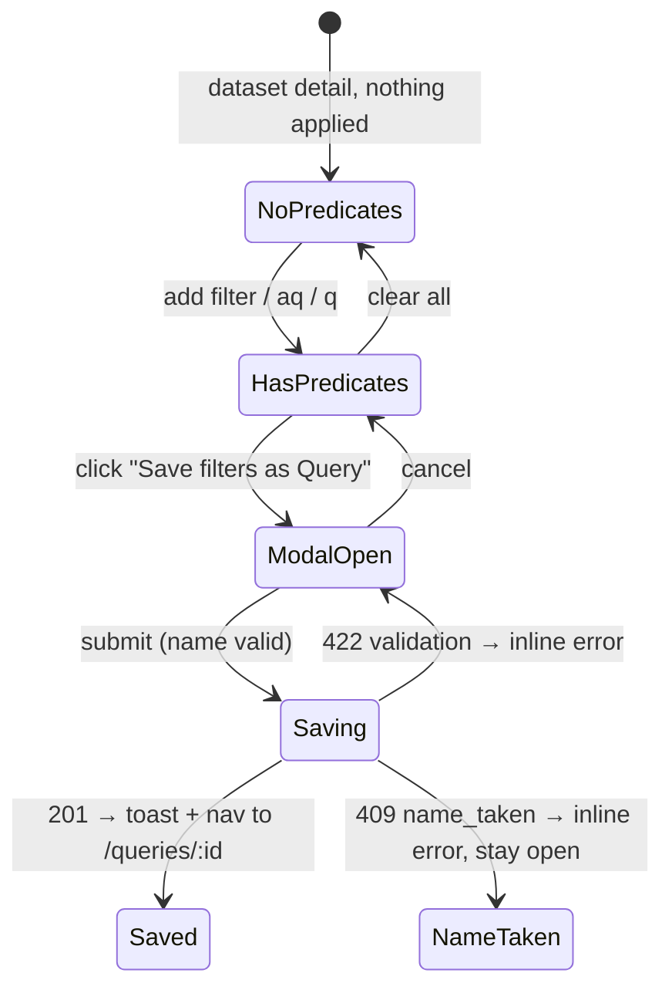
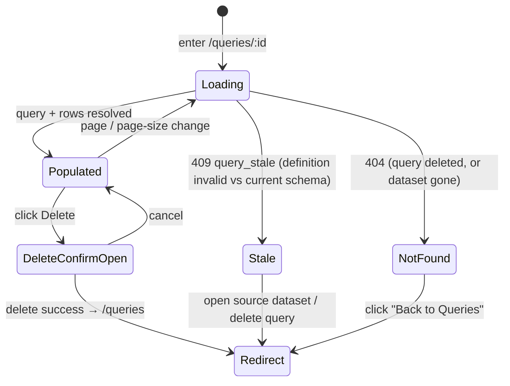

# Saved Query — persist a filtered dataset view as a named, re-runnable Query

**Concept**: a **Query** is a named, saved definition that produces a
**(virtual) dataset** by re-running a set of predicates against a source
Dataset. It is the **same readable-table-source kind** as a Dataset, but a
**different archetype**: it has its own identity (`qr_…`), its own home (a
**Queries catalog**) and its own URL — yet it **reuses the dataset surfaces'
layout and components** rather than duplicating them. R69 ships the thinnest
real slice: take the predicate state a user already builds on the
[dataset detail page](../datasets/dataset-detail.md) — chip
[filters](../datasets/dataset-filters.md) + the [advanced-query](../datasets/advanced-query.md) DNF +
the `?q=` row search — and let them **"Save as Query"**: name it, list it,
reopen it, and re-run it against current data. The predicate vocabulary is
unchanged; R69 adds **persistence + identity + an IA home**, not new query
semantics.

**Status**: Accepted (R69 design + shipped R69 — full DCFBI chain;
**relocated to `queries/` + reframed R70**). Supersedes the discarded new-noun
`queries.md`.

> **As-built deltas since (reconciled R72).** ① The dataset-page action is now
> **"Save filters as Query"** (relabelled from "Save as Query" at R72). ② **Editing a saved query's
> predicates is now SHIPPED** — the construction surface
> ([query-construction.md](query-construction.md), R72) makes the definition
> editable (join + cross-source predicates) with a live preview; the "deferred"
> scope item below is closed. ③ **Page size** is now the centralized
> **`10 / 25 / 50 / 100`** ([_shared/pagination.yaml#/PageSize](../../../../workspace/packages/contracts/_shared/pagination.yaml)).

**Round introduced**: [Round_69](../../../plan/cycles/Round_69.md) — the redo of
the discarded first R69, on the corrected "Query is a virtual Dataset" footing.
**Relocated + reframed**: [Round_70](../../../plan/cycles/Round_70.md) —
graduated from `datasets/` to the new `queries/` domain once the Query-Builder
complexity pulled a first-class home; "Save as Query" reframed as an **action**
on [dataset-detail.md](../datasets/dataset-detail.md). The domain overview is
[query-builder.md](query-builder.md); this doc is the first **construction
mode** (save a single-source filtered view).
**Domain folder**: `data-management/queries/` (the Query domain). The
anti-duplication invariant still holds — `queries/` surfaces **reuse** the
dataset components/layouts (`<PagedRowsView>`, the Page-List + standard detail
layouts), never a parallel page. Doc-home and UI-duplication are **independent
axes**; only the latter was the discarded model's error, and the graduation
leaves it untouched.
**Sibling docs**:
[dataset-detail.md](../datasets/dataset-detail.md) (the surface a Query is saved _from_,
and whose paged-rows body — the extracted `<PagedRowsView>` — and standard
detail layout the query-mode view **reuses**),
[dataset-filters.md](../datasets/dataset-filters.md) +
[advanced-query.md](../datasets/advanced-query.md) (the predicate vocabulary the saved
definition round-trips — `FilterPredicate` atoms + the `aq` DNF),
[datasets.md](../datasets/datasets.md) (the noun a Query reads from; the catalog +
workspace-filter conventions the Queries catalog mirrors),
[workspaces.md](../workspaces/workspaces.md) (the container a Query is scoped
to),
[crud-hygiene.md](../_shared/crud-hygiene.md) (the delete-confirm modal reused
on the query-mode view),
[workspace-shell.target.md](../../_platform/workspace-shell.target.md) (the
chrome all surfaces render inside).

> **Why a redo.** The first R69 modeled Query as a **new top-level noun** with
> parallel `QueriesPage` + `QueryDetailPage` that **duplicated** the datasets
> list and the dataset-detail row table; the whole D→C→F→B→I chain shipped as
> one seamless changeset and was discarded. Root cause + correction (committed
> repo doctrine):
> [specious-model-lock-in](../../../memory/2026-06-13-specious-model-lock-in.md)
> (the noun-vs-mode / discovered-vs-imposed trap) +
> [gate-vs-commit-conflation](../../../memory/2026-06-13-gate-vs-commit-conflation.md)
> (per-gate commits as the revert seam).
> _Track: 1 (product feature). Pulled by: [purpose.md](../../../context/purpose.md)
> critical path (data → relationships → dashboards) + the R69 post-mortem._
> Salvage parked at `tmp/queries/` (contracts, backend persistence /
> validate-on-save / hydrate-on-run, `query_stale`, `qr_` ids) is pulled in **by
> reference**, not re-applied wholesale.

---

## Why this exists separately from dataset-detail.md

The dataset detail page is the **ephemeral** verb surface: a user filters,
searches, and reads rows, and the URL (`f<N>_*`, `aq`, `q`) is the only
durability — it survives a refresh and a deep-link, nothing more
([advanced-query.md](../datasets/advanced-query.md) § Deferred: _"Saved queries / query
history — persistence concern; URL `?aq=` is the only durability this round"_).
That deferral is the gap this doc closes.

- `dataset-detail.md` — the **ephemeral view**: build predicates, read rows,
  share via URL. Predicates live in the URL.
- `saved-query.md` (this file) — the **persisted view**: the same predicate
  state, given a name and an identity, listed and reopenable. Predicates live
  in a `queries` row.

A Query is **not** a Dataset (no Parquet of its own — see § Execution model:
live re-run) and **not** a new query language (it reuses the shipped
`FilterPredicate` / `aq` vocabulary verbatim). It is the first member of the
product's Query layer, the abstraction later rounds extend toward joins (R70),
composition (R71), and workflow (R72) — which is exactly why it earns its own
**archetype identity** (a stable `qr_` id + URL) now: a thing R71 can reference
as a peer table-source input.

---

## Reuse, not duplication — the invariant

The one thing the discarded R69 got wrong, stated as a rule this doc holds to:

| Concern                 | Discarded (new noun)                | This design (mode / archetype)                                                                             |
| ----------------------- | ----------------------------------- | ---------------------------------------------------------------------------------------------------------- |
| Row table               | re-implemented in `QueryDetailPage` | **reuses `<PagedRowsView>`** (extracted to `data-management/_shared/` — [dataset-detail.md](../datasets/dataset-detail.md)) |
| Detail layout           | a parallel page                     | **reuses the standard layout** `PageHeader` + `PageCard` + `<PagedRowsView>`                               |
| Catalog list            | a duplicated table component        | **reuses the Page-List layout** (`PageHeader` + `PageCard` + AntD `<Table>`), own column config            |
| Predicate (de)serialize | re-derived                          | **reuses the shipped serializers/validators** verbatim                                                     |
| Row execution           | new read path                       | **reuses `query_dataset_rows`** end to end (live re-run)                                                   |

What is genuinely **new**: persistence (`queries` table, raw-SQLite), the `qr_`
identity, the Save-as-Query modal, the Queries catalog + detail **routes**, and
the read-only predicate-summary section. Everything else is reuse.

---

## Judgment calls (resolved at the Plan gate — [Round_69](../../../plan/cycles/Round_69.md))

| #   | Decision                | Resolution                                                                                                                                                     |
| --- | ----------------------- | -------------------------------------------------------------------------------------------------------------------------------------------------------------- |
| J-1 | Reopen model            | **Query-mode detail reusing the standard layout + `<PagedRowsView>`** — not a duplicated page, not a pure URL-state bundle.                                    |
| J-2 | Catalog home            | An **own Queries catalog** (a `Queries` nav item + `/data-management/queries` list route) rendered through the **shared Page-List layout**.                    |
| J-3 | Backend data-model base | _Planned_ **SQLModel**; **build-corrected → raw-SQLite + Pydantic** (the established standard — the backend has zero SQLModel; an ORM for one entity failed the brake). See [Round_69 § Gate 5](../../../plan/cycles/Round_69.md) + § Data model. |
| J-4 | Detail URL shape        | Top-level **`/data-management/queries/:id`** (`^qr_[0-9a-f]{8}$`), not nested under `datasets/`. A Query is a distinct archetype → own namespace; sets up R71. |
| D-4 | Single-dataset only     | One Query reads exactly one Dataset this round. Joins (Query×Dataset, Query×Query) and YAML/polars workflows are **out** (R70+). See § Scope boundary.         |

---

## Surfaces — layer / reuse / purity declaration

| Surface                                                       | Layer                                                                  | Reusability         | Purity             | Allowed peer deps                  |
| ------------------------------------------------------------- | ---------------------------------------------------------------------- | ------------------- | ------------------ | ---------------------------------- |
| `<PagedRowsView>` (reused; declared in dataset-detail.md)     | `apps/builder/src/features/data-management/_shared`                    | shared cross-domain | plain-UI           | react, antd, react-i18next         |
| `SaveQueryModal` component                                    | `workspace/apps/builder/src/features/data-management/queries`          | feature             | feature            | react, antd                        |
| `QueriesPage` (Queries catalog; reuses Page-List layout)      | `workspace/apps/builder/src/features/data-management/queries`          | feature             | feature            | react, antd, @tanstack/react-query |
| `QueryDetailPage` (query mode; reuses standard detail layout) | `workspace/apps/builder/src/features/data-management/queries`          | feature             | feature            | react, antd, @tanstack/react-query |
| `useQueriesQuery` / `useCreateQueryMutation` hooks            | `workspace/apps/builder/src/features/data-management/queries`          | feature             | glue (server-data) | @tanstack/react-query              |
| `useQueryQuery` / `useQueryRowsQuery` hooks                   | `workspace/apps/builder/src/features/data-management/queries`          | feature             | glue (server-data) | @tanstack/react-query              |
| `queriesApi` client                                           | `workspace/apps/builder/src/api`                                       | builder-only        | glue               | (fetch — no extra peer dep)        |
| `POST/GET …/queries` + run routes                             | `workspace/apps/backend`                                               | backend             | feature            | (FastAPI — backend native)         |
| `Query` Pydantic model                                        | `workspace/apps/backend/app/models/common.py`                          | backend             | data type          | pydantic                           |
| `Query` type (frontend)                                       | `workspace/apps/builder/src/features/data-management/queries/types.ts` | feature             | data type          | none                               |

**Boundary check**: no query surface re-implements a dataset surface. The row
table is the shared `data-management/_shared/` `<PagedRowsView>` (R69 extraction — its boundary
lives in [dataset-detail.md](../datasets/dataset-detail.md), not here). The Queries catalog
and query-mode detail are feature-local pages that **compose** the shared
layout shells (`PageHeader` / `PageCard` from `@mdd/ui`); they add only their
own sections (the predicate summary, the queries column config). The read-only
predicate summary reuses the `ActiveFilterChips` styling **by reference**.

---

## Token map

The Saved-Query surfaces are AntD primitives (`<Table>`, `<Modal>`, `<Input>`,
`<Tag>`, `<Empty>`, `<Button>`, `<Breadcrumb>`, `<Segmented>` n-a) styled by the
AntD `<ConfigProvider>` tokens derived from the six seeds in
[`themeTokens.ts`](../../../../workspace/packages/ui/src/themeTokens.ts) (the
source of truth — R66). **No new token is introduced**; the map reuses the
identifiers already cited by [datasets.md](../datasets/datasets.md) and
[dataset-detail.md](../datasets/dataset-detail.md). `Value` is informational (resolved via
`theme.getDesignToken()`, antd 6.x).

| Surface                                    | AntD token                     | Value (informational) |
| ------------------------------------------ | ------------------------------ | --------------------- |
| Page background                            | `colorBgLayout`                | `#f5f5f5`             |
| Page card background                       | `colorBgBase`                  | derived               |
| Table header background                    | `colorFillQuaternary`          | derived               |
| Table header text                          | `colorTextSecondary`           | derived               |
| Table row border                           | `colorBorderSecondary`         | `#f0f0f0`             |
| Table row hover                            | `colorPrimaryBg`               | `#e6f4ff`             |
| Cell text                                  | `colorText`                    | derived               |
| `[Save filters as Query]` / primary modal action | `colorPrimary`                 | `#1677ff`             |
| Read-only predicate `<Tag>` background     | `colorFillSecondary`           | derived               |
| Read-only predicate `<Tag>` text           | `colorTextSecondary`           | derived               |
| Stale-query warning text + icon            | `colorWarning`                 | `#faad14`             |
| Name input border (focus)                  | `colorBorder` → `colorPrimary` | `#d9d9d9` / `#1677ff` |
| Border radius (card, table, modal, button) | `borderRadius`                 | `6`                   |
| Font family                                | `fontFamily`                   | system stack          |

Identifier parity against the live AntD registry is enforced by
[`design-token-parity.mjs`](../../../../scripts/lint/design-token-parity.mjs).

---

## Layout — ASCII intent

All surfaces render inside the master-layout chrome
([workspace-shell.target.md](../../_platform/workspace-shell.target.md)) — the
"Data Management" nav group gains a **Queries** sub-item, peer to Datasets.

### Save-as-Query — from the dataset detail page

The `[Save filters as Query]` action (placement declared in
[dataset-detail.md](../datasets/dataset-detail.md)) is enabled **only when ≥1 predicate is
active** (chip filter, advanced query, or `?q=` search). Clicking opens the
modal.

```text
Home ▸ … ▸ q1_pipeline_Deals          [Save filters as Query]  [Rename]  [Delete]
  ┌─ chips ──────────────────────────────────────────────────────────────────┐
  │  stage = won  ×    amount > 1000  ×    won_at after 2026-01-01  ×          │
  └────────────────────────────────────────────────────────────────────────────┘

        ┌──────── Save filters as Query ─────────┐
        │  Name                                   │
        │  [ Won deals over $1k (2026)          ] │
        │  Source: q1_pipeline_Deals · Marketing  │
        │  Captures: 2 filters · 1 advanced rule  │
        │                  [ Cancel ] [ Save ]    │
        └─────────────────────────────────────────┘
```

### Queries catalog — `/data-management/queries`

Reuses the **standard Page-List layout** (`PageHeader` + `PageCard` + AntD
`<Table>`) — the same shell as [datasets.md](../datasets/datasets.md), with a query column
config. **Not** a duplicated `DatasetsPage`.

```text
Home ▸ Data Management ▸ Queries                                  [Workspace: All ▾]
Queries
Saved views across your workspaces. Open one to re-run it against fresh data.

┌──────────────────────────────────────────────────────────────────────────────────┐
│  PageCard                                                                         │
│   ┌─────────────────────────────────────────────────────────────────────────┐   │
│   │ Name                  │ Source dataset    │ Workspace  │ Predicates │ Saved │   │
│   ├─────────────────────────────────────────────────────────────────────────┤   │
│   │ 🔎 Won deals over $1k │ q1_pipeline_Deals │ Marketing  │ 2 + 1 aq   │ 14:02 │   │
│   │ 🔎 Stale leads        │ leads_2025        │ Marketing  │ 1 filter   │ Yest. │   │
│   └─────────────────────────────────────────────────────────────────────────┘   │
└──────────────────────────────────────────────────────────────────────────────────┘
```

- **Columns**: Name (primary, sortable), Source dataset (links to the dataset
  detail page), Workspace (sortable), Predicates (a compact count, e.g.
  "2 + 1 aq"), Saved (relative date, sortable). **Default sort**: Saved desc.
- **Workspace filter**: same pattern as datasets.md — `?workspace=<id>`,
  breadcrumb trail, `×` clear.
- **Row click**: navigates to `/data-management/queries/:id` (query mode).
- **Empty state**: no drop-zone (a Query is born from a dataset view, not an
  upload). Copy: _"No saved queries yet. Open a dataset, filter it, and choose
  **Save filters as Query**."_ with a link to Datasets.

### Query mode — `/data-management/queries/:id`

Reuses the **standard detail layout** (`PageHeader` + `PageCard` +
`<PagedRowsView>`) — the same shell dataset-detail uses — and adds two sections
of its own: a **read-only predicate summary** and a **source-dataset link**.
Predicates are not editable this round (see § Scope boundary).

```text
Home ▸ Data Management ▸ Queries ▸ Won deals over $1k                       [Delete]
Won deals over $1k                                       🔎 Query · live re-run
Source: q1_pipeline_Deals ↗   ·   Re-run against current data

  ┌─ Applied predicates (read-only) ───────────────────────────────────────────┐
  │  stage = won     amount > 1000     won_at after 2026-01-01                  │
  └────────────────────────────────────────────────────────────────────────────┘

  Matched 312 / 2,481 rows
  ┌────────────────────────────────────────────────────────────────────────┐
  │ <the shared <PagedRowsView> — same component, same page sizes, same      │
  │  dtype-aware cells as dataset-detail>                                     │
  └────────────────────────────────────────────────────────────────────────┘
```

### Stale-query state (definition no longer valid)

If the source dataset's schema drifted so a saved atom no longer validates
(column removed or retyped — [purpose.md](../../../context/purpose.md) principle 5:
schema flexibility, _flag don't reject_):

```text
Won deals over $1k                                    🔎 Query · ⚠ needs attention
Source: q1_pipeline_Deals ↗

  ⚠  This query references a column that no longer exists in
     q1_pipeline_Deals ("amount"). Re-save it from the dataset to fix.

     [ Open source dataset ↗ ]   [ Delete query ]
```

---

## Data model

The `Query` entity follows the **established raw-SQLite + Pydantic** backend
standard — persisting to a new `queries` table in the same `app.sqlite`
([db.py](../../../../workspace/apps/backend/app/db.py)), with a `Query` Pydantic
model in [common.py](../../../../workspace/apps/backend/app/models/common.py).
_(Build-first correction of J-3, which planned **SQLModel**: the R69 build found
the backend is uniformly raw-`sqlite3` + Pydantic and adopting an ORM for one
entity failed the [dynamic-equilibrium brake](../../../context/purpose.md#dynamic-equilibrium)
— so the established standard **is** the standard base. See
[Round_69 § Gate 5](../../../plan/cycles/Round_69.md) + § Judgment calls J-3.)_

```ts
// Frontend type — features/data-management/queries/types.ts
type Query = {
  id: string; // backend-generated, pattern `^qr_[0-9a-f]{8}$`
  workspaceId: string; // FK → Workspace.id (the IA scope)
  datasetId: string; // FK → Dataset.id (the single source, D-4)
  name: string; // user-supplied; unique per (workspaceId)
  definition: QueryDefinition; // the saved predicate state (below)
  createdAt: string; // ISO-8601 UTC, backend commit time
};

// The saved predicate state — the EXACT shapes the detail page already
// serializes (filters/serialize.ts + advanced-query/serialize.ts). No new
// vocabulary; col indices reference the source Dataset.columns[].
type QueryDefinition = {
  q?: string | null; // the `?q=` row search, if any
  filters: FilterPredicate[]; // chip filters (dataset-filters.md)
  advanced: FilterPredicate[][]; // advanced-query DNF (advanced-query.md)
  // R71 adds an optional `join` step (a `rel_` reference) — a Query then reads
  // two related datasets as one. The atom shape above is unchanged; `col`
  // indexes the effective (combined) column space when a join is present.
  // See joins.md.
};
```

> **R71 extends this definition.** Join execution adds an optional
> `join: { relationshipId, type }` to `QueryDefinition` — the **second
> construction mode** ([joins.md](joins.md)). This single-source doc is
> unchanged; the join mode is a strict superset.

**Definition fidelity (anti-drift).** The FE builds `QueryDefinition` from the
live URL/hook state on the detail page and the BE re-runs it verbatim; both
sides **reuse the shipped serializers/validators** —
`parseFiltersFromSearchParams` / `serializeFiltersToSearchParams` /
`cacheKeyForFilters` (filters/serialize.ts), `groupsToParam` / `groupsFromParam`
/ `groupsToText` (advanced-query/serialize.ts) on the FE;
`parse_filters_from_query` / `parse_advanced_from_query` / `_build_aq_atom`
(ingest/filters.py) on the BE. The saved JSON is the same atom shape the wire
already carries (`{ col, dtype, op, val?, min?, max? }`). No predicate is
re-derived.

**Persistence (raw-SQLite table).** Mirrors the `datasets` table conventions
(per-workspace name uniqueness, cascade on container delete):

```sql
CREATE TABLE IF NOT EXISTS queries (
    id TEXT PRIMARY KEY,                                   -- qr_xxxxxxxx
    workspace_id TEXT NOT NULL REFERENCES workspaces(id) ON DELETE CASCADE,
    dataset_id   TEXT NOT NULL REFERENCES datasets(id)   ON DELETE CASCADE,
    name TEXT NOT NULL CHECK (length(name) BETWEEN 1 AND 120),
    definition_json TEXT NOT NULL,                         -- QueryDefinition
    created_at TEXT NOT NULL
);
CREATE UNIQUE INDEX IF NOT EXISTS idx_queries_name_unique
    ON queries(workspace_id, name);
```

**Deferred fields** (salvage/ref-app has them; MVP does not need them):
`version_count`, `execution_count`, `updatedAt`, `lastRunAt`, `description`,
`tags`. Each lands when a surface or audit need pulls it (§ Scope boundary).

---

## Execution model (live re-run, no materialization)

A Query stores **only its definition**, never a result. Opening a Query re-runs
the saved predicates against the source dataset's `parsed.parquet` **right
now**, so the result always reflects current data
([purpose.md](../../../context/purpose.md): "always-fresh"). This reuses the
shipped read path end to end — the only new backend code is the route that
hydrates the saved `definition_json` into the existing `query_dataset_rows(...)`
call ([ingest/rows_reader.py](../../../../workspace/apps/backend/app/ingest/rows_reader.py)):

```text
run path — routers/queries.py (sketch)
  1. load the Query row (404 if absent)
  2. load its Dataset row (→ parquet_path, columns_meta)
  3. hydrate definition_json → filters / advanced / q, re-validating each atom
     against the CURRENT columns_meta via the existing ingest/filters.py checks
  4. on a validation failure (schema drift) → 409 query_stale (FE renders the
     stale state); otherwise:
  5. rows, total = query_dataset_rows(parquet_path, column_names, page=…,
        page_size=…, q=q, filters=filters, advanced=advanced)
  6. return the SAME RowsPage shape as GET /datasets/{id}/rows
```

No new Parquet, no result cache, no execution log. _Trigger to materialize:_ a
Query whose live re-run is too slow to be interactive at real data scale, or a
downstream surface (dashboard) that needs a pinned snapshot.

---

## IA / navigation

A new **Queries** sub-item under the "Data Management" nav group in
`AppLayout.tsx`, peer to Workspaces and Datasets:

```ts
items: [
  { key: 'workspaces', label: 'Workspaces', route: '/data-management/workspaces' },
  { key: 'datasets',   label: 'Datasets',   route: '/data-management/datasets' },
  { key: 'queries',    label: 'Queries',    route: '/data-management/queries' }, // R69
],
```

Routes added in `main.tsx`:

- `/data-management/queries` → `QueriesPage` (catalog).
- `/data-management/queries/:id` → `QueryDetailPage` (query mode); `:id` matches
  `^qr_[0-9a-f]{8}$`.

A Query has its **own identity and top-level URL** (J-4) — the deliberate setup
for R71 Query-as-input composition: a thing with a stable id can be referenced
as a join input. The Save-as-Query action lives on the dataset detail page (the
verb belongs where the predicates are built); the Queries catalog + detail are
the archetype's home.

---

## Behaviour

### Save flow



- `[Save filters as Query]` is **disabled** when no predicate is active
  (`filters.length === 0 && advanced.length === 0 && !q`); disabled tooltip:
  _"Add a filter or search first."_
- The modal **name input** pre-fills a suggestion derived from the active
  predicates (e.g. first chip: _"stage = won"_), editable. AntD
  `<Input maxLength={120} showCount>` (mirrors the `length BETWEEN 1 AND 120`
  CHECK); **Save is disabled until the trimmed name is non-empty**.
- On submit: `POST /workspaces/{id}/queries` with `{ name, datasetId,
definition }`. Success → toast _"Query saved"_ + `navigate('/data-management/queries/:id')`.
  `409 name_taken` → inline field error (reuses the rename-modal error pattern).
  Captures a **snapshot** of the current predicate state at save time.

### Query-mode detail



- **URL state**: `?page=N&page_size=M` (page_size ∈ {10, 25, 50, 100} — the
  centralized [`PageSize`](../../../../workspace/packages/contracts/_shared/pagination.yaml)
  set, R72), same convention as dataset-detail.md. Predicates are **not** in the URL
  here — they live in the saved definition; the read-only view does not edit them
  (editing is the construction surface, [query-construction.md](query-construction.md)).
- **Predicate summary** renders the definition as read-only `<Tag>`s using
  `groupsToText` / the chip-label formatter (no remove `×`).
- **Matched counter**: _"Matched X / Y"_ where `X` = run `total`, `Y` =
  `Dataset.rowCount`.
- **Delete**: reuses `<DeleteConfirmModal>`
  ([crud-hygiene.md](../_shared/crud-hygiene.md), `resourceLabel="query"`).
  Success → toast + `navigate('/data-management/queries')`. No dependents this
  round (no 409 path).
- **Concurrent delete (404 race)**: same discipline as dataset-detail.md — a
  delete from another tab surfaces 404 on the next fetch → NotFound state.
- **Stale state**: a `409 query_stale` (a saved atom references a column that no
  longer exists or changed dtype) renders the warning state above. The query is
  **not** auto-deleted or auto-edited; the user is pointed at the source
  dataset. _(Editing predicates to repair is deferred — see Scope.)_

### Caching (TanStack query keys)

- `['queries', { workspaceId }]` — catalog (mirrors the datasets key shape).
- `['query', id]` — single query (definition + metadata).
- `['query-rows', id, { page, pageSize }]` — run results.
- Create invalidates `['queries']`. Delete invalidates `['queries']` and removes
  `['query', id]` / `['query-rows', id]`.

---

## Data contract (intent — formalized at the Contract gate)

The Contract phase formalizes the wire shapes under
`workspace/packages/contracts/queries/`; this section states the **design
intent** the YAML must satisfy. The saved definition reuses the existing
`FilterPredicate` / `aq` JSON, so the predicate vocabulary is unchanged — the
contract references the dataset
[rows-get.contract.yaml](../../../../workspace/packages/contracts/datasets/rows-get.contract.yaml)
shapes rather than re-declaring atoms. The salvaged YAML at
`tmp/queries/snapshot/workspace/packages/contracts/queries/` is the reference
draft (sound; not re-applied wholesale).

| Route                                     | Purpose | Notes                                                                                                             |
| ----------------------------------------- | ------- | ----------------------------------------------------------------------------------------------------------------- |
| `POST /workspaces/{id}/queries`           | create  | body `{ name, datasetId, definition }`; 201 → `Query`; 409 `name_taken`; 422 on bad definition / unknown dataset. |
| `GET /workspaces/{id}/queries`            | list    | `Query[]`, `created_at` desc; scoped to the workspace.                                                            |
| `GET /queries/{id}`                       | get     | one `Query` (definition + metadata); 404 if absent.                                                               |
| `GET /queries/{id}/rows?page=&page_size=` | run     | the **same `RowsPage` shape** as `GET /datasets/{id}/rows`; 404 / 409 `query_stale`.                              |

- **Open contract question (flag for the Contract gate):** a **separate
  `/queries/:id/rows` route** vs a **unified table-source resolver** that serves
  both `ds_…` and `qr_…` ids. The unified resolver is the truer expression of
  "Dataset ∪ Query = one readable table source" and pre-stages R71, but a
  separate route is the smaller step. Decide at the Contract gate, not here.
- Run is a **GET** (idempotent, cacheable) — it re-executes the saved
  definition, taking no predicate params of its own (the definition is the
  source of truth; pagination is the only query param).
- Create **validates the definition at save time** against the dataset's
  current columns (reusing the per-atom checks from
  [ingest/filters.py](../../../../workspace/apps/backend/app/ingest/filters.py))
  — a definition that doesn't validate is rejected `422`. Drift happens **after**
  save (the dataset changes later) → surfaced as `409 query_stale` on run.
- Error envelopes reuse the shared
  [api-error.yaml](../../../../workspace/packages/contracts/_shared/api-error.yaml)
  shape; `name_taken` is the existing code.

---

## Read/write boundary

**R69 implements** (the DCFBI/DFCFBI chain decided by the flow-selector at
Design exit — sequenced in later sessions):

- **Backend**: `Query` Pydantic model + `queries` table bootstrap (raw-SQLite);
  the four routes above; run delegates to `query_dataset_rows`. pytest per create
  / list / get / run / stale / name-taken path.
- **Contract**: `workspace/packages/contracts/queries/*.contract.{yaml,md}` for
  the four routes; MSW handlers; contract validator stays green.
- **Frontend**: `SaveQueryModal` + the gated `[Save filters as Query]` action on the
  detail page; `QueriesPage` catalog (workspace filter, empty state);
  `QueryDetailPage` query mode (predicate summary + reused `<PagedRowsView>` +
  stale state); `queriesApi` + the four hooks; nav + routes; i18n namespace
  `queries.*` (en + vi); vitest for the modal, the catalog, and the query-mode
  states.
- **Shared (one extraction)**: `<PagedRowsView>` lifted from `DatasetDetailPage`
  into `data-management/_shared/` ([dataset-detail.md](../datasets/dataset-detail.md)
  declares it); the dataset detail page is refactored to consume it (no behavior
  change).
- **Integration**: one save → list → reopen → run round-trip (FE through MSW; BE
  through pytest).

---

## Acceptance criteria (Design gate exit)

**User journey** — as a user I build a filtered/searched view on a dataset,
choose **Save filters as Query** to name and keep it, find it later in a **Queries**
catalog scoped to my workspace, and reopen it to re-run the same predicates
against current data — so my reports survive past a single browser session
without my rebuilding them.

Each criterion maps to ≥1 automated test across F / B / I (built in the R69
chain):

1. **Save affordance gating** _(FE)_ — `[Save filters as Query]` on the dataset detail
   page is enabled iff ≥1 predicate is active (`filters ∨ advanced ∨ q`),
   disabled otherwise with the tooltip.
2. **Save round-trips the exact predicate state** _(FE + contract)_ — the modal
   POSTs `{ name, datasetId, definition }` where `definition` is built from the
   live filters/advanced/`q` via the shipped serializers; the atoms are
   byte-for-byte the wire shape (`{ col, dtype, op, val?, min?, max? }`).
3. **Create** _(pytest)_ — `POST /workspaces/{id}/queries` persists a `queries`
   row (`qr_` id, per-workspace-unique name) and returns the `Query`; a
   duplicate name → `409`; a definition failing per-atom validation → `422`; an
   unknown `datasetId` → `422`.
4. **List** _(pytest + FE)_ — `GET /workspaces/{id}/queries` returns the
   workspace's queries `created_at` desc; `QueriesPage` renders them via the
   shared Page-List layout with Name / Source dataset / Workspace /
   Predicates-count / Saved columns, default sort Saved desc, workspace filter
   via `?workspace=`.
5. **Get** _(pytest)_ — `GET /queries/{id}` returns the saved definition +
   metadata; `404` if absent.
6. **Run = live re-run, always fresh** _(pytest)_ — `GET /queries/{id}/rows`
   re-executes the saved definition against the dataset's current Parquet via
   `query_dataset_rows` and returns the `RowsPage` shape; mutating the dataset's
   rows between two runs changes the result (no materialized snapshot).
7. **Reopen → query mode reusing the shared layout** _(FE + integration)_ —
   clicking a Queries row opens `/data-management/queries/:id`, rendering the
   standard detail layout (`PageHeader` + `PageCard` + `<PagedRowsView>`) with a
   read-only predicate summary, a source-dataset link, the "Matched X / Y"
   counter, and the **same** paged row component as dataset-detail (not a
   re-implementation).
8. **Stale definition is flagged, not crashed** _(pytest + FE)_ — when the
   source dataset's schema drifted so a saved atom no longer validates, the run
   returns `409 query_stale` and the query-mode view renders the warning state
   (source-dataset link + delete), never a blank crash
   ([purpose.md](../../../context/purpose.md) principle 5).
9. **Delete** _(pytest + FE)_ — deleting a query removes the row, lists stop
   returning it, the detail view redirects to `/queries`; deleting the **source
   dataset** cascades its queries away (FK `ON DELETE CASCADE`).
10. **Empty state** _(FE)_ — zero queries (overall or per workspace filter)
    renders the "no saved queries yet" copy with a link to Datasets — no drop
    zone.
11. **Archetype IA, reuse not duplication** _(FE)_ — a **Queries** sub-item sits
    under Data Management peer to Datasets, active on both query routes; the
    catalog and detail **compose** the shared `@mdd/ui` layout shells +
    `<PagedRowsView>` (no copy-pasted `DatasetsPage` / `DatasetDetailPage`
    components) — the noun-vs-mode check from
    [specious-model-lock-in](../../../memory/2026-06-13-specious-model-lock-in.md).

---

## Scope boundary

### IN scope

- Persisting the single-dataset predicate state (chip `filters` + `advanced` DNF
  - `?q=` search) as a named **Query** entity, scoped to a workspace, with a
    `qr_` identity and a `queries` raw-SQLite table.
- The four routes (create / list / get / run); run is a **live re-run** via the
  shipped `query_dataset_rows` path.
- The FE: the gated Save-as-Query modal on the dataset detail page, the Queries
  catalog (workspace-filtered, empty state), and the read-only query-mode detail
  view (predicate summary, reused `<PagedRowsView>`, stale + 404 states), plus
  nav + routes + i18n.
- The single `<PagedRowsView>` extraction (declared in dataset-detail.md).

### OUT of scope (deferred with named triggers)

- **Joins / relationships** (governed column↔column; Query×Query) → R70.
  _Trigger: a report needs two datasets._
- **Query composition** (a Query as input to another Query) → R71. The Query's
  stable `qr_` id + top-level URL is the setup for it.
- **Workflow / complex query** (YAML + polars, the `hg_code` pattern) → R72.
- **Versioning + execution logging** → when history / audit is a real need.
- **Editing a saved query's predicates / overwrite / "save changes"** → **SHIPPED
  R72** (the trigger fired): the construction surface
  ([query-construction.md](query-construction.md)) makes the saved definition
  editable (join + cross-source predicates) with a live preview, persisted via
  `PUT /queries/{id}`. _(R69 shipped save + read + run only; this scope item is
  now closed.)_
- **A unified table-source resolver** replacing the per-noun `/rows` routes →
  flagged for the Contract gate; the smaller separate-route step is the default.
- **Result materialization / pinned snapshots** → when live re-run is too slow
  at real scale, or a dashboard needs a frozen result.
- **Excel export of a Query result; dashboards** → downstream value-out.
- **An ORM / migration framework (SQLModel + alembic)** → not adopted. J-3
  planned SQLModel; the R69 build kept the **established raw-SQLite + Pydantic**
  standard (one persistence style, no new dependency). Pull an ORM/migrations
  only when schema churn genuinely needs it.

### This concept explicitly does NOT cover

- The dataset detail page's own states / data contract (live in
  [dataset-detail.md](../datasets/dataset-detail.md); this page only adds the
  `[Save filters as Query]` action there).
- The `<PagedRowsView>` component boundary (lives in
  [dataset-detail.md](../datasets/dataset-detail.md), the extracting host).
- The predicate vocabulary internals (live in
  [dataset-filters.md](../datasets/dataset-filters.md) + [advanced-query.md](../datasets/advanced-query.md)).

---

## Reference materials (read-only)

- `tmp/queries/` — the discarded first R69's parked work: the salvageable
  contract YAML, the backend persistence + validate-on-save / hydrate-on-run
  reuse of `_build_aq_atom`, the live re-run via `query_dataset_rows`, the
  `query_stale` code, and the `qr_` / `query_max` constants. Pulled in **by
  reference**; the discarded surface model (parallel `QueriesPage` /
  `QueryDetailPage`) is **not** re-applied.
- [advanced-query.md](../datasets/advanced-query.md) + [dataset-filters.md](../datasets/dataset-filters.md)
  — the predicate vocabulary the saved `definition` round-trips.
- [datasets.md](../datasets/datasets.md) — the catalog + workspace-filter + Page-List
  conventions this doc mirrors.

---

## Lifecycle

This doc:

- **Amended in place** during the R69 build if implementation surfaces a
  decision not pre-baked here (modal copy, predicate-count format, exact
  stale-detection boundary, the Contract-gate resolver decision).
- **Extended** by R70 (relationships) and R71 (Query composition) as the Query
  entity grows inputs beyond a single dataset.
- **Folded back** into a `data-management/` overview if the spine (workspaces +
  datasets + queries + dashboards) coheres as one design.

The R69 Act section ([Round_69](../../../plan/cycles/Round_69.md)) confirms which
lifecycle event applies.
