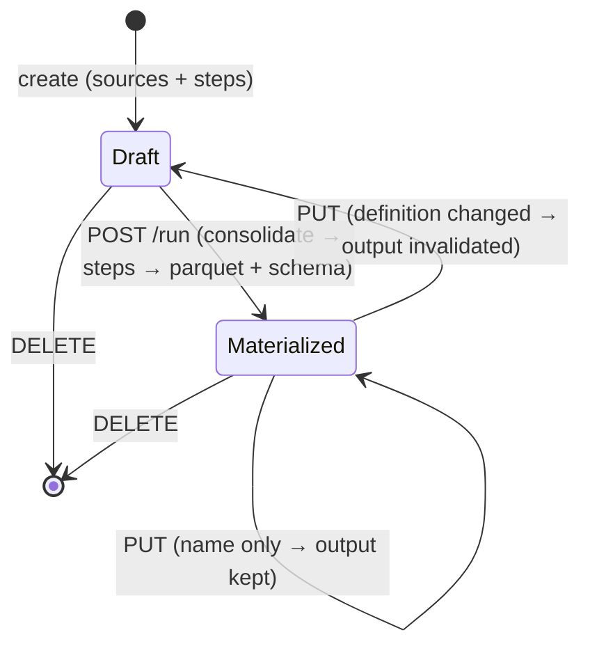

# Workflows — the Workflow domain (noun · consolidation · materialize · surfaces)

**Concept**: a **Workflow** (`wf_…`) is a named, workspace-scoped noun that
**consolidates ≥1 saved query** (and/or another workflow's output) via `UNION ALL BY
NAME`, applies the **same transform `steps`** a query uses (aggregate · derive ·
filter · top_n · sort · select · date_bucket · group_column), and **materializes a FROZEN typed output** on run. Unlike a
[Query](../queries/queries.md) — which is a *live* re-run and stores only its
definition — a Workflow **freezes** its result (a committed parquet + captured
schema), so it can be read back as a stable source and consolidates the recurring
"many exports → one table" pain the `queries ⇒ workflows` module exists for.

This doc is the **domain anchor** of `workflows/` — the home for the Workflow
**noun**, its **model · routes**, the **materialize/freeze** semantics, and its three
**FE surfaces** (catalog · builder · detail/Run). It reuses the shipped query engine
(`app/query_engine.py`) and the query/dataset FE components rather than duplicating
them.

**Status**: Accepted (R131 design gate; backend shipped R132·R134·R135·R138; FE
shipped R137; FE edit mode R139 — this doc reconciled to the built state
2026-07-01, backfilling the missing D-gate artifact flagged in that session).
**Round introduced**: [`Round_131`](../../../plan/cycles/Round_131.md) (Plan/Design
gate); FE design gate [`Round_136`](../../../plan/cycles/Round_136.md).
**Domain folder**: `workflows/`.

> **Read first — the domain noun-model.** [`../_noun-model.md`](../_noun-model.md) (R161) defines
> the five nouns (concepts locked R161) and flags the Workflow noun as **named debt D3**: the
> Query⇄Workflow **live-vs-frozen** distinction is settled, but *whether* frozen collapses to a
> **mode** of a query (dbt `table` vs `view`) is **fork-contingent + OPEN** — it only coheres if the
> query-identity fork closes toward model A. This doc is the **current-state** (noun) truth. Do not
> build *toward* a heavier Workflow noun without re-reading it.

**Sibling docs**:
[queries.md](../queries/queries.md) (the source a Workflow consolidates; the engine,
`Step` union, catalog + detail layout, and `PagedRowsView` this domain reuses),
[query-construction.md](../queries/query-construction.md) (the `StepsEditor` reused in
the builder), [datasets.md](../datasets/datasets.md) (leaf table-source; catalog
conventions), [crud-hygiene.md](../_shared/crud-hygiene.md) (the delete-confirm modal),
[workspaces.md](../workspaces/workspaces.md) (the container a Workflow is scoped to).

---

## Surfaces — layer / reuse / purity declaration

| Surface | Layer | Reusability | Purity | Allowed peer deps |
| --- | --- | --- | --- | --- |
| `WorkflowsPage` (catalog) route | `apps/builder/src/features/data-management/workflows/` | feature | feature | react, antd, @tanstack/react-query, react-router-dom |
| `WorkflowCreatePage` (builder) route | `.../features/data-management/workflows/` | feature | feature | react, antd, react-router-dom |
| `WorkflowDetailPage` (detail + Run + **edit mode**) route | `.../features/data-management/workflows/` | feature | feature | react, antd, react-router-dom |
| `WorkflowForm` component (R139 — name + sources + steps; shared by create + edit) | `.../features/data-management/workflows/` | feature | plain-UI (glue) | react, antd |
| `WorkflowSourcePicker` component | `.../features/data-management/workflows/` | feature | plain-UI (glue) | react, antd |
| `useWorkflows*`/`useSourceColumns` hooks | `.../features/data-management/workflows/` | feature | glue (server-data) | @tanstack/react-query |
| `workflowsApi` client | `apps/builder/src/api/` | builder-only | glue | (fetch — no extra peer dep) |
| `Workflow`/`WorkflowDefinition` type (FE) | `.../features/data-management/workflows/types.ts` | feature | data type | none |
| `POST/GET/PUT/DELETE /workflows…` + `/run` + `/rows` | `apps/backend/app/routers/workflows.py` | backend | feature | (FastAPI — backend native) |
| `Workflow` SQLModel + `0003_workflows` migration | `apps/backend/app/db_models.py` | backend | data type | (SQLModel/Alembic) |
| `build_consolidated_relation` / `_resolve_workflow_leaf` | `apps/backend/app/query_engine.py` | backend | pure | (DuckDB SQL) |

**Boundary check**: no new `@mdd/ui` primitive — the catalog/detail reuse the shipped
`PageContainer`/`PageCard`/`PageHeader` + `PagedRowsView`, and the builder reuses the
query `StepsEditor`. `WorkflowSourcePicker` is a feature-local AntD `Select` wrapper,
not a `@mdd/ui` primitive (no cross-domain reuse yet). No router/query/zod leaks into
`@mdd/ui`.

---

## Token map

| Surface | Source | Value (informational) |
| --- | --- | --- |
| Page background | AntD seed `colorBgLayout` (themeTokens.ts) | derived |
| Primary action ([New workflow] · [Run] · [Save]) | AntD seed `colorPrimary` (themeTokens.ts) | `#1677ff` |
| Border / summary panel | AntD seed `colorBorderSecondary` + `colorFillQuaternary` | derived |
| "Materialized" badge | AntD `Tag color="processing"` (seed `colorPrimary`) | derived |
| "Never run" badge | AntD `Tag color="default"` | derived |
| Never-run / warning state icon | AntD seed `colorWarning` (themeTokens.ts) | `#faad14` |

Inherits the dataset/query surfaces' token map verbatim (same `PageCard`/`Table`/
`PagedRowsView`); no invented inline values.

---

## Layout — ASCII intent

```text
CATALOG  /data-management/workflows
┌──────────────────────────────────────────────────────────┐
│ Workspaces ▸ Data Management ▸ Workflows   [ + New workflow ]│
│ [Workspace ▾]  [Search name…]                               │
│  Name              Sources  Steps  Workspace  Last run      │
│  Consolidated leads   1        0      Marketing  never run   │
└──────────────────────────────────────────────────────────┘

BUILDER  /data-management/workflows/new  (edit: R139, via PUT)
┌──────────────────────────────────────────────────────────┐
│ ▸ Workflows ▸ New            [Workspace ▾] name:[…] [Cancel][Save]│
│ SOURCES (consolidated by union)  ── WorkflowSourcePicker ── │
│ STEPS  ── reused StepsEditor over the first source's cols ──│
└──────────────────────────────────────────────────────────┘   (NO live preview)

DETAIL / OUTPUT  /data-management/workflows/:id
┌──────────────────────────────────────────────────────────┐
│ ▸ Workflows ▸ Consolidated leads   [Run] [Delete]          │
│ Definition: 1 source · 0 steps · Materialized 2026-07-01…  │
│  ── PagedRowsView (materialized output) ──                 │
│  (never-run state + [Run] before the first materialize)    │
└──────────────────────────────────────────────────────────┘
```

---

## Behaviour

Materialize is **explicit and frozen** — editing defines, Run produces; there is no
live preview (signed off R136). A definition change **invalidates** the frozen output.



- **Consolidation** = `UNION ALL BY NAME` over each source's resolved+filtered
  relation; `columns` = the first source's schema (same-shape assumption; BY NAME
  tolerates order differences).
- **Output-as-source**: a `wf_` resolves as a LEAF reading its frozen `output.parquet`
  (no recursion → no cycle). An un-run source → 409 on run.
- **Run errors** map like the query run path: `query_stale` / `composition_cycle` → 409.
- **`GET /rows`** 404s until the first run (the output is the rows resource).
- **Edit (R139)** — the detail page toggles an inline edit mode (mirroring the
  query detail's [Edit]) rendering the shared `WorkflowForm` over a working copy
  (name + sources + steps); [Save] `PUT`s. When the definition changed, the backend
  invalidates the frozen output → the view returns to the never-run state with a
  **"re-run to refresh"** cue; a name-only edit leaves the output intact.

---

## Acceptance criteria (Design gate exit)

**User journey** — as a basic-Excel leader, I consolidate several saved queries into
one table, shape it with steps, run it to freeze the result, and read/refresh the
output — without writing a formula.

1. **Catalog** _(FE test)_ — lists a workspace's workflows with source/step counts and
   a materialized-vs-never-run badge; row → detail. (`workflows.test.tsx`)
2. **Create** _(backend + FE)_ — `POST` validates each source is a query/workflow in
   the workspace (422) and names unique per workspace (409). (`test_workflows.py`)
3. **Run → materialize** _(backend)_ — consolidates sources, applies steps, writes
   TYPED parquet, captures `resolvedColumns` + `materializedAt`. (`test_workflows_run.py`)
4. **Consolidation** _(backend)_ — ≥1 source stacked via union (self-consolidation
   doubles the row count). (`test_workflows_run.py`)
5. **Output-as-source** _(backend)_ — a materialized `wf_` reads back as a source; an
   un-run source → 409. (`test_workflows_run.py`)
6. **Rows** _(backend + FE)_ — `GET /rows` pages the materialized output; 404 before
   first run. (`test_workflows_run.py`, `workflows.test.tsx`)
7. **Edit** _(backend)_ — `PUT` edits name + definition; a definition change clears the
   materialized output (rows→404, must re-run); a name-only edit keeps it.
   (`test_workflows.py`)
8. **Delete** _(backend)_ — `DELETE` → 204; subsequent `GET` → 404. (`test_workflows.py`)
9. **Edit mode** _(FE, R139)_ — the detail page's [Edit] reveals `WorkflowForm`
   pre-filled with the current definition; [Save] `PUT`s and returns to view; after a
   definition change the view shows the never-run state (re-run to refresh).
   (`workflows.test.tsx`)

---

## Scope boundary

### IN scope

- The Workflow noun (CRUD + run/rows + update), consolidation via union, transform
  steps (reused), materialize/freeze, output-as-source, the three FE surfaces, and the
  detail-page **edit mode** (R139 — inline `WorkflowForm` over a working copy → `PUT`).

### OUT of scope (deferred with named triggers)

- **Value-out deliverable** (Excel/CSV download of the materialized output) — deferred
  at R136; decide once the in-app output is proven (a real value-out pull).
- **YAML import/edit of the spec** — PARKED. A raw-spec editor cuts against the #1 ease
  value ("Excel-with-extra-steps"); pull only on a real #2 AI-loop or power-user need.
- **Heterogeneous-schema consolidation** (a column mapper) — v1 assumes same-shape
  sources; pull when a real divergent-schema consolidation appears.
- **Join-based consolidation** — v1 is union only; a join across sources is a later
  pull if union can't express a real consolidation.

---

## Reference materials (read-only)

- [Round_131](../../../plan/cycles/Round_131.md) (noun design gate),
  [Round_136](../../../plan/cycles/Round_136.md) (FE design gate) — the intent-before-code
  reasoning this doc distils.
- Brainstorm: [2026-07-01-queries-to-workflows-module](../../../plan/brainstorms/2026-07-01-queries-to-workflows-module.md)
  (the `hg_code` reframing that pulled the module).
- Memory: `2026-06-30-workflows-extend-query-duckdb-first` (workflows = query gains
  steps, DuckDB-first) — the doctrine the noun realizes.
