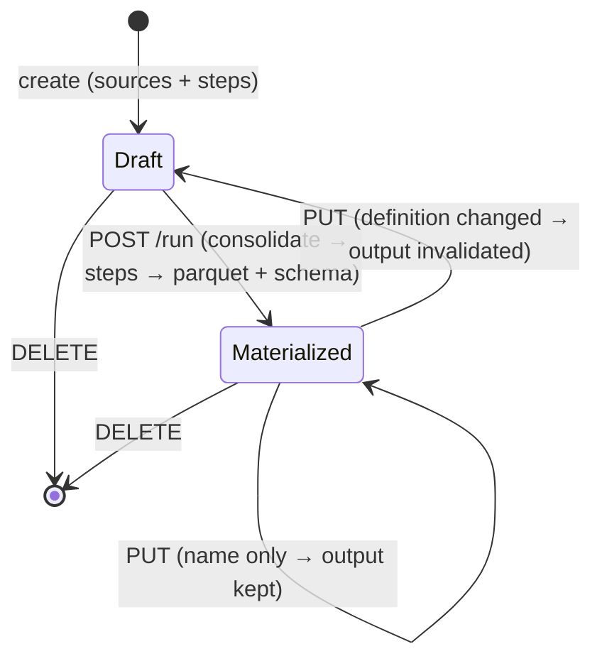

# Workflows — the Workflow domain (noun · consolidation · materialize · surfaces)

**Concept**: a **Workflow** (`wf_…`) is a named, workspace-scoped noun that
**consolidates what ≥1 saved query RETURNS** (and/or another workflow's output) via
`UNION ALL BY NAME`, applies **its own** transform `steps` — the same step union a query
uses (aggregate · derive · filter · top*n · sort · select · date_bucket · group_column) —
over that union, and **materializes a FROZEN typed output** on run. Unlike a
[Query](../queries/queries.md) — which is a \_live* re-run and stores only its
definition — a Workflow **freezes** its result (a committed parquet + captured
schema), so it can be read back as a stable source and consolidates the recurring
"many exports → one table" pain the `queries ⇒ workflows` module exists for.

**Two shaping altitudes, one per noun** (ruled R168, § The noun, settled). Per-source
shaping belongs to the **Query** and arrives already applied — a source contributes the
rows its own detail page shows. Post-union shaping belongs to the **Workflow** and is the
only shaping a Query cannot express, because a Query cannot union. They stack; they do not
compete.

This doc is the **domain anchor** of `workflows/` — the home for the Workflow
**noun**, its **model · routes**, the **materialize/freeze** semantics, and its three
**FE surfaces** (catalog · builder · detail/Run). It reuses the shipped query engine
(`app/query_engine.py`) and the query/dataset FE components rather than duplicating
them.

**Status**: Accepted (R131 design gate; backend shipped R132·R134·R135·R138; FE
shipped R137; FE edit mode R139 — this doc reconciled to the built state
2026-07-01, backfilling the missing D-gate artifact flagged in that session).
**R168 settles the noun and ships it** (§ The noun, settled): consolidation reads what a source
**returns** (D1 repaired), a workflow source resolves **frozen**, the noun is
**consolidate + materialize**, and the `composition_cycle` error code is retired.
**Round introduced**: [`Round_131`](../../../plan/cycles/Round_131.md) (Plan/Design
gate); FE design gate [`Round_136`](../../../plan/cycles/Round_136.md).
**Domain folder**: `workflows/`.

> **Read first — the domain noun-model.** [`../_noun-model.md`](../_noun-model.md) (R161) defines
> the five nouns (concepts locked R161) and flags the Workflow noun as **named debt D3**: the
> Query⇄Workflow **live-vs-frozen** distinction is settled, but _whether_ frozen collapses to a
> **mode** of a query (dbt `table` vs `view`) is **fork-contingent + OPEN** — it only coheres if the
> query-identity fork closes toward model A. This doc is the **current-state** (noun) truth. Do not
> build _toward_ a heavier Workflow noun without re-reading it.

**Sibling docs**:
[queries.md](../queries/queries.md) (the source a Workflow consolidates; the engine,
`Step` union, catalog + detail layout, and `PagedRowsView` this domain reuses),
[query-construction.md](../queries/query-construction.md) (the `StepsEditor` reused in
the builder), [datasets.md](../datasets/datasets.md) (leaf table-source; catalog
conventions), [crud-hygiene.md](../_shared/crud-hygiene.md) (the delete-confirm modal),
[workspaces.md](../workspaces/workspaces.md) (the container a Workflow is scoped to).

---

## Surfaces — layer / reuse / purity declaration

| Surface                                                                           | Layer                                                  | Reusability  | Purity             | Allowed peer deps                                    |
| --------------------------------------------------------------------------------- | ------------------------------------------------------ | ------------ | ------------------ | ---------------------------------------------------- |
| `WorkflowsPage` (catalog) route                                                   | `apps/builder/src/features/data-management/workflows/` | feature      | feature            | react, antd, @tanstack/react-query, react-router-dom |
| `WorkflowCreatePage` (builder) route                                              | `.../features/data-management/workflows/`              | feature      | feature            | react, antd, react-router-dom                        |
| `WorkflowDetailPage` (detail + Run + **edit mode**) route                         | `.../features/data-management/workflows/`              | feature      | feature            | react, antd, react-router-dom                        |
| `WorkflowForm` component (R139 — name + sources + steps; shared by create + edit) | `.../features/data-management/workflows/`              | feature      | plain-UI (glue)    | react, antd                                          |
| `WorkflowSourcePicker` component                                                  | `.../features/data-management/workflows/`              | feature      | plain-UI (glue)    | react, antd                                          |
| `useWorkflows*`/`useSourceColumns` hooks                                          | `.../features/data-management/workflows/`              | feature      | glue (server-data) | @tanstack/react-query                                |
| `workflowsApi` client                                                             | `apps/builder/src/api/`                                | builder-only | glue               | (fetch — no extra peer dep)                          |
| `Workflow`/`WorkflowDefinition` type (FE)                                         | `.../features/data-management/workflows/types.ts`      | feature      | data type          | none                                                 |
| `POST/GET/PUT/DELETE /workflows…` + `/run` + `/rows`                              | `apps/backend/app/routers/workflows.py`                | backend      | feature            | (FastAPI — backend native)                           |
| `Workflow` SQLModel + `0003_workflows` migration                                  | `apps/backend/app/db_models.py`                        | backend      | data type          | (SQLModel/Alembic)                                   |
| `build_consolidated_relation` / `_resolve_workflow_leaf`                          | `apps/backend/app/query_engine.py`                     | backend      | pure               | (DuckDB SQL)                                         |

**Boundary check**: no new `@mdd/ui` primitive — the catalog/detail reuse the shipped
`PageContainer`/`PageCard`/`PageHeader` + `PagedRowsView`, and the builder reuses the
query `StepsEditor`. `WorkflowSourcePicker` is a feature-local AntD `Select` wrapper,
not a `@mdd/ui` primitive (no cross-domain reuse yet). No router/query/zod leaks into
`@mdd/ui`.

---

## Token map

| Surface                                          | Source                                                   | Value (informational) |
| ------------------------------------------------ | -------------------------------------------------------- | --------------------- |
| Page background                                  | AntD seed `colorBgLayout` (themeTokens.ts)               | derived               |
| Primary action ([New workflow] · [Run] · [Save]) | AntD seed `colorPrimary` (themeTokens.ts)                | `#1677ff`             |
| Border / summary panel                           | AntD seed `colorBorderSecondary` + `colorFillQuaternary` | derived               |
| "Materialized" badge                             | AntD `Tag color="processing"` (seed `colorPrimary`)      | derived               |
| "Never run" badge                                | AntD `Tag color="default"`                               | derived               |
| Never-run / warning state icon                   | AntD seed `colorWarning` (themeTokens.ts)                | `#faad14`             |

Inherits the dataset/query surfaces' token map verbatim (same `PageCard`/`Table`/
`PagedRowsView`); no invented inline values.

---

## Layout — ASCII intent

```text
CATALOG  /data-management/workflows
┌──────────────────────────────────────────────────────────┐
│ Workspaces ▸ Data Management ▸ Workflows   [ + New workflow ]│
│ [Workspace ▾]  [Search name…]                               │
│  Name              Sources  Steps  Workspace  Last run      │
│  Consolidated leads   1        0      Marketing  never run   │
└──────────────────────────────────────────────────────────┘

BUILDER  /data-management/workflows/new  (edit: R139, via PUT)
┌──────────────────────────────────────────────────────────┐
│ ▸ Workflows ▸ New            [Workspace ▾] name:[…] [Cancel][Save]│
│ SOURCES (consolidated by union)  ── WorkflowSourcePicker ── │
│ STEPS  ── reused StepsEditor over the first source's cols ──│
└──────────────────────────────────────────────────────────┘   (NO live preview)

DETAIL / OUTPUT  /data-management/workflows/:id
┌──────────────────────────────────────────────────────────┐
│ ▸ Workflows ▸ Consolidated leads   [Run] [Delete]          │
│ Definition: 1 source · 0 steps · Materialized 2026-07-01…  │
│  ── PagedRowsView (materialized output) ──                 │
│  (never-run state + [Run] before the first materialize)    │
└──────────────────────────────────────────────────────────┘
```

---

## Behaviour

Materialize is **explicit and frozen** — editing defines, Run produces; there is no
live preview (signed off R136). A definition change **invalidates** the frozen output.



- **Consolidation** = `UNION ALL BY NAME` over each source's resolved+filtered
  relation; `columns` = the first source's schema (same-shape assumption; BY NAME
  tolerates order differences).
- **Output-as-source**: a `wf_` resolves as a LEAF reading its frozen `output.parquet`
  (no recursion → no cycle). An un-run source → 409 on run.
- **Run errors** map like the query run path: `query_stale` / `step_invalid` → 409.
- **`GET /rows`** 404s until the first run (the output is the rows resource).
- **The materialized write is ORDERED** (R171), by the same `_page_order_sql` keys the source
  query's paged read uses (R165 W-7): the user's `sort`/`top_n` leads, every remaining column
  breaks ties. Without it the parquet came out in whatever sequence DuckDB's plan emitted and
  the rows path read that back verbatim, so a workflow and the query it was built from
  disagreed about what the first row is — same rows, same values, different order (found in
  R168). Ordering the **write** settles the sequence once, where it is decided, rather than
  re-sorting on every read. **This is not a total order on the READ**: `query_dataset_rows` still
  has no `ORDER BY`. That read is nonetheless **stable in practice, and not by luck** — DuckDB's
  `preserve_insertion_order` (default `true`) makes a parquet **scan** emit file order even under
  parallel execution (measured 2026-08-15: 200k rows, 20 threads, 60 pages — zero duplicates, exact
  file order, stable on repeat and under a filter). **It is therefore _not_ the R165 W-7 case**,
  which reshuffled because `build_steps_relation` carries hash aggregates and window functions with
  no insertion order to preserve. What remains is narrower and still true: paging correctness on
  this path rests on an **engine default the code never sets and never asserts**.
- **Edit (R139)** — the detail page toggles an inline edit mode (mirroring the
  query detail's [Edit]) rendering the shared `WorkflowForm` over a working copy
  (name + sources + steps); [Save] `PUT`s. When the definition changed, the backend
  invalidates the frozen output → the view returns to the never-run state with a
  **"re-run to refresh"** cue; a name-only edit leaves the output intact.

---

## Acceptance criteria (Design gate exit)

**User journey** — as a basic-Excel leader, I consolidate several saved queries into
one table, shape it with steps, run it to freeze the result, and read/refresh the
output — without writing a formula.

1. **Catalog** _(FE test)_ — lists a workspace's workflows with source/step counts and
   a materialized-vs-never-run badge; row → detail. (`workflows.test.tsx`)
2. **Create** _(backend + FE)_ — `POST` validates each source is a query/workflow in
   the workspace (422) and names unique per workspace (409). (`test_workflows.py`)
3. **Run → materialize** _(backend)_ — consolidates each source **as that source returns it**
   (its own steps applied — R168), applies **the workflow's own** steps over the union, writes
   TYPED parquet, captures `resolvedColumns` + `materializedAt`. (`test_workflows_run.py`) —
   **the source-steps half is R168's D1 repair; see § The noun, settled → § D1.**
4. **Consolidation** _(backend)_ — ≥1 source stacked via union (self-consolidation
   doubles the row count). (`test_workflows_run.py`)
5. **Output-as-source** _(backend)_ — a materialized `wf_` reads back as a source; an
   un-run source → 409. (`test_workflows_run.py`)
6. **Rows** _(backend + FE)_ — `GET /rows` pages the materialized output; 404 before
   first run. (`test_workflows_run.py`, `workflows.test.tsx`)
7. **Edit** _(backend)_ — `PUT` edits name + definition; a definition change clears the
   materialized output (rows→404, must re-run); a name-only edit keeps it.
   (`test_workflows.py`)
8. **Delete** _(backend)_ — `DELETE` → 204; subsequent `GET` → 404. (`test_workflows.py`)
9. **Edit mode** _(FE, R139)_ — the detail page's [Edit] reveals `WorkflowForm`
   pre-filled with the current definition; [Save] `PUT`s and returns to view; after a
   definition change the view shows the never-run state (re-run to refresh).
   (`workflows.test.tsx`)

---

## Workflow owns the polymorphic source resolver (R167)

`resolve_source`'s `qr_` branch — which resolves a saved query into a sub-relation — is
**Workflow's, and nothing else's**. A Workflow's sources are `qr_`/`wf_` and **never** `ds_`
([common.py](../../../../workspace/apps/backend/app/models/common.py)), and
`build_consolidated_relation` resolves them through that branch.

R167 retired `query⋈query` composition, which used the same branch, and **narrowed rather than
deleted it** for exactly this reason: a Query's driving source and every join operand are now
`ds_`, and the join path resolves a dataset leaf directly, so the branch is reachable from
**exactly one call site** — a Workflow supplying a driving source. Workflow's boundary is
therefore visible in the call graph. Two consequences a reader should carry:

- **A workflow source resolves FROZEN — permanently** (ruled R168, § The noun, settled). A `wf_`
  source is a leaf: `_resolve_workflow_leaf` reads the already-materialized parquet and never
  resolves that workflow's own definition, so a self-reference reads stale rows rather than
  looping.
- **`composition_base_missing` is alive and is this domain's**: it is the un-run-workflow case.

---

## The noun, settled (R168)

Three questions arrived at this round with a shipped consequence each. All three are answered
here; the reasoning that produced them is in
[`Round_168`](../../../plan/cycles/Round_168.md) § Do.

### 1. Consolidating a query means consolidating what it RETURNS

**Ruled: yes.** A source contributes the rows and columns its own detail page shows — its steps
included. The competing reading ("one shaping layer: the workflow shapes the source's raw rows")
is not merely less attractive, it is **not self-consistent as shipped**:

- **A `wf_` source already resolves to what it RETURNS.** `_resolve_workflow_leaf` reads
  `output.parquet`, whose schema is `output_columns_json` — captured from the **post-step**
  `final_cols`. So in a single `UNION ALL BY NAME`, a workflow source contributes shaped rows
  while a query source contributes raw ones. Two source kinds, two contradictory readings, one
  union.
- **The builder already promises post-step columns.** `useSourceColumns` feeds the `StepsEditor`
  a `qr_` source's `resolvedColumns`, which are the query's **post-step** output columns
  (R120). `build_consolidated_relation` then validates the workflow's steps against the
  **pre-step** space. The UI offers a column the run rejects — a workflow step over an aggregate
  measure the builder listed fails at run with `step_invalid`.
- **The program's thesis forbids it.** [Query as the single shaping
  surface](../../../plan/programs/query-shaping-surface.plan.md): a path that reads a query's
  un-shaped rows routes _around_ the shaping surface.

So **D1 is a bug**, not the definition (noun-model
[`_noun-model.md`](../_noun-model.md)) — see § D1 below.

### 2. A workflow source is resolved FROZEN

**Ruled: frozen, and it is the noun's distinction.** Live resolution would collapse Query and
Workflow into one live noun and delete the reason this one exists (§ Concept; noun-model **D3**).
It would also pull an upstream-re-run/DAG concept the product does not have — Evolution Rule
default = don't add.

**Consequence: the `composition_cycle` ERROR CODE is retired — and the GUARD is kept.** They are
different things. With a Query's sources constrained to `ds_` (R167) and a `wf_` source a frozen
leaf, no request can make `resolve_source`'s `visited` set see a repeat, so the wire stopped
advertising an error nothing can provoke. The `visited` check itself stays: deleting it would not
make a cycle impossible, it would make one **fatal** — the API cannot express a self-referencing
query, but a hand-crafted DB row can, and it would recurse until the stack gives out. The guard
now returns an internal `source_cycle` reason with no code of its own, which each consumer maps
through its generic "this source can't resolve" fallback.

### 3. What the noun is for, that a Query with `steps` is not

Two things, and only two — both of which a Query genuinely cannot express:

|                 | The Workflow does                                                     | A Query cannot                                                          |
| --------------- | --------------------------------------------------------------------- | ----------------------------------------------------------------------- |
| **Consolidate** | `UNION ALL BY NAME` over ≥1 saved query                               | There is no `query ∪ query`; a Query has one driving source + join hops |
| **Materialize** | freeze a typed parquet + captured schema, readable as a stable source | A Query is live-only — it stores a definition and re-runs               |

Its `steps` are **not** a third thing. They are the same step union, borrowed, and their
justification is narrow: **post-union shaping** (consolidate twelve monthly queries, _then_
total them). Shaping expressible on one source belongs upstream, in the Query.

### D1 — the repair

`build_consolidated_relation` resolves each source and stacks it, but **never applies that
source's steps** ([query_engine.py](../../../../workspace/apps/backend/app/query_engine.py)) —
and, because a run materializes, **freezes the un-shaped rows to `output.parquet`**. Inherited as
noun-model **D1**, which did not dissolve when composition retired; it **relocated** here, into a
path that additionally persists the wrong answer.

**Reproduced from the dev DB, 2026-08-14** — the seeded demo still demonstrates it:

|                                                                               |    Rows | Columns                      |
| ----------------------------------------------------------------------------- | ------: | ---------------------------- |
| Query `Revenue by order status` (one `aggregate` step) on its own detail page |       4 | `status`, the summed measure |
| Workflow `Consolidated revenue by status` consolidating exactly that query    | **120** | **the 9 raw order columns**  |

**The repair**: each source's resolved relation is folded through its **own** steps before it is
stacked, and the consolidation's declared column space becomes the first source's **post-step**
columns. `_apply_step` already folds SQL→SQL — both `run_steps` and `materialize_steps` do that
fold and then execute — so the change is an extraction of that shared fold, not a new engine path.

**Shipped R168.** The fold lives in `resolve_source`'s `qr_` branch — extracted as
`_resolve_query_source`, so the resolver's contract ("what the query returns") is true for every
consumer of it, not just the consolidation path. `build_steps_relation` is the SQL→SQL fold
`run_steps` and `materialize_steps` had each written inline. Three tests assert the ruling rather
than the call site, each verified failing against the pre-fix engine.

> **Existing materialized outputs went stale on the fix** — the definition did not change, the
> engine did, so nothing invalidated them. Dev-only: `pnpm dev:seed --reset` regenerates. This is
> a real gap in the noun rather than a migration artefact, and it is on R168's acceptance walk
> (T3/T4) rather than pre-fixed: a change **upstream** of a workflow does not mark its frozen
> output stale, and only a `PUT` on the workflow itself invalidates.

---

## Scope boundary

### IN scope

- The Workflow noun (CRUD + run/rows + update), consolidation via union, transform
  steps (reused), materialize/freeze, output-as-source, the three FE surfaces, and the
  detail-page **edit mode** (R139 — inline `WorkflowForm` over a working copy → `PUT`).

### OUT of scope (deferred with named triggers)

- **Value-out deliverable** (Excel/CSV download of the materialized output) — deferred
  at R136; decide once the in-app output is proven (a real value-out pull).
- **YAML import/edit of the spec** — PARKED. A raw-spec editor cuts against the #1 ease
  value ("Excel-with-extra-steps"); pull only on a real #2 AI-loop or power-user need.
- **Heterogeneous-schema consolidation** (a column mapper) — v1 assumes same-shape
  sources; pull when a real divergent-schema consolidation appears.
- **Join-based consolidation** — v1 is union only; a join across sources is a later
  pull if union can't express a real consolidation.

---

## Reference materials (read-only)

- [Round_131](../../../plan/cycles/Round_131.md) (noun design gate),
  [Round_136](../../../plan/cycles/Round_136.md) (FE design gate) — the intent-before-code
  reasoning this doc distils.
- Brainstorm: [2026-07-01-queries-to-workflows-module](../../../plan/brainstorms/2026-07-01-queries-to-workflows-module.md)
  (the `hg_code` reframing that pulled the module).
- Memory: `2026-06-30-workflows-extend-query-duckdb-first` (workflows = query gains
  steps, DuckDB-first) — the doctrine the noun realizes.
