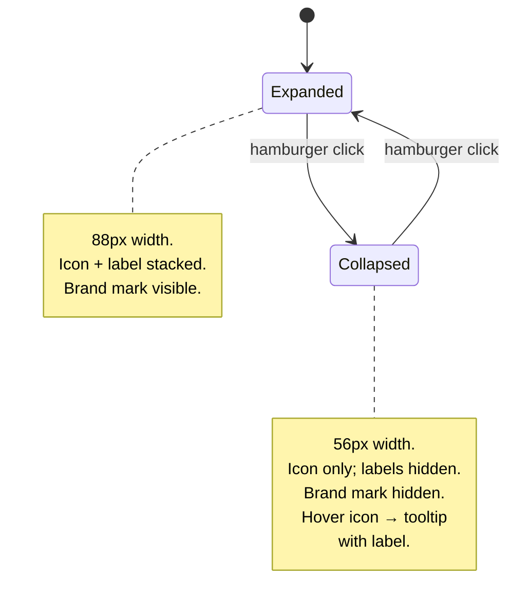
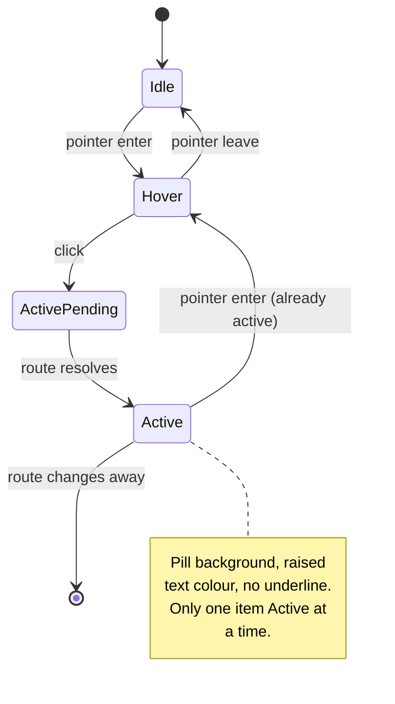

# Workspace Shell — canonical design intent

**Concept**: top-level application shell that hosts every feature
domain. Round 07's deliverable; this is the first occupant's view.
**Status**: Accepted (R07 design; shipped R07–R09).
**Round introduced**: [Round_07](../../plan/cycles/Round_07.md).
**Domain folder**: `data-management/` — placed here because Data
Management is the first puller. Promote to `_platform/` (or named at
promotion time) when a second domain consumes the shell. See
[../README.md](../README.md) §"First puller wins".

---

## Surfaces — layer / reuse / purity declaration

Per the canonical-doc template (see
[../README.md](../README.md) §"Canonical: `<concept>.md`"). This
declaration is how this concept re-states the UI/BIZ boundary rule
from
[memory/2026-05-22-ui-boundary-build-first.md](../../memory/2026-05-22-ui-boundary-build-first.md).
Surface marked `(target)` are aspirational and tracked in
[workspace-shell.target.md](./workspace-shell.target.md), not built
yet.

| Surface                          | Layer               | Reusability         | Purity              | Allowed peer deps                         |
| -------------------------------- | ------------------- | ------------------- | ------------------- | ----------------------------------------- |
| `WorkspaceShell` component       | `@mdd/ui`           | shared cross-domain | plain-UI            | react, react-dom, antd, @ant-design/icons |
| `NAV_ITEMS` data constant        | `apps/builder/src/` | builder-only        | data constant       | none                                      |
| `AppLayout` host                 | `apps/builder/src/` | builder-only        | glue (router-aware) | react, react-router-dom                   |
| `DataManagementPage` placeholder | `apps/builder/src/` | feature (DM domain) | feature             | react, antd                               |

**Boundary check**: `WorkspaceShell` is the only `@mdd/ui` row. Its
peer-dep list matches the package's permanent allow-list (no
`react-router-dom`, no `@tanstack/*`, no `zod`). Verified against
[workspace/packages/ui/package.json](../../../workspace/packages/ui/package.json)
at R09 close.

---

## Reference materials (read-only)

| Source                                                                                                   | What we look at it for                                                                                                  | Adopted?                                                                          |
| -------------------------------------------------------------------------------------------------------- | ----------------------------------------------------------------------------------------------------------------------- | --------------------------------------------------------------------------------- |
| [context/drifted-iteration.md](../../context/drifted-iteration.md)                                       | Durable summary of what drifted, what to preserve, and how to avoid depending on local ignored reference files          | **Yes**: governs how this doc treats old shell/design material                    |
| [memory/2026-05-23-drifted-shell-distillation.md](../../memory/2026-05-23-drifted-shell-distillation.md) | Sidebar/content lessons, brand deferrals, shell composition principles, and BIZ-coupling rejects distilled from drifted | **Layout**: yes, partially. **Brand palette / typography**: no, deferred          |
| [memory/2026-05-22-ui-boundary-build-first.md](../../memory/2026-05-22-ui-boundary-build-first.md)       | UI/BIZ boundary rule                                                                                                    | **Yes**: the shell primitive in `@mdd/ui` stays router-agnostic, no BIZ peer deps |

The drifted brand-palette decision is deliberately deferred. R04
established AntD-default tokens (`colorPrimary: #1677ff`,
`borderRadius: 6`); a brand refresh to the drifted palette would be
its own round with its own pull. R07 ships the shell in R04's
visual language; a future round can re-skin it without restructuring
the shell.

---

## Layout — ASCII intent

Dimensions are approximate; the React implementation will use
flex/grid to fluidly fill the viewport. Numbers in parentheses are
the target widths in pixels at desktop ≥1280px.

```text
┌─────────┬──────────────────────────────────────────────────────────┐
│         │  Data Management                                          │
│   M     │  ───────────────────────────────────────────────────────  │
│   D     │                                                            │
│   D     │  ┌─────────────────────────────────────────────────────┐  │
│         │  │                                                       │ │
│         │  │  (Placeholder content)                                │ │
│ ┌─────┐ │  │                                                       │ │
│ │ ▣   │ │  │  R07 stub: a heading + 3-sentence intent paragraph    │ │
│ │ Dat │ │  │  describing what this page will hold (CSV upload,     │ │
│ └─────┘ │  │  dataset list, schema view). Real Data Management     │ │
│         │  │  features arrive in later rounds, each its own        │ │
│         │  │  design doc + round.                                  │ │
│         │  │                                                       │ │
│         │  └─────────────────────────────────────────────────────┘  │
│         │                                                            │
│         │                                                            │
│         │                                                            │
└─────────┴──────────────────────────────────────────────────────────┘
  ↑ 88px            ↑ fluid (min 800px content area)
  Sidebar          Content area

Active nav-item ─┐
                 └─ "▣ Dat" pill: filled-background + raised text colour
                    (rest of nav-items render as icon-only or text-only
                    glyphs; only the active item gets the pill)
```

### Structural notes

- **Sidebar**: fixed width `88px` (compact-mode default for R07; an
  expanded-mode toggle is **out of scope** — defer to a later round).
- **Top app-bar**: deliberately absent in R07. The drifted iteration
  had search + language switcher + user menu in a top bar; those are
  BIZ concerns (search of what? user of which account?) and stay
  deferred. The content area starts at the top edge with the page
  title.
- **Right rail** (drifted Sample had Server Status / Contacts /
  Messages / Activity): **out of scope**. Single-column content
  area for R07; right-rail composition is a per-page decision in
  later rounds.
- **Workspace picker**: **out of scope**. R07 ships an implicit
  single "default" workspace context; a picker arrives when a
  second workspace pull is real. See
  [memory/2026-05-22-round-roadmap-deferrals.md](../../memory/2026-05-22-round-roadmap-deferrals.md).

---

## Token map

All tokens cite
[workspace/packages/ui/src/themeTokens.ts](../../../workspace/packages/ui/src/themeTokens.ts)
or the AntD seed-token system. Nothing here introduces a new token.

| Surface                              | Source                                                                          | Value (informational)  |
| ------------------------------------ | ------------------------------------------------------------------------------- | ---------------------- |
| Sidebar background                   | AntD seed `colorBgContainer` (derived from `colorBgBase`)                       | `#ffffff`              |
| Sidebar right border                 | AntD seed `colorBorderSecondary`                                                | derived                |
| Active nav-item background           | AntD seed `colorPrimary` (10% alpha tint via `colorPrimaryBg`)                  | derived from `#1677ff` |
| Active nav-item text/icon            | AntD seed `colorPrimary`                                                        | `#1677ff`              |
| Idle nav-item icon/text              | AntD seed `colorTextSecondary`                                                  | derived                |
| Content area background              | AntD seed `colorBgLayout`                                                       | derived                |
| Page title text                      | AntD seed `colorTextHeading`                                                    | derived                |
| Body text                            | AntD seed `colorText`                                                           | `#000000`              |
| Border radius (nav-item pill, cards) | `borderRadius: 6`                                                               | `6px`                  |
| Font                                 | `fontFamily: -apple-system, BlinkMacSystemFont, "Segoe UI", Roboto, sans-serif` | system stack           |

If R07 implementation finds that AntD's `<Layout.Sider>` does not
expose a clean styling hook for one of these surfaces, document the
deviation in the round's Do phase and update this table; do not
introduce ad-hoc hex values.

---

## Icons

Each nav-item carries an icon from
[`@ant-design/icons@^6.0.0`](https://ant.design/components/icon) (a
peer dependency of `@mdd/ui`). The icon is the entire visual content
when the sidebar is in any future collapsed mode, so the choice
should be recognisable at small size.

**Authority**: AntD icon names below resolve to the exported React
components in `@ant-design/icons`. The SVG path data lives in
[`@ant-design/icons-svg`](https://www.npmjs.com/package/@ant-design/icons-svg)
(transitive dep). Versions are pinned via `pnpm-lock.yaml`.

| Key               | AntD icon          | Rationale                                                                                                                                                                       | Round added |
| ----------------- | ------------------ | ------------------------------------------------------------------------------------------------------------------------------------------------------------------------------- | ----------- |
| `data-management` | `DatabaseOutlined` | Represents the underlying DuckDB store; signals "data work, not chrome." Outlined weight matches AntD's default nav-item icon idiom (1em).                                      | R08         |
| `__shell.toggle`  | `MenuOutlined`     | Sidebar collapse/expand hamburger. Single neutral glyph rather than paired `MenuFold` / `MenuUnfold` — user reads collapse state from the sidebar's actual width, not the icon. | R09         |

The `__shell.*` namespace is reserved for shell-internal controls
(toggles, brand mark, etc.) — not real navigation entries. When a
future round adds a nav-item, it adds a row here in the same
round, citing the round id in the last column. The `.preview.html`
freezes the rendered SVG markup for the chosen icon — see
[../README.md §"When to add structure"](../README.md) for the
preview drift caveat.

---

## Collapse states

The sidebar has two width states, toggled by a hamburger button
at the top of the sidebar. Default state is **expanded**;
collapse is opt-in per session (persistence is deferred — see
the scope boundary below).



### Width and content table

| State     | Sidebar width | Brand mark | Nav-item label  | Tooltip on hover |
| --------- | ------------- | ---------- | --------------- | ---------------- |
| Expanded  | 88px          | Visible    | Visible (below) | Suppressed       |
| Collapsed | 56px          | Hidden     | Hidden          | Shows label      |

The width changes via a **200ms CSS transition** for visual
polish. Label visibility flips via `display: none` (instant; the
column re-flows to icon-only at 56px). Brand mark visibility
also flips instantly — at 56px there's no room for the 56px-square
MDD block. The hamburger button stays in the same screen position
(top of sidebar) in both states.

### Collapsed wireframe

```text
┌─────┬──────────────────────────────────────────────────────────┐
│  ☰  │  Data Management                                          │
│     │  ───────────────────────────────────────────────────────  │
│     │                                                            │
│ ┌─┐ │  (Placeholder content — same as expanded state)            │
│ │▣│ │                                                            │
│ └─┘ │                                                            │
│     │                                                            │
└─────┴──────────────────────────────────────────────────────────┘
  ↑ 56px
  Sidebar (no brand, icon-only nav,
           tooltip on hover shows "Data")

Hamburger ─┘
(at top of sidebar in both states; click toggles back to 88px expanded)
```

### Interaction rules

- The shell is **stateless about collapse**: the parent owns the
  state via `collapsed` prop and `onToggleCollapse` callback.
  This keeps the shell consistent with R07's stateless-about-
  routing rule and lets the consumer choose where to persist
  preference (future round).
- **No persistence in R09**: state resets on each page load.
- **Tooltip rendering**: AntD `<Tooltip>` wraps each nav-item.
  In expanded state, the tooltip's `title` is empty so AntD
  short-circuits and renders no tooltip element. In collapsed
  state, `title={item.label}` so hover/focus reveals the label.
  Keeps the DOM clean in the common (expanded) case.
- **Hamburger button** is itself a `<button>` (not a nav-item)
  styled to match the sidebar's visual rhythm. It is not part
  of `NavItem[]`; it lives in the shell's chrome.

---

## Behaviour — nav-item states



### Interaction notes

- **Click** on a nav-item triggers `onSelect(key)` callback exposed
  by `<WorkspaceShell>`. The shell does not navigate itself — the
  consuming app (builder) wires the callback to its router.
- **Keyboard**: Tab moves focus through items; Enter / Space
  activates. Focus ring uses AntD's default outline (no custom
  treatment in R07).
- **Active item is driven by prop**, not internal state. The
  consumer passes `activeKey="data-management"` based on the
  current route. This keeps the shell stateless about routing.
- **Hover affordance**: subtle background tint (`colorFillTertiary`
  or similar) — gentle, not pill-strength. Distinguishable from
  Active.

---

## Component contract — `<WorkspaceShell>` in `@mdd/ui`

Per
[memory/2026-05-22-ui-boundary-build-first.md](../../memory/2026-05-22-ui-boundary-build-first.md):
**router-agnostic, no BIZ peer deps**. Peer deps stay `react`,
`react-dom`, `antd`, `@ant-design/icons` only.

### Proposed signature

```typescript
type NavItem = {
  key: string;
  label: string;
  icon?: ReactNode;
};

type WorkspaceShellProps = {
  items: NavItem[];
  activeKey: string;
  onSelect: (key: string) => void;
  children: ReactNode;
  // R09 additions — collapse state machine
  collapsed?: boolean; // default false (expanded)
  onToggleCollapse?: () => void; // no-op when absent
};

export function WorkspaceShell(props: WorkspaceShellProps): JSX.Element;
```

### Positive usage example (builder)

```tsx
import { WorkspaceShell } from '@mdd/ui';
import { useNavigate, useLocation } from 'react-router-dom';

const items = [{ key: 'data-management', label: 'Data Management', icon: <DatabaseOutlined /> }];

export function Layout({ children }: { children: ReactNode }) {
  const navigate = useNavigate();
  const { pathname } = useLocation();
  const activeKey = pathname.startsWith('/data-management') ? 'data-management' : '';

  return (
    <WorkspaceShell items={items} activeKey={activeKey} onSelect={(key) => navigate(`/${key}`)}>
      {children}
    </WorkspaceShell>
  );
}
```

`react-router-dom` lives in `apps/builder/package.json`. **Never** in
`workspace/packages/ui/package.json`. The drifted iteration leaked
`react-router-dom` into `@mdd/ui` as a peer dep — that was the BIZ
entanglement that motivated the build-first lesson.

### Negative example (rejected)

```tsx
// ❌ Do not do this — couples @mdd/ui to a specific router
import { useNavigate } from 'react-router-dom'; // ← in @mdd/ui!

export function WorkspaceShell({ items }: { items: NavItem[] }) {
  const navigate = useNavigate(); // ← shell decides routing
  // ...
}
```

If `WorkspaceShell` imports anything from `react-router-dom`,
`@tanstack/react-query`, `zod`, or any feature-state library, the
boundary is broken. Reject the change.

---

## Acceptance criteria (Design gate exit)

Testable criteria the R07–R09 chain satisfies, each mapping to at least
one automated test. Numbered `C1`–`C6`; they describe the **shipped**
shell behaviour.

**User journey** — as a user I navigate the app through a persistent
sidebar shell: I see where I am, switch sections, and collapse the
sidebar to reclaim room.

1. **Shell render** _(FE component)_ — `<WorkspaceShell items activeKey
   onSelect>` renders the sidebar nav and the content region; the item
   matching `activeKey` gets the pill treatment and only one item is
   active at a time.
2. **Router-agnostic boundary** _(FE / boundary check)_ — `@mdd/ui`'s
   `WorkspaceShell` imports nothing from `react-router-dom`,
   `@tanstack/*`, or `zod`; navigation flows only through the consumer's
   `onSelect(key)` callback.
3. **Collapse (R09)** _(FE)_ — a hamburger toggles the sidebar 88px
   expanded ↔ 56px collapsed via a 200 ms width transition; collapsed
   hides labels and the brand mark and reveals a tooltip on hover; the
   state is parent-owned (`collapsed` + `onToggleCollapse`) with no
   persistence.
4. **Nav-item states** _(FE)_ — idle / hover / active per the
   state machine; keyboard Tab moves focus and Enter / Space activates;
   the active item is driven by the `activeKey` prop, not internal
   state.
5. **Routing wiring** _(FE / integration)_ — the builder layout wires
   `onSelect` to the router; `/` redirects to the Data-Management
   landing route; the `/data-management` route renders inside the shell.
6. **Icons** _(FE)_ — each nav-item carries its `@ant-design/icons`
   glyph (e.g. `DatabaseOutlined`) and the hamburger uses
   `MenuOutlined`.

---

## Scope boundary — R07

### IN scope

- `<WorkspaceShell>` primitive in `@mdd/ui` per the contract above.
- Builder layout component wiring the shell to `react-router-dom`.
- One route `/data-management` rendering a placeholder page (heading
  with a 3-sentence intent paragraph; no real features).
- Root route `/` redirects to `/data-management` (only nav item, no
  ambiguity).
- This design doc + the `.preview.html` brainstorming aid.

### OUT of scope (deferred to later rounds, each its own pull)

- **Sidebar expand/collapse toggle** — R07 ships compact-only.
- **Top app-bar** (search, language, notifications, user menu) — BIZ
  concerns; defer until each pull is real.
- **Right rail** — single-column content area for R07.
- **Workspace picker / multi-workspace switching** — implicit
  single "default" workspace context only; picker waits for a real
  second workspace.
- **Actual Data Management features** (CSV upload, dataset list,
  schema view, profiling) — each its own round.
- **Brand refresh** to the drifted palette (`#4F45B6` purple etc.)
  — current shell uses R04's AntD-default tokens. Brand refresh is
  a separate, future round with its own design doc.
- **Accessibility audit** — basic keyboard + focus-ring behaviour
  is in scope; full a11y pass (ARIA roles, screen reader, contrast
  audit) is a separate round when pulled.
- **Responsive / mobile** — desktop ≥1280px is the target this
  round. Narrower viewports are deferred.

---

## Open questions for HIxAI review

1. **Sidebar width**: 88px feels right for icon + short label below
   icon. Confirm or propose alternative.
2. **Active-item treatment**: pill background, or left-edge accent
   bar, or both? Sample preview shows pill; left-bar is a common
   alternative.
3. **Where does the app brand mark go** (top-left of sidebar)?
   Confirm "MDD" text mark for now (the preview shows three letters
   stacked); a logo is deferred.
4. **Route base for Data Management** — `/data-management` (clear,
   slug-cased) or `/data` (terse)? Preview uses
   `/data-management` to match the domain folder name. Confirm.
