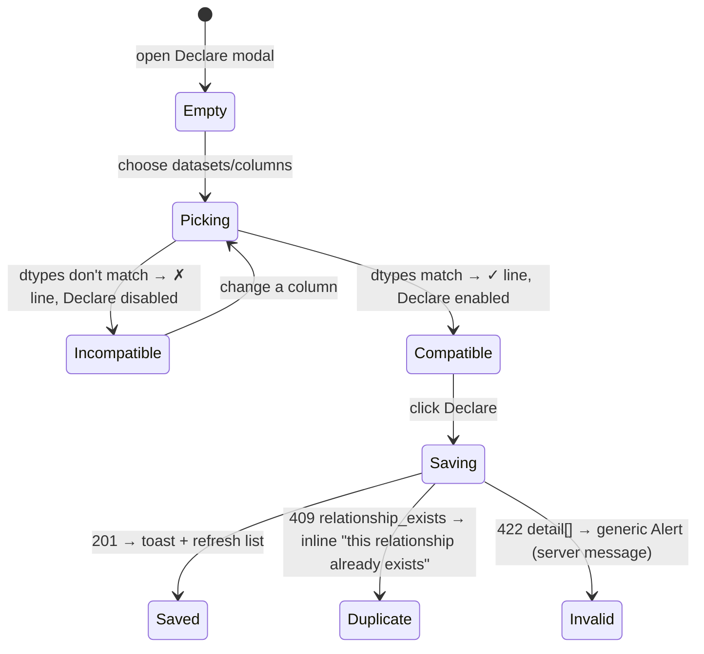
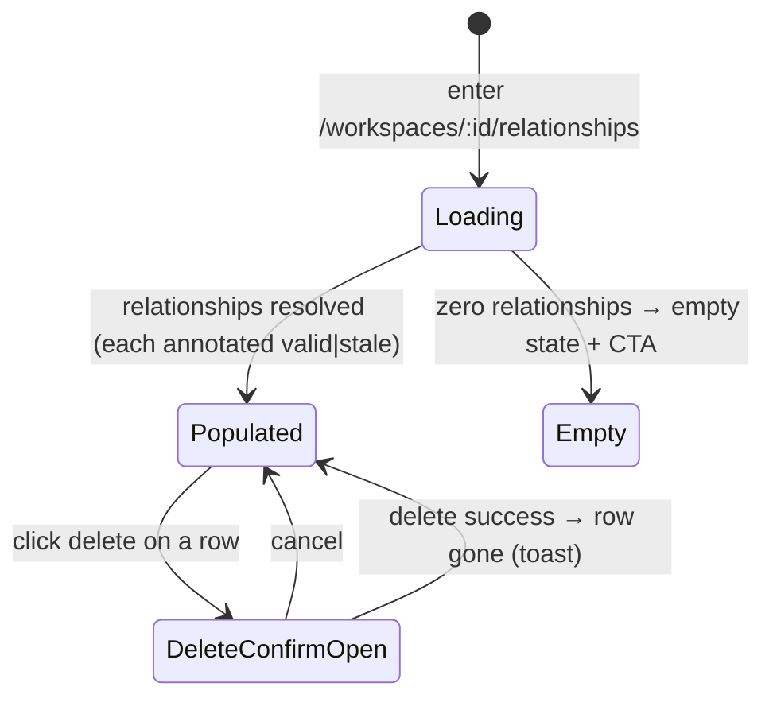

# Relationships — govern validated joins between a workspace's datasets

**Concept**: a **Relationship** is a **governed edge** between two Datasets in
the same Workspace — a column pair `left.col ↔ right.col` with a declared
**cardinality** and a validated **dtype compatibility**. It is a genuinely
**new entity**, but an _edge_, **not a table-source**: Datasets and
[Queries](../queries/queries.md) are the table-sources it connects. Its
**home is the Workspace** that owns those datasets (joins are within-workspace).
This surface is **governance only** — a user **declares** an edge, the system
**validates** it (both columns exist, dtypes join-compatible), and the edge is
**stored, listed, and kept honest** against schema drift (`flag, don't reject` —
[purpose.md](../../../context/purpose.md) #5). It produces **no joined rows**;
consuming a Relationship to actually join is the
[Query Builder](../queries/queries.md)'s job.
**Status**: Accepted, shipped (full DCFBI chain: governance only). The governed
edge carries what a real join needs as input — the join key pair, two sources,
the freshness gate — see
[joins.md § Truth-test record](../queries/queries.md#joins-reading-related-datasets-as-one).
Relationship governance is a stated product requirement
([purpose.md](../../../context/purpose.md) #4: _"Relationships are central and
not fixed… relationship governance is a product requirement"_) and the third
step of the critical path (`data → relationships → dashboards`).
**Domain folder**: `data-management/workspaces/` (a Relationship is owned by the
**Workspace** whose datasets it connects — J-1; a sibling of
[workspaces.md](workspaces.md), **not** a top-level catalog and **not** a
dataset-detail section).
**Sibling docs**:
[workspaces.md](workspaces.md) (the container that owns relationships; this view
is reached from the workspace card),
[datasets.md](../datasets/datasets.md) +
[dataset-detail.md](../datasets/dataset-detail.md) (the datasets + the column /
`dtype` metadata the compatibility rule reads),
[joins.md](../queries/queries.md#joins-reading-related-datasets-as-one) (the **consumer** — R71 join execution resolves a
declared Relationship to produce joined rows) +
[query-builder.md](../queries/queries.md) (the queries domain anchor),
[crud-hygiene.md](../_shared/crud-hygiene.md) (the delete-confirm modal reused
here),
[workspace-shell.target.md](../../_platform/workspace-shell.target.md) (the
chrome all surfaces render inside).

> **Why an edge, not a mode or a table-source (the noun-vs-mode check).** Unlike
> a Query (a virtual dataset — a _mode_ of the dataset surfaces), a Relationship
> is structurally distinct: it has no rows of its own; it _relates_ two
> row-sources. So it earns a new entity — but the
> [anti-duplication invariant](../queries/queries.md#the-reuse-invariant-the-one-rule-this-domain-holds)
> still binds its **surfaces**: the declare flow is a **modal**, the list
> **reuses the Page-List layout**, validation **reuses the dataset `dtype`
> metadata** — never a parallel page, never a re-invented engine
> ([specious-model-lock-in](../../../memory/2026-06-13-specious-model-lock-in.md)).

---

## Surfaces — layer / reuse / purity declaration

| Surface                                             | Layer                                                     | Reusability         | Purity             | Allowed peer deps                  |
| --------------------------------------------------- | --------------------------------------------------------- | ------------------- | ------------------ | ---------------------------------- |
| `WorkspaceRelationshipsPage` (reuses Page-List)     | `apps/builder/src/features/data-management/relationships` | feature             | feature            | react, antd, @tanstack/react-query |
| `DeclareRelationshipModal` component                | `apps/builder/src/features/data-management/relationships` | feature             | feature            | react, antd                        |
| `useRelationshipsQuery` / `use*Mutation` hooks      | `apps/builder/src/features/data-management/relationships` | feature             | glue (server-data) | @tanstack/react-query              |
| `relationshipsApi` client                           | `apps/builder/src/api`                                    | builder-only        | glue               | (fetch — no extra peer dep)        |
| `POST/GET/DELETE …/relationships` routes            | `apps/backend`                                            | backend             | feature            | (FastAPI — backend native)         |
| `Relationship` Pydantic model                       | `apps/backend/app/models/common.py`                       | backend             | data type          | pydantic                           |
| `Relationship` type (frontend)                      | `.../features/data-management/relationships/types.ts`     | feature             | data type          | none                               |
| `<DeleteConfirmModal>` (reused)                     | `apps/builder/src/features/data-management/_shared`       | shared cross-domain | plain-UI           | react, antd                        |
| Page-List shells `PageHeader` / `PageCard` (reused) | `apps/builder/src/features/data-management/_shared`       | shared cross-domain | plain-UI           | react, antd                        |

**Boundary check**: the only shared-cross-domain rows (`<DeleteConfirmModal>`,
the Page-List shells) are **reused, not owned** — their boundaries live in
[crud-hygiene.md](../_shared/crud-hygiene.md) / [datasets.md](../datasets/datasets.md).
`WorkspaceRelationshipsPage` is feature-local and **composes** the shared
Page-List layout, adding only its own column config + the declare action. No
relationships surface re-implements a dataset/query surface; the dataset `dtype`
metadata is **read**, never re-modeled.

---

## Token map

The relationships surfaces are AntD primitives (`<Table>`, `<Modal>`, `<Select>`,
`<Segmented>`, `<Tag>`, `<Empty>`, `<Button>`, `<Alert>`) styled by the
`<ConfigProvider>` tokens derived from the six seeds in
[`themeTokens.ts`](../../../../workspace/packages/ui/src/themeTokens.ts) (the
source of truth — R66). **No new token is introduced**; the map reuses the
identifiers already cited by [datasets.md](../datasets/datasets.md) and
[saved-query.md](../queries/queries.md). `Value` is informational.

| Surface                                     | AntD token (themeTokens.ts) | Value (informational) |
| ------------------------------------------- | --------------------------- | --------------------- |
| Page background                             | `colorBgLayout`             | `#f5f5f5`             |
| Page / modal card background                | `colorBgBase`               | derived               |
| Table header background                     | `colorFillQuaternary`       | derived               |
| Table row border                            | `colorBorderSecondary`      | `#f0f0f0`             |
| `[+ Declare relationship]` / primary action | `colorPrimary`              | `#1677ff`             |
| Compatible-keys check ✓ (success)           | `colorSuccess`              | `#52c41a`             |
| Incompatible-keys / stale warning           | `colorWarning`              | `#faad14`             |
| Cardinality / status `<Tag>` text           | `colorTextSecondary`        | derived               |
| Border radius (card, table, modal)          | `borderRadius`              | `6`                   |
| Font family                                 | `fontFamily`                | system stack          |

Identifier parity is enforced by
[`design-token-parity.mjs`](../../../../scripts/lint/design-token-parity.mjs).

---

## Layout — ASCII intent

All surfaces render inside the master-layout chrome
([workspace-shell.target.md](../../_platform/workspace-shell.target.md)). There is
no workspace _detail_ page today (only the card grid), so this surface is a thin
workspace-scoped sub-route **`/data-management/workspaces/:id/relationships`**
reached from the workspace card (a **Relationships** affordance on the card; J-1)
— **not** a full workspace detail page (the [brake](../../../context/purpose.md#dynamic-equilibrium)).

### Relationships list — `/data-management/workspaces/:id/relationships`

Reuses the **standard Page-List layout** (`PageHeader` + `PageCard` + AntD
`<Table>`) — the same shell as [datasets.md](../datasets/datasets.md), with a
relationships column config. **Not** a duplicated `DatasetsPage`.

```text
Home ▸ Data Management ▸ Workspaces ▸ Marketing ▸ Relationships   [+ Declare relationship]
Relationships in “Marketing”
Govern how this workspace’s datasets join. Used by the Query Builder to combine sources.

┌──────────────────────────────────────────────────────────────────────────────────────┐
│  PageCard                                                                              │
│   ┌───────────────────────────────────────────────────────────────────────────────┐  │
│   │ Left              │ Right            │ Keys               │ Cardinality │ Status │  │
│   ├───────────────────────────────────────────────────────────────────────────────┤  │
│   │ Deals             │ Accounts         │ account_id ↔ id    │ many:many*  │ ✓      │  │
│   │ Deals             │ Owners           │ owner_id ↔ id      │ 1:many      │ ⚠ stale│  │
│   └───────────────────────────────────────────────────────────────────────────────┘  │
└──────────────────────────────────────────────────────────────────────────────────────┘
   * cardinality is declared (MVP); sampling-based inference is deferred.
```

- **Columns**: Left (dataset, links to its detail), Right (dataset, links),
  Keys (`left.col ↔ right.col`, the derived label — there is **no** user name,
  J-5), Cardinality (`<Tag>`), Status (`✓` valid / `⚠ stale`). Default sort:
  created desc. **Row action**: delete (`<DeleteConfirmModal>`); rows are not
  editable this round (re-declare to change — see Scope).
- **Empty state**: _"No relationships yet. Declare how two datasets join so the
  Query Builder can combine them."_ + the `[+ Declare relationship]` CTA. No
  drop zone.

### Declare modal — pick two columns, validate, save

```text
        ┌──────────────── Declare relationship ─────────────────┐
        │  Left dataset   [ Deals            ▾ ]                 │
        │  Left column    [ account_id  (integer) ▾ ]           │
        │  Right dataset  [ Accounts         ▾ ]                 │
        │  Right column   [ id          (integer) ▾ ]           │
        │  Cardinality    ( 1:1 ) ( 1:many ) (•many:many)        │
        │  ──────────────────────────────────────────────────   │
        │  ✓ Keys are join-compatible (integer ↔ integer)        │
        │                          [ Cancel ] [ Declare ]        │
        └────────────────────────────────────────────────────────┘
```

- Dataset selects list **this workspace's** datasets only; column selects list
  that dataset's columns **with their `dtype`** (read from the dataset metadata).
- A **live compatibility line** updates as columns change: `✓` when
  join-compatible, `⚠` with the reason when not (e.g. _"`amount` (float) and
  `name` (string) can't join"_). **Declare is disabled** until both columns are
  chosen and compatible.

### Stale state (a join column drifted away)

If a referenced column was removed or retyped after the edge was declared
([purpose.md](../../../context/purpose.md) #5 — _flag, don't reject_): the row's
Status shows `⚠ stale` and an inline detail; the edge is **not** auto-deleted.

```text
│ Deals  │ Owners  │ owner_id ↔ id  │ 1:many │ ⚠ stale │
│   ⚠ “owner_id” no longer exists in Deals. Re-declare or delete.   [Delete] │
```

---

## Data model

The `Relationship` entity persists to the `relationships` table in `app.sqlite`.
The **schema of record is the SQLModel `Relationship` table**
([db_models.py](../../../../workspace/apps/backend/app/db_models.py)), evolved via
**Alembic** (`alembic/versions/0001_baseline.py`). Request **handlers use raw
`sqlite3`** (`db.get_conn()`, hand-written SQL, `PRAGMA foreign_keys = ON` per
connection) — SQLModel owns the DDL/migration, the handlers own the queries.

```ts
// Frontend type — features/data-management/relationships/types.ts
type Cardinality = 'one_to_one' | 'one_to_many' | 'many_to_many'; // J-5; direction by side order
type RelationshipStatus = 'valid' | 'stale'; // COMPUTED at read vs current schemas — not stored

type Relationship = {
  id: string; // backend-generated, pattern `^rel_[0-9a-f]{8}$`
  workspaceId: string; // FK → Workspace.id (the governance scope)
  leftDatasetId: string; // FK → Dataset.id
  leftColumn: string; // a column name in leftDataset.columns[]
  rightDatasetId: string; // FK → Dataset.id (same workspace)
  rightColumn: string; // a column name in rightDataset.columns[]
  cardinality: Cardinality; // declared (MVP); inference deferred
  status: RelationshipStatus; // 'stale' iff a referenced column no longer validates
  createdAt: string; // ISO-8601 UTC
};
```

**Persistence (SQLModel schema of record).** Mirrors the `queries` table
conventions (per-workspace uniqueness, FK cascade). **Status is not a column** —
it is recomputed on every read by checking both columns against the current
dataset schemas (the always-fresh discipline, like `query_stale`). The effective
DDL the SQLModel model emits:

```sql
CREATE TABLE relationships (
    id TEXT PRIMARY KEY,                                       -- rel_xxxxxxxx
    workspace_id     TEXT NOT NULL REFERENCES workspaces(id) ON DELETE CASCADE,
    left_dataset_id  TEXT NOT NULL REFERENCES datasets(id)   ON DELETE CASCADE,
    left_column      TEXT NOT NULL,
    right_dataset_id TEXT NOT NULL REFERENCES datasets(id)   ON DELETE CASCADE,
    right_column     TEXT NOT NULL,
    cardinality TEXT NOT NULL
        CHECK (cardinality IN ('one_to_one','one_to_many','many_to_many')),
    created_at TEXT NOT NULL
);
CREATE INDEX idx_relationships_workspace_id ON relationships(workspace_id);
-- one governed edge per ordered column-pair, per workspace (J-5; no user name)
CREATE UNIQUE INDEX idx_relationships_pair_unique
    ON relationships(workspace_id, left_dataset_id, left_column, right_dataset_id, right_column);
```

**Compatibility rule (J-4).** Two columns are **join-compatible** iff their
`dtype`s (from the closed enum `string` / `integer` / `float` / `boolean` /
`date` / `datetime`) are equal, **with `integer` ↔ `float` allowed** (numeric);
every other cross-type pair is rejected. The rule reuses the dataset column
metadata; no new dtype machinery.

**Centralized constants.** `relationship: '^rel_[0-9a-f]{8}$'` lives in the
shared `id_patterns`; the `relationship_stale` error code is defined but unused
until its first consumer (the join executor) — see the contract note below.

---

## Behaviour

### Declare flow



- **Declare** is disabled until both columns are chosen and the live
  compatibility check passes. The check is advisory on the client; the **server
  re-validates** on POST (the client check can't be trusted alone).
- **Self-pair guard**: same dataset + same column on both sides is rejected
  (a degenerate edge); self-joins (same dataset, _different_ columns) are **out**
  this round (Scope) and also rejected `422`.
- **Promote target.** The same `POST …/relationships` is the **promote** endpoint for a
  query-owned relationship: the Query Builder's canvas ([canvas.md](../queries/canvas.md))
  posts a query-local rel's join fields here to lift it into the governed ER, reusing the
  whole rulebook (dedup `409`, dtype/self `422`) — no separate route. On success the
  query-owned rel records the new `rel_` id as its provenance back-ref.

### List / governance reads



- Each listed relationship is annotated `status: valid | stale` **computed at
  read** (validate both columns against current schemas). Stale rows render the
  warning affordance; they are never auto-removed (flag, don't reject).
- **Delete** reuses `<DeleteConfirmModal>`
  ([crud-hygiene.md](../_shared/crud-hygiene.md), `resourceLabel="relationship"`).
  Deleting a **dataset** or **workspace** cascades its relationships away
  (FK `ON DELETE CASCADE`). No dependents this round (R71's joins will add a
  dependency check before delete).

### Accessibility (declared here so F builds it, not infers it)

- The **live compatibility line** is an `aria-live="polite"` region so its
  `✓ compatible` / `⚠ <reason>` change is announced, not just shown — it is the
  learnability affordance for the non-obvious "which columns can join" rule, and
  must reach screen-reader users.
- The **Status** indicator is **icon + text** (`✓ valid` / `⚠ stale`), never
  colour-only; the icon carries an accessible name. Cardinality is a labelled
  `<Tag>`, not a colour swatch.
- The declare controls are AntD `<Select>` / `<Segmented>` with **visible
  labels** (label-above, per the AntD Data-Entry fast-fill guidance) and are
  keyboard-reachable; `[Declare]` / `[Cancel]` are focus-order reachable, and
  `Esc` closes the modal.

### Caching (TanStack query keys)

- `['relationships', { workspaceId }]` — the workspace's relationships.
- `['relationship', id]` — a single relationship.
- Create / delete invalidate `['relationships', { workspaceId }]`.

---

## Data contract (intent — formalized at the Contract gate)

The Contract phase formalizes the wire shapes under
`workspace/packages/contracts/relationships/` (mirroring `queries/`: one
`.yaml` + `.md` per verb + a `_shared/relationship.yaml`). This section states
the **design intent** the YAML must satisfy.

| Route                                 | Purpose | Notes                                                                                                                                                                                            |
| ------------------------------------- | ------- | ------------------------------------------------------------------------------------------------------------------------------------------------------------------------------------------------ |
| `POST /workspaces/{id}/relationships` | declare | body `{ leftDatasetId, leftColumn, rightDatasetId, rightColumn, cardinality }`; 201 → `Relationship`; 409 duplicate pair; 422 unknown column / incompatible dtype / cross-workspace / self-pair. |
| `GET /workspaces/{id}/relationships`  | list    | `Relationship[]`, `created_at` desc, each with **computed `status`**; scoped to the workspace.                                                                                                   |
| `GET /relationships/{id}`             | get     | one `Relationship` (computed `status`); 404 if absent.                                                                                                                                           |
| `DELETE /relationships/{id}`          | delete  | 204; 404 if absent. **No `/rows` route** — governance only (joins are R71).                                                                                                                      |

- **`status` is computed, not stored** — list/get re-validate the columns vs the
  current dataset schemas, returning `valid | stale`. Governance reads **never
  error on stale** (they annotate); a **`409 relationship_stale`** is reserved
  for **R71** join execution, where a stale edge must block the join. _(This
  refines J-4, which named `relationship_stale`: in R70 stale is a non-erroring
  status; the 409 variant lands with its first consumer.)_ **R71 consumes it** —
  a join over a stale edge returns `409 relationship_stale`
  ([saved-query.md § Execution model](../queries/queries.md#execution-model-live-re-run-no-materialization)).
- **Error envelopes.** The duplicate-pair conflict is a code-first envelope —
  `409 { code: "relationship_exists" }` (reusing the shared
  [api-error.yaml](../../../../workspace/packages/contracts/_shared/api-error.yaml)
  shape). The **declare `422` carries NO machine code**: it is the generic
  FastAPI/pydantic validation envelope `detail: [{ loc, msg, type: "value_error" }]`.
  The human reason (self-pair, unknown dataset, cross-workspace, unknown column,
  incompatible join keys) rides as a text prefix inside `msg` — it is not a
  structured `code`. The FE special-cases only `relationship_exists`; every other
  failure renders the server message in a generic `<Alert>`.

---

## Acceptance criteria (Design gate exit)

**User journey** — as a user I open a workspace's **Relationships**, declare that
a column in one dataset joins a column in another, the system confirms the keys
are compatible and remembers the edge, I see it listed (and flagged if a column
later drifts), so that the Query Builder can later combine those datasets without
my re-explaining how they relate.

Each criterion maps to ≥1 automated test across F / B / I:

1. **Declare affordance + live compatibility** _(FE)_ — the
   `[+ Declare relationship]` modal lists the workspace's datasets/columns (with
   `dtype`), shows a live `✓/⚠` compatibility line, and **disables Declare** until
   two columns are chosen and compatible.
2. **Compatibility validation** _(pytest + FE)_ — declaring incompatible dtypes
   is rejected `422`; equal dtypes succeed; `integer`↔`float` (numeric) succeeds;
   the server re-validates independently of the client check.
3. **Declare persists + guards** _(pytest)_ — `POST` persists a `relationships`
   row (`rel_` id) and returns the `Relationship`; a duplicate ordered column-pair
   → `409`; unknown column / cross-workspace dataset / self-pair → `422`.
4. **List with computed status** _(pytest + FE)_ — `GET /workspaces/{id}/relationships`
   returns the workspace's edges `created_at` desc, each annotated `valid|stale`;
   `WorkspaceRelationshipsPage` renders them via the shared Page-List layout
   (Left / Right / Keys / Cardinality / Status), reached from the workspace card.
5. **Get one** _(pytest)_ — `GET /relationships/{id}` returns the edge (computed
   status); `404` if absent.
6. **Stale is flagged, not crashed** _(pytest + FE)_ — when a referenced column
   is removed/retyped, reads return `status: 'stale'` and the row renders the
   warning affordance; the edge is not auto-deleted
   ([purpose.md](../../../context/purpose.md) #5).
7. **Delete + cascade** _(pytest + FE)_ — deleting an edge removes the row (lists
   stop returning it); deleting a source **dataset** or the **workspace**
   cascades its relationships away (FK `ON DELETE CASCADE`).
8. **Empty state** _(FE)_ — zero relationships renders the "declare how two
   datasets join" copy + the CTA, no drop zone.
9. **Workspace-scoped IA, reuse not duplication** _(FE)_ — the view lives at
   `/data-management/workspaces/:id/relationships`, reached from the workspace
   card; it **composes** the shared Page-List layout + `<DeleteConfirmModal>` (no
   copy-pasted `DatasetsPage` / parallel page) — the noun-vs-mode check
   ([specious-model-lock-in](../../../memory/2026-06-13-specious-model-lock-in.md)).
10. **Governance only** _(scope assertion)_ — no joined rows, no `/rows` route, no
    table-source resolver this round; the edge is metadata the Query Builder
    consumes in R71.

---

## Scope boundary

### IN scope (R70)

- Declaring a single-column edge `(left.col ↔ right.col)` between two datasets in
  one workspace, with a declared cardinality and server-side dtype-compatibility
  validation; a `relationships` table (SQLModel schema, Alembic-migrated) +
  `rel_` identity.
- The four routes (declare / list / get / delete); `status` computed on read
  (`valid | stale`).
- The FE: the workspace-scoped `WorkspaceRelationshipsPage` (Page-List), the
  `DeclareRelationshipModal` with live compatibility, the stale + empty states,
  delete via `<DeleteConfirmModal>`, nav entry from the workspace card, i18n.

### OUT of scope (deferred with named triggers)

- **Join execution** — producing joined rows from a declared edge; the unified
  table-source resolver; the `409 relationship_stale` error → **R71**
  ([query-builder.md](../queries/queries.md)). _Trigger: a query/report
  must read two related datasets as one._
- **Composite / multi-column join keys** (`(a,b) ↔ (c,d)`) → future. _Trigger: a
  real CRM export needs a two-column key._
- **Self-joins** (same dataset, different columns) → future. _Trigger: a
  hierarchy/parent-child within one dataset._
- **Cross-workspace relationships** → future; governance stays within-workspace.
- **Cardinality inference by sampling** (distinct-key ratio) → future; MVP
  cardinality is **declared**. _Trigger: users mis-declare and want a suggestion._
- **Editing an edge in place** → re-declare + delete this round. _Trigger:
  users churn near-identical edges to fix one side._
- **A relationship graph / ER visualization** → a later presentation concern.

### This concept explicitly does NOT cover

- The dataset column/`dtype` model itself (lives in
  [datasets.md](../datasets/datasets.md) / [dataset-detail.md](../datasets/dataset-detail.md);
  this doc only **reads** it).
- How a Query consumes a Relationship to join (lives in
  [query-builder.md](../queries/queries.md), R71).

---

## Reference materials (read-only)

- [query-builder.md](../queries/queries.md) — the R71 consumer that joins
  by resolving a declared Relationship.
- [saved-query.md](../queries/queries.md) — the `query_stale` precedent this
  doc mirrors for `status: stale` / the deferred `relationship_stale`.
- [specious-model-lock-in](../../../memory/2026-06-13-specious-model-lock-in.md)
  — the noun-vs-mode / reuse-not-duplicate lesson the edge model honors.
