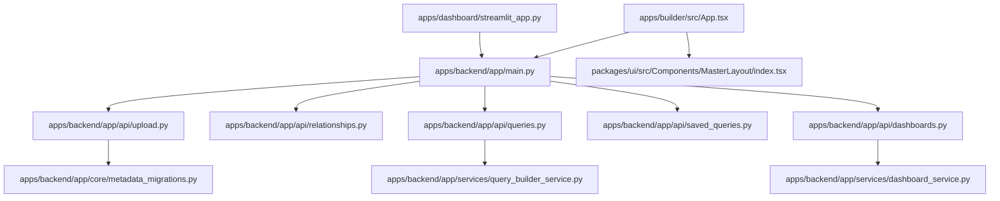

# Deep Scan Markdown Docs

Generated: 2026-05-20 16:11:01 UTC

## Understanding

### Three Important Tracks

This repo is not only one thing. It is a real product, a working AI-agent development practice, and a self-evolution research experiment sharing the same disk.

| Track                                  | Meaning                                                                                                                                                       | Why it matters                                                                                                      |
| -------------------------------------- | ------------------------------------------------------------------------------------------------------------------------------------------------------------- | ------------------------------------------------------------------------------------------------------------------- |
| **1. Product: `my-dynamic-dashboard`** | A data discovery and analytics platform for replacing a broken CRM → Excel reporting workflow.                                                                | This is the real-world problem and the concrete deliverable. It keeps the work grounded.                            |
| **2. AI-agent build practice**         | The product is built with vibe-coding, multi-agent workflows, autoagent/autopilot, PDCA rounds, memory, skills, and governance.                               | This is the development method being tested in a real codebase, not a toy benchmark.                                |
| **3. Agent self-evo research**         | The repo also studies whether agents can improve their own operating system through lessons, reports, verifier loops, meta-rounds, and cold-start discipline. | This is the research layer: how AI agents learn, preserve context, avoid drift, and become more reliable over time. |

The repo drifted because these three tracks are intertwined. Product files, agent operating files, generated reports, plans, docs, and experiments all grew together. The brainstorming session should separate them without pretending any track is unimportant.

### Ideal Shape

The ideal repo has three layers that cooperate but do not blur:

1. **Product layer**: `apps/backend`, `apps/builder`, `apps/dashboard`, `packages/ui`, `docs/features`, `docs/operations`, and `devops` serve the CRM reporting product.
2. **Agent-method layer**: `.agents/context`, `.agents/skills`, `.agents/plan`, `.agents/auto`, and mirrored command docs describe how AI agents help build and govern the product.
3. **Self-evo research layer**: self-evo orchestrator files, meta-rounds, auto reports, verifier notes, memory entries, and experiments record what is learned about agent self-improvement.

In the ideal state, each layer has its own source of truth, success criteria, and backlog:

| Layer             | Ideal success criterion                                                                                                                                          |
| ----------------- | ---------------------------------------------------------------------------------------------------------------------------------------------------------------- |
| Product           | A user can upload CRM exports, profile data, govern joins, run real DuckDB-backed queries, save reports, and view dashboards.                                    |
| Agent method      | Human + agents can start cold, choose the next useful round, implement it within declared boundaries, and leave durable context for the next session.            |
| Self-evo research | Agent-system changes are justified by product velocity or research value, measured by reports/verifier evidence, and kept separate from product delivery claims. |

### Actual State

The current repo already contains meaningful work in all three tracks.

**Product actual state**

- Backend, builder, dashboard, shared UI package, docs, and devops folders exist.
- Upload/profile and metadata persistence are substantially implemented: CSV/Excel parsing, Polars profiling, Parquet output, SQLite metadata, Alembic startup migrations, manifest import/export, and builder session state.
- Relationship governance exists as API/service code around overlap checks, review transitions, and low-overlap guardrails.
- Saved-query and dashboard services exist, with frontend/dashboard surfaces present.
- Query execution is the main product gap: validation and SQL translation exist, but preview/execute/export paths are still stubbed or incomplete, so DuckDB is more intended architecture than fully delivered execution engine.
- Builder workflow is split between a large `apps/builder/src/App.tsx` orchestration surface and the newer `BuilderWorkflowPage`/workflow-shell structure.

**Agent-method actual state**

- `.agents/context` holds canonical project and operating knowledge.
- `.agents/skills` contains reusable procedures such as bug-fix, clean-code, compact-docs, master-plan, pdca-next, repo-explainer, research, and skill-creator.
- `.agents/plan/cycles` records product PDCA rounds; current visible rounds focus heavily on extracting and stabilizing `@mdd/ui`.
- `.agents/auto` contains queue/state/report artifacts for autonomous or semi-autonomous execution.
- The repo has strong role separation vocabulary: master-agent, autoagent, and self-evo.

**Self-evo research actual state**

- `.agents/orchestrators/self-evo` exists as a specialist orchestrator area.
- `.agents/plan/meta` contains meta-rounds improving the agent system itself.
- `.agents/auto/reports` records round reports and cold dry-run evidence.
- `.agents/memory` contains agent-drafted learnings such as purpose hierarchy, tier taxonomy, round cadence, and verifier trust gaps.
- The research layer has already influenced repo governance, but it can also distract from product delivery if not explicitly bounded.

### Product Architecture at a Glance

```
React Builder          ─┐
                        ├→  FastAPI Backend  ─→  Polars + SQLite + Parquet + intended DuckDB execution
Streamlit Dashboard  ─┘
```

| Layer         | Technology                    | Responsibility                                                                                |
| ------------- | ----------------------------- | --------------------------------------------------------------------------------------------- |
| **Backend**   | FastAPI + Python              | Data processing, schema management, query validation/execution API, saved queries, dashboards |
| **Builder**   | React + TanStack + React Flow | File upload, profiling review, relationship builder, query builder UI, saved-query library    |
| **Dashboard** | Streamlit + Pandas + Plotly   | Report viewing, visualization, dashboard runs, export controls                                |
| **Shared UI** | `@mdd/ui`                     | Reusable React shell, layout, page, form, modal, button, navigation primitives                |

The backend is intended to be the product source of truth; both frontends consume its REST API.

### Product Data Design

| Tool        | Intended role                                                                           | Current caveat                                                                               |
| ----------- | --------------------------------------------------------------------------------------- | -------------------------------------------------------------------------------------------- |
| **Polars**  | Ingest, profile, clean, type-detect, write Parquet                                      | Concrete in upload/profile code.                                                             |
| **SQLite**  | Metadata store for workspaces, files, schemas, relationships, saved queries, dashboards | Concrete via raw `sqlite3` services and Alembic migrations.                                  |
| **Parquet** | Versioned data storage                                                                  | Concrete in upload path.                                                                     |
| **DuckDB**  | SQL query engine over Parquet                                                           | Intended for product query execution, but current query endpoints are still partial/stubbed. |

### Feature Roadmap vs Current Reality

| Spec    | Name                       | Current reading                                                                                                      |
| ------- | -------------------------- | -------------------------------------------------------------------------------------------------------------------- |
| **001** | Data Upload & Profiling    | Strong implementation surface exists. Needs end-to-end verification rather than assumption.                          |
| **002** | Relationship Rules         | Meaningful service/API implementation exists. Need verify UI and approved-only enforcement.                          |
| **003** | Query Builder & Execution  | Biggest gap. Validation + SQL translation exist; real preview/execute/export over DuckDB/Parquet appears incomplete. |
| **004** | Saved Queries              | Service/API/frontend surfaces exist. Depends on query execution for full product value.                              |
| **005** | Dashboard & Visualizations | Dashboard code exists. Depends on saved-query execution and panel executor path.                                     |
| **006** | Production Deployment      | Devops/runbooks exist. Product readiness depends on closing core execution gaps.                                     |

### Gap Map

| Track             | Ideal                                                        | Actual                                                                                                         | Gap                                                   | Likely next action                                |
| ----------------- | ------------------------------------------------------------ | -------------------------------------------------------------------------------------------------------------- | ----------------------------------------------------- | ------------------------------------------------- |
| Product           | End-to-end CRM export → query → saved report → dashboard     | Upload/profile and metadata are strongest; query execution is partial                                          | Product docs overstate completion                     | Make Spec 003 real, then verify dashboard path    |
| Product frontend  | Clear staged workflow                                        | `App.tsx` and `BuilderWorkflowPage` both own workflow pieces                                                   | UI ownership drift                                    | Plan a builder workflow consolidation round       |
| Product docs      | Docs match implemented behavior                              | README/docs mention missing or aspirational sources such as `specs/`; specs say complete where code is partial | Documentation drift                                   | Create a doc truth pass after implementation scan |
| Agent method      | Agents accelerate product without hijacking it               | Agent system is rich and well documented                                                                       | Product vs agent priorities can blur                  | Keep a visible three-track backlog                |
| Self-evo research | Meta work improves agent reliability and/or product velocity | Meta-rounds and self-evo artifacts exist                                                                       | Research value not always tied to measurable outcomes | Define research questions and evaluation signals  |

### Brainstorming Frame

For the next session, the useful question is not "is the repo good or bad?" It is:

> Given the three-track purpose, what is the smallest next move that reduces drift and increases real value?

Candidate directions:

1. **Product-first recovery**: close the Spec 003 DuckDB execution/export gap so the product becomes real end-to-end.
2. **Repo truth recovery**: build an implementation-vs-doc matrix for specs 001-006, then update docs and backlog.
3. **Workflow recovery**: consolidate builder workflow ownership so `App.tsx` stops absorbing feature logic.
4. **Agent-method recovery**: turn the three-track model into a lightweight governance rule so future rounds declare whether they are product, agent-method, or self-evo research.
5. **Self-evo research recovery**: define measurable research questions for self-evo, such as cold-start quality, verifier trust, autonomy boundary accuracy, and lesson reuse.

### Key Design Decisions

1. **Real problem first** — The CRM/Excel reporting pain is the anchor; product delivery keeps the agent research honest.
2. **Builder first, dashboard second** — Without uploaded data and defined relationships, there is nothing reliable to visualize.
3. **Excel output first** — Users already know Excel; the system should offload heavy processing and return manageable result files.
4. **Relationships are central and not fixed** — Join paths change per report; relationship governance is a product requirement, not a technical extra.
5. **Schema flexibility over rigidity** — CRM exports change; the platform should version, flag, and adapt rather than reject normal business drift.
6. **AI agents are part of the experiment** — Vibe-coding, multi-agent workflows, autoagent, autopilot, and self-evo are legitimate repo goals, but they must be separated from product completion claims.
7. **Spec-driven development needs truth checks** — Specs and docs are useful only if regularly reconciled with actual implementation.

---

## All Docs

| File                                                        | Purpose                                                                                    | Remark                                               |
| ----------------------------------------------------------- | ------------------------------------------------------------------------------------------ | ---------------------------------------------------- |
| .agents/AGENTS.md                                           | AGENTS.md – Pair Programming Guide for AI Agents                                           | Agent behavior/governance instructions               |
| .agents/auto/README.md                                      | .agents/auto/ — autoagent operating directory                                              | Entry/read-first document                            |
| .agents/auto/queue.md                                       | Autoagent topic queue                                                                      | Auto-inferred summary; verify details                |
| .agents/auto/reports/20260519/Meta_04.report.md             | Meta 04 Report — 2026-05-19                                                                | Auto-inferred summary; verify details                |
| .agents/auto/reports/20260519/Meta_05.report.md             | Meta 05 Report — 2026-05-19                                                                | Auto-inferred summary; verify details                |
| .agents/auto/reports/20260519/Round_01.report.md            | Round 01 Report — 2026-05-19                                                               | Auto-inferred summary; verify details                |
| .agents/auto/reports/20260519/Round_02.report.md            | Round 02 (draft phase) Report — 2026-05-19                                                 | Auto-inferred summary; verify details                |
| .agents/auto/reports/20260519/Round_03.report.md            | Round 03 Report — 2026-05-19                                                               | Auto-inferred summary; verify details                |
| .agents/auto/reports/20260519/Round_04.report.md            | Round 04 Report — 2026-05-19                                                               | Auto-inferred summary; verify details                |
| .agents/auto/reports/20260519/Round_05.report.md            | Round 05 Report (draft phase only) — 2026-05-19                                            | Auto-inferred summary; verify details                |
| .agents/auto/reports/20260519/Round_06.report.md            | Round 06 Report — 2026-05-19                                                               | Auto-inferred summary; verify details                |
| .agents/auto/reports/20260519/Round_07.report.md            | Round 07 Report — 2026-05-19                                                               | Auto-inferred summary; verify details                |
| .agents/auto/reports/20260519/Round_08.report.md            | Round 08 Report — 2026-05-19                                                               | Auto-inferred summary; verify details                |
| .agents/auto/reports/20260519/Round_09.report.md            | Round 09 Report — 2026-05-19                                                               | Auto-inferred summary; verify details                |
| .agents/auto/reports/20260519/Round_10.report.md            | Round 10 Report — 2026-05-19                                                               | Auto-inferred summary; verify details                |
| .agents/auto/reports/20260519/cold-dryrun-1.report.md       | Cold Dry-Run 1 Report — 2026-05-19                                                         | Auto-inferred summary; verify details                |
| .agents/context/principles.md                               | Principles                                                                                 | Auto-inferred summary; verify details                |
| .agents/context/project-overview.md                         | Project Overview: my-dynamic-dashboard                                                     | Auto-inferred summary; verify details                |
| .agents/context/tools.md                                    | Repository Tools (Canonical)                                                               | Auto-inferred summary; verify details                |
| .agents/memory/agent-tier-taxonomy.md                       | The repo's agent system has three tiers with non-overlapping                               | Agent-drafted memory; validate before relying        |
| .agents/memory/llm-mode-taxonomy.md                         | The LLMClient.mode union in                                                                | Agent-drafted memory; validate before relying        |
| .agents/memory/master_plan_skill_widen_proposal.md          | Proposal — widen the master-plan skill to cover cross-round arcs                           | Agent-drafted memory; validate before relying        |
| .agents/memory/purpose-hierarchy.md                         | The repo's one and only deliverable is my-dynamic-dashboard (apps/builder, apps/backend, t | Agent-drafted memory; validate before relying        |
| .agents/memory/round-cadence.md                             | Each PDCA round drives one feature, bug fix, or refactor. If a                             | Agent-drafted memory; validate before relying        |
| .agents/memory/verifier-trust-gap.md                        | self-evo's verifier runs in a sandbox worktree where nested                                | Agent-drafted memory; validate before relying        |
| .agents/orchestrators/self-evo/README.md                    | @self/orchestrator — self-evo                                                              | Entry/read-first document                            |
| .agents/orchestrators/self-evo/ROLLOUT.md                   | self-evo — Rollout Plan & Handoff                                                          | Auto-inferred summary; verify details                |
| .agents/plan/COMPACTION_LOG.md                              | Compaction Log                                                                             | Auto-inferred summary; verify details                |
| .agents/plan/DoD.md                                         | Definition of Done (DoD)                                                                   | Auto-inferred summary; verify details                |
| .agents/plan/PDCA.md                                        | PDCA Methodology — Spec Driven Development                                                 | Auto-inferred summary; verify details                |
| .agents/plan/cycles/README.md                               | .agents/plan/cycles/ — Product PDCA rounds                                                 | Entry/read-first document                            |
| .agents/plan/cycles/Round_01.md                             | Round 01: Ship @mdd/ui reusable master-layout package                                      | Auto-inferred summary; verify details                |
| .agents/plan/cycles/Round_02.md                             | Round 02: Collapse apps/builder/src/theme/antdTheme.ts to re-export @mdd/ui/themeTokens    | Auto-inferred summary; verify details                |
| .agents/plan/cycles/Round_03.md                             | Round 03: Extend @mdd/ui/MasterLayout API additively                                       | Auto-inferred summary; verify details                |
| .agents/plan/cycles/Round_04.md                             | Round 04: Promote PageCard + PageHeader to @mdd/ui/Components                              | Auto-inferred summary; verify details                |
| .agents/plan/cycles/Round_05.md                             | Round 05: Swap apps/builder/AppShell → @mdd/ui/MasterLayout                                | Auto-inferred summary; verify details                |
| .agents/plan/cycles/Round_06.md                             | Round 06: Fix SavedQueryLibraryPage.tsx typecheck regression                               | Auto-inferred summary; verify details                |
| .agents/plan/cycles/Round_07.md                             | Round 07: Land @mdd/ui/Components/Button (brand-defaults wrapper)                          | Auto-inferred summary; verify details                |
| .agents/plan/cycles/Round_08.md                             | Round 08: Land @mdd/ui/Components/Modal (brand-defaults wrapper)                           | Auto-inferred summary; verify details                |
| .agents/plan/cycles/Round_09.md                             | Round 09: Land @mdd/ui/Components/FormField (zod-aware)                                    | Auto-inferred summary; verify details                |
| .agents/plan/cycles/Round_10.md                             | Round 10: Land @mdd/ui/Pages/NotFound                                                      | Auto-inferred summary; verify details                |
| .agents/plan/meta/Meta_01.md                                | Meta 01: Fix self-evo's pre-apply judge false-positive                                     | Auto-inferred summary; verify details                |
| .agents/plan/meta/Meta_02.md                                | Meta 02: Crystallize principles + wire --autopilot / --cold flags                          | Auto-inferred summary; verify details                |
| .agents/plan/meta/Meta_03.md                                | Meta 03: Flip self-evo to opt-in + lockfile-noise carve-out                                | Auto-inferred summary; verify details                |
| .agents/plan/meta/Meta_04.md                                | Meta 04: Promote Write-tool-Read-first discipline to a workflow rule                       | Auto-inferred summary; verify details                |
| .agents/plan/meta/Meta_05.md                                | Meta 05: Move Write-tool discipline rule from workflow-doc table cell to a memory file     | Auto-inferred summary; verify details                |
| .agents/plan/meta/README.md                                 | .agents/plan/meta/ — Meta-PDCA rounds                                                      | Entry/read-first document                            |
| .agents/plan/promotions.md                                  | Promotion Log                                                                              | Auto-inferred summary; verify details                |
| .agents/prompts/reflect-agents.prompt.md                    | Reflect Changes into .agents/                                                              | Auto-inferred summary; verify details                |
| .agents/skills/bug-fix/SKILL.md                             | Trigger                                                                                    | Auto-inferred summary; verify details                |
| .agents/skills/clean-code/SKILL.md                          | Trigger                                                                                    | Auto-inferred summary; verify details                |
| .agents/skills/clean-code/references/stack-quick-ref.md     | Stack Quick Reference                                                                      | Auto-inferred summary; verify details                |
| .agents/skills/compact-docs/SKILL.md                        | compact-docs Skill                                                                         | Auto-inferred summary; verify details                |
| .agents/skills/master-plan/SKILL.md                         | Trigger                                                                                    | Auto-inferred summary; verify details                |
| .agents/skills/pdca-next/SKILL.md                           | Trigger                                                                                    | Auto-inferred summary; verify details                |
| .agents/skills/repo-explainer/SKILL.md                      | repo-explainer                                                                             | Auto-inferred summary; verify details                |
| .agents/skills/research/SKILL.md                            | Trigger                                                                                    | Auto-inferred summary; verify details                |
| .agents/skills/research/references/crawl4ai.md              | crawl4ai Reference                                                                         | Auto-inferred summary; verify details                |
| .agents/skills/skill-creator/SKILL.md                       | Trigger                                                                                    | Auto-inferred summary; verify details                |
| .claude/CLAUDE.md                                           | CLAUDE.md — Project Instructions                                                           | Agent behavior/governance instructions               |
| .claude/commands/autoagent.md                               | /autoagent                                                                                 | Auto-inferred summary; verify details                |
| .claude/commands/pdca.md                                    | /pdca                                                                                      | Auto-inferred summary; verify details                |
| .claude/commands/self-evo.md                                | /self-evo                                                                                  | Auto-inferred summary; verify details                |
| .claude/skills/bug-fix/SKILL.md                             | <!-- Do not edit this file directly. -->                                                   | Auto-inferred summary; verify details                |
| .claude/skills/clean-code/SKILL.md                          | <!-- Do not edit this file directly. -->                                                   | Auto-inferred summary; verify details                |
| .claude/skills/compact-docs/SKILL.md                        | <!-- Do not edit this file directly. -->                                                   | Auto-inferred summary; verify details                |
| .claude/skills/master-plan/SKILL.md                         | <!-- Do not edit this file directly. -->                                                   | Auto-inferred summary; verify details                |
| .claude/skills/repo-explainer/SKILL.md                      | <!-- Do not edit this file directly. -->                                                   | Auto-inferred summary; verify details                |
| .claude/skills/research/SKILL.md                            | <!-- Do not edit this file directly. -->                                                   | Auto-inferred summary; verify details                |
| .claude/skills/skill-creator/SKILL.md                       | <!-- Do not edit this file directly. -->                                                   | Auto-inferred summary; verify details                |
| .codex/prompts/pdca.md                                      | /pdca                                                                                      | Auto-inferred summary; verify details                |
| .github/agents/pdca.agent.md                                | /pdca                                                                                      | Auto-inferred summary; verify details                |
| .github/copilot-instructions.md                             | copilot-instructions.md — Project Instructions                                             | Agent behavior/governance instructions               |
| .github/prompts/pdca.prompt.md                              | Markdown document                                                                          | Auto-inferred summary; verify details                |
| .kiro/steering/code-review-graph.md                         | <!-- code-review-graph MCP tools -->                                                       | Auto-inferred summary; verify details                |
| .pytest_cache/README.md                                     | pytest cache directory #                                                                   | Entry/read-first document                            |
| AGENTS.md                                                   | AGENTS.md — Project Instructions                                                           | Agent behavior/governance instructions               |
| GEMINI.md                                                   | GEMINI.md — Project Instructions                                                           | Agent behavior/governance instructions               |
| README.md                                                   | My Dynamic Dashboard                                                                       | Entry/read-first document                            |
| apps/backend/.code-review-graph/wiki/app-health.md          | app-health                                                                                 | Auto-inferred summary; verify details                |
| apps/backend/.code-review-graph/wiki/app-query.md           | app-query                                                                                  | Auto-inferred summary; verify details                |
| apps/backend/.code-review-graph/wiki/app-spec.md            | app-spec                                                                                   | Auto-inferred summary; verify details                |
| apps/backend/.code-review-graph/wiki/contract-contract.md   | contract-contract                                                                          | Auto-inferred summary; verify details                |
| apps/backend/.code-review-graph/wiki/contract-put.md        | contract-put                                                                               | Auto-inferred summary; verify details                |
| apps/backend/.code-review-graph/wiki/contract-saved-2.md    | contract-saved                                                                             | Auto-inferred summary; verify details                |
| apps/backend/.code-review-graph/wiki/contract-saved.md      | contract-saved                                                                             | Auto-inferred summary; verify details                |
| apps/backend/.code-review-graph/wiki/core-json.md           | core-json                                                                                  | Auto-inferred summary; verify details                |
| apps/backend/.code-review-graph/wiki/core-startup.md        | core-startup                                                                               | Auto-inferred summary; verify details                |
| apps/backend/.code-review-graph/wiki/index.md               | Code Wiki                                                                                  | Auto-inferred summary; verify details                |
| apps/backend/.code-review-graph/wiki/integration-bytes.md   | integration-bytes                                                                          | Auto-inferred summary; verify details                |
| apps/backend/.code-review-graph/wiki/integration-client.md  | integration-client                                                                         | Auto-inferred summary; verify details                |
| apps/backend/.code-review-graph/wiki/integration-compose.md | integration-compose                                                                        | Auto-inferred summary; verify details                |
| apps/backend/.code-review-graph/wiki/integration-end-2.md   | integration-end                                                                            | Auto-inferred summary; verify details                |
| apps/backend/.code-review-graph/wiki/integration-end.md     | integration-end                                                                            | Auto-inferred summary; verify details                |
| apps/backend/.code-review-graph/wiki/integration-keyword.md | integration-keyword                                                                        | Auto-inferred summary; verify details                |
| apps/backend/.code-review-graph/wiki/integration-overlap.md | integration-overlap                                                                        | Auto-inferred summary; verify details                |
| apps/backend/.code-review-graph/wiki/integration-panel.md   | integration-panel                                                                          | Auto-inferred summary; verify details                |
| apps/backend/.code-review-graph/wiki/integration-query-2.md | integration-query                                                                          | Auto-inferred summary; verify details                |
| apps/backend/.code-review-graph/wiki/integration-query.md   | integration-query                                                                          | Auto-inferred summary; verify details                |
| apps/backend/.code-review-graph/wiki/integration-saved.md   | integration-saved                                                                          | Auto-inferred summary; verify details                |
| apps/backend/.code-review-graph/wiki/integration-soft.md    | integration-soft                                                                           | Auto-inferred summary; verify details                |
| apps/backend/.code-review-graph/wiki/services-active.md     | services-active                                                                            | Auto-inferred summary; verify details                |
| apps/backend/.code-review-graph/wiki/services-dashboard.md  | services-dashboard                                                                         | Auto-inferred summary; verify details                |
| apps/backend/.code-review-graph/wiki/services-export.md     | services-export                                                                            | Auto-inferred summary; verify details                |
| apps/backend/.code-review-graph/wiki/services-panel.md      | services-panel                                                                             | Auto-inferred summary; verify details                |
| apps/backend/.code-review-graph/wiki/services-query-2.md    | services-query                                                                             | Auto-inferred summary; verify details                |
| apps/backend/.code-review-graph/wiki/services-query-3.md    | services-query                                                                             | Auto-inferred summary; verify details                |
| apps/backend/.code-review-graph/wiki/services-query.md      | services-query                                                                             | Auto-inferred summary; verify details                |
| apps/backend/.code-review-graph/wiki/services-smoke.md      | services-smoke                                                                             | Auto-inferred summary; verify details                |
| apps/backend/.code-review-graph/wiki/services-validate.md   | services-validate                                                                          | Auto-inferred summary; verify details                |
| apps/backend/.pytest_cache/README.md                        | pytest cache directory #                                                                   | Entry/read-first document                            |
| apps/backend/CHANGELOG.md                                   | Changelog                                                                                  | Version history; keep append-only                    |
| apps/backend/tests/README.md                                | Backend Test Layers and Governance                                                         | Testing guidance                                     |
| apps/builder/README.md                                      | Builder Frontend                                                                           | Entry/read-first document                            |
| apps/dashboard/.pytest_cache/README.md                      | pytest cache directory #                                                                   | Entry/read-first document                            |
| apps/dashboard/README.md                                    | Dashboard App                                                                              | Entry/read-first document                            |
| devops/README.md                                            | DevOps                                                                                     | Entry/read-first document                            |
| docs/README.md                                              | Documentation Hub                                                                          | Entry/read-first document                            |
| docs/agents/design/design-guidelines.md                     | Design Guidelines — apps/builder/                                                          | Auto-inferred summary; verify details                |
| docs/agents/design/research-notes.md                        | UI Stack Research Notes — Ant Design + TanStack                                            | Auto-inferred summary; verify details                |
| docs/agents/plan/packages-ui.plan.md                        | Master Plan — @mdd/ui (reusable master-layout package)                                     | Auto-inferred summary; verify details                |
| docs/agents/workflows/agent-architecture.workflow.md        | Agent Architecture Workflow                                                                | Auto-inferred summary; verify details                |
| docs/agents/workflows/data-management.workflow.md           | Data Management Workflows                                                                  | Auto-inferred summary; verify details                |
| docs/agents/workflows/packages-ui.workflow.md               | @mdd/ui workflow — how the package threads through a consuming app                         | Auto-inferred summary; verify details                |
| docs/analysis/00-problem.md                                 | Problem Analysis                                                                           | Auto-inferred summary; verify details                |
| docs/development/setup.md                                   | Development Setup                                                                          | Auto-inferred summary; verify details                |
| docs/features/spec-001-profiling.md                         | Spec 001 — Data Upload & Profiling                                                         | Feature specification; verify against implementation |
| docs/features/spec-002-relationships.md                     | Spec 002 — Relationship Rules                                                              | Feature specification; verify against implementation |
| docs/features/spec-003-query-builder.md                     | Spec 003 — Query Builder & Execution                                                       | Feature specification; verify against implementation |
| docs/features/spec-004-saved-queries.md                     | Spec 004 — Saved Queries                                                                   | Feature specification; verify against implementation |
| docs/features/spec-005-dashboard.md                         | Spec 005 — Dashboard & Visualizations (MVP 2)                                              | Feature specification; verify against implementation |
| docs/features/spec-006-production.md                        | Spec 006 — Production Deployment Hardening                                                 | Feature specification; verify against implementation |
| docs/governance.md                                          | Governance & Compliance                                                                    | Auto-inferred summary; verify details                |
| docs/operations/deployment-guide.md                         | Deployment Guide (Spec 006)                                                                | Auto-inferred summary; verify details                |
| docs/operations/oncall-playbook.md                          | On-Call Playbook (Spec 006)                                                                | Auto-inferred summary; verify details                |
| docs/operations/rollback-runbook.md                         | Rollback Runbook (Spec 006)                                                                | Auto-inferred summary; verify details                |
| docs/operations/troubleshooting-runbook.md                  | Troubleshooting Runbook (Spec 006)                                                         | Auto-inferred summary; verify details                |
| packages/ui/README.md                                       | @mdd/ui                                                                                    | Entry/read-first document                            |
| tmp/deep-scan/brainstorming.md                              | Deep-Scan Brainstorming — my-dynamic-dashboard                                             | Auto-inferred summary; verify details                |

## Repo Explainer (Product Layer)

This section explains the dashboard product layer only. The broader repo meaning is the three-track model above: product, AI-agent build practice, and self-evo research.

This repo is a specification-first analytics product for replacing a brittle Excel reporting workflow. Its core meaning is practical: move CRM-export reporting out of manual Power Query / pivot-table work and into a repeatable system that can ingest larger files, understand changing schemas, govern joins, generate reusable queries, and serve dashboard views.

The intended user split is clear. A technical owner uses the builder to upload source files, inspect profiles, define relationships, and create saved reports. Less-technical report consumers use the dashboard side to run or inspect prepared reporting views. The backend sits between both as the system of record for data, metadata, query definitions, dashboard definitions, and operational state.



The main product architecture is a three-app monorepo. `apps/backend` is the source of truth and exposes FastAPI routers for workspaces, upload/profile, relationships, queries, saved queries, dashboards, and deployment operations. `apps/builder` is the React/Vite authoring UI for upload, schema/profile review, relationship/query work, and saved-query management. `apps/dashboard` is a Streamlit consumption UI for saved dashboards, health checks, run history, parameters, and export controls. `packages/ui` is a shared React layout/component package so frontend shells, navigation, page wrappers, and form primitives can be reused instead of duplicated.

The product flow is staged and cumulative. First, a workspace receives CSV/Excel uploads and derives column profiles, data quality signals, schema metadata, and role assignments. Then relationship rules define how tables may be joined, with overlap/cardinality checks and approval gates before downstream use. Query builder payloads are validated, translated to SQL, previewed, executed, exported, and eventually saved as reusable versioned query definitions. Dashboards then compose panels from saved queries and expose run history, health, parameters, and exports.

Code-review-graph currently sees 1,948 nodes and 15,173 edges across 350 files. Its highest-signal flows are `assign_column_roles`, `validate_query`, `import_manifest`, `preview_query`, `execute_query`, `get_saved_query`, `export_manifest`, `save_query`, `update_saved_query`, `review_relationship`, `create_relationship`, and `upload_source_for_workspace`. That matches the docs: the backend is the critical path, with most risk around metadata state, active workspace/source context, query validation/execution semantics, relationship approval, and saved-query lifecycle behavior.

Implementation maturity is uneven by feature. Upload/profile and metadata persistence have substantial concrete implementation: source registry parsing, Polars profiling, Parquet writes, SQLite/Alembic metadata, manifest import/export, and builder session state are represented in code. Relationship governance is implemented as API/service logic around SQLite state, overlap checks, review transitions, and low-overlap guardrails. Query builder execution is partly skeletal in the current code: validation and SQL string generation exist, but preview/execute/export endpoints currently return empty or placeholder responses instead of fully querying DuckDB-backed Parquet results. Dashboard services and Streamlit UI are present, but they depend on saved-query/dashboard metadata being populated and on the panel executor path.

The frontend has two overlapping surfaces. `apps/builder/src/App.tsx` still owns a large amount of upload/profile/query orchestration directly, while `apps/builder/src/pages/BuilderWorkflowPage.tsx` and `components/workflow-shell` provide the staged workflow shell. API calls are expected to live in `src/api` and TanStack hooks in `src/api/hooks`; local UI state is allowed, but application state is supposed to live in domain Zustand stores. The builder README's configuration rule is important: app config flows through `src/config/appConfig.ts` with build-time env, backend runtime config, then localStorage debug overrides.

The backend data model is the load-bearing product surface. Polars handles parsing/profiling and Parquet output, SQLite tracks metadata and lifecycle state, and DuckDB is the intended execution engine over Parquet files. The current code already shows the storage/profile/metadata side clearly; the main product gap to verify is whether query preview/execute/export paths have caught up with the documented DuckDB-backed behavior.

Most meaningful product docs:

- Product overview and entry points: `README.md`, `docs/README.md`.
- Problem and product framing: `docs/analysis/00-problem.md`.
- Feature behavior: `docs/features/spec-001-profiling.md` through `docs/features/spec-006-production.md`, with full specs under `specs/`.
- Development and runtime: `docs/development/setup.md`, `devops/README.md`, `docs/operations/*.md`.
- Builder and UI direction: `apps/builder/README.md`, `docs/agents/design/design-guidelines.md`, `packages/ui/README.md`.
- Dashboard surface: `apps/dashboard/README.md`, `docs/features/spec-005-dashboard.md`.
- Backend test and quality surface: `apps/backend/tests/README.md`, `docs/governance.md`.

Highest-value next deep-scan targets:

- Reconcile Spec 003's promised DuckDB query execution/export behavior with the placeholder implementation in `apps/backend/app/api/queries.py` and `apps/backend/app/services/query_builder_service.py`.
- Map metadata schema tables from Alembic migrations to service expectations, especially upload, relationship, saved-query, dashboard, and manifest paths.
- Split builder surface ownership between the legacy `App.tsx` upload/control flow and the newer `BuilderWorkflowPage` staged workflow.
- Verify dashboard execution end-to-end: saved query snapshot -> panel executor -> dashboard run -> Streamlit render/export.
- Compare feature docs against implementation and mark which flows are complete, skeletal, or documentation-ahead-of-code.

---

## Findings

Cross-checked the doc against the repo at commit `4d9845c` on branch `dev` (2026-05-20). The "Understanding" section is mostly accurate as a product-intent summary, but several concrete claims drift from the code. Inline fixes were applied above; remaining observations follow.

### Confirmed accurate

- **Three-app monorepo** (`apps/backend`, `apps/builder`, `apps/dashboard`) plus `packages/ui` — matches workspace layout.
- **Stack**: FastAPI + Python backend, React + Vite + TanStack + Ant Design builder, Streamlit + Pandas + Plotly dashboard (`apps/dashboard/requirements.txt`).
- **Polars / DuckDB / SQLite / Parquet** dependencies are present; SQLAlchemy/Alembic-style metadata migrations live in [apps/backend/app/core/metadata_migrations.py](apps/backend/app/core/metadata_migrations.py).
- **PDCA cadence**: Rounds 01–10 and Meta 01–05 are all on disk under `.agents/plan/cycles/` and `.agents/plan/meta/`; matching reports exist under `.agents/auto/reports/20260519/`.
- **Eight Principles + three roles + tier authority + cold-start invariant** — all corroborated by `.agents/AGENTS.md`, `.agents/context/principles.md`, and the memory index.
- **Skill inventory** (`bug-fix`, `clean-code`, `compact-docs`, `master-plan`, `pdca-next`, `repo-explainer`, `research`, `skill-creator`) matches `.agents/skills/`.
- **@mdd/ui catalogue**: `Button`, `FormField`, `MasterLayout`, `Modal`, `PageCard`, `PageHeader`, `Sidebar`, `SidebarMenu` + `Pages/NotFound` — matches Round_07–Round_10 round files.

### Corrected inline (above)

1. **Spec 003 is not "Complete"**. [apps/backend/app/services/query_execution_service.py](apps/backend/app/services/query_execution_service.py) and [apps/backend/app/services/query_export_service.py](apps/backend/app/services/query_export_service.py) are stubs that return `{rows: [], total_rows: 0, …}` and `b""` respectively. The route handlers in [apps/backend/app/api/queries.py:100-205](apps/backend/app/api/queries.py#L100-L205) mirror those stubs — validation/translation work end-to-end, but `preview_query` returns hard-coded empty rows and `export_query` returns an empty Excel/CSV body. The README and original table both overstate this as ✅ Complete; I downgraded it to ⚠️ Partial.
2. **Codebase tree was missing real subtrees**. Added `apps/backend/app/apps/` (per-domain composition roots — `QUERY_APP`, `UPLOAD_APP`, etc., imported by route handlers), plus `resources/` and `utils/`. Clarified that `apps/builder/src/state/` is Zustand stores and added the `config/` directory called out by the builder README.

### Additional discrepancies (not patched inline — flagging for review)

1. **DuckDB is not (yet) the query engine**. The doc presents DuckDB as the execution layer for SQL joins over Parquet. In the current code, `import duckdb` only appears in [apps/backend/app/services/relationship_service.py:10](apps/backend/app/services/relationship_service.py#L10) — used for overlap/cardinality checks during relationship review, not for query execution. The query-execution path is the stub described above. So "DuckDB + Polars + SQLite + Parquet" is the **intended** architecture; today, DuckDB only powers relationship metrics.
2. **README references `specs/` that doesn't exist**. Both `README.md` and the Repo Explainer section ("full specs under `specs/`") point at a top-level `specs/` directory; only `docs/features/spec-001-profiling.md` … `spec-006-production.md` exist. Either the directory was removed during compaction or it was always aspirational. Worth deciding before next doc pass.
3. **Models layer is not pure SQLAlchemy ORM**. Files like [apps/backend/app/models/saved_query.py](apps/backend/app/models/saved_query.py) are domain dataclasses/Pydantic-style records over a raw `sqlite3` connection (see services), not SQLAlchemy mapped classes — the doc's "SQLAlchemy ORM models" phrasing is misleading. Corrected to "ORM models" inline; consider rewording further if you want precision.
4. **Builder dual-surface claim is real**. Repo Explainer's note that [apps/builder/src/App.tsx](apps/builder/src/App.tsx) still owns upload/profile orchestration alongside the staged [apps/builder/src/pages/BuilderWorkflowPage.tsx](apps/builder/src/pages/BuilderWorkflowPage.tsx) is confirmed — `App.tsx` imports upload/profile/manifest APIs directly and renders panels. This split is a real product-tech-debt signal worth surfacing in next round planning.
5. **`Round 06: Fix SavedQueryLibraryPage.tsx typecheck regression`** in the All-Docs table is the only Round_06 description that diverges from the round subject most likely worth treating as a "stabilization" round rather than a feature; cosmetic, but accurate.
6. **`apps/dashboard/dist/`** is present in the working copy — this is a build artifact and should be `.gitignore`d if it isn't already. Out of scope for this doc, but visible during scan.

### Suggested next deep-scan targets (refining the doc's own list)

- **Wire `query_execution_service` to real DuckDB.** This is the single biggest gap between docs and code; everything downstream (dashboard panels, export, saved-query run history) depends on it. The lineage/parameter contract is already shaped in `QueryExecutionResponse`, so the missing piece is the executor itself plus Parquet-path resolution from the source registry.
- **Decide `specs/` vs `docs/features/` as canonical.** Pick one and update READMEs; today the entry-point README sends readers to a missing directory.
- **Audit model layer naming.** Either rename `models/` → `records/` or `entities/` to reflect that it isn't an ORM, or actually adopt SQLAlchemy if the manifest/saved-query/dashboard schema is stabilizing.
- **Plan a `BuilderWorkflowPage` migration round** to move the remaining upload/profile flow off `App.tsx`. This is exactly the kind of "boundary widening regression" Principle 7 warns about — silently letting `App.tsx` keep owning workflow logic.

### Methodology

Spot-checked: directory tree, `apps/backend/app/{api,services,models,core,apps,resources,utils}` contents, `apps/builder/src/{api,state,pages}`, `apps/dashboard/requirements.txt`, `.agents/{plan,context,memory,skills,auto/reports/20260519}`. Read query route handlers and the execution/export service files in full. Did not exhaustively diff every spec — implementation maturity per spec beyond 003 is taken from the doc's own claims and warrants its own pass.
