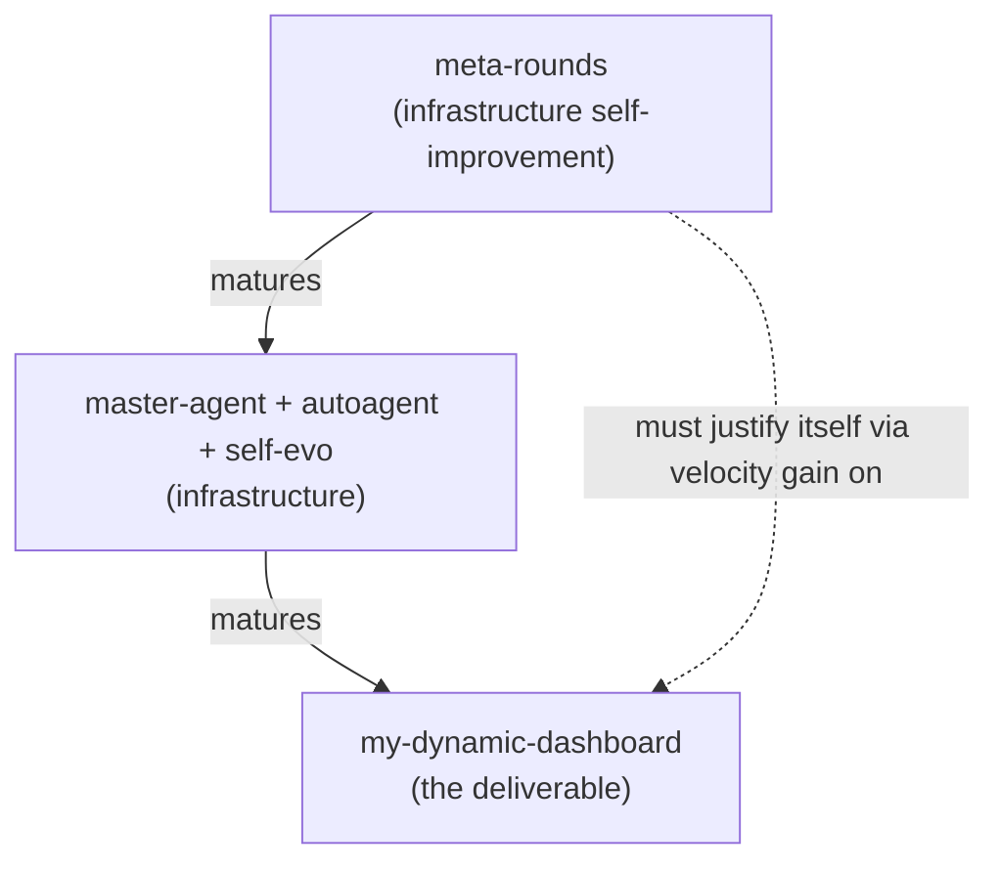
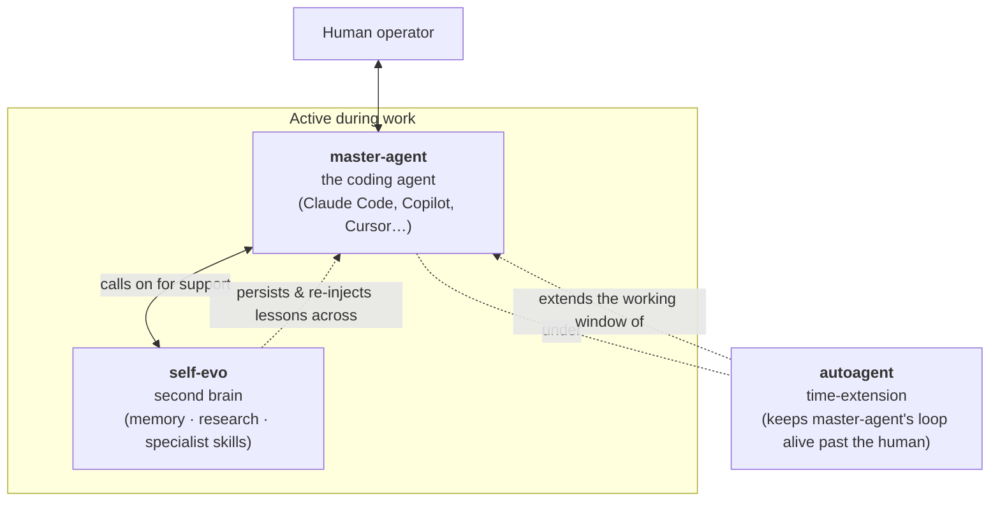
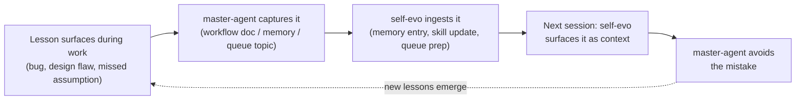

# Agent Architecture Workflow

This document defines the agent system used to evolve this repo and the
contract its parts operate under. Deviate only with an explicit, recorded
change of mindset (see [When to bypass](#when-to-bypass)).

> If you are an LLM reading this for the first time in a session: load
> this file **before** invoking `/autoagent`, `scripts/self-evo.sh`, or
> any extended unattended work. The boundaries below are load-bearing —
> getting them wrong is how scope bleeds, design errors slip through,
> and meta-work eats product time.

---

## Purpose hierarchy — the only deliverable is my-dynamic-dashboard

This is the most important boundary in the whole document. The agent
system has no intrinsic purpose. It exists **only** to mature
my-dynamic-dashboard toward production-readiness.

### Rules that follow

1. **Product work outranks agent work.** A round that improves the
   dashboard wins against a round that polishes the orchestrator, all
   else equal.
2. **A meta-round must justify itself in product-velocity terms.** If
   improving the agent system doesn't shorten or de-risk the next ≥3
   product rounds, it's vanity. Master-agent challenges this before
   accepting meta-work.
3. **Queue mix is the leading indicator.** A healthy
   `.agents/auto/queue.md` is majority product topics. >50% meta = drift.
4. **Two cadences, two namespaces.** Product PDCA = `Round_NN.md`
   (continuing the existing series, last was Round 40). Agent meta =
   `Meta_NN.md` (new namespace, starting `Meta_01`). The current
   2026-05-17/18 self-evo rounds miscategorised as `Round_01..07`
   should be renamed `Meta_01..07` before product Round 41.
5. **Idle is fine.** When the dashboard is blocked on human-only
   decisions, the agents idle. They do **not** use that gap to keep
   working on themselves.

---

## The three roles

### master-agent — the coding agent

The actual hands at the keyboard. Today this is Claude Code; tomorrow
it could be Copilot, Cursor, or whatever the operator pairs with.
Master-agent is the _driver_. It writes code, reads files, runs
commands, has the conversation, makes design calls.

**Owns**:

- Holding the [purpose hierarchy](#purpose-hierarchy--the-only-deliverable-is-my-dynamic-dashboard) — every accepted task either
  advances the product or justifies itself in product-velocity terms.
- The actual coding work. Master-agent **does not delegate the code
  itself** to a sub-agent; it does the coding and uses sub-agents for
  support.
- Calling on self-evo for memory, research, or its specialist PDCA
  skill when the work benefits.
- [Smart-autopilot policy](#smart-autopilot--master-agents-unattended-decision-policy) — autonomous decisions during unattended runs.
- Capturing lessons into the [lesson-learn loop](#lesson-learn-loop) so
  today's mistakes become tomorrow's prevented mistakes.
- Final commits, PR descriptions, end-of-session summary.

**Critical rule**: master-agent **always re-validates in the main checkout**
after a self-evo PDCA round reports "approve." self-evo's verifier
worktree has known reliability gaps; its verdict is necessary but not
sufficient. See [[verifier-trust-gap]] memory.

### autoagent — time-extension

Generic continuation harness defined at
[.claude/commands/autoagent.md](../../../.claude/commands/autoagent.md).
Triggered by the user (today: `/autoagent`) or by cron (future).
Worker-agnostic — it doesn't know or care which sub-agents master-agent
calls on within its extended window.

**Owns**:

- Per-round branch creation, HITL gate handling, blockers.md on tier-2.
- Stop conditions: `--budget`, `--until`, `STOP` file, blocker hits.
- The two-tier authority model (auto-approve vs. hard-stop).
- Reports under `.agents/auto/reports/<yyyymmdd>/`.

**Does NOT own**:

- Picking what to work on (master-agent's call).
- Judging whether the work is conceptually right (master-agent's call).
- Long-term project memory (master-agent writes; self-evo serves).

Without autoagent, master-agent's working window is bounded by the
human's attention. With it, master-agent's window is bounded only by
the budget, deadline, or a tier-2 blocker.

### self-evo — master-agent's second brain

A specialist sub-agent at
[.agents/orchestrators/self-evo/](../../../.agents/orchestrators/self-evo/).
**Not a worker that gets tasks delegated to it.** A support service
master-agent calls on for capabilities master-agent doesn't have or
shouldn't replicate.

**Three capabilities**:

1. **Memory** — accumulated context from past sessions. Surfaces "here's
   what we learned about X" before master-agent re-discovers it. Today
   implemented as `.agents/memory/*.md` files cross-linked via
   `[[name]]` references.
2. **Research** — investigates on master-agent's behalf and returns
   digested findings, not raw search dumps. Today partially implemented
   as the orchestrator's repo-scanner + boundary-scoper nodes.
3. **High-skill specialist work** — the PDCA round harness, with
   boundary-respecting patch generation and HITL gates. Today this is
   the full orchestrator (intake → repo-scanner → boundary-scoper →
   change-classifier → plan-writer → patch-author → verifier → judge
   → HITL → round-writer).

**Master-agent invokes self-evo for**:

- Bounded, repeatable work where the harness saves time (PDCA round).
- Research that would burn master-agent's context window otherwise.
- Pulling in memory before starting work on a domain self-evo has
  history with.

**Master-agent does NOT use self-evo for**:

- Design decisions (self-evo executes against a queue; it can't judge
  whether the queue is correct).
- Cross-cutting refactors where the boundary isn't obvious in advance.
- Anything master-agent is faster at doing directly.

---

## Lesson-learn loop

The mechanism that turns one-time pain into permanent capability.
Without this, every session re-discovers the same mistakes.

### How master-agent captures (today)

| Lesson type                                              | Destination                       | Example                                       |
| -------------------------------------------------------- | --------------------------------- | --------------------------------------------- |
| Process / methodology rule that binds future sessions    | `docs/agents/workflows/*`         | "master-agent must re-validate in main"       |
| Persistent project fact (decisions, taxonomies, gotchas) | `.agents/memory/*.md`             | [[verifier-trust-gap]], [[llm-mode-taxonomy]] |
| Tightly-scoped fix self-evo can do as a round            | `.agents/auto/queue.md`           | "Make plan-writer enforce maxPlanSteps"       |
| Ephemeral context (won't matter next session)            | Conversation only, no persistence | Trivia                                        |

### How self-evo serves it back (aspirational vs. today)

- **Today (primitive)**: memory files are tracked in
  `.agents/memory/`. Master-agent reads them when relevant. The
  CLAUDE.md memory-index pattern is the closest thing to automatic
  injection.
- **Direction**: self-evo proactively surfaces relevant memory entries
  _before_ master-agent starts work in a domain self-evo has history
  with — e.g., touching `.agents/orchestrators/self-evo/src/llm/` should
  auto-surface [[llm-mode-taxonomy]] and [[verifier-trust-gap]].
- **What's between**: a self-evo capability to read CLAUDE.md +
  the memory index at session start, hash the user's first message
  against memory `description:` fields, and dump the top-K relevant
  entries into master-agent's context.

That's a candidate meta-round once it can be justified in product-velocity terms (it pays for itself the first time a session avoids re-doing today's codex-mode mistake).

---

## Smart-autopilot — master-agent's unattended decision policy

"Smart-autopilot" is **not a separate tier**. It's master-agent's
**policy for making decisions without user approval** during unattended
runs (overnight via autoagent, scheduled cron jobs, etc.). When the
human is in the loop, master-agent confirms; when the human isn't,
smart-autopilot decides on its own.

### When smart-autopilot is in effect

- During `/autoagent` runs (the user is asleep / away).
- During scheduled remote-agent / cron runs.
- During any session the user explicitly tells master-agent to "work
  without stopping for clarifying questions."

### What smart-autopilot decides autonomously

| Decision                                                            | Autonomous action                           | Escalate (tier-2)                  |
| ------------------------------------------------------------------- | ------------------------------------------- | ---------------------------------- |
| Worker returned `approve` with patches that lint/test green in main | Commit + write report                       | —                                  |
| Worker returned `approve` but main-validation fails                 | —                                           | Revert + blockers.md               |
| Worker returned `refine` past its budget                            | —                                           | blockers.md                        |
| Diff touches hard-locked file                                       | —                                           | blockers.md                        |
| Boundary expansion is unavoidable to compile (e.g., type ripple)    | Accept expansion, note in report            | —                                  |
| Queue topic looks conceptually wrong (e.g., today's codex-mode)     | —                                           | blockers.md with proposed re-scope |
| Self-validation regression in unrelated channel (worktree noise)    | Ignore, document in report                  | —                                  |
| Self-validation regression in **related** channel                   | —                                           | Revert + blockers.md               |
| Trivial follow-up suggests itself ("while I'm here, fix Y")         | Refuse, leave as queue topic for next round | —                                  |

### What smart-autopilot escalates to the human

- Anything that requires re-scoping the work.
- Anything that touches the [purpose hierarchy](#purpose-hierarchy--the-only-deliverable-is-my-dynamic-dashboard) (e.g., "should we
  spend the next 3 rounds on agent work or product?").
- Conceptual / design disagreements with the queue.
- Repeated worker failure patterns suggesting an infrastructure issue.

The default bias is **escalate when in doubt** — a tier-2 stop with a
clear blocker is cheap to resolve; an autonomous wrong call is not.

---

## Sub-agent support-service contract

To register as a sub-agent master-agent can call on, an executable must:

1. **Expose discrete capabilities** master-agent can invoke individually
   (e.g., self-evo exposes: round, resume, query-memory, list-memories).
   Not a monolithic "do my work" entrypoint.
2. **Return machine-readable state** at every pause point (verdict,
   findings, patches, applied/skipped flags). master-agent reads this
   to decide next action.
3. **Honor HITL commands via stdin or RPC**: at minimum `approve`,
   `apply`, `revise <stage>`, `quit`.
4. **Run pure** — no edits to the main checkout. master-agent applies
   any returned patches.
5. **Declare a self-lock contract** — files the sub-agent cannot edit
   without an explicit unlock flag (self-evo's hard-lock + soft-lock
   in [autoagent.md](../../../.claude/commands/autoagent.md)).
6. **Be deterministic w.r.t. failure surfaces** — same inputs + clean
   workspace → same verdict and same artifacts.

Sub-agents do **not** need to know about each other. autoagent does
not need to know about sub-agent internals.

---

## Boundaries — what each role can and cannot do

| Action                                           | master-agent                                                | autoagent                          | self-evo                  |
| ------------------------------------------------ | ----------------------------------------------------------- | ---------------------------------- | ------------------------- |
| Write code in main checkout                      | yes (post-HITL when invoked via self-evo; freely otherwise) | no — only applies returned patches | no — worktree only        |
| Have the conversation with the user              | yes                                                         | no                                 | no                        |
| Author queue topics, memory, workflow docs       | yes                                                         | no                                 | no — but serves them back |
| Drive an unattended loop                         | no — runs under autoagent                                   | yes                                | no                        |
| Make design / scope decisions                    | yes                                                         | no                                 | no                        |
| Provide memory + research + specialist execution | no — calls on self-evo                                      | no                                 | yes                       |
| Decide round-success at HITL                     | yes (smart-autopilot when unattended)                       | enforces tier policy               | proposes verdict          |
| Commit                                           | yes                                                         | yes (scripted, per-round)          | no                        |
| Edit hard-locked files                           | yes (outside an autoagent run)                              | no                                 | no                        |

---

## Lessons learned — 2026-05-18 session

Each routed to its durable home so it isn't re-discovered next time.

| Lesson                                                                      | Destination                                                                                   | Memory file             |
| --------------------------------------------------------------------------- | --------------------------------------------------------------------------------------------- | ----------------------- |
| master-agent must re-validate in main after self-evo "approve"              | workflow doc + memory                                                                         | [[verifier-trust-gap]]  |
| self-evo can't catch conceptual / design errors in the queue                | workflow doc (this section + smart-autopilot table) + memory                                  | [[llm-mode-taxonomy]]   |
| Plan-writer over-decomposes despite maxPlanSteps req                        | self-evo queue (worker fixing itself)                                                         | —                       |
| Build artifacts can poison verification                                     | self-evo queue (already fixed, Round 06) + sub-agent contract rule (run pure within worktree) | —                       |
| Boundary R01 is soft when types require ripple edits                        | workflow doc (sub-agent contract — boundaries are declared minimums)                          | —                       |
| One feature per round; master-agent enforces upstream                       | memory                                                                                        | [[round-cadence]]       |
| Agent infrastructure exists only for product velocity                       | workflow doc (purpose hierarchy) + memory                                                     | [[purpose-hierarchy]]   |
| master-agent / autoagent / self-evo are distinct roles, not interchangeable | workflow doc (this whole doc) + memory                                                        | [[agent-tier-taxonomy]] |

---

## When to bypass

These roles and the smart-autopilot policy are the default. **Explicitly
override** only when:

1. The user states a different working mode for the session ("just hack
   on it directly, skip the worker"). Confirm and note inline.
2. A bug in autoagent or self-evo would prevent normal operation — fix
   by hand, document the bypass in the round report or commit message.
3. The change is trivial enough that round-overhead exceeds the work
   (typo fix, single-line constant). Skip self-evo's PDCA harness;
   master-agent commits directly. Threshold: if the change takes < 1 min
   by hand and is uncontroversial, just do it.

Any other deviation should first update this doc so the new mindset is
durable. Re-deviating without a doc change is how the system drifts.

---

## Cross-references

- Autoagent command + state machine: [.claude/commands/autoagent.md](../../../.claude/commands/autoagent.md)
- Self-evo orchestrator design: [.agents/orchestrators/self-evo/ROLLOUT.md](../../../.agents/orchestrators/self-evo/ROLLOUT.md)
- Memory index: [.agents/memory/](../../../.agents/memory/)
- Per-round PDCA artifacts: [.agents/plan/cycles/](../../../.agents/plan/cycles/)
- Sub-agent queue (today: self-evo only): [.agents/auto/queue.md](../../../.agents/auto/queue.md)
- Shared agent knowledge base: [.agents/AGENTS.md](../../../.agents/AGENTS.md)
