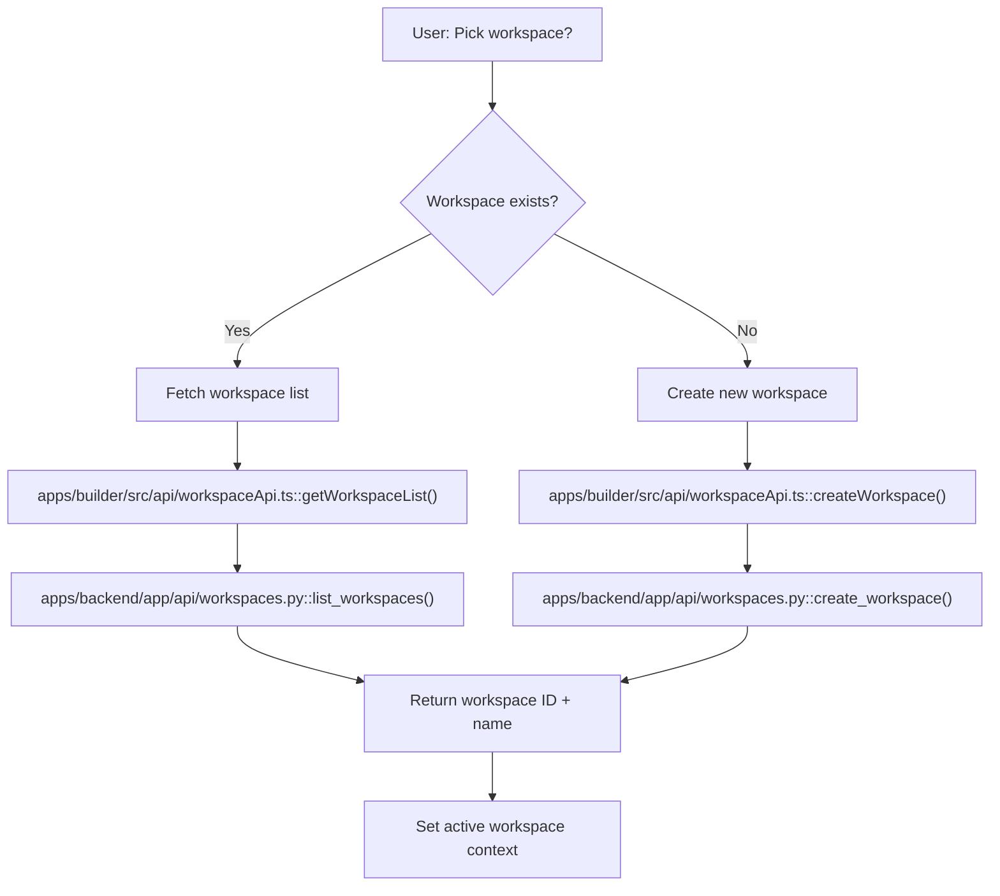
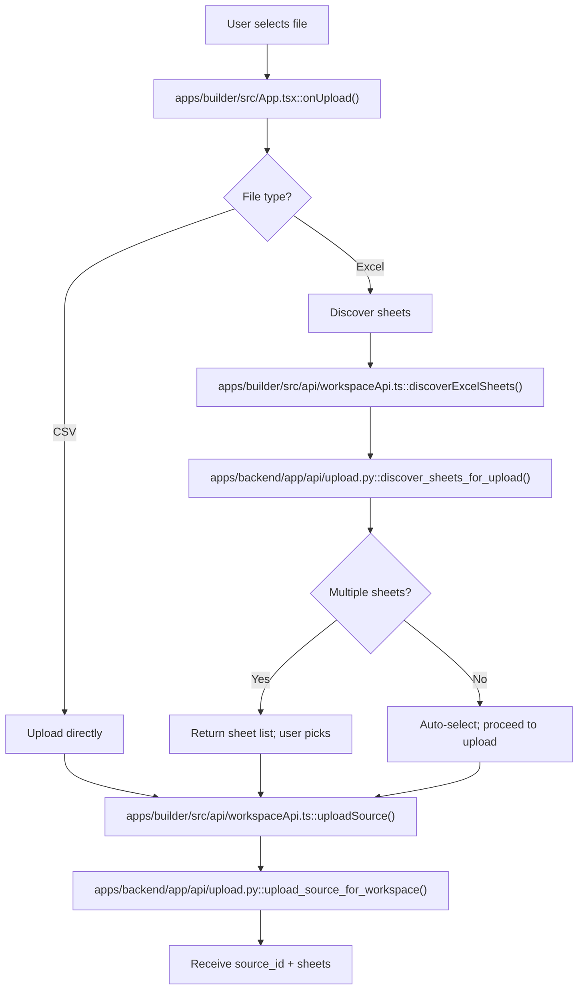
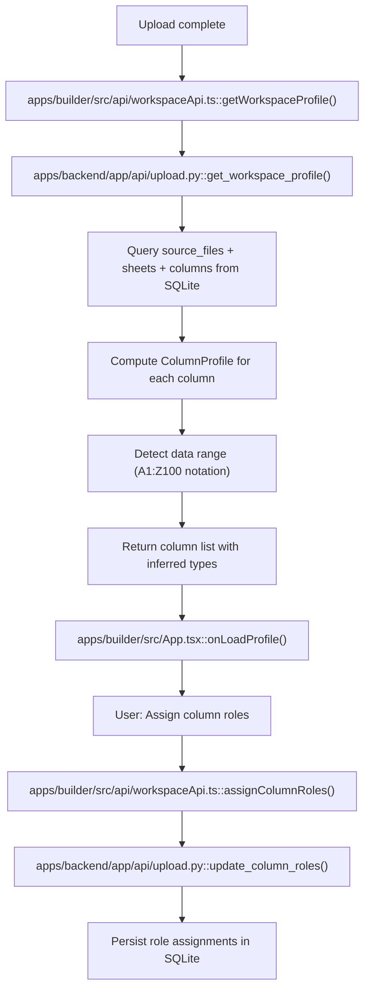
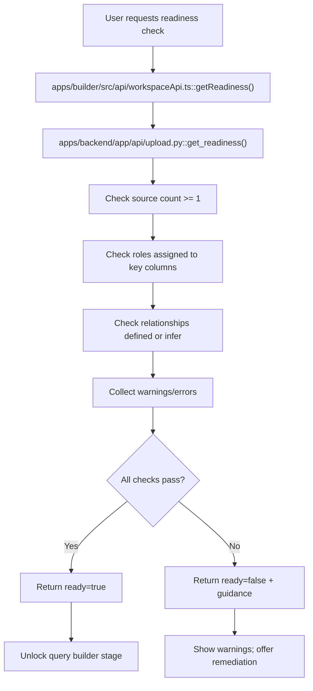

# Data Management Workflows

This document breaks down the Data Management phase into four focused workflows: workspace selection, file upload with sheet discovery, metadata extraction, and readiness validation. Each workflow is a single user action with clear entry/exit points and error handling paths.

---

## Workflow 1: Workspace Selection / Creation

**Trigger**: User arrives at builder and needs to set active workspace context.  
**Goal**: Select an existing workspace or create a new one for data uploads.

- User chooses to reuse an existing workspace or create a new one, see [apps/builder/src/App.tsx](apps/builder/src/App.tsx#L337).
- New workspace creation calls the workspace create endpoint, see [apps/builder/src/api/workspaceApi.ts](apps/builder/src/api/workspaceApi.ts#L30).
- Backend creates workspace row in SQLite and returns the ID, see [apps/backend/app/api/workspaces.py](apps/backend/app/api/workspaces.py#L25).
- Workspace context is set in the upload flow state for downstream operations.

---

## Workflow 2: File Upload & Sheet Discovery

**Trigger**: User has selected workspace and file; ready to upload.  
**Goal**: Accept file, detect source type (Excel/CSV), optionally discover Excel sheets, then upload raw source.

- File upload entry point branches on source type detection, see [apps/builder/src/App.tsx](apps/builder/src/App.tsx#L355).
- Excel files trigger optional sheet discovery before upload, see [apps/builder/src/api/workspaceApi.ts](apps/builder/src/api/workspaceApi.ts#L84).
- Backend discovers sheet options via openpyxl/calamine, see [apps/backend/app/api/upload.py](apps/backend/app/api/upload.py#L123).
- Source is uploaded and persisted with metadata (source_id, file hash, sheet layout), see [apps/backend/app/api/upload.py](apps/backend/app/api/upload.py#L205).

---

## Workflow 3: Metadata Extraction & Profiling

**Trigger**: File has been uploaded; now analyze columns and infer schema.  
**Goal**: Extract column names, types, nullability; compute data range; profile for role assignment.

- Profile fetch happens post-upload to show columns and detected types, see [apps/builder/src/api/workspaceApi.ts](apps/builder/src/api/workspaceApi.ts#L124).
- Backend queries SQLite for source/sheet/column metadata inserted during upload, see [apps/backend/app/api/upload.py](apps/backend/app/api/upload.py#L454).
- Column profiles are derived using Polars type inference, see [apps/backend/app/services/upload_service.py](apps/backend/app/services/upload_service.py#L50).
- User can then assign semantic roles (identity_key, dimension, measure) to each column for relationship definition, see [apps/builder/src/App.tsx](apps/builder/src/App.tsx#L500).

---

## Workflow 4: Readiness Validation

**Trigger**: User has completed profile + role assignment; ready to move to query builder.  
**Goal**: Validate that workspace has minimum requirements (relationships defined, no blocking warnings) before query stage unlocks.

- Readiness is a gate before unlocking the query/results stages, see [apps/builder/src/App.tsx](apps/builder/src/App.tsx#L523).
- Backend validates workspace completeness: at least one source, required roles assigned, no blocking schema issues, see [apps/backend/app/api/upload.py](apps/backend/app/api/upload.py#L560).
- Readiness response includes actionable error/warning messages for incomplete setups.
- Once ready, user can proceed to relationship definition, query building, and saved query management.

---

## Integration Points

- **Workspace → Upload**: Active workspace_id gates all upload operations.
- **Upload → Profile**: Source persisted during upload; profile reads from SQLite.
- **Profile → Readiness**: Column roles inform readiness checks; missing roles block progression.
- **Readiness → Query**: Workspace-scoped query validation and execution require passing readiness gate.

All operations are workspace-scoped: every API call includes `workspace_id` in the path to prevent cross-project data leakage.
