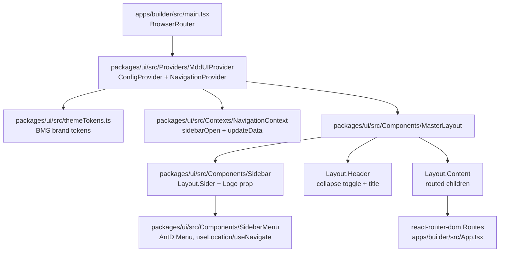
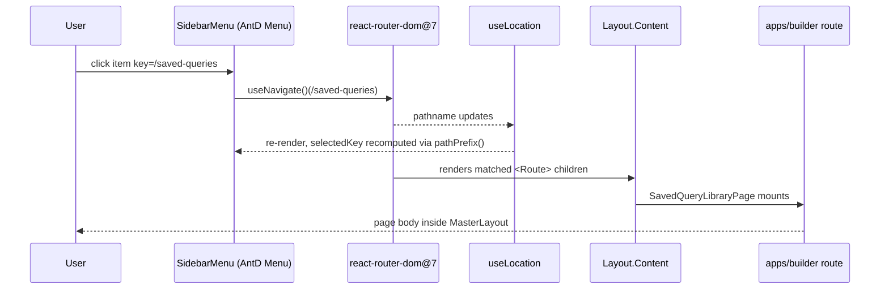
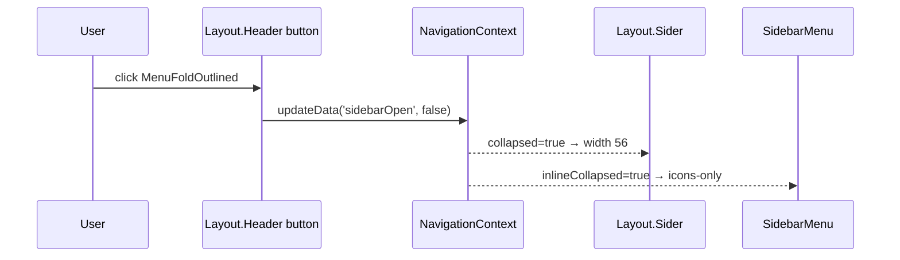

# `@mdd/ui` workflow — how the package threads through a consuming app

**Companion plan**: [docs/agents/plan/packages-ui.plan.md](../plan/packages-ui.plan.md)
**Drafted**: 2026-05-18 · generated by `repo-explainer` skill at the request of `master-plan`.

## Component view — what's in the box, and what wires it together

- `<MddUIProvider>` is the single entry: it composes AntD's
  `<ConfigProvider theme={themeTokens}>` with `<NavigationProvider>`
  in one wrapper, so consumers don't mount the two by hand.
- `themeTokens` is a verbatim copy of
  [apps/builder/src/theme/antdTheme.ts](../../../apps/builder/src/theme/antdTheme.ts)
  in R01; R02 inverts so builder imports _from_ `@mdd/ui` and the
  local file goes away.
- `MasterLayout` reads `data.sidebarOpen` from `NavigationContext`
  and passes it to `Sidebar`; the header's collapse button flips it
  via `updateData('sidebarOpen', …)`.
- `SidebarMenu` calls `useLocation` and `useNavigate` from
  `react-router-dom`. The package never imports
  `@tanstack/react-router`.

## Sequence — user clicks a sidebar item

- The active highlight uses a **two-segment prefix rule**: take the
  current pathname, keep the first one or two non-empty segments,
  match any item whose `path` equals or starts that prefix. So
  `/saved-queries/123` collapses to the menu item `/saved-queries`
  and stays highlighted while the user is anywhere under that
  subtree. (Helpers `pathPrefix` + `isActive` in
  `packages/ui/src/Components/SidebarMenu/index.tsx`.)
- The header's collapse toggle is the **only** sidebar-state writer.
  Routes never call `updateData` themselves, so menu collapse is
  page-local and reverts to default on remount.

## Sequence — header collapse toggle

## Where to look in code

- Provider wiring: [packages/ui/src/Providers/MddUIProvider/index.tsx](../../../packages/ui/src/Providers/MddUIProvider/index.tsx) _(planned — R01 Phase 2)_
- Navigation context: [packages/ui/src/Contexts/NavigationContext/index.tsx](../../../packages/ui/src/Contexts/NavigationContext/index.tsx) _(planned — R01 Phase 2)_
- Layout shell: [packages/ui/src/Components/MasterLayout/index.tsx](../../../packages/ui/src/Components/MasterLayout/index.tsx) _(planned — R01 Phase 3)_
- Sidebar collapse + Logo slot: [packages/ui/src/Components/Sidebar/index.tsx](../../../packages/ui/src/Components/Sidebar/index.tsx) _(planned — R01 Phase 3)_
- Menu + RRD navigation: [packages/ui/src/Components/SidebarMenu/index.tsx](../../../packages/ui/src/Components/SidebarMenu/index.tsx) _(planned — R01 Phase 3)_
- BMS token source today: [apps/builder/src/theme/antdTheme.ts](../../../apps/builder/src/theme/antdTheme.ts) — mirrored into `packages/ui/src/themeTokens.ts` in R01 and inverted in R02.

## Regeneration

This diagram lags the code by definition. Regenerate via the
`repo-explainer` skill whenever:

- A round adds or removes a component from `packages/ui/src/Components/`.
- The router stack changes (e.g. RRD upgrade, or a TanStack-router
  introduction).
- The provider composition gains or loses a layer (e.g. an
  `<ErrorBoundary>` or `<QueryClientProvider>` becomes part of
  `MddUIProvider`).
