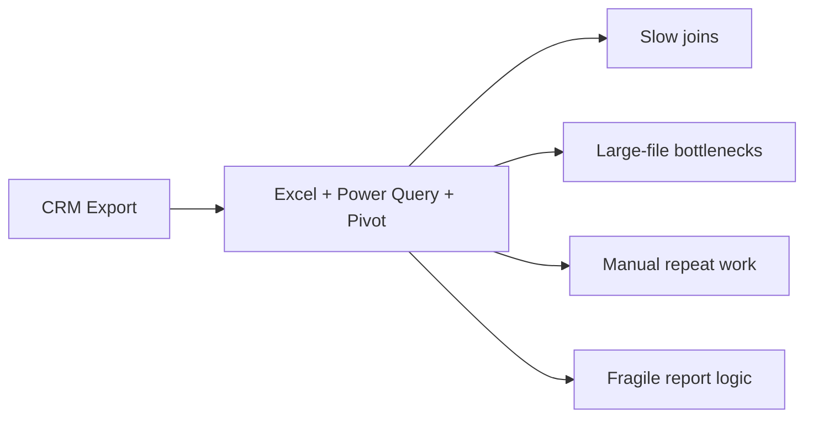
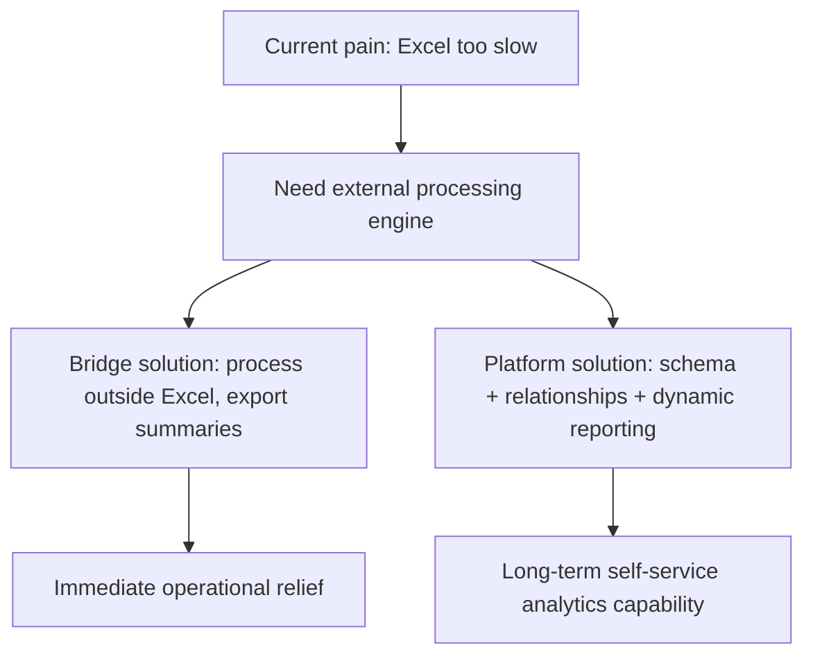
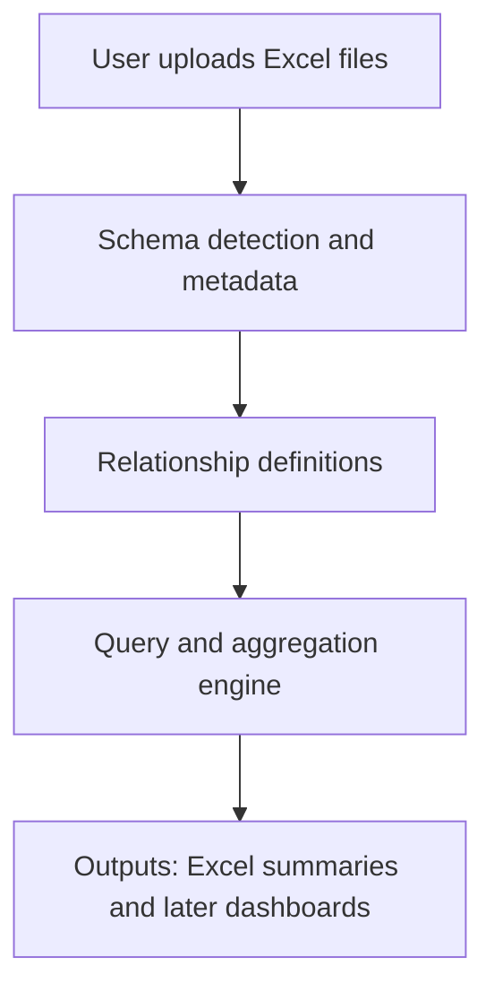

# Problem Analysis

## Summary

The core problem is not "build a dashboard". The actual problem is that the current CRM does not support required reporting workflows, while Excel has become the unofficial analytics engine and is now failing under growing data volume and changing join logic.

This creates a gap between:

- operational data living in CRM exports
- analytical needs that require joins, transformations, and repeatable reporting
- a working style that still depends on Excel for final reporting and charts

The draft shows a clear progression:

1. CRM is missing needed reporting features.
2. Excel became the workaround through exports, Power Query, pivots, and charts.
3. Data volume grew past what Excel handles comfortably.
4. Reporting logic is not fixed, especially joins across uploaded files.
5. A more flexible analysis platform is needed, but the immediate pain is performance and relationship handling.

## Problem Statement

The user needs a system that can ingest exported Excel data, model relationships between uploaded tables, perform heavy joins and aggregations outside Excel, and still support Excel-based output in the near term.

The first success condition is not a polished self-service BI product. It is a pragmatic bridge that removes Excel from the heavy-processing path while preserving Excel as a familiar consumption layer.

## Why Excel Is Breaking Down

Excel is currently doing too many jobs at once:

- raw data storage
- transformation engine
- join engine
- aggregation engine
- presentation layer

That works while data is small and relationships are simple. It stops working when:

- row counts move beyond a comfortable interactive range
- multiple files must be joined repeatedly
- join paths change from one report to another
- logic needs to be repeatable and less manual

## Real Constraints Extracted From The Draft

### Business context

- Reporting cadence is weekly and monthly.
- The domain is telesales insurance, but the solution is trending toward a more generic upload-and-analyze product.
- The user is technical and can work with web and Python.

### Data context

- Data already exceeds 100k rows.
- Source data arrives as Excel exports.
- Multiple files may need to be related together.
- Relationships are important and not fixed permanently.

### Workflow context

- Excel output still matters.
- The user wants flexibility more than a one-off hardcoded dashboard.
- A future UI for relationship definition is desirable, but not required for the first milestone.

## Core Tension

There are two valid product directions, and they should not be confused:

### Direction A: Immediate bridge solution

Use Python plus an analytical engine to:

- load large Excel files
- define or reuse relationships
- run heavy joins and aggregations
- export smaller summary outputs back to Excel

This solves the current pain fastest.

### Direction B: Flexible analytics platform

Build a system where users can:

- upload multiple Excel files
- inspect inferred schema
- define table relationships
- dynamically choose joins and fields
- generate reports or dashboards without rewriting SQL

This is the longer-term product direction.

## Main Problem Components

### 1. Performance bottleneck

Excel is the bottleneck for joins and transformations on large datasets.

### 2. Relationship modeling bottleneck

The challenging part is not only volume. It is that joins are variable:

- some reports join two tables
- others join three or four tables
- join paths may change depending on the question

### 3. Tooling mismatch

CRM is too limited, while Excel is too overloaded. There is no middle layer dedicated to data modeling and computation.

### 4. Repeatability gap

Current manual steps are fragile. The same logic should be executable repeatedly with fresh exports.

## Implications

A successful solution needs these properties:

- faster than Excel for joins and aggregations
- explicit relationship metadata
- flexible enough for changing join paths
- able to export Excel-ready results
- simple enough to implement incrementally

This points to a layered design:

## Recommended Framing

The problem should be framed as:

> Build an analysis engine for exported business data, starting with relationship-aware processing and Excel output, then growing into a flexible self-service reporting tool.

That framing avoids two common mistakes:

- overbuilding a dashboard before solving the data-processing bottleneck
- hardcoding relationships too early when the real requirement is dynamic joining

## What To Read Next

- [01-requirements.md](./01-requirements.md) — functional and non-functional requirements
- [02-architecture-options.md](./02-architecture-options.md) — three architecture options compared
- [03-roadmap.md](./03-roadmap.md) — phased delivery plan
- [04-tech-stack.md](./04-tech-stack.md) — FastAPI + React + Streamlit decision and rationale
- [05-data-layer.md](./05-data-layer.md) — DuckDB + SQLite + Parquet architecture, schema evolution
- [06-ai-workflow-engine.md](./06-ai-workflow-engine.md) — AI-powered YAML workflow generation and execution
- [07-collaboration-model.md](./07-collaboration-model.md) — business-tech bridge, roles, request workflow
- [08-evolutionary-approach.md](./08-evolutionary-approach.md) — just-in-time features, Polars/DuckDB/Pandas division, naming
- [09-mvp-plan.md](./09-mvp-plan.md) — two-MVP strategy, week-by-week breakdown, monorepo structure, deployment
