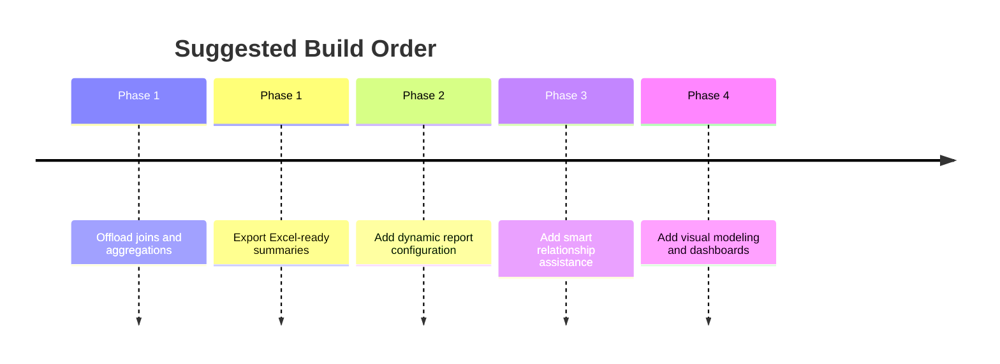

# Delivery Roadmap

## Phase 1: Relieve Excel Bottlenecks

Goal: move heavy joins and aggregations out of Excel while keeping Excel as the reporting surface.

Deliverables:

- Excel ingestion
- schema inspection
- relationship metadata stored explicitly
- query execution over uploaded tables
- Excel export for summarized outputs

## Phase 2: Relationship-Aware Report Builder

Goal: make joins configurable without rewriting code each time.

Deliverables:

- selectable base table
- related-table selection from known relationships
- column and metric selection
- reusable report definitions

## Phase 3: Guided Relationship Management

Goal: reduce the cost of maintaining data models across uploads.

Deliverables:

- relationship suggestions
- validation of key overlap and cardinality
- clearer conflict handling for schema changes

## Phase 4: Visual Modeling And Dashboards

Goal: evolve from a processing tool into a broader analytics product.

Deliverables:

- visual relationship builder
- dashboard generation from saved report definitions
- richer sharing and scheduled reporting features

## Delivery Principle

Each phase should leave the system useful on its own. The mistake to avoid is waiting for the full platform before solving the current reporting pain.

