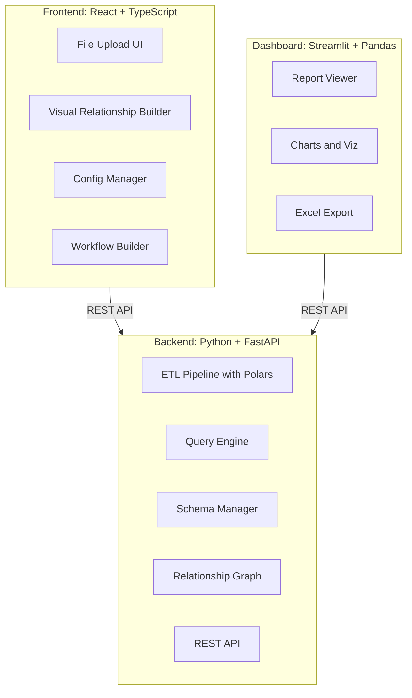
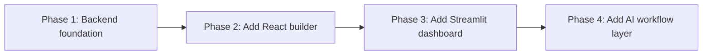

# Tech Stack Direction

## Current Direction



## Why This Three-Part Architecture

The draft explored multiple frontend options and eventually converged on a separation of concerns:

- **Backend (FastAPI)**: Single source of truth for data processing, relationships, and queries. All logic lives here. Both frontends consume the same API.
- **React Frontend**: For complex interactive UX like the visual relationship builder, workflow management, and file upload. Power users configure the system here.
- **Streamlit Dashboard**: For report consumers who just need to run pre-built reports, view charts, and export to Excel. Fast to build, data-focused.

This means the system can evolve each piece independently. In the later draft, the intended build order becomes:

1. backend foundation
2. React builder for setup and relationships
3. Streamlit dashboard for daily reporting

## Technology Comparison

The draft evaluated four frontend options for the relationship builder and reporting needs:

| Criteria               | Streamlit | Dash      | React + FastAPI | Svelte         |
| ---------------------- | --------- | --------- | --------------- | -------------- |
| Time to MVP            | 1-2 weeks | 2-3 weeks | 4-6 weeks       | 4-6 weeks      |
| Visual relationship UI | Form only | Possible  | Full drag-drop  | Full drag-drop |
| Python-only            | Yes       | Yes       | No              | No             |
| Production readiness   | OK        | Good      | Excellent       | Excellent      |
| Customization          | Limited   | Better    | Full control    | Full control   |

### Why not Streamlit alone

Streamlit is excellent for data apps but limited for complex interactive UIs. The visual relationship builder (drag-drop between table nodes) is not feasible in pure Streamlit. Page reloads on every interaction make complex workflows feel sluggish.

### Why not Dash alone

More control than Streamlit but still limited for drag-drop graph interfaces. Callbacks and ID management add boilerplate without reaching the interactivity level React provides.

### Why React for the frontend

React has the richest ecosystem for the specific UI components needed:

- **react-flow**: Proven library for node-based graph editors, used by Stripe and Notion. Maps directly to the relationship builder concept where tables are nodes and relationships are edges.
- **Component ecosystem**: shadcn/ui, Tailwind CSS, and Tanstack Query provide production-grade UI without building from scratch.
- Full control over layout, state management, and user experience.

### Why Streamlit stays for the dashboard

Report consumers do not need complex UIs. They need to select a saved report configuration, adjust parameters like date range and team filter, click generate, and download Excel. Streamlit does this well and is fast to iterate on.

## Backend Stack Details

```
FastAPI
├── Polars           (ETL, file reading, schema detection, Parquet conversion)
├── DuckDB           (analytics queries on Parquet files)
├── SQLite           (metadata, relationships, configs)
├── pandas           (result conversion for dashboard/export)
├── Pydantic         (data validation, API models)
├── python-multipart (file uploads)
├── openpyxl         (Excel read/write)
├── PyYAML           (workflow definitions)
└── networkx         (relationship graph traversal, join path finding)
```

### Why FastAPI

- Async support for file uploads and query execution.
- Automatic OpenAPI docs, which helps both the React frontend team and the Streamlit integration.
- Pydantic validation catches schema issues early.
- Python ecosystem access for Polars, DuckDB, SQLite, and the relationship graph logic.

## Frontend Stack Details

```
React + TypeScript
├── react-flow       (visual relationship builder)
├── Tanstack Query   (API state management, caching)
├── Axios            (HTTP client)
├── Tailwind CSS     (utility-first styling)
└── shadcn/ui        (accessible component library)
```

## API Design

The backend exposes a versioned REST API consumed by both frontends:

```
/api/v1/tables/upload        POST   Upload Excel/CSV file
/api/v1/tables               GET    List uploaded tables
/api/v1/tables/{id}          GET    Table details and schema
/api/v1/tables/{id}          DELETE Remove a table

/api/v1/relationships        GET    List all relationships
/api/v1/relationships        POST   Create relationship
/api/v1/relationships/{id}   DELETE Remove relationship
/api/v1/relationships/suggest GET   Auto-suggest relationships

/api/v1/queries/preview      POST   Preview SQL and first 100 rows
/api/v1/queries/execute      POST   Execute query, return results
/api/v1/queries/export       POST   Execute and export to Excel

/api/v1/configs              GET    List saved query configurations
/api/v1/configs              POST   Save a configuration
/api/v1/configs/{id}         GET    Get saved configuration
```

## Deployment

```yaml
# devops/compose.yaml structure
services:
  backend: # FastAPI on port 8000
  frontend: # React on port 3000
  dashboard: # Streamlit on port 8501
```

All three services share the same data volume. The backend manages all data access. The frontend and dashboard only communicate through the API.

## Migration Path



The architecture supports incremental delivery. The backend can still be useful on its own with scripts before any frontend exists, but the later MVP planning in the draft puts the React builder ahead of the Streamlit dashboard because relationships and query construction are the first critical UX problems to solve.
