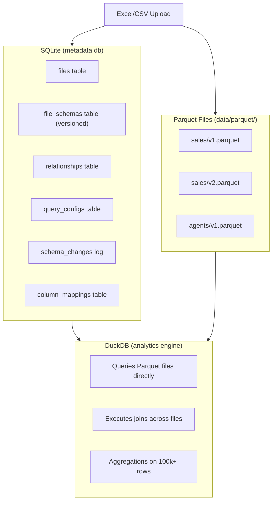
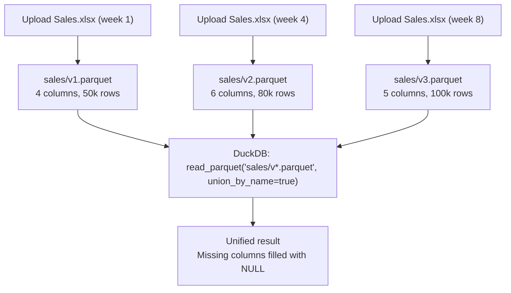
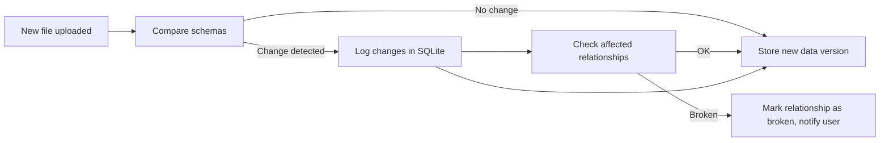
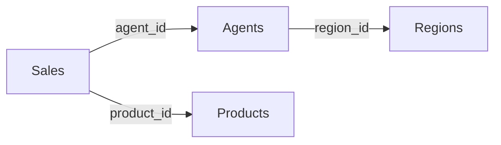
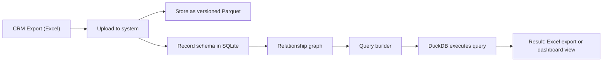

# Data Layer Architecture

## Overview: DuckDB + SQLite + Parquet

The draft converged on a hybrid storage strategy where each technology handles what it does best.



## Why This Combination

| Concern             | Technology | Reason                                                    |
|---------------------|-----------|-----------------------------------------------------------|
| Metadata CRUD       | SQLite    | ACID transactions, small data, fast lookups               |
| Schema tracking     | SQLite    | Normalized relational model for versions, changes, mappings|
| Relationship storage| SQLite    | Foreign keys, constraints, transactional updates          |
| Data storage        | Parquet   | Column-oriented, compressed, schema evolution friendly    |
| Analytics queries   | DuckDB    | OLAP-optimized, fast aggregations, reads Parquet directly |

SQLite answers: "What files exist? What relationships are defined? What changed?"
DuckDB answers: "Show me total sales by agent for Q1 across 100k+ rows."

Both are serverless and file-based, which keeps deployment simple.

## Schema Evolution

This is one of the most critical design decisions in the draft. CRM exports change over time: columns get added, renamed, or removed.

### The Problem

```
Week 1: Upload Sales.xlsx → columns: [sale_id, agent_id, amount, date]
Week 4: Upload Sales.xlsx → columns: [sale_id, agent_id, amount, date, product_id, commission]
                                                                        ^^^^^^^^^^^^^^^^^^^^^^
                                                                        NEW COLUMNS
```

What happens to the database schema? Existing relationships? Saved queries?

### The Solution: Schema Versioning + Parquet



Each upload creates a new versioned Parquet file rather than mutating a database table. DuckDB can query across versions with `union_by_name=true`, automatically handling schema differences.

### Schema Change Detection

On every upload, the system:

1. Compares new columns against the latest schema version.
2. Detects added columns, removed columns, and type changes.
3. Creates a new schema version record in SQLite.
4. Checks if any existing relationships are broken (e.g., a joined column was removed).
5. Returns a schema change notification to the user and flags affected relationships.



### Column Mapping for Renames

When a CRM renames a column (e.g., `sales_amount` becomes `amount`), the system stores a mapping:

```sql
column_mappings (
    file_id, old_column_name, new_column_name, from_version, to_version
)
```

The query builder applies these mappings when generating SQL, so saved reports continue to work even after column renames.

## SQLite Metadata Schema

The metadata database tracks six concerns:

### files

Registered uploaded files with their current version and row count.

### file_schemas

Versioned schema snapshots. Each version stores columns as JSON with type, position, and nullability for every column.

### relationships

User-defined relationships between tables, including join type, relationship type (one-to-many, etc.), and a broken flag with reason when schema changes invalidate a join column.

### query_configs

Saved report definitions that can be rerun. Stores the full query configuration as JSON so it can be loaded and executed without rebuilding the parameters.

### schema_changes

Audit log of every schema change: which column was added, removed, or changed type, and between which versions.

### column_mappings

Handles column renames across schema versions so that saved queries and relationships survive column name changes.

## DuckDB Query Patterns

### Query latest version only

```sql
SELECT * FROM read_parquet('data/parquet/{file_id}/v{latest}.parquet')
```

### Query all versions with schema union

```sql
SELECT * FROM read_parquet('data/parquet/{file_id}/v*.parquet',
                           union_by_name=true)
```

DuckDB fills missing columns with NULL and handles different column orders automatically.

### Multi-table join across Parquet files

```sql
SELECT a.agent_name, SUM(s.amount) as total_sales
FROM read_parquet('data/parquet/sales/v2.parquet') s
LEFT JOIN read_parquet('data/parquet/agents/v1.parquet') a
  ON s.agent_id = a.agent_id
GROUP BY a.agent_name
ORDER BY total_sales DESC
```

## Relationship Graph and Join Path Finding

Relationships between tables are stored in SQLite but used at query time to generate joins dynamically.



When a user selects a base table (Sales) and wants columns from a non-adjacent table (Regions), the system uses networkx to find the shortest path through the relationship graph and generates the full JOIN chain:

```
Sales → Agents → Regions
```

This means the user picks tables and columns, and the system figures out the required joins automatically.

## Data Flow Summary


