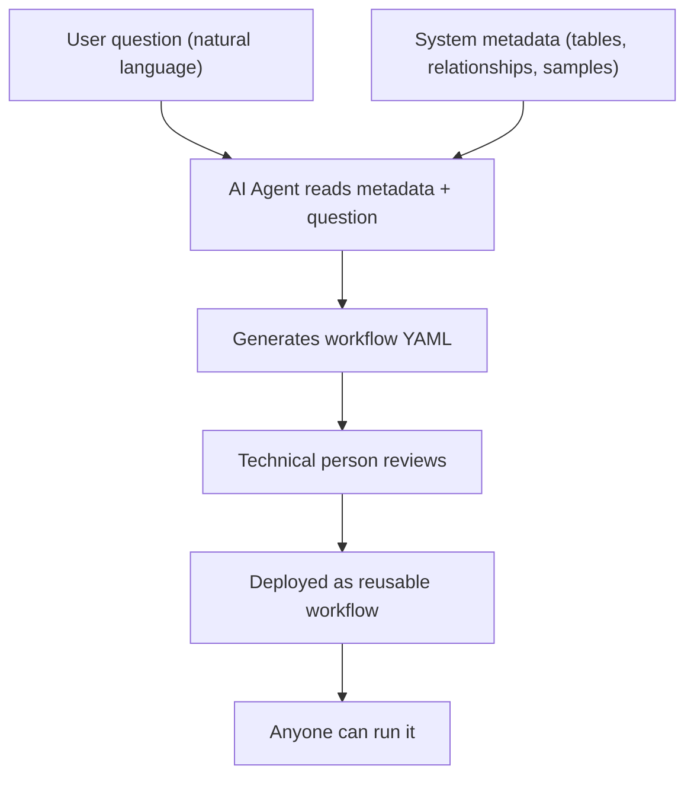
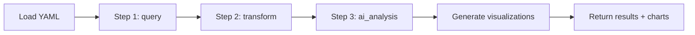

# AI-Powered Workflow Engine

## Evidence Status

- `Direct draft conclusion`: explicitly proposed or described in the draft.
- `Synthesis`: a reasonable consolidation or structuring of draft ideas, but not stated in exactly this final form.
- `Speculative extension`: plausible next-step detail added to make the concept concrete.

## Concept

Evidence: `Direct draft conclusion`

The draft's final evolution adds an AI layer on top of the data platform. The idea: export current metadata (tables, columns, relationships, sample data) and let an AI agent generate executable analysis workflows in YAML format.

This turns the system from a tool that requires someone to write every query into a platform where AI generates first drafts and humans review and approve.



## Workflow YAML Format

Evidence: `Direct draft conclusion`

A workflow is a structured YAML file that defines analysis steps, transformations, and visualizations. It is both human-readable and machine-executable.

### Structure

```yaml
workflow:
  id: agent_performance_analysis
  name: "Agent Performance & Coaching Priorities"
  description: "Identify underperforming agents and suggest coaching focus"
  version: 1
  created_by: ai_agent

metadata:
  base_tables: [sales, agents]
  required_columns:
    sales: [sale_id, agent_id, amount, date, status]
    agents: [agent_id, agent_name, team, hire_date]

steps:
  - name: calculate_metrics
    type: query
    sql: |
      SELECT ...
    output: agent_metrics

  - name: identify_underperformers
    type: transform
    code: |
      import pandas as pd
      ...
    output: underperformers

  - name: suggest_coaching
    type: ai_analysis
    prompt: |
      Based on this agent performance data: {underperformers}
      Suggest coaching priorities...
    output: coaching_suggestions

visualizations:
  - name: performance_overview
    type: bar_chart
    data: agent_metrics
    config:
      x: agent_name
      y: conversion_rate
      color: team

output:
  format: dashboard
  schedule: weekly
```

### Step Types

Evidence: `Direct draft conclusion`

| Type          | What it does                                      | Execution           |
|---------------|--------------------------------------------------|---------------------|
| `query`       | Runs SQL against DuckDB/Parquet                  | DuckDB engine       |
| `transform`   | Runs Python code on intermediate DataFrames      | Sandboxed exec      |
| `ai_analysis` | Sends data + prompt to Claude for textual insight | Claude API call     |

Steps execute sequentially. Each step's output is available to subsequent steps by name.

## Metadata Export for AI Context

Evidence: `Direct draft conclusion`

Before generating a workflow, the system exports its current state in an AI-friendly format:

- All tables with their column names, types, and positions
- All defined relationships
- Sample data (first 5 rows per table) for context
- Business context (domain, key metrics, common questions)

This gives the AI enough information to write correct SQL and understand the data model without accessing the raw data.

## Workflow Execution Engine

Evidence: `Synthesis`



The engine:

1. Loads the YAML file.
2. Executes each step in order, passing outputs into a shared context.
3. For `query` steps: runs SQL through DuckDB.
4. For `transform` steps: executes Python code with intermediate DataFrames available.
5. For `ai_analysis` steps: sends data + prompt to Claude, stores the textual result.
6. After all steps: generates visualization configs from the `visualizations` section.
7. Returns a combined result with data, analysis text, and chart definitions.

The draft clearly describes workflow upload, execution, and sequential step handling. This section is a structured summary of that behavior rather than a separate new decision.

## Scheduling and Automation

Evidence: `Direct draft conclusion`

Workflows can be scheduled for automatic execution:

```yaml
output:
  schedule: weekly
  notification:
    enabled: true
    recipients: [managers@company.com]
    condition: "underperformers.count() > 0"
```

The system stores schedules in SQLite and can use APScheduler or Celery for execution.

`APScheduler` and `Celery` are named in the draft as implementation options, not as final locked choices.

## Realistic Expectations

Evidence: `Direct draft conclusion`

The draft includes an honest assessment of what AI can and cannot do here.

### AI is good at

- Generating boilerplate SQL (SELECT, JOIN, GROUP BY patterns)
- Adapting existing workflows (change date filters, add a column)
- Suggesting visualizations based on column types
- Documenting what the code does

### AI needs human review for

- Business logic validation (should cancelled sales be excluded?)
- Context that is not in the metadata (data quality quirks, implicit rules)
- Complex multi-step business logic (tiered commissions, quota adjustments)
- Data quality issues (nulls, duplicates, timezone problems)

### Expected quality

- AI-generated workflows: approximately 80% correct out of the box
- After technical review: approximately 95% correct
- Quality improves over time as the workflow library grows and patterns emerge

## Where This Fits in the Roadmap

Evidence: `Synthesis`

The AI workflow engine is Phase 3 work. It should not be built until:

1. The data pipeline is proven (Phase 1)
2. Users are running pre-built reports through a basic UI (Phase 2)
3. The workflow library has enough examples for AI to learn patterns from

Building AI features before the foundation is solid is a common mistake the draft explicitly warns against.

The draft strongly supports "build AI later, after the core platform proves useful." The exact phase numbering here is a synthesis layered onto that guidance.
