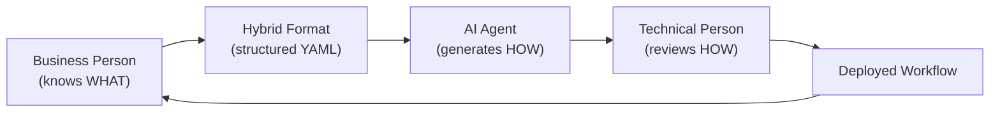
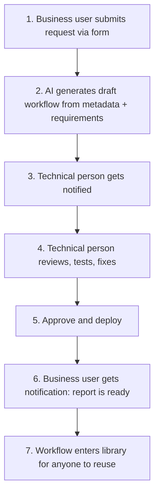
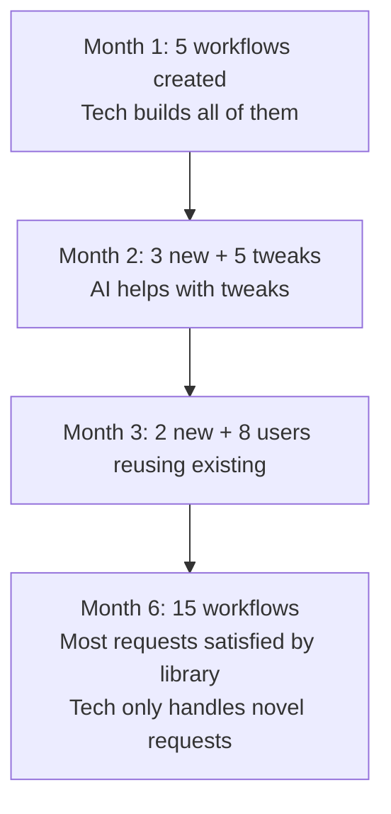
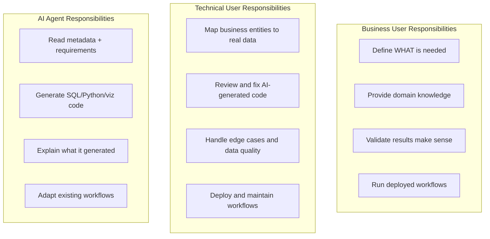

# Business-Tech Collaboration Model

## Evidence Status

- `Direct draft conclusion`: explicitly proposed or described in the draft.
- `Synthesis`: a reasonable consolidation or framing of draft ideas, but not stated in exactly this final form.
- `Speculative extension`: plausible detail added to operationalize the concept.

## The Core Idea

Evidence: `Direct draft conclusion`

The draft identifies a critical insight: business people know WHAT they need but not HOW to build it. Technical people know HOW to build it but need the WHAT defined clearly. AI can bridge the gap by generating a first draft, but humans on both sides must validate.

The meeting point is a structured requirements format that both sides can read and that the AI can consume.

## User Personas

Evidence: `Synthesis`

### Business User (e.g., Sales Manager)

Can do with the system:

- Run pre-built workflows
- Adjust parameters (date range, team filter, thresholds)
- Download results to Excel
- Submit requests for new reports via a form

Cannot do without help:

- Create new workflows from scratch
- Debug failed workflows
- Understand or modify SQL/Python code
- Define data relationships

### Technical User (e.g., PM/Dev)

Can do with the system:

- Review AI-generated workflows
- Fix SQL, add edge case handling, optimize queries
- Define and manage data relationships
- Deploy and maintain workflows
- Create workflows manually when needed

Does not need to:

- Define business metrics (that is the business user's domain)
- Run reports manually (the system does that)
- Rebuild reports from scratch (AI generates the first draft)

### AI Agent

Can do:

- Read metadata and business requirements
- Generate SQL queries, Python transforms, and visualization configs
- Adapt existing workflows to new parameters
- Explain what it generated

Cannot do:

- Make final approval decisions
- Understand implicit business rules not in the metadata
- Guarantee correctness (human review required)

These personas and responsibilities are strongly grounded in the draft, but this section consolidates them into a cleaner role model than the original conversational material.

## The Request Workflow

Evidence: `Direct draft conclusion`

### Time comparison

Evidence: `Direct draft conclusion`

| Step                    | Before (manual) | After (with system) |
| ----------------------- | --------------- | ------------------- |
| Business defines need   | Email thread    | Structured form     |
| Technical builds report | 8 hours         | 1 hour review       |
| Report available to run | One-off Excel   | Reusable workflow   |
| Re-run with fresh data  | Repeat process  | Click a button      |

## The Hybrid Format

Evidence: `Direct draft conclusion`

The business requirements YAML serves as a contract that both sides understand.

### Business layer (filled by the business user via form)

- Goal: what are we trying to achieve
- Questions: what specific questions should the report answer
- Success criteria: when is the report considered useful
- Audience: who will read it

### Business definitions (domain knowledge from the business user)

- Metric definitions: what does "underperforming" mean, exactly
- Time period definitions: what does "week" mean (Monday to Sunday?)
- Threshold definitions: what triggers an alert

### Data requirements (in business terms)

- Primary entities: "Sales Calls", "Agents" (not table names)
- Required fields: call_date, agent_name, outcome (not column names)
- Time range and filter preferences

### Output requirements

- Views: table, line chart, bar chart, text summary
- Export options: Excel, PDF
- Delivery schedule and recipients

### Technical notes (optional, for the tech reviewer)

- Known data quality issues
- Performance constraints
- Data source details

## The Workflow Library (Compound Effect)

Evidence: `Direct draft conclusion`

The goal: build a library that covers 80% of reporting needs so the technical person only intervenes for the 20% that are genuinely new.

## Role Boundaries

Evidence: `Synthesis`

The role split is explicit in the draft, but the grouped boundary diagram is a synthesis for readability.

## Success Metrics

Evidence: `Synthesis`

### For business users

- Time from request to available report: 2-5 days becomes less than 1 day
- Percentage of reports they can run without asking for help: target 80%
- Number of report requests to technical team: trending down over time

### For the technical team

- Time spent per request: trending down (8 hours to 1 hour to 30 minutes)
- Percentage of AI-generated code needing modification: trending down
- Workflow library size: trending up
- Repeat request rate: trending down

### For the platform

- Workflow reuse rate (how often saved workflows are re-run)
- Coverage: percentage of requests satisfied by existing workflows
- Time to create a new workflow: decreasing as AI improves

The draft gives concrete before/after examples and success signals. This section turns those into a cleaner operating scorecard.

## What This Is Not

Evidence: `Direct draft conclusion`

This is not a replacement for a BI tool like Power BI or Tableau. It is a pragmatic bridge for a specific situation:

- CRM lacks reporting features
- No dev team to enhance the CRM
- Excel is overloaded
- A technical PM can maintain the platform
- Business users need self-service on pre-built reports

The system is scoped to this context. It does not try to be a general-purpose analytics platform on day one.
