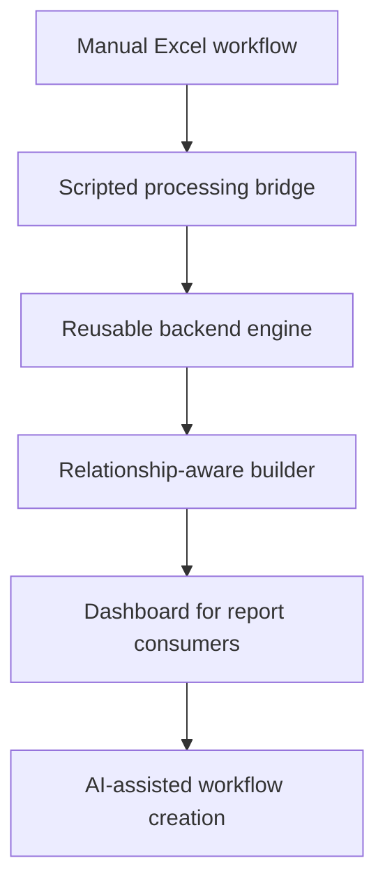
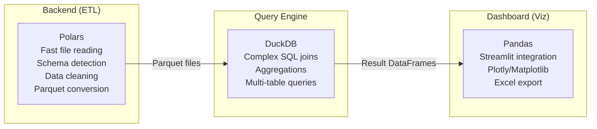

# Evolutionary Approach

## Philosophy: Start Small, Evolve Fast

The draft repeatedly converges on one principle: do not build "the ultimate analytics platform." Build the thing that saves 10 hours this week, then let it evolve based on what actually gets used.



The exact order changed across the draft as the thinking matured, but the principle stayed stable: solve the current bottleneck first, then add the next layer only when it becomes the real constraint.

## Just-in-Time Features

The decision framework from the draft:

1. **Does this save time THIS WEEK?** If no, do not build it yet.
2. **How many people does it help?** Even 1 person is worth it if it saves 5+ hours/week.
3. **How long to build?** Under 4 hours: just do it. Over 1 week: needs strong justification.
4. **Can it evolve?** Builds on existing work = good. Dead-end = reconsider.

## What NOT to Build Prematurely

The draft explicitly warns against building these before they are needed:

- User authentication (unless there are real security requirements)
- Advanced permissions system
- Multi-tenancy
- Complex workflow orchestration (Airflow/Prefect)
- Real-time dashboards (batch processing is fine for weekly reports)
- Mobile app

## Evolution Readiness Checklist

Build so the system CAN evolve, even if you do not build everything now:

- Use standard formats (Parquet, YAML, SQL) for easy migration later
- Separate layers (data, logic, UI) so any piece can be swapped
- Version data (keep old Parquet versions) so you can go back
- Log usage (who ran what when) to learn from patterns
- Make it easy to add features: new workflow = add YAML, new data = upload file

## Measuring Success of Evolution

### Good signs

- Spending less time on manual work
- Others using the tool without asking for help
- Requests for new features (means they are engaged)
- Old features still being used (they are valuable)
- Having time to add new features (not drowning in manual work)

### Warning signs

- Nobody using it except you (may be solving the wrong problem)
- Constant bugs (built too fast, need to slow down)
- Every use case needs custom code (need more flexibility)
- People going back to Excel (UX too complex)
- Drowning in maintenance (over-engineered)

## Polars and Pandas: Division of Labor

A key decision from the draft: use the right data library for each layer.



### Why Polars for ETL

- 5-10x faster than pandas for reading Excel/CSV
- Better type inference for schema detection
- Lazy evaluation: build queries without executing, optimize before running
- Strict types help catch schema evolution issues early
- Native Parquet support with optimal compression

### Why DuckDB for SQL queries

- Handles any join complexity (3+ tables, complex conditions)
- Standard SQL syntax is universal and debuggable
- Optimizes query plans internally
- Users can see the generated SQL

### Why Pandas for dashboards

- Streamlit works natively with pandas (`st.dataframe(df)` just works)
- All visualization libraries (Plotly, Matplotlib, Seaborn) expect pandas
- Results are small (already aggregated), so pandas performance is fine
- Familiar API for debugging and quick analysis

### The later converged query flow

```
Visual Builder (React) → JSON config → SQL Translator → DuckDB → Pandas → Streamlit
```

The later draft explicitly recommends against generating Polars code from the visual builder. SQL is simpler to generate, debug, and maintain for joins. Polars is reserved for ETL where it excels.

## Project Naming Rationale

The project is named `my-dynamic-dashboard`:

- **my**: Solving a personal/team problem, not a generic enterprise tool
- **dynamic**: Adapts to changing schemas and evolving needs
- **dashboard**: The end goal is insights and visualization

The name reflects the destination (dashboard), not the process (builder). The builder is the foundation; the dashboard is what users interact with daily.
