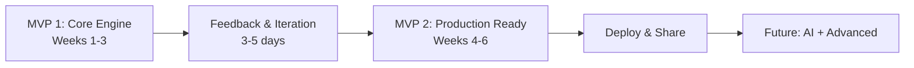

# MVP Plan

## Two-MVP Strategy

The draft converges on two clear milestones, each delivering standalone value.



## MVP 1: Core Engine

**Goal**: Replace the manual Excel workflow. Can I process 100k+ rows without Excel crashing?

### Features

1. **Data Upload** (Polars): Upload Excel/CSV, auto-detect schema, convert to Parquet, version tracking
2. **Relationship Builder** (React Flow): Visual graph, drag to connect tables, save relationships
3. **Query Builder** (SQL Translator + DuckDB): Select base table, columns, filters, aggregations, preview results, show generated SQL
4. **Export** (DuckDB to Excel/CSV): Execute full query, download as Excel or CSV

### Success criteria

- Upload 100k+ rows without crash
- Define relationships visually
- Execute query in less than 5 seconds
- Export results as Excel/CSV
- Save 2+ hours on the weekly report

### Week-by-week breakdown

**Week 1: Backend Foundation**
- Days 1-2: Environment setup, file upload API, Polars processing, schema detection, Parquet storage, SQLite metadata
- Days 3-4: Relationship model, CRUD endpoints, SQL translator, DuckDB integration
- Days 5-7: Query builder endpoint, preview (LIMIT 100), execute, export to Excel/CSV

**Week 2: Frontend Builder**
- Days 8-10: React + TanStack setup, upload page with drag-drop, tables list, schema viewer
- Days 11-13: React Flow graph, drag to connect nodes, save relationships, visual feedback
- Day 14: Loading states, error messages, toasts, basic Tailwind styling

**Week 3: Query Builder and Export**
- Days 15-17: Query builder UI (base table, columns, filters, group by, aggregations), SQL preview, results preview
- Days 18-19: Execute button, download Excel/CSV, progress indicator
- Days 20-21: Test with real data, fix bugs, write README, record demo

### Tech stack (locked in)

```
Backend:  FastAPI + Polars (ETL) + DuckDB (SQL) + SQLite (metadata) + Parquet (storage)
Frontend: React 18 + TanStack (Router, Query, Table) + React Flow + Tailwind + Vite
Infra:    pnpm monorepo on WSL2; Docker CE used for deployment and optional hybrid dev
```

### Monorepo structure for MVP 1

```
my-dynamic-dashboard/
├── packages/
│   ├── backend/
│   │   ├── app/
│   │   │   ├── main.py
│   │   │   ├── api/        (upload, relationships, queries)
│   │   │   ├── core/       (polars_processor, sql_translator, duckdb_executor, metadata_db)
│   │   │   └── models/
│   │   └── requirements.txt
│   └── builder/
│       ├── src/
│       │   ├── routes/      (__root, upload, relationships, queries)
│       │   ├── components/  (FileUploader, RelationshipGraph, QueryBuilder, ResultsTable)
│       │   └── api/         (client.ts)
│       └── package.json
├── data/                    (gitignored: parquet/, metadata.db)
├── scripts/                 (dev.sh, stop.sh, clean.sh)
├── docker-compose.yml
├── pnpm-workspace.yaml
└── package.json
```

## Feedback Gate Between MVPs

After MVP 1, collect feedback before proceeding:

- Ask yourself: Did it solve my Excel problem? Is it faster? What is the most painful part?
- Ask 1-2 colleagues: Can they upload data? Understand relationships? Build a query?
- Decision: If 3+ people rate it 7+/10, proceed to MVP 2. If not, iterate more on MVP 1.

## MVP 2: Production Ready

**Goal**: Make it deployable and shareable. Can others use this in production?

### Features

1. **Dashboard** (Streamlit + Pandas): Select saved queries, run with parameters, view visualizations, auto-refresh, export from dashboard
2. **Saved Queries**: Save/load query configurations, name and describe, query library
3. **Visualizations**: Auto-detect column types, suggest chart types, Plotly charts (bar, line, scatter, pie)
4. **Polish**: Better error messages, loading indicators, help tooltips
5. **Deployment**: Docker Compose production config, environment variables, health checks, logging, backup strategy

### Success criteria

- Dashboard shows weekly report automatically
- Colleague can access via URL
- System runs 24/7 without intervention
- Can share link with manager
- Data persists across restarts

### Week-by-week breakdown

**Week 4: Dashboard Foundation**
- Days 26-27: Saved queries backend (CRUD endpoints, SQLite storage)
- Days 28-29: Streamlit app setup, connect to backend API, display results
- Days 30-32: Auto-generated charts (Plotly), dashboard layout (metrics, charts, table, export)

**Week 5: Polish and Features**
- Days 33-35: Advanced filters, save query from builder, query templates
- Days 36-38: Error handling, loading states, notifications, performance optimization

**Week 6: Deployment**
- Days 39-40: Production Dockerfiles, docker-compose.prod.yml, logging, environment variables
- Days 41-42: Deploy to target, verify all services, setup backup
- Days 43-44: User documentation, tutorial video, team training
- Day 45: Soft launch with 3-5 users, monitor, quick fixes

## Docker and Development Environment

The draft recommends:

- **Development**: No Docker needed. Run Python venv + uvicorn for backend, pnpm dev for frontend. Fastest hot reload, easy debugging.
- **Production / optional hybrid dev**: WSL2 + Docker CE (lightest option, ~100MB idle vs Docker Desktop's 2-3GB). Fully open source, no licensing issues.
- Docker Desktop explicitly avoided due to heavy resource usage.

## Risk Management

| Risk | Mitigation |
|------|-----------|
| WSL2 performance issues | Test early, keep project in WSL filesystem (/home/), not Windows (/mnt/c/) |
| DuckDB limitations | Document workarounds, consider alternatives for specific edge cases |
| Low user adoption | Invest in UX, documentation, training |
| Data loss | Daily backups, test restore process |
| Scope creep | Strict MVP boundaries, defer features to later phases |
| Burnout | Clear milestones, celebrate wins at each checkpoint |

## Post-MVP Roadmap

- Phase 3 (Weeks 7-9): AI query suggestion, natural language to SQL, auto-generated insights
- Phase 4 (Weeks 10-12): Multi-user authentication, shared queries, collaboration features
- Phase 5 (Weeks 13-15): Custom Python transformations, scheduled reports, email notifications
- Phase 6 (Week 16+): Handle 1M+ rows, multiple data sources, query caching
