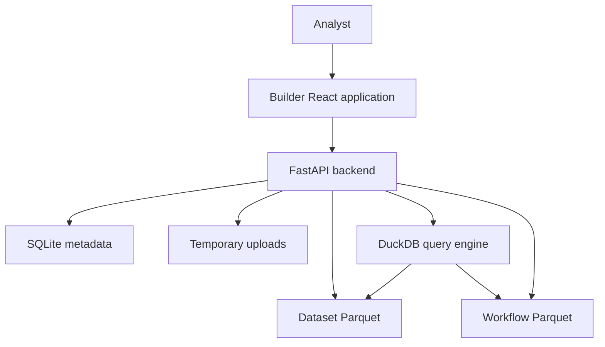

# System architecture

`my-dynamic-dashboard` turns CSV or Excel exports into governed, queryable datasets, then into saved queries, materialized workflows, and persisted dashboards. The browser application is [the builder](../builder/application.md); [the backend](../backend/service.md) owns HTTP behavior, metadata, files, and execution. Endpoint shapes originate in [API contracts](../contracts/api-contracts.md).

This is the source-grounded ownership path from an uploaded export to analytical output.

## Runtime boundaries

| Unit | Entrypoint | Owns | Depends on |
| --- | --- | --- | --- |
| Builder | `workspace/apps/builder/src/main.tsx` | Routes, views, local editor state, API clients, React Query cache | `@mdd/ui`, backend HTTP API |
| Backend | `workspace/apps/backend/app/main.py` | FastAPI composition, validation, SQLite metadata, filesystem storage, DuckDB execution | FastAPI, SQLModel/Alembic, DuckDB, pandas/pyarrow |
| Contracts | `workspace/packages/contracts` | OpenAPI endpoint documents and shared wire schemas | Builder and backend hand-aligned models |
| UI | `workspace/packages/ui/src/index.ts` | Theme, providers, layout and page primitives | React and Ant Design |

## Data and lifecycle model

A workspace scopes all durable nouns. A temporary upload is not a dataset: `POST /uploads` stores an original file under `uploads_tmp/<temp_id>` and parses enough metadata for the import wizard. Dataset batch commit writes a source copy, a typed `parsed.parquet`, and `source.json`, then inserts SQLite metadata. The [dataset page](../backend/datasets.md) details atomicity, refresh and provenance.

Saved queries keep their source and definition in SQLite but execute live against current Parquet. Their query-owned relationship snapshots protect saved joins from later edits to governed relationships; invalid current schemas become typed stale errors rather than silently altered results. [Queries](../backend/queries.md) explains resolution and transformations. Workflows instead write a frozen typed output Parquet only when run; [workflows](../backend/workflows.md) documents invalidation and reuse as a source. Dashboards persist widget definitions and bind widgets to saved queries; see [dashboard governance](../backend/governance-and-dashboards.md).

## Load-bearing ordering

Backend lifespan runs Alembic migration before serving requests, then optionally starts the temporary-upload sweeper. `UnhandledErrorMiddleware` is registered before CORS so CORS wraps its typed generic 500 response. Reversing that registration produces browser-visible CORS-like failures for server errors. Tests build the schema from `SQLModel.metadata`, stamp it at Alembic head, and use isolated temporary paths; `test_schema_parity.py` protects equivalence with migrated production schema.

## Where to change

- Import, schema, typed storage, or refresh behavior: [datasets](../backend/datasets.md) and [builder data management](../builder/data-management.md).
- Query semantics, joins, predicate evaluation, or transform steps: [queries](../backend/queries.md).
- Dashboard widgets or server aggregates: [builder dashboards](../builder/dashboards.md) and [dashboard governance](../backend/governance-and-dashboards.md).
- A wire change: update [contracts](../contracts/api-contracts.md) before both implementations.
- Startup/configuration or local fixtures: [configuration and operations](../platform/configuration-and-operations.md).
