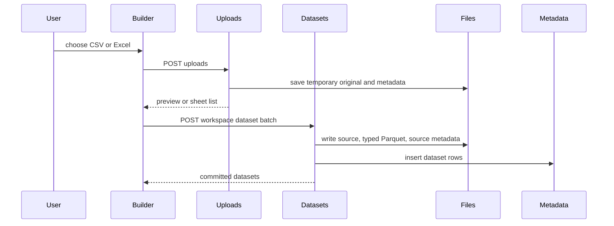

# Datasets and ingestion

The dataset domain converts staged exports into a workspace-scoped immutable-on-create table representation backed by Parquet. Its HTTP owners are `routers/uploads.py` and `routers/datasets.py`; parsers and execution helpers live in `app/ingest`. The builder wizard and exploration UI are documented in [builder data management](../builder/data-management.md) and [dataset exploration](../builder/dataset-exploration.md).

This flow distinguishes temporary inspection from durable dataset commit.

## Upload staging

`create_temp_upload()` limits body size using configured `upload_max_bytes`, verifies the declared format matches `.csv`, `.xlsx`, or `.xls`, and writes `original.<ext>` plus `meta.json`. CSV receives an inline parse preview through `parse_csv`; Excel returns enumerated sheet summaries through `enumerate_sheets`. Parse failure removes the temp directory. `parse_temp_upload()` re-parses one CSV item or one-or-more selected Excel sheets, preserving per-Excel-sheet success/failure results.

Temporary material is swept by the lifespan job according to `backend.tmp_sweep` configuration. A commit must find both metadata and original file; unknown or expired temp IDs return 404.

## Commit and physical-schema invariant

`commit_datasets_batch()` validates the workspace, staged file, item format rules, and create-versus-refresh fields before persisting anything. A create has no `target_dataset_id` and may not carry `merge_key`, `refresh_mode`, or `overlap_check_field`; any item with `target_dataset_id` is routed to the single-item refresh path. Excel items require a sheet, but multiple items may deliberately name the same sheet with distinct ranges and produce distinct datasets. For each item `_parse_and_target()` validates override names against parsed columns, rejects unsupported date/datetime formats, applies exclusions, and rejects a result with no remaining source columns. It then derives committed columns, parse settings and coercion targets; it injects a computed source-file provenance column (`Source.Name`, or an auto-suffixed noncolliding name). It writes filesystem trees first and inserts all metadata in one SQLite transaction. Errors clean staged dataset directories; dtype coercion failure returns typed `coercion_failed` and aborts the whole batch.

`ingest/parquet_writer.py` is the physical-data authority:

- CSV uses DuckDB `read_csv_auto` and a Parquet copy when inferred types conform.
- Excel uses pandas/openpyxl and PyArrow-backed output.
- Overrides and inferred targets are enforced at write time, so `parsed.parquet` types match `datasets.columns_json`.
- Integer, float, boolean, string, date and datetime casting is explicit; unsupported date format tokens and uncastable non-null cells fail loudly.
- Reported coercion rows are source-file row numbers, not merely parsed-row offsets.

Never mutate Parquet merely to implement column visibility: `PATCH /datasets/{id}/columns` changes `columns_json` only, has replacement semantics, rejects unknown columns and hiding all columns, and leaves computation intact.

## Refresh and reads

A batch item with `target_dataset_id` follows `_handle_refresh`; it is refresh-only and is deliberately limited to one item so an in-place replacement can be atomic. Omitting `refresh_mode` selects replace; explicit modes are `replace`, `merge`, and `append`. The refresh record retains the target dataset ID while reconstructing the table and records fresh source metadata. `GET /datasets/{id}/refresh-settings` exposes the prior `source.json` `commitSettings` baseline—parse options, column overrides/exclusions, and the computed/provenance-column pointer—for wizard carry-forward. The backend also carries hidden column hints forward only when appropriate; they are presentation metadata in `columns_json`, never Parquet semantics.

Replace swaps the complete dataset representation. Merge requires a declared key that remains present and type-compatible on the incoming and committed sides; duplicate incoming key values return `merge_duplicate_keys` because “incoming wins” would otherwise be ambiguous. Append retains all rows. Its optional `overlap_check_field` is an advisory-only date/datetime field: `POST /datasets/{id}/append-overlap` returns 422 if the target/incoming field cannot be checked or parsed, otherwise returns committed/incoming ranges and an overlap flag; overlap itself never blocks append. Schema differences are surfaced to the wizard as drift for user acknowledgement rather than silently redefining its baseline. Refresh settings are stored in `source.json` and returned by `GET /datasets/{id}/refresh-settings` for wizard carry-forward.

`GET /datasets/{id}/rows` validates page size against generated `PAGE_SIZES`, parses chip filters and advanced-query DNF parameters, and delegates to `query_dataset_rows()`. That reader executes DuckDB against Parquet, AND-composing typed column filters, advanced OR-of-AND groups, and optional substring search; `total` uses the same predicate. It stringifies cells at the response edge while preserving nulls.

Deleting a dataset first deletes queries directly rooted at its `ds_` source, deletes the metadata row, and then removes the directory. A filesystem-cleanup failure can leave unreferenced data but not inconsistent metadata.

## Change surface and tests

For an ingestion or schema change, align `packages/contracts/uploads/*`, `packages/contracts/datasets/*`, `app/models/common.py`, router validation, parsers/writers, builder types/API/wizard, and conformance tests. Focused backend checks include:

- `tests/test_uploads_post.py` and `test_uploads_parse.py` for staging and parse errors;
- `tests/test_datasets_batch.py` for multi-item commits, parse options, provenance, type conformance, and batch abort;
- `tests/test_datasets_refresh.py`, `test_datasets_merge_refresh.py`, `test_datasets_append_refresh.py`, and `test_datasets_append_overlap.py` for refresh modes;
- `tests/test_datasets_rows_get.py`, `test_datasets_columns_patch.py`, and `test_datasets_provenance.py` for reads, presentation hints, and lineage.

Run `uv run pytest tests/test_datasets_batch.py` for the narrow core commit check, then the affected focused files.
