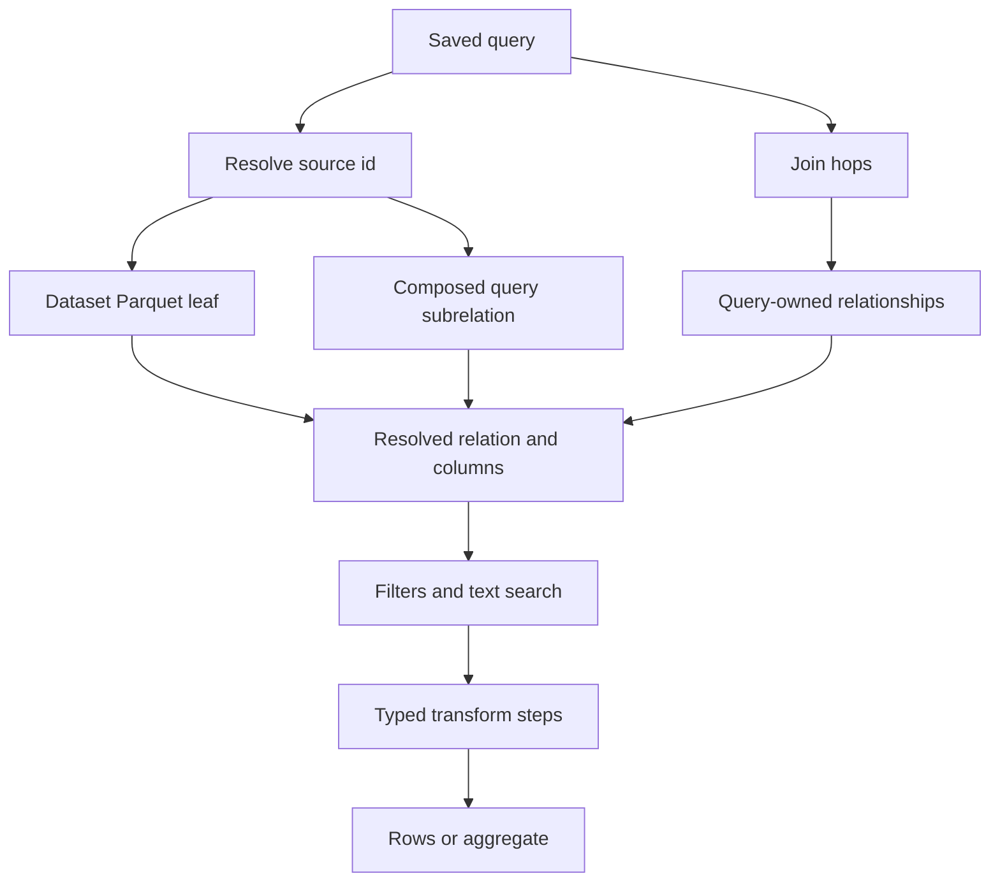

# Saved queries and execution

`routers/queries.py` owns saved-query endpoints while `app/query_engine.py` owns reusable resolution and transform planning. Queries are workspace-scoped SQLite records with a polymorphic `source_id`: a dataset `ds_…` or a saved query `qr_…`. They run live against current Parquet rather than materializing output.

## Resolution model

The resolver forms an executable plan only after every source, join key, and current schema has been validated.

`resolve_source()` returns a typed relation, effective columns, dataset provenance and display name. A dataset maps to `read_parquet(?)`; a query recursively resolves its own source and joins, applies its own filters, and becomes a subquery. Recursion tracks visited `qr_` IDs, producing `composition_cycle` rather than looping. A materialized workflow `wf_` is treated as a frozen Parquet leaf when used by workflow consolidation, not as a recursive workflow definition.

`_resolve_chain()` uses query-owned `relationships[]`, indexed by `queryRelId`, not the live governed `rel_` table. This snapshot means changing or deleting a governed relationship does not rewrite saved query meaning. The join graph must be a tree: the left source must already be in graph provenance and the right source must be new. Overlap produces `cyclic_join`; a disconnected edge produces `disconnected_join`. Current key existence and compatible dtypes are rechecked, producing `relationship_stale` when they drift.

## Definitions, predicates and steps

Create and update validate definitions against the current effective column space. `build_definition_predicates()` validates simple filters and advanced predicates. `_step_plan()` folds over columns after each step, caps a definition at eight steps, and validates each operation against the column space it receives.

Supported step kinds are `filter`, `aggregate`, `top_n`, `derive`, `sort`, `select`, and `date_bucket`. Aggregate measure rules are type-sensitive: `sum` and `avg` require numeric columns, `min`/`max` require numeric/date/datetime, and `count` has no column. Derived operands must be numeric; select output names must be unique; date buckets require date/datetime and an allowed granularity. Intermediate SQL stays typed in `rows_reader.run_steps()`; strings are emitted only in HTTP rows, preventing lexical sort/compare errors after an aggregate or derive.

## HTTP behavior

- `POST /workspaces/{id}/queries` validates and saves. Duplicate names yield `name_taken`; composition cycles yield 409.
- `PUT /queries/{id}` replaces only the definition, preserving source and name.
- `GET /queries/{id}/rows` re-resolves then runs. A bad persisted predicate or step returns `query_stale`; stale relationship/source resolution returns typed 409 behavior; unknown query is 404.
- `POST /workspaces/{id}/queries/preview` runs an unsaved definition without persisting. Structural invalidity is 422; stale execution state is 409.
- `POST /queries/{id}/aggregate` performs DuckDB aggregation over the entire resolved relation. Runtime dashboard filters are applied by column name before grouping; filters for a column absent from a particular query are ignored.

`unpaged=true` serves dashboard consumers but is capped at `DASHBOARD_MAX_ROWS`. `total` remains the full count so consumers can identify a partial raw-row result. Aggregate responses are not subject to this raw-row cap because they are grouped server-side.

## Change and validation guide

A query contract change crosses `packages/contracts/_shared/query.yaml` and `packages/contracts/queries/*`, `models/common.py`, `query_engine.py`, `routers/queries.py`, builder query types/API/hooks/canvas, and often dashboard widgets. Do not alter source resolution without considering [workflows](workflows.md), which imports the same engine.

Focused tests:

- `tests/test_queries.py` exercises CRUD, runs, stale definitions and response conformance.
- `tests/test_joins.py`, `test_composition.py`, and `test_resolve_plan.py` protect joins, snapshots, query composition and plan failures.
- `tests/test_aggregate.py`, `test_workflow_steps.py`, `test_workflow_derive.py`, `test_workflow_filter.py`, `test_workflow_shaping.py`, and `test_date_bucket.py` protect shared step/aggregate semantics.

Use `uv run pytest tests/test_queries.py tests/test_joins.py` for a targeted query change, adding the specific transformation suite when relevant.
