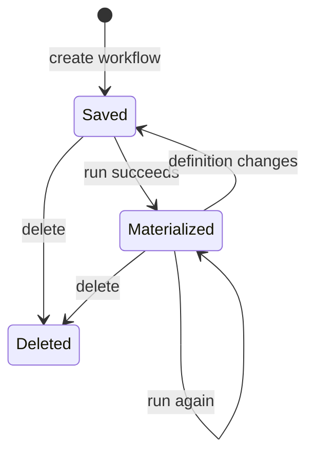

# Workflows and materialization

A workflow (`wf_…`) is a workspace-scoped durable definition that consolidates saved queries and/or previously materialized workflow outputs, applies the same typed transformation-step engine as queries, and persists a frozen `output.parquet`. `routers/workflows.py` owns HTTP and lifecycle; `query_engine.build_consolidated_relation()` and `_step_plan()` supply shared execution semantics.

## Lifecycle

A name-only update preserves materialization; a changed definition clears `output_columns_json` and `materialized_at`, requiring another run.

Create and update validate that every `sources[]` ID identifies a query or workflow in the same workspace. They deliberately do not fully validate transform steps at save time: steps validate at run when current source columns are available. Names are unique per workspace.

## Run semantics

`POST /workflows/{id}/run` resolves each source. Query sources are live resolved relations; workflow sources are leaf reads of their already materialized `output.parquet`. `build_consolidated_relation()` stacks source relations with `UNION ALL BY NAME`, so column order may differ and missing columns read as null. The first source declares the column space used for step validation and captured output schema; the v1 expectation is same-shape sources.

The router runs `_step_plan`, writes the final typed relation via `materialize_steps()`, stores output columns and UTC materialization time, and returns the updated workflow. Any absent/unrun workflow source, deleted source, stale query, or invalid step becomes `query_stale` (409); composition cycles preserve the dedicated 409 cycle error. `GET /workflows/{id}/rows` is 404 until a successful run, then pages the frozen Parquet output. Its unpaged mode is capped with the same dashboard max-row setting as query rows.

Workflow outputs can be input to a later workflow, but this reads the prior output rather than recursively evaluating its definition. That is why an unrun source blocks execution and why output reuse does not create a definition-evaluation cycle.

## Change surface and tests

Coordinate `packages/contracts/workflows/*` and `_shared/workflow.yaml`, `models/common.py`, `db_models.Workflow` plus Alembic migrations, router behavior, `query_engine.py`, `rows_reader.py`, builder workflow types/API/hooks/forms, and tests. Any shared-step behavior must remain consistent with [saved queries](queries.md).

`tests/test_workflows.py` covers CRUD and validation. `tests/test_workflows_run.py` verifies aggregate schema capture, rows-before-run 404, stale sources, union duplication, output-as-source, and unrun-source failure. Run `uv run pytest tests/test_workflows.py tests/test_workflows_run.py` for focused validation.
