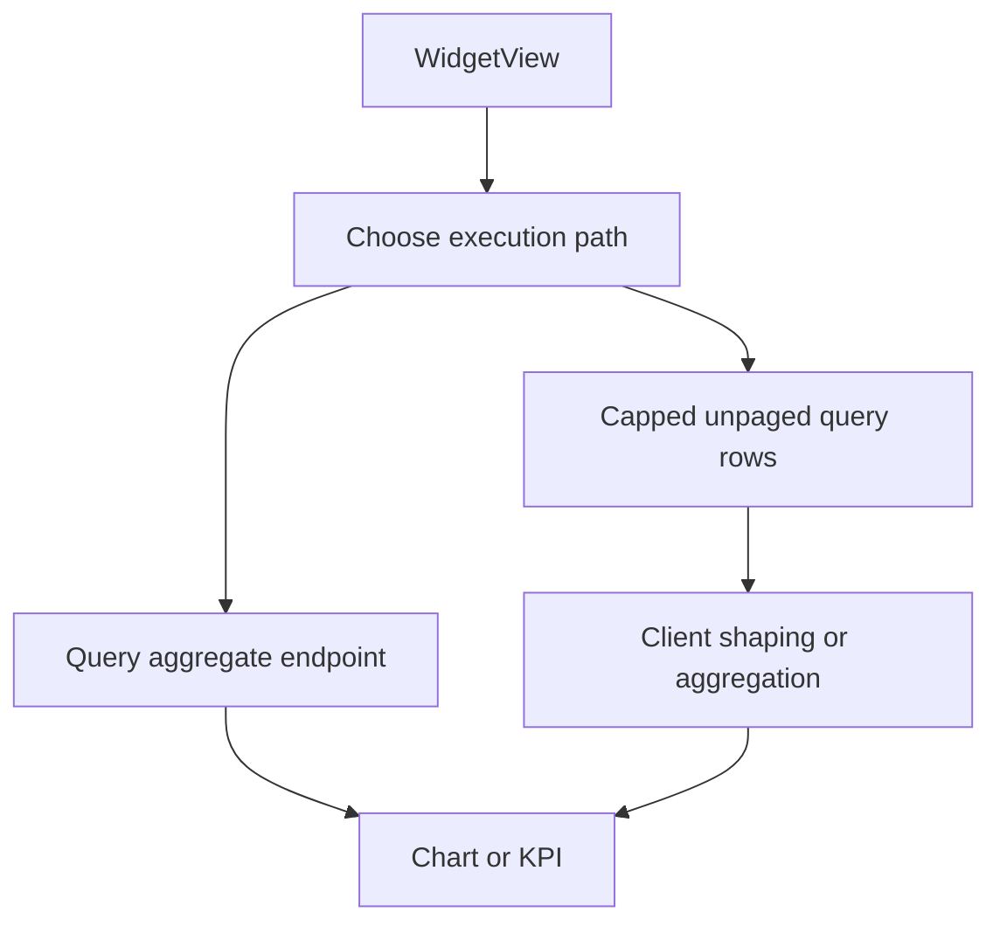

# Dashboard builder and widgets

`src/features/dashboard` provides dashboard configuration at `/settings/dashboard` and rendered views at `/dashboards/:workspaceId/:slug`. It consumes persisted dashboard definitions from the backend and executes each widget against a saved query.

## Persistence representation

`types.ts` defines dashboard and widget models: chart type, aggregation, layout span, formatting and query binding. `wire.ts` is the deliberate translation boundary between UI models and backend definition JSON: `wireToDashboard()` rehydrates API objects, while `widgetsToDefinition()` serializes all widgets for full-representation create/update. `slugify()` creates route-friendly slugs; backend uniqueness is still the final authority.

`DashboardListPage` manages create/list/delete. `DashboardDetailPage` edits a complete dashboard and persists every mutation through `useUpdateDashboardMutation`; it must send the whole definition because the API uses PUT rather than widget-level patches. `WidgetBuilder.draftToConfig()` is the single serialization path. A persisted widget contains its `queryId`, trimmed title, `chartType`, `agg`, and `span`, plus only applicable fields: non-stat/gauge/table charts get `dimensionCol`; bar may get an optional `seriesCol`, heatmap requires it; sum and two-measure charts get `measureCol`; combo/scatter add `measureCol2`; gauge may carry `target`; and nondefault display formatting carries `numberFormat`. Table omits dimension, measure, and aggregation controls.

The builder scopes the selectable query list to the dashboard workspace. It defaults fields from loaded query columns, limits measure choices to numeric columns, requires a title and query, requires dimensions except for stat/gauge/scatter/table, requires a series for heatmap, and requires one or two measures according to chart type and aggregation (`count` needs no measure). The backend repeats the workspace ownership check and owns per-workspace name/slug collision rejection.

## Widget data paths

Widgets use the aggregate endpoint for supported measures to avoid computing totals over a capped raw-row fetch. `serverAggregateSupportsMeasure()` guards that choice. `useWidgetAggregate()` calls it; `useWidgetData()` provides raw unpaged rows for chart modes that need them. Raw fetches expose the server’s full `total`, so `WidgetView` can warn when capped results are partial.

`WidgetFilterDrawer` collects dashboard runtime filters. `useWidgetFilterOptions()` derives distinct values, and each widget receives filters; the backend applies named filters only where the query exposes that column. `aggregate.ts` supplies pure client transformations such as grouped sums/counts, scalar aggregation, scatter points, matrix formation, sort rules, blank labels and filter application. `WidgetView`, `ChartCard`, `GaugeView`, and `HeatmapView` render the various chart types.

A deleted query does not invalidate a saved dashboard definition. The widget handles the missing query as an unavailable per-widget state, preserving the rest of the dashboard.

## Tests

`tests/widget-aggregate.test.tsx` and feature `aggregate.test.ts` protect aggregate decisions and pure data functions. `widget-preshaped.test.tsx`, `widget-config.test.ts`, `server-aggregate-measure.test.ts`, and `slug.test.ts` cover shapes, configuration, server eligibility and slugs. Backend counterparts are `test_dashboards.py` and `test_aggregate.py`. Run `pnpm --filter builder test` for frontend changes and focused backend tests when changing the execution contract.
