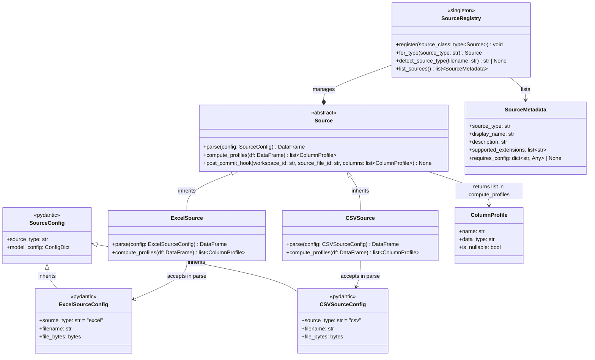
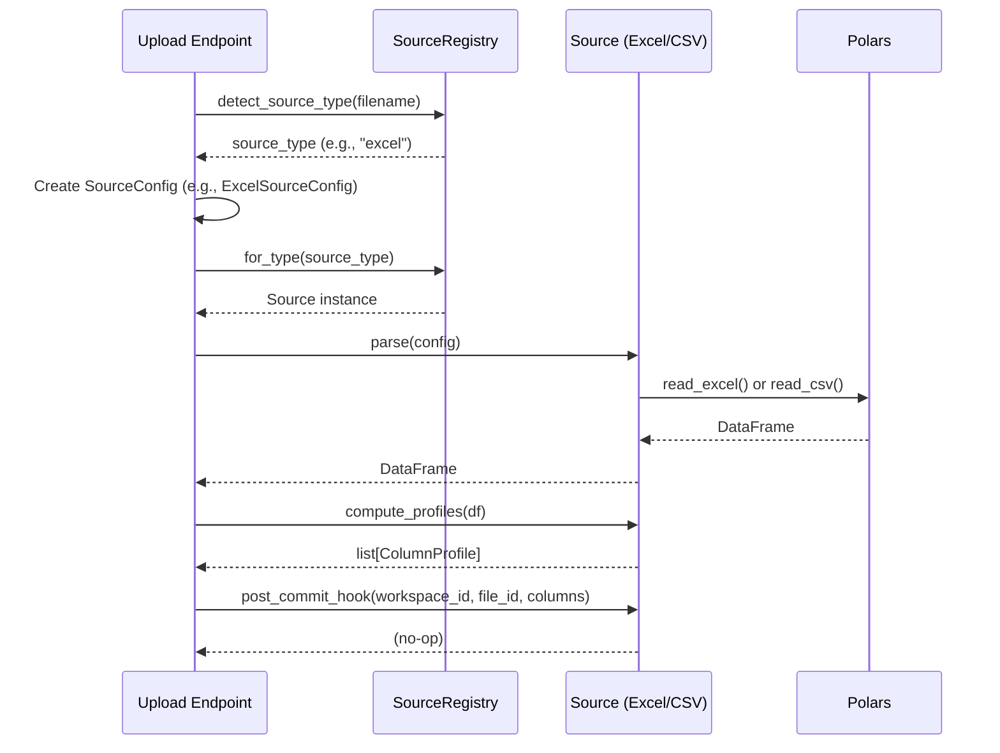

# Data Model: Source/Provider Abstraction Layer

**Date**: 2026-05-10 | **Spec**: [spec.md](spec.md) | **Research**: [research.md](research.md)

---

## Overview

This document defines the entities and relationships that comprise the Source/Provider abstraction layer. It serves as a reference for developers implementing new source types and for system designers reasoning about the architecture.

---

## Entity Relationship Diagram



---

## Entity Definitions

### 1. Source (Abstract Base Class)

**Location**: `apps/backend/app/sources/base.py`

**Purpose**: Define the contract for all data source implementations.

**Inheritance**: None (base class)

**Key Methods**:

| Method             | Signature                                                                        | Returns                 | Throws            | Notes                                                                                     |
| ------------------ | -------------------------------------------------------------------------------- | ----------------------- | ----------------- | ----------------------------------------------------------------------------------------- |
| `parse`            | `(config: SourceConfig) -> pl.DataFrame`                                         | Polars DataFrame        | `ValueError`      | Abstract; must be implemented by subclass. Reads file_bytes and returns parsed DataFrame. |
| `compute_profiles` | `(df: pl.DataFrame) -> list[ColumnProfile]`                                      | List of column profiles | `ValueError`      | Abstract; returns list of ColumnProfile for each column in DataFrame.                     |
| `post_commit_hook` | `(workspace_id: str, source_file_id: str, columns: list[ColumnProfile]) -> None` | None                    | Exception ignored | Optional hook; called after upload orchestration completes. Default: no-op.               |

**Immutability**: Instances are stateless; all state is in SourceRegistry.

**Thread-Safety**: Subclasses must be thread-safe (no mutable class attributes).

---

### 2. SourceConfig (Pydantic Base Model)

**Location**: `apps/backend/app/sources/base.py`

**Purpose**: Base configuration for all source types. Extensible via inheritance.

**Key Attributes**:

| Attribute     | Type  | Required | Default | Notes                                                                                  |
| ------------- | ----- | -------- | ------- | -------------------------------------------------------------------------------------- |
| `source_type` | `str` | Yes      | N/A     | Identifier for the source type (e.g., "excel", "csv"). Frozen to prevent modification. |

**Immutability**: `model_config = ConfigDict(frozen=True)` — SourceConfig and all subclasses are immutable.

**Serialization**: Fully JSON-serializable via Pydantic v2 `.model_dump()` and `.model_validate()`.

**Validation**: Pydantic v2 automatic validation; custom validators can be added in subclasses.

**Example**:

```python
from pydantic import BaseModel, ConfigDict, Field

class SourceConfig(BaseModel):
    model_config = ConfigDict(frozen=True)
    source_type: str
```

---

### 3. ExcelSourceConfig (Pydantic Model)

**Location**: `apps/backend/app/sources/excel_source.py`

**Purpose**: Configuration specific to Excel file parsing.

**Inheritance**: Extends `SourceConfig`

**Key Attributes**:

| Attribute     | Type    | Required | Default   | Notes                                                                 |
| ------------- | ------- | -------- | --------- | --------------------------------------------------------------------- |
| `source_type` | `str`   | Yes      | `"excel"` | Frozen; always "excel".                                               |
| `filename`    | `str`   | Yes      | N/A       | Original filename (e.g., "data.xlsx"); used for logging and metadata. |
| `file_bytes`  | `bytes` | Yes      | N/A       | Raw file contents as byte buffer.                                     |

**Example**:

```python
config = ExcelSourceConfig(
    filename="data.xlsx",
    file_bytes=b"PK\x03\x04..."  # Binary Excel content
)
```

---

### 4. CSVSourceConfig (Pydantic Model)

**Location**: `apps/backend/app/sources/csv_source.py`

**Purpose**: Configuration specific to CSV file parsing.

**Inheritance**: Extends `SourceConfig`

**Key Attributes**:

| Attribute     | Type    | Required | Default | Notes                                                   |
| ------------- | ------- | -------- | ------- | ------------------------------------------------------- |
| `source_type` | `str`   | Yes      | `"csv"` | Frozen; always "csv".                                   |
| `filename`    | `str`   | Yes      | N/A     | Original filename (e.g., "data.csv"); used for logging. |
| `file_bytes`  | `bytes` | Yes      | N/A     | Raw file contents as byte buffer.                       |

**Example**:

```python
config = CSVSourceConfig(
    filename="data.csv",
    file_bytes=b"col1,col2\nval1,val2\n"
)
```

---

### 5. ExcelSource (Concrete Implementation)

**Location**: `apps/backend/app/sources/excel_source.py`

**Purpose**: Parse Excel files (.xlsx, .xlsm, .xlsb, .xls) into Polars DataFrames.

**Inheritance**: Extends `Source`

**Implementation Strategy**:

- Copy `read_dataframe()` logic from `upload_service.py` verbatim (extract-don't-refactor)
- Try openpyxl engine first; fall back to calamine if openpyxl fails
- Preserve error message exactly: `"openpyxl failed: {exc1}; calamine failed: {exc2}"`

**Methods**:

| Method                             | Implementation                           | Behavior                                                 |
| ---------------------------------- | ---------------------------------------- | -------------------------------------------------------- |
| `parse(config: ExcelSourceConfig)` | Uses `pl.read_excel()`                   | Reads Excel file; tries openpyxl then calamine.          |
| `compute_profiles(df)`             | Delegates to `compute_column_profiles()` | Returns list of ColumnProfile for each column.           |
| `post_commit_hook(...)`            | Inherited no-op                          | Does nothing; hook call site established for future use. |

---

### 6. CSVSource (Concrete Implementation)

**Location**: `apps/backend/app/sources/csv_source.py`

**Purpose**: Parse CSV files (.csv) into Polars DataFrames.

**Inheritance**: Extends `Source`

**Implementation Strategy**:

- Copy `read_dataframe()` logic from `upload_service.py` verbatim
- Use `pl.read_csv()` with default settings
- Preserve error handling exactly

**Methods**:

| Method                           | Implementation                           | Behavior                                         |
| -------------------------------- | ---------------------------------------- | ------------------------------------------------ |
| `parse(config: CSVSourceConfig)` | Uses `pl.read_csv()`                     | Reads CSV file with default delimiter inference. |
| `compute_profiles(df)`           | Delegates to `compute_column_profiles()` | Returns list of ColumnProfile for each column.   |
| `post_commit_hook(...)`          | Inherited no-op                          | Does nothing.                                    |

---

### 7. SourceMetadata (Dataclass)

**Location**: `apps/backend/app/sources/base.py`

**Purpose**: Introspectable metadata about a registered source type (returned by SourceRegistry.list_sources()).

**Key Attributes**:

| Attribute              | Type            | Required | Notes                                                                            |
| ---------------------- | --------------- | -------- | -------------------------------------------------------------------------------- | -------------------------------------------------------------------------- |
| `source_type`          | `str`           | Yes      | Unique identifier (e.g., "excel", "csv").                                        |
| `display_name`         | `str`           | Yes      | Human-readable name (e.g., "Excel Spreadsheet").                                 |
| `description`          | `str`           | Yes      | Short description of what this source does.                                      |
| `supported_extensions` | `list[str]`     | Yes      | File extensions this source handles (e.g., [".xlsx", ".xlsm", ".xlsb", ".xls"]). |
| `requires_config`      | `dict[str, Any] | None`    | No                                                                               | Optional additional config fields required (e.g., `{"delimiter": "str"}`). |

**JSON Serialization**: Fully serializable via dataclass `.asdict()` or Pydantic converter.

**Example**:

```python
SourceMetadata(
    source_type="excel",
    display_name="Excel Spreadsheet",
    description="Parse .xlsx, .xlsm, .xlsb, and .xls files",
    supported_extensions=[".xlsx", ".xlsm", ".xlsb", ".xls"],
    requires_config=None
)
```

---

### 8. SourceRegistry (Singleton Factory)

**Location**: `apps/backend/app/services/source_registry.py`

**Purpose**: Centralized registry for all source types. Enables dynamic dispatch based on file type.

**Pattern**: Module-level singleton (all methods are `@staticmethod` or `@classmethod`)

**Key Methods**:

| Method               | Signature                              | Returns          | Throws       | Purpose                                                                |
| -------------------- | -------------------------------------- | ---------------- | ------------ | ---------------------------------------------------------------------- |
| `register`           | `(source_class: type[Source]) -> None` | None             | `ValueError` | Register a new Source subclass at app startup.                         |
| `for_type`           | `(source_type: str) -> Source`         | Source instance  | `KeyError`   | Retrieve a Source instance for the given type.                         |
| `detect_source_type` | `(filename: str) -> str \| None`       | String or None   | N/A          | Inspect filename and return detected source_type (or None if unknown). |
| `list_sources`       | `() -> list[SourceMetadata]`           | List of metadata | N/A          | Return all registered sources (for UI, introspection, docs).           |

**Thread-Safety**: Class methods with module-level dict (Python GIL guarantees thread-safe dict operations for simple get/set).

**Initialization**: Called at FastAPI app startup via `main.py`:

```python
from app.sources import ExcelSource, CSVSource
from app.services.source_registry import SourceRegistry

SourceRegistry.register(ExcelSource)
SourceRegistry.register(CSVSource)
```

---

### 9. ColumnProfile (Dataclass)

**Location**: `apps/backend/app/services/upload_service.py` (existing)

**Purpose**: Metadata about a single column in a parsed DataFrame.

**Key Attributes**:

| Attribute     | Type   | Notes                                                  |
| ------------- | ------ | ------------------------------------------------------ |
| `name`        | `str`  | Column name (as appears in DataFrame).                 |
| `data_type`   | `str`  | Polars data type (e.g., "String", "Int64", "Boolean"). |
| `is_nullable` | `bool` | True if column contains any null values.               |

**Usage**: Returned by `Source.compute_profiles()` and `compute_column_profiles()`.

---

## Relationships & Dependencies

### Inheritance Hierarchy

```
Source (abstract)
├── ExcelSource
├── CSVSource
└── (Future: DatabaseSource, SalesforceSource, ...)

SourceConfig (abstract)
├── ExcelSourceConfig
├── CSVSourceConfig
└── (Future: DatabaseSourceConfig, ...)
```

### Composition

- **SourceRegistry** contains a mapping of `source_type: str` → `Source instance`
- **SourceRegistry.list_sources()** returns list of `SourceMetadata`
- **Source.compute_profiles()** returns list of `ColumnProfile`

### Usage Flow



---

## Validation & Constraints

### SourceConfig Immutability

All SourceConfig subclasses are frozen (immutable). Once created, fields cannot be modified:

```python
config = ExcelSourceConfig(filename="data.xlsx", file_bytes=b"...")
# config.filename = "other.xlsx"  # ❌ Raises FrozenInstanceError
```

### Source Statefulness

Sources are stateless instances. State is managed in SourceRegistry. Two calls to `SourceRegistry.for_type("excel")` may return different instances, but behavior is identical.

### SourceMetadata Consistency

Once a source is registered, its metadata is fixed. Attempting to re-register the same source_type raises `ValueError`.

### File Extension Detection

- `.xlsx`, `.xlsm`, `.xlsb`, `.xls` → `"excel"`
- `.csv` → `"csv"`
- Others → `None` or `ValueError` (TBD; see research.md Design Decision E notes)

---

## Future Extensions (Not in Scope)

The following entities are designed with extensibility in mind but are NOT implemented in Spec 010:

1. **DatabaseSource** + **DatabaseSourceConfig**: Connect to SQL databases (SQLAlchemy engine)
2. **S3Source** + **S3SourceConfig**: Read from AWS S3 buckets (boto3)
3. **SalesforceSource** + **SalesforceSourceConfig**: Fetch data from Salesforce APIs
4. **JSONSource** + **JSONSourceConfig**: Parse JSON/JSONL files
5. **Custom validation hooks**: Pre-parse and post-parse hooks in SourceConfig

All can be added without modifying orchestration code (upload_app.py) if they follow the Source/SourceConfig pattern.

---

## Implementation Checklist

- [ ] **T-004**: `apps/backend/app/sources/` directory created
- [ ] **T-005**: `Source` base class defined in `base.py`
- [ ] **T-006**: `SourceConfig` base class defined in `base.py`
- [ ] **T-007**: `SourceMetadata` dataclass defined in `base.py`
- [ ] **T-019**: `ExcelSource` class defined in `excel_source.py`
- [ ] **T-020**: `ExcelSourceConfig` class defined in `excel_source.py`
- [ ] **T-032**: `CSVSource` class defined in `csv_source.py`
- [ ] **T-033**: `CSVSourceConfig` class defined in `csv_source.py`
- [ ] **T-009**: `SourceRegistry` defined in `source_registry.py`

---

## Related Documents

- **Specification**: [spec.md](spec.md) — Requirements and business context
- **Implementation Plan**: [plan.md](plan.md) — Phased approach and architecture
- **Research & Decisions**: [research.md](research.md) — Design rationales
- **Quick Start**: [quickstart.md](quickstart.md) — How to add a new source
