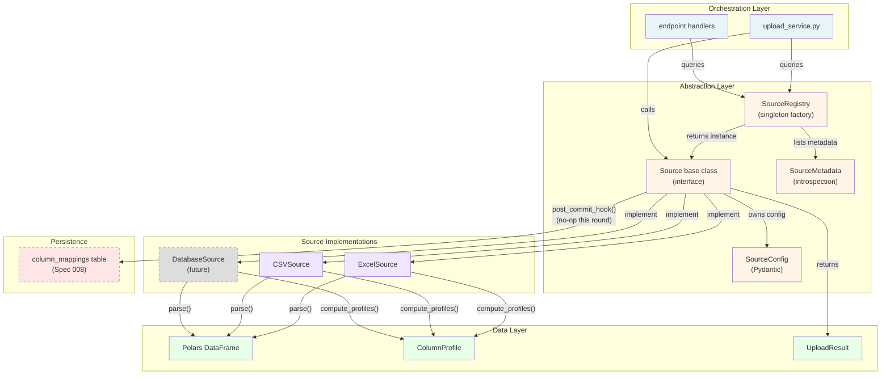

# Feature Specification: Source/Provider Abstraction Layer

**Feature Branch**: `010-source-provider-abstraction`  
**Created**: 2026-05-10  
**Status**: Draft  
**Input**: User description: "Extract a Source/Provider interface so adding a new ingestion source type = 'subclass + (eventually) YAML descriptor', not 'edit upload_service.py and three other files'. Mirror the shape proven in hg_code/src/com/provider.py, adapted to FastAPI + SQLModel."

## Business Question _(mandatory for this project)_

> "Can we extract ingestion source handling into a pluggable Source/Provider abstraction so introducing a new data source type (API endpoint, database, cloud storage) requires only a new Source subclass, not scattered edits across upload_service.py, endpoints, and middleware?"

**Decision consumed**: Whether the upload and ingestion layer can be refactored to separate source-type-specific logic from orchestration and persistence logic without breaking current Excel/CSV upload behavior.

**Primary roles**: Backend maintainer (extends for new source types), release owner (regression safety), data analyst (no visible behavior change expected).

**Surface role**: audit / export

This round is primarily an internal abstraction and decoupling change. Its visible output is evidence that the Source/Provider layer was extracted, Excel upload still works without regression, and new source types are demonstrably extensible without modifying core upload logic.

---

## Business Value & Customer Impact

### Value Proposition

**For Backend Maintainers**: Ingestion extensibility shifts from "edit multiple files, understand the full upload flow" to "write a Source subclass, plug it into SourceRegistry". This reduces cognitive load, coupling, and maintenance risk for each new data source.

**For Product**: Each new ingestion source (database connection, Salesforce, Snowflake, REST API, S3 bucket) can be delivered as an independent feature without destabilizing the core upload machinery.

**For Analysts**: No change to existing upload UX. Excel and CSV imports remain stable while the infrastructure prepares for future extensibility.

### Success Metrics

1. **Extensibility metric**: Time to integrate a new source type (excluding UI) decreases from ~6 hours (scattered edits) to ~2 hours (Source subclass + registry registration).
2. **Regression metric**: Existing Excel/CSV upload tests pass unchanged. Zero upload failures introduced by refactoring.
3. **Coupling metric**: `upload_service.py` OR any endpoint module does NOT import source-type-specific logic (e.g., openpyxl, calamine, CSV parser configuration). Source subclasses own their dependencies.
4. **Post-commit hook adoption metric**: `column_mappings` table is pre-staged and `Source.post_commit_hook()` contract is callable (not yet consumed by fuzzy matcher in this round).

---

## User Scenarios & Testing _(mandatory)_

### User Story 1 — Upload Excel file via abstracted Excel source (Priority: P1)

An analyst uploads an Excel or CSV file using the existing UI/endpoint. Behind the scenes, the system detects the file type, routes to the appropriate Source subclass (ExcelSource or CSVSource), and processes the upload using that subclass's logic without orchestration code knowing format-specific details.

**Why this priority**: The abstraction only succeeds if existing upload behavior is preserved. Breaking Excel/CSV upload is a release blocker.

**Independent Test**: Upload the bundled sample Excel files (single-sheet, multi-sheet, edge cases) using the standard endpoint and verify identical behavior to pre-refactor baseline (same output, same metadata, same validation errors).

**Acceptance Scenarios**:

1. **Given** the current upload endpoint and an Excel file, **When** file is uploaded, **Then** SourceRegistry detects Excel type, routes to ExcelSource subclass, and produces identical UploadResult to pre-refactor baseline.
2. **Given** a CSV file, **When** file is uploaded, **Then** SourceRegistry detects CSV type, routes to CSVSource subclass, and produces identical UploadResult to pre-refactor baseline.
3. **Given** a file with an unsupported extension, **When** upload is attempted, **Then** SourceRegistry returns a clear error message (same error message as pre-refactor).
4. **Given** an Excel file with encoding issues, **When** ExcelSource.parse() fails and falls back between engines, **Then** the fallback logic is identical to current `read_dataframe()` behavior.

---

### User Story 2 — Add a new ingestion source type (database connector) as a Source subclass (Priority: P2)

A developer adds a new ingestion source without editing upload_service.py, endpoint handlers, or middleware. The developer: (1) creates a DatabaseSource subclass, (2) defines its SourceConfig, (3) registers it with SourceRegistry, and (4) the system routes incoming database-connection requests to that subclass.

**Why this priority**: This demonstrates the abstraction's value. If adding a source requires >1 file edit, the abstraction failed its purpose.

**Independent Test**: In a feature branch, create a stub DatabaseSource that connects to a test database and verify that SourceRegistry can route and instantiate it without modifying existing code paths.

**Acceptance Scenarios**:

1. **Given** a new DatabaseSource subclass that implements the Source interface, **When** SourceRegistry.register(DatabaseSource) is called, **Then** subsequent calls to SourceRegistry.for_type("database") return DatabaseSource instances.
2. **Given** a DatabaseSource registered with SourceRegistry, **When** an upload request targets that source type, **Then** orchestration code does NOT need to know DatabaseSource details; it calls generic Source.parse() and Source.compute_profiles().
3. **Given** a DatabaseSource.parse() implementation, **When** the method is called with database connection config, **Then** it returns a Polars DataFrame (same contract as ExcelSource.parse()).

---

### User Story 3 — Pre-stage column_mappings hook for future fuzzy matcher (Priority: P2)

After a Source successfully parses and profiles a file, the system calls Source.post_commit_hook() with workspace context. This hook has access to workspace_id, source_file_id, and columns. A future round's fuzzy matcher will override this hook to record column rename suggestions; this round's hook is a no-op.

**Why this priority**: Decoupling the fuzzy-match write site from upload orchestration ensures that matcher logic is not scattered. The hook site must be established now so the matcher can plug in without touching upload_service.py.

**Independent Test**: After a successful Excel upload, verify that Source.post_commit_hook() is called with the correct context and that the call does not break upload flow (no-op success).

**Acceptance Scenarios**:

1. **Given** a successful upload via ExcelSource, **When** Source.post_commit_hook(workspace_id, source_file_id, columns) is called, **Then** the call completes without error and does not mutate database state in this round.
2. **Given** Source.post_commit_hook() is defined in the Source base class, **When** it is called on any Source subclass, **Then** the method is available (either overridden or inherited as no-op).
3. **Given** a future fuzzy-matcher implementation that overrides post_commit_hook(), **When** upload completes, **Then** the fuzzy matcher's hook can write to column_mappings without modifying upload_service.py.

---

### User Story 4 — SourceRegistry provides inspectable source types and metadata (Priority: P2)

A developer, operator, or admin can call SourceRegistry.list_sources() to see all registered source types with metadata (display name, description, supported file extensions, requirements). This enables dynamic UI rendering and diagnostics.

**Why this priority**: Registry introspection is a low-lift enabler for future UI (source picker) and operational observability.

**Independent Test**: Call SourceRegistry.list_sources() and verify that ExcelSource and CSVSource are listed with correct metadata.

**Acceptance Scenarios**:

1. **Given** a SourceRegistry with ExcelSource and CSVSource registered, **When** SourceRegistry.list_sources() is called, **Then** it returns a list of SourceMetadata objects with display_name, description, and supported_extensions for each.
2. **Given** SourceRegistry.list_sources() response, **When** the response is serialized to JSON, **Then** it is suitable for consumption by a frontend source-picker UI.

---

### Edge Cases

- An Excel file with mixed encodings or corrupted sections; ExcelSource must attempt fallback between openpyxl and calamine without losing existing error context.
- A CSV file with ambiguous delimiter or quoted fields; CSVSource must detect or prompt without breaking.
- A source-type detection conflict (e.g., a ".csv" file that is actually JSON-formatted or a pipe-delimited file); SourceRegistry.detect_source_type() must fail gracefully with a clear message.
- A Source subclass that raises an exception during parse(); the orchestration code must catch and surface the error without polluting the upload_service.py control flow.
- A database or API source that times out; Source.parse() timeout behavior must be bounded and returnable to the caller.
- Concurrent uploads of the same file from different workspaces; each upload must route through the appropriate Source instance independently.

---

## Requirements _(mandatory)_

### Functional Requirements

- **FR-001**: The backend MUST define a `Source` base class (abstract or concrete with overridable methods) that all ingestion sources implement. The Source interface MUST include: `parse(config: SourceConfig) -> pl.DataFrame`, `compute_profiles(df: pl.DataFrame) -> list[ColumnProfile]`, `post_commit_hook(workspace_id: str, source_file_id: str, columns: list[ColumnProfile]) -> None`.

- **FR-002**: The backend MUST define a `SourceConfig` Pydantic model (or dataclass) that captures source-specific configuration. SourceConfig MUST be extensible via subclassing for each source type (e.g., ExcelSourceConfig, DatabaseSourceConfig). Each SourceConfig MUST include a `source_type` field for dispatch.

- **FR-003**: The backend MUST define a `SourceRegistry` class that: (a) registers Source subclasses by type string, (b) provides `for_type(type_str) -> Source` to retrieve a Source instance, (c) provides `detect_source_type(filename: str) -> str | None` to infer source type from file extension or content, (d) provides `list_sources() -> list[SourceMetadata]` for introspection.

- **FR-004**: The backend MUST implement `ExcelSource` as a Source subclass that encapsulates current `read_dataframe()` logic for .xlsx/.xlsm/.xlsb/.xls files (including openpyxl → calamine fallback). ExcelSource.parse() MUST accept an ExcelSourceConfig with filename and file_bytes and return a Polars DataFrame.

- **FR-005**: The backend MUST implement `CSVSource` as a Source subclass that encapsulates current `read_dataframe()` logic for .csv files, including delimiter detection and encoding inference. CSVSource.parse() MUST accept a CSVSourceConfig with filename and file_bytes and return a Polars DataFrame.

- **FR-006**: `SourceRegistry` MUST be a singleton or thread-safe factory accessible from `upload_service.py` and all upload endpoints. SourceRegistry MUST pre-register ExcelSource and CSVSource at backend startup.

- **FR-007**: `upload_service.py` MUST be refactored to call SourceRegistry for source type detection and Source.parse() instead of calling `read_dataframe()` directly. The UploadResult contract and all existing orchestration logic MUST remain unchanged.

- **FR-008**: After a successful Source.parse() and profile computation, orchestration code MUST call Source.post_commit_hook(workspace_id, source_file_id, columns) to enable future fuzzy-matcher registration. This round's hook implementation is a no-op.

- **FR-009**: The `Source` base class MUST be located in `apps/backend/app/core/sources.py` or `apps/backend/app/services/source_registry.py` (decision per round implementation plan). SourceRegistry MUST be importable from a single canonical location (e.g., `from apps.backend.app.core.source_registry import SourceRegistry`).
- **FR-009**: The `Source` base class MUST be located in `apps/backend/app/sources/base.py`. SourceRegistry MUST be importable from a single canonical location: `from app.services.source_registry import SourceRegistry`. All Source subclasses and SourceConfig variants MUST be importable from `app.sources/`.
- **FR-008**: After a successful Source.parse() and profile computation, orchestration code MUST call Source.post_commit_hook(workspace_id, source_file_id, columns) to enable future fuzzy-matcher registration. This round's hook implementation is a no-op.
  **Status**: Implemented (Round 24 complete ✅ 2026-05-10)

- **FR-010**: `SourceConfig` subclasses MUST be Pydantic models or frozen dataclasses to enable serialization for eventual YAML descriptor support (Gate A deferred). Base SourceConfig MUST support a `source_type: str` field.

- **FR-011**: Source subclass implementations (ExcelSource, CSVSource, future DatabaseSource, etc.) MUST NOT be imported by orchestration code (upload_service.py, endpoints). Only SourceRegistry and the Source base class are imported by orchestration.

- **FR-012**: `detect_source_type()` MUST use file extension as the primary signal and return the source type string (e.g., "excel", "csv"). For ambiguous extensions (e.g., ".txt"), detection MUST fail gracefully with a clear error message.

- **FR-013**: Existing backend tests MUST pass without modification. New tests MUST validate Source interface contract, SourceRegistry dispatch, and ExcelSource/CSVSource backward compatibility against current `read_dataframe()` behavior.

- **FR-014**: `SourceMetadata` model MUST include: `source_type: str`, `display_name: str`, `description: str`, `supported_extensions: list[str]`, `requires_config: dict[str, any]` (optional, for UI source-picker rendering).

- **FR-015**: Future Source subclasses (e.g., DatabaseSource, SalesforceSource) MUST be able to register with SourceRegistry and be routable by existing orchestration code without edits to upload_service.py or endpoint handlers.

- **FR-016**: This round MUST NOT introduce YAML descriptor loading or auto-discovery. All source registrations MUST be explicit (e.g., `SourceRegistry.register(ExcelSource)`) in backend startup code.

- **FR-017**: This round MUST NOT modify the UploadResult contract, column profile schema, or persisted metadata structure beyond pre-staging column_mappings (already established in Spec 008).

- **FR-018**: Error handling MUST preserve existing error messages and validation behavior. Source.parse() failures MUST produce the same error feedback as current `read_dataframe()` failures.

### Key Entities _(include if feature involves data)_

- **Source (abstract)**: Base class for all ingestion sources. Defines parse(), compute_profiles(), post_commit_hook() contract.
- **SourceConfig (Pydantic model)**: Extensible configuration for source-specific settings. Subclassed by ExcelSourceConfig, CSVSourceConfig, etc.
- **ExcelSource**: Concrete implementation for Excel file ingestion. Encapsulates openpyxl + calamine logic.
- **CSVSource**: Concrete implementation for CSV file ingestion. Encapsulates Polars CSV reader configuration.
- **SourceRegistry**: Factory/registry for discovering and instantiating Source subclasses. Provides dispatch and introspection APIs.
- **SourceMetadata**: Serializable metadata about a registered source type (for UI and diagnostics).

---

## Success Criteria _(mandatory)_

### Measurable Outcomes

- **SC-001**: Existing backend upload tests pass unchanged. Zero new failures introduced by refactoring. Regression suite baseline is the acceptance gate.

- **SC-002**: ExcelSource.parse() produces identical DataFrame output to current `read_dataframe()` for all test files (single-sheet, multi-sheet, mixed types, edge cases). Byte-level output comparison (e.g., parquet hashes) is acceptable as validation method.

- **SC-003**: CSVSource.parse() produces identical DataFrame output to current `read_dataframe()` for CSV test files.

- **SC-004**: SourceRegistry.for_type("excel") returns an ExcelSource instance capable of parsing an Excel file without modification to orchestration code. Same for "csv".

- **SC-005**: A new test DatabaseSource can be registered with SourceRegistry and dispatched by orchestration code without modifying upload_service.py or endpoint handlers.

- **SC-006**: Source.post_commit_hook() is called after successful upload, receives correct workspace_id, source_file_id, and columns parameters, and completes without breaking the upload workflow.

- **SC-007**: SourceRegistry.list_sources() returns a list containing ExcelSource and CSVSource with correct metadata (display_name, description, supported_extensions).

- **SC-008**: The Source interface, SourceConfig, and SourceRegistry are documented (inline docstrings or README) with signatures and contracts clear enough for a developer to add a new source type without trial-and-error.

- **SC-009**: No source-type-specific logic (openpyxl, calamine, CSV delimiter detection) appears in upload_service.py, endpoint handlers, or middleware after refactoring.

- **SC-010**: SourceRegistry and Source base class are importable from a single canonical module; circular imports are absent.

---

## Risks & Mitigations

| Risk                                                         | Likelihood | Impact                       | Mitigation                                                                                                                                                                              |
| ------------------------------------------------------------ | ---------- | ---------------------------- | --------------------------------------------------------------------------------------------------------------------------------------------------------------------------------------- |
| Breaking existing Excel upload during refactor               | Medium     | High (release blocker)       | Maintain byte-level output parity. Use comprehensive test suite with pre/post snapshots. Deploy to staging first.                                                                       |
| Circular imports between Source subclasses and orchestration | Medium     | Medium (refactor complexity) | Keep Source subclasses in separate modules. Only orchestration imports SourceRegistry + base Source. Use protocol-based type hints if needed.                                           |
| Performance regression in parse() or profile computation     | Low        | Medium (analyst UX)          | Profile before/after. No algorithmic changes to existing logic; only encapsulation. If regression detected, adjust and gate behind performance test.                                    |
| YAML descriptor scope creep (Gate A violation)               | Medium     | High (scope drift)           | Explicitly lock Gate A in decision gates below. Docs must state "YAML descriptors deferred to Round N+1".                                                                               |
| fuzzy-matcher coupling (Gate B violation)                    | Low        | Medium (future integration)  | pre_commit_hook() is no-op this round. If future fuzzy matcher edits orchestration code, it violates the abstraction goal. Gate B test must verify hook is called without side effects. |
| Database source timeout not bounded                          | Low        | Medium (operational)         | Define Source.parse() timeout contract. Recommend bounded timeouts in subclass implementations. This is not enforced this round but documented as best practice.                        |
| Operator confusion about source type detection               | Low        | Low (supportability)         | Error messages must be clear. SourceRegistry.detect_source_type() returns None for unknown types; caller must handle. Document supported extensions.                                    |

---

## Scope Boundaries

### IN This Round

- Extract Source/Provider abstraction and move Excel/CSV parsing logic into ExcelSource and CSVSource subclasses.
- Define SourceConfig extensible model and SourceRegistry factory.
- Refactor upload_service.py to route through SourceRegistry instead of calling read_dataframe() directly.
- Pre-stage Source.post_commit_hook() for future fuzzy-matcher integration (no-op in this round).
- Ensure 100% backward compatibility for existing Excel/CSV upload workflows.
- Document Source interface and SourceRegistry API for future source implementers.
- Add tests to validate Source interface contract, registry dispatch, and backward compatibility.

### OUT This Round (Explicit Gates)

- **Gate A (YAML Descriptors)**: Source auto-discovery from YAML configuration files is LOCKED OUT. All source registrations must be explicit in code (e.g., `SourceRegistry.register(ExcelSource)` at startup). YAML descriptor loading is deferred to a future round.

- **Gate B (Fuzzy-Matcher Implementation)**: Column rename suggestion logic and column_mappings write logic is LOCKED OUT. Source.post_commit_hook() is pre-staged as a callable hook point, but no fuzzy-match logic is implemented. The post_commit_hook() itself is a no-op this round.

- **No New Source Types**: Database, API, Salesforce, Snowflake, or other ingestion sources are NOT implemented in this round. Only Excel and CSV remain supported. Demonstrating extensibility through a stub test source is acceptable; production sources are out of scope.

- **No Service-Layer Rewrite**: Source subclasses do NOT use SQLModel sessions or async/await. They remain synchronous, Polars-based functions. Async source handling is deferred.

- **No Endpoint or UI Changes**: The upload endpoint and frontend UI remain unchanged. This is an internal refactor; no new endpoints or UI components are added.

- **No Migration or Schema Changes**: Metadata database schema is not modified in this round (column_mappings is pre-staged in Spec 008 and is not consumed here).

---

## Dependency Diagram



**Diagram Legend:**

- **Blue (Orchestration)**: Existing code paths that coordinate uploads.
- **Yellow (Abstraction)**: New interfaces and factories. These are the primary deliverable.
- **Purple (Implementations)**: Source subclasses. ES and CSV are this round; DB is future (dashed).
- **Green (Data)**: Polars DataFrames and profile/result objects.
- **Red (Persistence)**: Post-commit hook write site, deferred to future.

---

## API Surface

### Source Base Class

```python
from abc import ABC, abstractmethod
from typing import Optional
import polars as pl
from pydantic import BaseModel

class SourceConfig(BaseModel):
    """Base config for all source types. Extend via subclassing."""
    source_type: str  # "excel", "csv", "database", etc.

    class Config:
        frozen = True  # Immutable for serialization

class ColumnProfile:
    """Profile for a single column (unchanged from current)."""
    name: str
    data_type: str
    is_nullable: bool

class Source(ABC):
    """
    Abstract base class for all ingestion sources.

    Responsibilities:
    - Parse source-specific file/stream format into Polars DataFrame
    - Compute column profiles
    - Pre-stage future fuzzy-match hooks
    """

    @abstractmethod
    def parse(self, config: SourceConfig) -> pl.DataFrame:
        """
        Parse source configuration into a Polars DataFrame.

        Args:
            config: Source-specific configuration (e.g., file_bytes, encoding).

        Returns:
            Polars DataFrame with parsed data.

        Raises:
            ValueError: If parsing fails or config is invalid.
        """
        pass

    @abstractmethod
    def compute_profiles(self, df: pl.DataFrame) -> list[ColumnProfile]:
        """
        Compute column profiles for a DataFrame.

        Args:
            df: Parsed Polars DataFrame.

        Returns:
            List of ColumnProfile objects (one per column).
        """
        pass

    def post_commit_hook(
        self,
        workspace_id: str,
        source_file_id: str,
        columns: list[ColumnProfile]
    ) -> None:
        """
        Called after successful upload and persistence.

        No-op in this round. Future rounds (e.g., fuzzy matcher) override
        to record column rename suggestions or mappings.

        Args:
            workspace_id: ID of the workspace receiving the upload.
            source_file_id: ID of the committed source file.
            columns: List of committed columns with profiles.
        """
        pass
```

### ExcelSourceConfig

```python
class ExcelSourceConfig(SourceConfig):
    """Configuration for Excel source."""
    source_type: str = "excel"
    filename: str  # Original filename with extension
    file_bytes: bytes  # Raw Excel file bytes
    sheet_index: Optional[int] = None  # If None, auto-detect
```

### CSVSourceConfig

```python
class CSVSourceConfig(SourceConfig):
    """Configuration for CSV source."""
    source_type: str = "csv"
    filename: str
    file_bytes: bytes
    delimiter: Optional[str] = None  # If None, auto-detect
    encoding: Optional[str] = None  # If None, auto-detect
```

### SourceRegistry

```python
class SourceMetadata(BaseModel):
    """Metadata for a registered source type."""
    source_type: str
    display_name: str
    description: str
    supported_extensions: list[str]
    requires_config: dict[str, str] = {}  # Optional config keys for UI

class SourceRegistry:
    """
    Singleton factory and registry for Source subclasses.
    Thread-safe.
    """

    @classmethod
    def register(cls, source_class: type[Source]) -> None:
        """
        Register a Source subclass.

        Args:
            source_class: A concrete Source implementation.

        Raises:
            ValueError: If source_class does not implement Source interface.
        """
        pass

    @classmethod
    def for_type(cls, source_type: str) -> Source:
        """
        Retrieve a Source instance for the given type.

        Args:
            source_type: Source type string (e.g., "excel", "csv").

        Returns:
            Instantiated Source subclass.

        Raises:
            KeyError: If source_type is not registered.
        """
        pass

    @classmethod
    def detect_source_type(cls, filename: str) -> Optional[str]:
        """
        Infer source type from filename or content signature.

        Args:
            filename: Original filename with extension.

        Returns:
            Source type string (e.g., "excel", "csv") or None if unrecognized.
        """
        pass

    @classmethod
    def list_sources(cls) -> list[SourceMetadata]:
        """
        List all registered sources with metadata.

        Returns:
            List of SourceMetadata objects for all registered sources.
        """
        pass
```

### Integration Point in upload_service.py

```python
# Before (current):
def upload_file(workspace_id: str, filename: str, file_bytes: bytes) -> UploadResult:
    df = read_dataframe(filename, file_bytes)  # Format-specific logic here
    profiles = compute_column_profiles(df)
    # ...

# After (refactored):
def upload_file(workspace_id: str, filename: str, file_bytes: bytes) -> UploadResult:
    source_type = SourceRegistry.detect_source_type(filename)
    source = SourceRegistry.for_type(source_type)

    config = create_config_for_type(source_type, filename, file_bytes)
    df = source.parse(config)
    profiles = source.compute_profiles(df)

    result = UploadResult(...)
    # ... persist result ...

    source.post_commit_hook(workspace_id, result.source_file_id, profiles)

    return result
```

---

## Reference Materials

### hg_code Patterns (Guidance, Not Direct Copy)

The abstraction mirrors these patterns from `hg_code/src/com/provider.py`:

- **Provider base class**: Similar to our Source base class. Defines parse/compute contract.
- **ProviderConfig**: Similar to our SourceConfig. Extensible via subclassing per provider type.
- **ProviderManager**: Similar to our SourceRegistry. Factory and dispatch logic.
- **ExcelProvider**: Similar to our ExcelSource. Format-specific implementation.

Adaptation to FastAPI + SQLModel:

- hg_code patterns are not directly copied; they are studied for shape and responsibility separation.
- Our Source interface uses Polars (matching current backend convention) instead of hg_code's data model.
- SourceRegistry is a simpler factory (synchronous, no async/await) than hg_code's ProviderManager.
- Future YAML descriptor support will inherit hg_code's declarative patterns but is deferred (Gate A).

### i18n-tool Configuration Precedence (Parallel, Not Direct)

Spec 009 establishes configuration precedence: `.env < default.yaml < CONFIG_FILE`. SourceConfig and YAML descriptors (future) will follow the same precedence model for extensibility.

### Column Mappings Pre-Staging (Spec 008)

Spec 008 established the `column_mappings` table with `id`, `workspace_id`, `source_file_id`, `from_column_name`, `to_column_name`, `from_version`, `to_version`, `confidence`, `accepted_by`, `created_at`.

This round pre-stages the `Source.post_commit_hook()` write site. A future fuzzy-matcher round will override post_commit_hook() to populate column_mappings without editing orchestration code.

---

## Constitution Alignment

### Principle I (Business-Question-First)

**PASS**: This round answers a maintainability and extensibility question: "Can we make adding a new source type a simple subclass operation instead of scattered edits?" The business value is engineering velocity for feature delivery, not a new analytical capability.

### Principle II (Metric Contract Before Visualization)

**PASS**: No metric contract is introduced, modified, or consumed. Upload behavior is unchanged; profiling and role assignment remain the same.

### Principle III (Relationship Rule Before Cross-Table Query)

**PASS**: Relationship-rule behavior is unchanged. Source abstraction does not affect join semantics or cross-table logic.

### Principle IV (Reconciliation Before Recommendation)

**PASS**: No recommendation outputs are added. Upload and profiling remain pure data ingestion.

### Principle V (Challenge & Sensitivity Before Decision-Ready)

**PASS**: No decision-ready analytical surfaces are introduced.

### Principle VI (Traceability For Every Claim)

**PASS WITH REQUIREMENT**: The Source abstraction itself is traceable: each Source subclass is a distinct implementation with clear parse() and compute_profiles() contracts. The refactoring must not obscure where format-specific logic lives (should be in Source subclasses, not orchestration). Traceability surfaces: implementation code (Source subclasses), tests (verify backward parity), and documentation (API surface).

### Principle VII (Reproducibility From Raw Inputs)

**PASS**: Reproducibility is preserved. The Source/SourceRegistry refactoring does not change input-to-output determinism. Same file → same DataFrame → same profiles → same UploadResult. Reproducibility is verified by test parity with pre-refactor baseline.

---

## Assumptions

- **Current behavior is correct**: Excel/CSV parsing logic in current `read_dataframe()` is treated as ground truth. No behavioral changes are made to parsing or profiling algorithms.

- **Polars is the internal DataFrame format**: All Source subclasses return Polars DataFrames. No pandas, dask, or other frameworks are used in this round.

- **Synchronous I/O**: Source.parse() is synchronous. Async source handling (e.g., API polling, database streaming) is deferred.

- **SourceRegistry is a singleton**: Accessed via class methods, not instantiation. Thread-safe registration and lookup are assumed to be sufficient (no distributed registry needed).

- **No runtime source discovery**: YAML files or plugins are not auto-loaded at startup. All sources must be explicitly registered in code. (Gate A boundary.)

- **column_mappings is not consumed this round**: The post_commit_hook() write site is pre-staged but not exercised. No fuzzy-match logic runs. (Gate B boundary.)

- **No new ingestion types are delivered**: ExcelSource and CSVSource are the only implementations. DatabaseSource, API source, etc., are deferred to future rounds.

- **Error handling mirrors current behavior**: Source.parse() exceptions are caught and reported using current error messages and validation patterns.

---

## Traceability

### Spec Requirements → Implementation Mapping

| Requirement                           | Implementation Artifact                                   | Acceptance Test                                           |
| ------------------------------------- | --------------------------------------------------------- | --------------------------------------------------------- |
| FR-001: Source base class             | `apps/backend/app/core/sources.py:Source`                 | `tests/test_source_interface.py::test_source_contract`    |
| FR-002: SourceConfig model            | `apps/backend/app/core/sources.py:SourceConfig`           | `tests/test_config_serialization.py::test_config_frozen`  |
| FR-003: SourceRegistry                | `apps/backend/app/core/source_registry.py:SourceRegistry` | `tests/test_registry_dispatch.py::test_for_type`          |
| FR-004: ExcelSource                   | `apps/backend/app/services/excel_source.py:ExcelSource`   | `tests/test_excel_source.py::test_parse_parity`           |
| FR-005: CSVSource                     | `apps/backend/app/services/csv_source.py:CSVSource`       | `tests/test_csv_source.py::test_parse_parity`             |
| FR-006: SourceRegistry singleton      | `apps/backend/app/core/source_registry.py:SourceRegistry` | `tests/test_registry_singleton.py::test_import_reuse`     |
| FR-007: upload_service.py refactor    | `apps/backend/app/services/upload_service.py`             | `tests/test_upload_regression.py::test_excel_csv_uploads` |
| FR-008: post_commit_hook call         | `apps/backend/app/services/upload_service.py`             | `tests/test_post_commit.py::test_hook_called`             |
| SC-001: Regression tests pass         | Backend test suite                                        | `pytest apps/backend/tests/`                              |
| SC-002: Excel output parity           | ExcelSource.parse()                                       | `tests/test_excel_source.py::test_output_parity`          |
| SC-003: CSV output parity             | CSVSource.parse()                                         | `tests/test_csv_source.py::test_output_parity`            |
| SC-004: Registry dispatch             | SourceRegistry.for_type()                                 | `tests/test_registry_dispatch.py`                         |
| SC-005: Stub source test              | TestDatabaseSource                                        | `tests/test_extensibility.py::test_custom_source`         |
| SC-006: post_commit_hook integration  | Hook call site                                            | `tests/test_post_commit.py`                               |
| SC-007: SourceRegistry.list_sources() | Introspection API                                         | `tests/test_registry_metadata.py`                         |
| SC-008: Documentation                 | Docstrings + API surface                                  | Manual review                                             |
| SC-009: No scattered logic            | Code inspection                                           | `tests/test_source_isolation.py`                          |
| SC-010: Canonical import              | Module hierarchy                                          | Import resolution test                                    |

### PDCA Workflow Integration

This spec is the **SPECIFY** phase of the `/speckit.specify` workflow. It translates the user's narrative goal ("extract a Source/Provider abstraction") into testable requirements and decision gates.

Next phases:

- **CLARIFY** (optional): If ambiguities exist (e.g., should SourceRegistry be a service or a static utility?), an interactive clarification round resolves them.
- **PLAN**: The plan.md will decompose requirements into phased tasks (e.g., Phase 1: Define Source/SourceRegistry/SourceConfig, Phase 2: ExcelSource, Phase 3: CSVSource, Phase 4: Integration and testing).
- **TASKS**: Generated tasks will reference this spec's requirements.
- **IMPLEMENT**: Each task is implemented with reference back to traceability table above.

---

## Decision Gates & Approval Checkpoints

### Gate A: YAML Descriptor Lock ✓ LOCKED OUT

**Status**: Locked for this round.

**Requirement**: Source auto-discovery from YAML files is NOT permitted in this round. All source registrations must be explicit in code.

**Verification**: Code review confirms no YAML loading logic in SourceRegistry or startup paths. Docstrings explicitly state "Future round adds YAML descriptor support."

### Gate B: Fuzzy-Matcher Hook Pre-Staging ✓ PRE-STAGED

**Status**: Pre-staged, no-op implementation.

**Requirement**: Source.post_commit_hook() is called after successful upload and receives (workspace_id, source_file_id, columns), but does not write to column_mappings in this round.

**Verification**: Test confirms hook is called with correct parameters. Hook produces no side effects. Future fuzzy-matcher round can override hook without editing orchestration.

### Gate C: Backward Compatibility ✓ GATED

**Status**: Conditional pass. Existing upload tests must pass without modification.

**Requirement**: Excel/CSV upload workflows produce identical output to pre-refactor baseline.

**Verification**: Regression test suite passes. Byte-level or semantic output parity is confirmed.

### Gate D: Source Isolation ✓ GATED

**Status**: Conditional pass. No source-type logic in upload_service.py or endpoints.

**Requirement**: Format-specific parsing and profiling logic is owned by Source subclasses, not by orchestration.

**Verification**: Code inspection. Grep for "openpyxl", "calamine", "csv" in upload_service.py and endpoint handlers should find no matches (except in imports or error messages).

### Gate E: Extensibility Demonstration ✓ GATED

**Status**: Conditional pass. A new source type can be added without editing orchestration code.

**Requirement**: In a test or feature branch, a stub DatabaseSource can be registered and dispatched by existing upload_service.py.

**Verification**: Feature branch with DatabaseSource passes all dispatch and integration tests without modifying upload_service.py, endpoints, or middleware.

---

## Open Questions & Deferred Decisions

1. **SourceRegistry location**: Should SourceRegistry live in `core/` or `services/`? Plan will decide based on dependency analysis.

2. **Async/streaming support**: Should Source.parse() support async I/O for future database or API sources? Deferred to a future round. This round is synchronous only.

3. **Source-specific error messages**: Should Source subclasses have custom error types (e.g., ExcelParseError, CSVDelimiterError)? Current behavior uses ValueError. Deferred if not required for backward parity.

4. **Configuration secrets**: Should SourceConfig support secrets (e.g., database passwords)? Deferred. Not applicable to file-based sources.

5. **Performance monitoring**: Should Source subclasses emit metrics (parse time, profile compute time)? Deferred. Current code has no instrumentation.

---

## Deliverables Checklist

- [ ] spec.md (this document)
- [ ] plan.md (phased implementation tasks)
- [ ] data-model.md (Source/SourceRegistry/SourceConfig type details)
- [ ] quickstart.md (proof-of-concept walk-through)
- [ ] research.md (investigation of hg_code patterns, existing upload_service.py analysis)
- [ ] tasks.md (generated from plan.md with acceptance criteria)
- [ ] contracts/ (subdirectory for decision records, if needed)

---

**Version**: 0.1.0 | **Status**: Draft | **Last Updated**: 2026-05-10
